# HWView 多产线数据采集与可视化平台 技术设计文档

> 文档定位：本文件描述 HWView 平台"怎么做"（架构、数据模型、接口、流程、部署等实现细节），承接 spec.md 的"要做什么"。
> 阶段：第二阶段技术设计（Spec-Driven Development）
> 上游规格：`.codeartsdoer/specs/hwview_platform/spec.md`（18 章，1406 行）
> 设计基线：EV1 设计基线（spec.md 第 9 章）+ EV1 任务清单（spec.md 第 10 章）+ EV1 红线（spec.md 第 13 章）+ R2-AMENDMENT（spec.md §16.4）+ R4 报表（spec.md §18）
> 技术栈：后端 Go + Gin；前端 React 18 + TypeScript(Strict) + Vite + React Query + Recharts；数据库表名 `TBL_` 前缀加下划线分隔大写格式
> 命名规范：项目命名大写字母加连字符风格（HWView-EV1）；结构化命名带前缀和版本号层级命名（TASK-HWV-EV1-001）
> **修订记录**：
> - 2026-09-08 R2-AMENDMENT 设计同步更新：基于 spec.md §16.4 新业务证据（quantity=17 为整箱数 carton_count，actual_quantity = carton_count × units_per_carton + loose_quantity = 17 × 30 + 9 = 519），同步更新 §3.3 数据模型（新增 carton_count/units_per_carton/loose_quantity/actual_quantity 字段 + TBL_CARTON_SPECIFICATION 表）、§3.4 接口（新增装箱规格配置接口 + CRUD 扩展）、§3.5 Excel 导出（行2-行5 显示 actual_quantity）、§3.7 数据分离架构（数据来源标注扩展）、§3.9 R4 红线（新增禁硬编码/公式计算约束 + 合计公式修正）。追溯：spec.md §16.4 / §18.2.4 / §18.4.1 第 4/5 项 / §18.7.4 / §18.7.5 / §18.9.4 第 3 项 / §18.10。
> - 2026-09-08 R4-BLOCKER-01 修正：TBL_CARTON_SPECIFICATION 装箱规格必须支持适用范围/维度（product_code + line_code + effective_from/effective_to 三维），禁止将 30 或 60 作为全局单一常量；30 与 60 可并存（不同产品/产线/时间），两份业务证据（§18.2.3 "60 只/箱" 与 §16.4.1 "30 件/箱"）不必互相否定。同步更新 §3.3.4（强化适用范围维度说明 + 多规格并存示例）、§3.4.4（强化按 product+line+date 三维查询有效规格逻辑）、§3.9（新增 R4-BLOCKER-01 红线条目）、§3.10（新增追溯）。追溯：spec.md §18.7.4 第 10/11 项 / §18.2.4 第 2 项 / §18.10。
> - 2026-09-08 R4-BLOCKER-02 修正：报表 10 行业务定义修正——行4 由"实际完成数量（新线白班）"修正为"目标数量新线"(TARGET)，行5 由"实际完成数量（新线夜班）"修正为"实际完成数量（新线）"(ACTUAL，新线不再区分白/夜班)，行6 合计公式由"行2+3+4+5"修正为"行2+3+5"。禁止目标数量行（行1、行4）参与实际产量计算。同步更新 §3.4.5（行6 计算公式修正）、§3.5.2（行顺序冻结 + 辅助列适用行调整为行2/3/5）、§3.5.4（行6 公式 + 示例修正）、§3.7.2（编排逻辑行6 公式 + 行4 标注 TARGET）、§3.7.3（数据来源标注行4 为 TARGET + 辅助列适用行调整）、§3.9（合计公式修正条目更新）、§3.10（新增追溯）。追溯：spec.md §18.2.2 / §18.4.1 第 2/4/5 项 / §18.7.5 第 3/9 项 / §18.10。

---

# 一、需求与存量功能关系分析

## 1.1 需求功能与存量功能对比

### 1.1.1 已实现功能

> 当前代码库为全新项目（工作目录仅含 `.codeartsdoer/` 配置目录，无任何业务源代码）。EV0 阶段（spec.md 第 14.2 章）已对华为102真实数据源完成验证并 CLOSED，其验证产物（433 records / 5395 pieces / Q0926-078）作为 Golden Evidence（spec.md 第 11 章）冻结，构成"已验证未产品化"的存量知识基线，但不构成可复用代码存量。

| 需求功能 | 存量功能 | 代码位置 | 匹配度 |
|---------|---------|---------|--------|
| Golden Evidence 验收基准（433/5395/Q0926-078） | EV0 真实数据源验证产物（已冻结为不可变基准） | spec.md 第 11 章（无源代码，仅基准值） | 100% |
| 华为102 数据源可达性已验证（GET /Cron/Jili/lists/） | EV0 阶段已确认该端点可访问、可分页、可解析 | spec.md 第 14.2 章 HWView-EV0 PASS/CLOSED | 100% |
| 部署目标服务器环境（192.168.2.110 / debian / sudo） | 部署环境假设 A5（spec.md 第 7.2 章）已明确预置 | spec.md 第 4.6 章 + 第 7.2 章 C6/C7/C8 | 100% |

### 1.1.2 需要扩展的功能

> 由于代码库为空，本节"扩展"特指将 EV0 阶段已验证的华为102单产线采集逻辑，扩展为支持多产线、可插拔 Adapter、增量采集、统一统计的平台化能力。

| 需求功能 | 存量功能 | 差异说明 | 扩展方向 |
|---------|---------|---------|---------|
| 多产线注册（≥5 条） | EV0 仅验证华为102单产线 | 输入从单一产线扩展为产线注册表；需支持 HW102-COPY/HW102-LINE/BMW/SCHAEFFLER/MAGNA | 新建 `hwview-server` Production Line Registry 模块 + `TBL_PRODUCTION_LINE` 表 |
| 可插拔 Adapter | EV0 验证逻辑内嵌于脚本/手动验证 | 解析逻辑需从验证脚本抽离为独立 Adapter 组件，按产线类型命名注册 | 新建 `adapters/` 目录 + `ProductionAdapter` Go interface + `Huawei102Adapter` 首个实现 |
| 增量采集 + Cursor | EV0 为一次性全量验证（09:xx→15:xx→17:16 共 433 条） | 需从"每次全量"改为"Cursor 断点续采"，避免重复 INSERT | 新建 `hwview-collector` Incremental Collector + Cursor 持久化表 |
| 统一 ProductionRecord | EV0 产出为华为102专属字段（操作/条码/箱码/批次/创建时间） | 需将产线专属字段映射为统一结构（line_id/source_id/product_code/barcode/batch_no/quantity/created_at） | 新建 `TBL_PRODUCTION_RECORD` 表 + Adapter normalize() 方法 |
| 统计引擎（box_count/piece_count） | EV0 统计为人工核对（433/5395） | 需产品化为 SQL 聚合查询，公式冻结为 box_count=COUNT(DISTINCT source_id)、piece_count=SUM(quantity) | 新建 `hwview-server` Statistics Engine 模块 |
| Web Dashboard | EV0 无前端 | 需从零构建 React 18 + TypeScript(Strict) + Vite + React Query + Recharts 前端 | 新建前端工程（首页总览 + 产线详情页） |
| 部署自动化 | EV0 为手动验证 | 需提供 systemd 服务单元 + 部署脚本，凭据占位符注入 | 新建 `deploy/` 目录 + `hwview-server.service` + `deploy.sh` |

### 1.1.3 需要新增的功能或接口

> 以下功能在存量代码中完全没有对应实现，需从零新增。按 spec.md 第 9.1 章四大组件分组。

**hwview-server 组件新增**：
- Production Line Registry（产线注册中心）：CRUD 接口 + line_id 唯一性校验 + 审计日志
- Data Source Registry（数据源注册中心）：CRUD 接口 + current_ip 可变属性 + Adapter 绑定
- Production Record Store（生产记录存储）：写入接口 + UNIQUE(line_id, source_id) 约束 + 按日期/产线/客户/产品聚合查询
- Statistics Engine（统计引擎）：box_count/piece_count/batch_count/first_production_at/last_production_at 计算
- REST API 层：产线 CRUD / 数据源 CRUD / 采集触发 / 统计查询 / 健康查询 / Agent 心跳 / IP_CHANGED 上报
- 健康状态聚合：聚合 Collector 上报的 last_success_at/last_failure_at/consecutive_failures/last_error

**hwview-collector 组件新增**：
- Scheduler（调度器）：默认 5 分钟周期，可配置 collection_interval，产线关机不置 0
- Source Resolver（数据源解析器）：从 Registry 读取当前 current_ip + adapter_type
- Adapter Runtime（适配器运行时）：加载指定 Adapter，调用 discover/fetch/parse/normalize
- Incremental Collector（增量采集器）：Cursor 推进 + 去重 + 产线隔离 + 失败可继续
- Deduplication（去重器）：基于 (line_id, source_id) 唯一约束的 INSERT IGNORE / ON CONFLICT DO NOTHING
- Health Monitor（健康监控器）：ONLINE/DEGRADED/OFFLINE 状态机 + consecutive_failures 阈值

**adapters 组件新增**：
- ProductionAdapter Go interface（统一接口契约）
- Huawei102Adapter（华为102复制线）：GET /Cron/Jili/lists/ → 日期过滤 → 分页发现 → 逐页抓取 → HTML Parse → source_id/barcode/quantity/batch_no/created_at
- Huawei102LineAdapter（华为102 LINE）：接口预留，EV1 可暂不实现具体解析
- BMWAdapter / SchaefflerAdapter / MagnaAdapter：接口预留，EV1 可暂不实现具体解析
- GenericAdapter：通用兜底 Adapter
- Adapter 注册中心：插件化注册 + 按名加载，新增产线不改 Core

**hwview-agent 组件新增（EV2 接口预定义，EV1 不实现）**：
- Machine Identity（机器身份采集）：hostname/machine_id/MAC
- IPv4 Detection（IPv4 变化检测）：周期采集本机 IPv4 并比对
- Heartbeat（心跳上报）：周期 ≤30s 上报 agent_id/hostname/machine_id/MAC/IPv4/source endpoints
- IP Change Reporting（IP 变化上报）：检测到变化时上报 IP_CHANGED(old, new)

**部署相关新增**：
- systemd 服务单元 `hwview-server.service`
- 部署脚本 `deploy.sh`（sudo 提权 + 凭据环境变量注入）
- 数据库初始化脚本 `init_schema.sql`（三张基线表 + Cursor 表 + 健康监控表）

## 1.2 存量功能详细分析

> 由于代码库为空，本节对"已实现功能"（1.1.1）的深入解读聚焦于 EV0 验证产物与部署环境假设的约束条件，作为增量设计的输入约束。

### 1.2.1 Golden Evidence（EV0 验证产物）

- **接口契约**：不可变验收基准。Huawei102Adapter Integration Test 产出必须与 433 records / 5395 pieces / Q0926-078 完全一致；Statistics Engine 对 HW102-COPY / 2026-09-07 的统计结果必须为 boxes=433 / pieces=5395 / batch=Q0926-078。
- **业务规则**：Golden Evidence 一经冻结禁止在未通过 PM 裁决情况下修改（spec.md 第 11 章）。
- **扩展点**：无。Golden Evidence 为只读基准，不提供扩展接口。
- **约束**：作为 Adapter Integration Test 与 Statistics Engine 的双重验收基准，任何修改需 PM 裁决（spec.md 第 14.4 章 Evidence Gate 裁决规则）。

### 1.2.2 华为102 数据源可达性（EV0 已验证）

- **接口契约**：HTTP GET `/Cron/Jili/lists/`，支持日期过滤与分页参数，返回 HTML 页面。
- **业务规则**：页面包含操作/条码/箱码/批次/创建时间等字段（spec.md 第 4.5 章 4.5.1 兼容性）。
- **扩展点**：解析逻辑必须封装在 Huawei102Adapter 内，禁止进入 Collector Core（spec.md 第 13 章红线第 6 项）。
- **约束**：IP 禁止硬编码（spec.md 第 9.2 章 IP 禁止硬编码原则）；current_ip 必须作为 TBL_DATA_SOURCE 的可变属性读取。

### 1.2.3 部署目标服务器环境（192.168.2.110 / debian / sudo）

- **接口契约**：HWView Server 部署于 192.168.2.110，以 debian 普通用户运行，系统级操作经 sudo 提权。
- **业务规则**：禁止 root 长期运行服务进程（spec.md 第 4.6 章 4.6.4）；凭据通过环境变量注入，禁止明文（spec.md 第 4.6 章 4.6.5/4.6.6）。
- **扩展点**：部署脚本必须支持自动化，提供 systemd 服务单元（spec.md 第 4.6 章 4.6.3）。
- **约束**：
  - 凭据占位符 `<DEPLOY_USER_PASSWORD>` 与 `<DEPLOY_SUDO_PASSWORD>` 必须出现在文档与脚本中，实际值由部署环境变量注入（spec.md 第 4.3 章 4.3.6）。
  - Agent 部署在各产线终端 PC，禁止部署在 192.168.2.110（spec.md 第 4.6 章 4.6.2）。
  - 假设 A5：192.168.2.110 已预装 Debian 系 Linux，debian 用户已具备 sudo 提权权限，平台运行所需端口未被占用（spec.md 第 7.2 章）。

---

# 二、增量设计方案

## 2.1 实现模型

### 2.1.1 上下文视图

> 对应 spec.md 第 3.3 章交互上下文 + 第 9.1 章四大组件 + 第 4.6 章部署架构。展示 HWView 平台与外部系统的交互关系及部署位置。

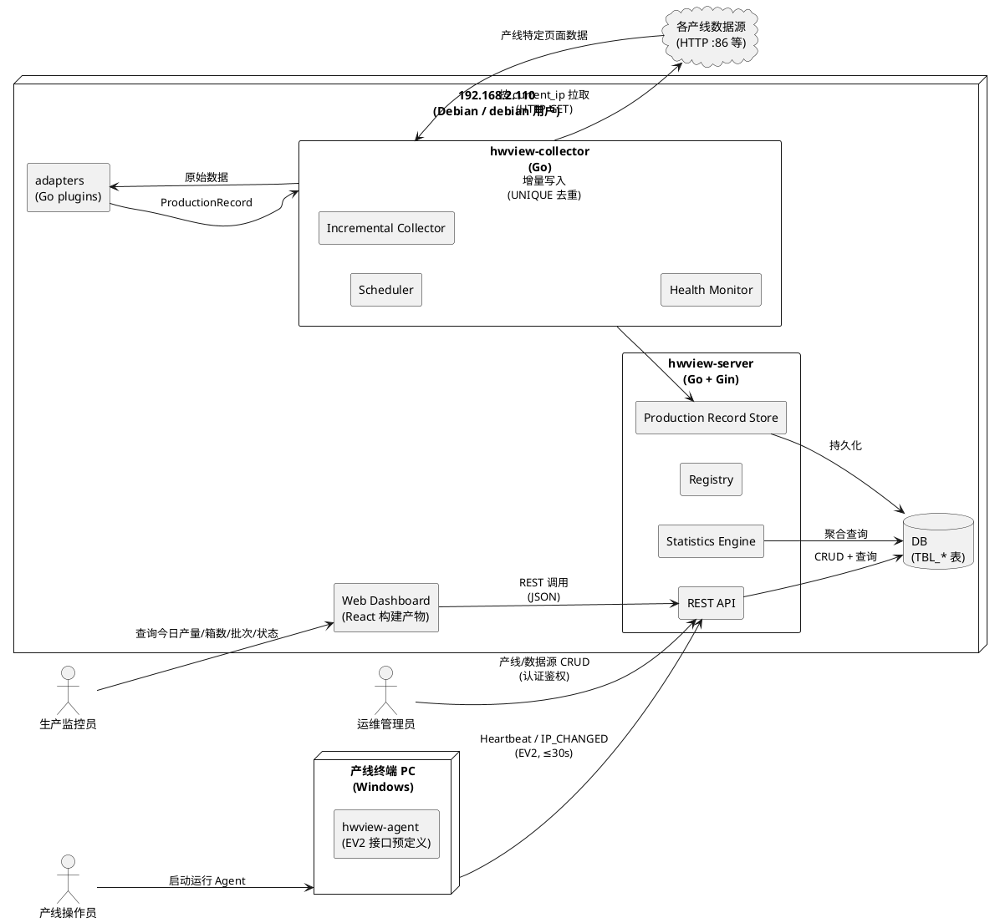

**通信协议与调用频率**：
- 运维管理员 → REST API：HTTP/HTTPS，低频（配置变更）
- 生产监控员 → Dashboard：HTTP/HTTPS，中频（页面加载 + React Query 轮询）
- Agent → REST API：HTTP/HTTPS，高频（心跳 ≤30s/次，IP_CHANGED 事件触发）
- Collector → 数据源：HTTP，高频（默认 5 分钟/次，可配置）
- Collector → DB：SQL，高频（每次采集周期写入）
- Dashboard → REST API：HTTP/HTTPS，中频（页面加载 + 近实时轮询）

### 2.1.2 服务/组件总体架构

> 对应 spec.md 第 9.1 章四大组件基线 + 第 9.2 章核心原则。展示模块内部组成结构与依赖关系。

```plantuml
@startuml
top to bottom direction

package "hwview-server" {
  component [REST API Layer\n(Gin)] as API
  component [Production Line Registry] as LineReg
  component [Data Source Registry] as SrcReg
  component [Agent Registry\n(EV2)] as AgentReg
  component [Production Record Store] as RecStore
  component [Statistics Engine] as StatsEng
  component [Audit Log] as Audit
  component [Auth Middleware] as Auth
}

package "hwview-collector" {
  component [Scheduler\n(5min default)] as Sched
  component [Source Resolver] as SrcResolver
  component [Adapter Runtime] as AdaptRT
  component [Incremental Collector] as IncColl
  component [Deduplication] as Dedup
  component [Health Monitor\n(ONLINE/DEGRADED/OFFLINE)] as HMon
  component [Cursor Store] as CursorStore
}

package "adapters" {
  component [ProductionAdapter\n(interface)] as AdaptIf
  component [Huawei102Adapter] as HW102
  component [Huawei102LineAdapter] as HW102L
  component [BMWAdapter] as BMW
  component [SchaefflerAdapter] as SCH
  component [MagnaAdapter] as MAG
  component [GenericAdapter] as GEN
  component [Adapter Registry] as AdaptReg
}

package "hwview-agent (EV2)" {
  component [Machine Identity] as MachId
  component [IPv4 Detection] as IPv4Det
  component [Heartbeat] as HB
  component [IP Change Reporting] as IPChg
}

database "DB" as DB

' 依赖关系
API --> Auth
API --> LineReg
API --> SrcReg
API --> AgentReg
API --> RecStore
API --> StatsEng
API --> Audit
LineReg --> Audit
SrcReg --> Audit
SrcReg --> LineReg
StatsEng --> RecStore
RecStore --> DB

Sched --> SrcResolver
SrcResolver --> SrcReg
SrcResolver --> AdaptRT
AdaptRT --> AdaptReg
AdaptRT --> AdaptIf
IncColl --> AdaptRT
IncColl --> Dedup
IncColl --> RecStore
IncColl --> CursorStore
IncColl --> HMon
CursorStore --> DB
HMon --> SrcReg
HMon --> DB

HW102 ..up|> AdaptIf
HW102L ..up|> AdaptIf
BMW ..up|> AdaptIf
SCH ..up|> AdaptIf
MAG ..up|> AdaptIf
GEN ..up|> AdaptIf
AdaptReg --> AdaptIf

HB --> API
IPChg --> API
IPv4Det --> IPChg
MachId --> HB

@enduml
```

**模块划分与职责**：
- **hwview-server**：平台服务端，承载注册中心、记录存储、统计与 REST API。以 Gin 框架暴露 HTTP 接口，Auth Middleware 强制认证鉴权（spec.md 第 4.3 章），Audit Log 记录所有配置变更（spec.md 第 4.3 章 4.3.5）。
- **hwview-collector**：采集器，执行调度、解析、增量采集、去重与健康监控。单一 Collector 实例服务多产线（spec.md 第 13 章红线第 7 项），通过 Source Resolver 动态读取 current_ip（spec.md 第 9.2 章 IP 禁止硬编码原则）。
- **adapters**：可插拔数据源适配器集合。所有 Adapter 实现 ProductionAdapter interface，通过 Adapter Registry 按名加载。Collector Core 仅依赖 interface，禁止依赖任何具体 Adapter（spec.md 第 9.2 章 Adapter 与 Core 解耦原则）。
- **hwview-agent**：终端代理（EV2 接口预定义，EV1 不实现）。仅上报设备身份与 IP 变化，不内置任何产线解析逻辑（spec.md 第 5.2 章 5.2.1 第 6 项禁止项）。

**配置项及取值策略**：
- `collection_interval`：默认 5 分钟，可通过配置文件/环境变量调整（spec.md 第 10.8 章）
- `agent_heartbeat_timeout`：60 秒，超时判定离线（spec.md 第 5.2 章 5.2.1 第 4 项）
- `consecutive_failures_threshold`：连续失败阈值，达阈值转 DEGRADED/OFFLINE（spec.md 第 10.9 章）
- `ip_switch_timeout`：30 秒，IP 切换超时告警（spec.md 第 4.2 章 4.2.5）
- `dashboard_polling_interval`：前端 React Query 轮询间隔，近实时反映采集进展（spec.md 第 5.7 章 5.7.1 第 4 项）

### 2.1.3 实现设计文档

> 对应 spec.md 第 5.4 章数据采集与 IP 自动切换 + 第 9.4 章 Incremental Collection + 第 10.9 章 Health Monitor。展示核心状态机与流程分支。

#### 2.1.3.1 数据源健康状态机

> 对应 spec.md 第 10.9 章 Health Monitor + 第 5.6 章数据源健康监控。状态基线 ONLINE/DEGRADED/OFFLINE。

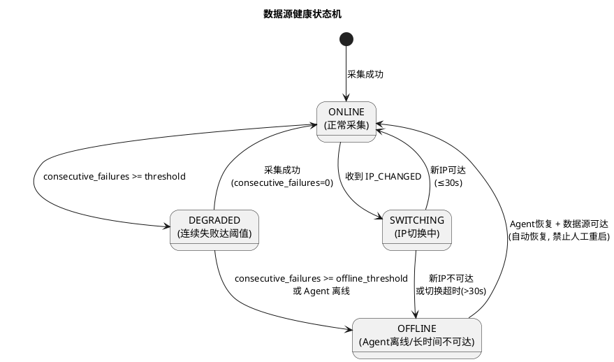

**状态转换触发条件与处理策略**：
- ONLINE → DEGRADED：Collector 连续采集失败次数达 `consecutive_failures_threshold`，触发告警，Dashboard 标记异常（spec.md 第 5.6 章 5.6.1 第 3 项）
- DEGRADED → ONLINE：采集成功，consecutive_failures 重置为 0，状态恢复
- DEGRADED → OFFLINE：连续失败达 `offline_threshold` 或关联 Agent 离线（心跳 >60s），Collector 暂停采集（spec.md 第 5.6 章 5.6.1 第 4 项）
- OFFLINE → ONLINE：Agent 恢复心跳且数据源可达，Collector 自动恢复采集，禁止要求人工手动重启（spec.md 第 5.6 章 5.6.1 第 5 项禁止项）
- ONLINE → SWITCHING：收到 IP_CHANGED 事件，更新 current_ip（spec.md 第 5.4 章 5.4.1 第 3/4 项）
- SWITCHING → ONLINE：新 IP 可达且切换完成 ≤30s，恢复采集（spec.md 第 4.2 章 4.2.5）
- SWITCHING → OFFLINE：新 IP 不可达或切换超时 >30s，触发告警（spec.md 第 5.4 章 5.4.3 第 1/2 项）

#### 2.1.3.2 增量采集主流程

> 对应 spec.md 第 9.4 章 Incremental Collection + 第 10.6 章 TASK-HWV-EV1-006。流程：Scheduler→Source Resolver→Adapter→Fetch→Normalize→Dedup→DB。

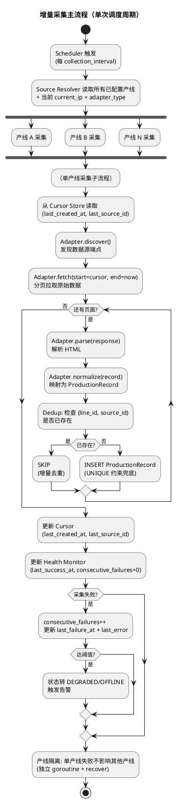

**关键设计决策**：
- **产线隔离**：每条产线采集在独立 goroutine 中执行，配合 `recover` 捕获 panic，确保单产线失败不影响其他产线（spec.md 第 9.4 章 9.4.5 产线隔离规则 + 第 4.2 章 4.2.3 Collector 故障隔离）
- **Cursor 双键**：采用 `last_created_at + last_source_id` 双键，避免相同时间戳漏记录（spec.md 第 9.5 章 9.5.1 Cursor 构成规则）。具体推进逻辑：下次采集 `WHERE created_at > last_created_at OR (created_at = last_created_at AND source_id > last_source_id)`
- **去重双层保障**：应用层 Dedup 检查 + 数据库 UNIQUE(line_id, source_id) 约束兜底（INSERT IGNORE / ON CONFLICT DO NOTHING），确保可重复执行不重复入库（spec.md 第 9.3.3 章 + 第 9.4 章 9.4.3 可重复执行规则）
- **失败可继续**：Cursor 持久化存储，Collector 重启后从 Cursor 断点继续（spec.md 第 9.5 章 9.5.2 + 第 9.4 章 9.4.4 失败可继续规则）

#### 2.1.3.3 IP_CHANGED 处理流程

> 对应 spec.md 第 5.4 章 5.4.2 交互流程 + 第 12.3 章 IP 变化处理流程。EV2 接口预定义，EV1 仅设计 Server 端响应逻辑。

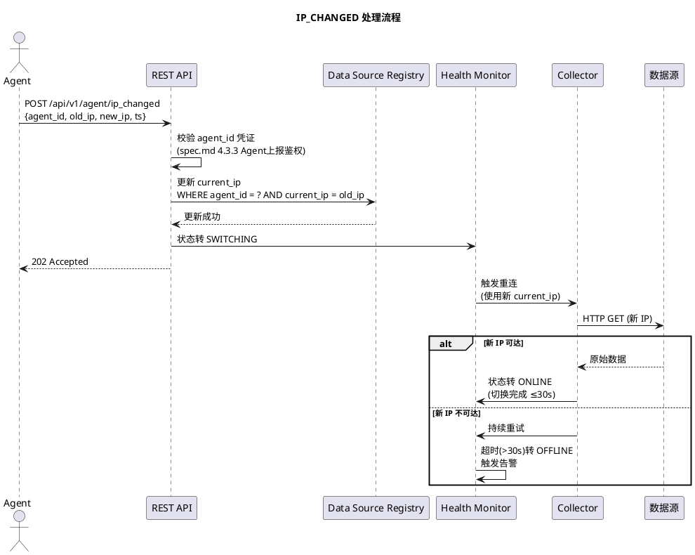

**事务设计**：
- current_ip 更新与 SWITCHING 状态标记在同一数据库事务内完成，确保一致性
- 切换期间已采集数据不丢失（spec.md 第 4.2 章 4.2.5），Cursor 保持不变，新 IP 恢复后从断点继续

---

## 2.2 接口设计

### 2.2.1 总体设计

> 对应 spec.md 第 5.1-5.7 章核心能力 + 第 12 章 EV2 Agent 接口预定义。接口分类依据：按调用方与业务域分类。

| 接口分类 | 接口名称 | 调用方 | 稳定性等级 | spec.md 追溯 |
|---------|---------|--------|-----------|-------------|
| 产线管理 | `POST/GET/PUT/DELETE /api/v1/lines` | 运维管理员 | 稳定 | 5.1 产线注册与管理 |
| 数据源管理 | `POST/GET/PUT/DELETE /api/v1/datasources` | 运维管理员 | 稳定 | 5.3 数据源配置与适配 |
| Agent 管理（EV2） | `POST/GET /api/v1/agents` | 运维管理员 | 实验 | 5.2 Agent 管理与动态发现 |
| Agent 心跳（EV2） | `POST /api/v1/agent/heartbeat` | hwview-agent | 实验 | 5.2.2 交互流程 + 12.2 |
| IP_CHANGED（EV2） | `POST /api/v1/agent/ip_changed` | hwview-agent | 实验 | 5.4.2 + 12.3 |
| 采集控制 | `POST /api/v1/collect/trigger` | 运维管理员 | 稳定 | 5.4 数据采集 |
| 统计查询 | `GET /api/v1/stats/overview` | Dashboard | 稳定 | 5.5 + 5.7.1 总览首页 |
| 统计查询 | `GET /api/v1/stats/lines/{line_id}` | Dashboard | 稳定 | 5.7.1 产线详情 |
| 统计查询 | `GET /api/v1/stats/batches` | Dashboard | 稳定 | 5.5.1 批次统计 |
| 健康查询 | `GET /api/v1/health/datasources` | Dashboard/运维 | 稳定 | 5.6 数据源健康监控 |
| 健康查询 | `GET /api/v1/health/lines` | Dashboard/运维 | 稳定 | 5.6 + 10.9 |

**接口变更策略**：
- URL 含版本前缀 `/api/v1/`，破坏性变更升版本号
- EV2 Agent 接口标记为"实验"稳定性，EV1 Evidence Gate 通过后稳定化
- 所有接口遵循 RESTful 风格，JSON 请求/响应

### 2.2.2 接口清单

#### 2.2.2.1 产线管理接口

**接口签名**：
```go
// POST /api/v1/lines
type CreateLineRequest struct {
    LineCode    string `json:"line_code" binding:"required"`    // 如 HW102-COPY
    LineName    string `json:"line_name" binding:"required"`    // 如 华为102复制线
    Customer    string `json:"customer" binding:"required"`     // 如 华为
    Product     string `json:"product" binding:"required"`      // 如 HW102
    AdapterType string `json:"adapter_type" binding:"required"` // 如 Huawei102Adapter
    Enabled     bool   `json:"enabled"`
}

type LineResponse struct {
    ID          int64  `json:"id"`
    LineCode    string `json:"line_code"`
    LineName    string `json:"line_name"`
    Customer    string `json:"customer"`
    Product     string `json:"product"`
    AdapterType string `json:"adapter_type"`
    Enabled     bool   `json:"enabled"`
    Status      string `json:"status"` // 未配置/已配置/采集中/异常
    CreatedAt   string `json:"created_at"`
    UpdatedAt   string `json:"updated_at"`
}
```

**业务说明**：新增产线，需校验 line_code 唯一性与必填属性（spec.md 第 5.1 章 5.1.1 第 1/2 项）。
**前置条件**：调用者已通过认证鉴权，具备运维管理员权限（spec.md 第 4.3 章 4.3.1/4.3.2）。
**后置条件**：TBL_PRODUCTION_LINE 新增记录，审计日志记录操作人与变更内容（spec.md 第 4.3 章 4.3.5）。
**异常映射**：
- `400 Bad Request`：必填属性缺失，响应体明确缺失字段列表（spec.md 第 5.1 章 5.1.3 第 2 项）
- `409 Conflict`：line_code 已存在（spec.md 第 5.1 章 5.1.3 第 1 项）
- `401 Unauthorized`：未认证
- `403 Forbidden`：权限不足

**调用示例**：
```bash
curl -X POST https://192.168.2.110/api/v1/lines \
  -H "Authorization: Bearer <token>" \
  -H "Content-Type: application/json" \
  -d '{"line_code":"HW102-COPY","line_name":"华为102复制线","customer":"华为","product":"HW102","adapter_type":"Huawei102Adapter","enabled":true}'
```

#### 2.2.2.2 数据源管理接口

**接口签名**：
```go
// POST /api/v1/datasources
type CreateDataSourceRequest struct {
    LineID   int64  `json:"line_id" binding:"required"`
    AgentID  string `json:"agent_id"`              // EV2 绑定，EV1 可空
    Hostname string `json:"hostname"`              // 终端主机名
    CurrentIP string `json:"current_ip" binding:"required"` // 可变属性
    Port     int    `json:"port" binding:"required"`        // 如 86
    BasePath string `json:"base_path" binding:"required"`   // 如 /Cron/Jili/lists/
    Enabled  bool   `json:"enabled"`
}

type DataSourceResponse struct {
    ID           int64  `json:"id"`
    LineID       int64  `json:"line_id"`
    AgentID      string `json:"agent_id"`
    Hostname     string `json:"hostname"`
    CurrentIP    string `json:"current_ip"`
    Port         int    `json:"port"`
    BasePath     string `json:"base_path"`
    Enabled      bool   `json:"enabled"`
    Status       string `json:"status"` // ONLINE/DEGRADED/OFFLINE/SWITCHING
    LastSuccessAt string `json:"last_success_at"`
    LastErrorAt  string `json:"last_error_at"`
}
```

**业务说明**：配置数据源，current_ip 为可变属性，可随 IP_CHANGED 更新（spec.md 第 9.3.2 章 + 第 10.2 章 TASK-HWV-EV1-002）。
**前置条件**：line_id 已存在于 TBL_PRODUCTION_LINE。
**后置条件**：TBL_DATA_SOURCE 新增记录，Collector 下个调度周期自动纳入采集。
**异常映射**：`400`（必填缺失）/ `404`（line_id 不存在）/ `409`（重复配置）。

#### 2.2.2.3 Agent 心跳接口（EV2 预定义）

**接口签名**：
```go
// POST /api/v1/agent/heartbeat
type HeartbeatRequest struct {
    AgentID      string   `json:"agent_id" binding:"required"`
    Hostname     string   `json:"hostname" binding:"required"`
    MachineID    string   `json:"machine_id" binding:"required"`
    MAC          string   `json:"mac" binding:"required"`
    IPv4         string   `json:"ipv4" binding:"required"`
    SourceEndpoints []string `json:"source_endpoints" binding:"required"`
    Timestamp    int64    `json:"ts" binding:"required"` // Unix 时间戳
}

type HeartbeatResponse struct {
    Accepted bool   `json:"accepted"`
    AgentID  string `json:"agent_id"`
    Bound    bool   `json:"bound"`   // 是否已绑定产线
    LineID   *int64 `json:"line_id"` // 已绑定则返回
}
```

**业务说明**：Agent 周期上报身份与网络信息，间隔 ≤30s（spec.md 第 5.2 章 5.2.1 第 3 项 + 第 12.2 章）。
**前置条件**：Agent 携带有效 agent_id 凭证（spec.md 第 4.3 章 4.3.3）。
**后置条件**：刷新 TBL_DATA_SOURCE.last_heartbeat；若 agent_id 首次上报则自动登记为待绑定（spec.md 第 5.2 章 5.2.3 第 3 项）。
**异常映射**：`401`（凭证无效）/ `409`（身份冲突，保留先注册者，拒绝后者并告警，spec.md 第 5.2 章 5.2.3 第 1 项）。

#### 2.2.2.4 IP_CHANGED 接口（EV2 预定义）

**接口签名**：
```go
// POST /api/v1/agent/ip_changed
type IPChangedRequest struct {
    AgentID string `json:"agent_id" binding:"required"`
    OldIP   string `json:"old_ip" binding:"required"`
    NewIP   string `json:"new_ip" binding:"required"`
    Timestamp int64 `json:"ts" binding:"required"`
}
```

**业务说明**：Agent 检测到 IPv4 变化时上报，触发无感切换（spec.md 第 5.4 章 5.4.1 第 3/4 项 + 第 12.3 章）。
**前置条件**：agent_id 已注册且凭证有效。
**后置条件**：TBL_DATA_SOURCE.current_ip 更新为 new_ip；Health Monitor 状态转 SWITCHING；Collector 自动使用新 IP 重连；切换完成 ≤30s（spec.md 第 4.2 章 4.2.5）。
**异常映射**：`401`（凭证无效）/ `404`（agent_id 不存在）/ `409`（old_ip 与当前 current_ip 不匹配）。

#### 2.2.2.5 统计查询接口

**接口签名**：
```go
// GET /api/v1/stats/overview?date=2026-09-07
type OverviewResponse struct {
    Date             string `json:"date"`              // 2026-09-07
    TotalPieceCount  int64  `json:"total_piece_count"` // SUM(quantity) 全厂
    TotalBoxCount    int64  `json:"total_box_count"`   // COUNT(DISTINCT source_id) 全厂
    OnlineLineCount  int    `json:"online_line_count"` // 在线产线数
    DataSourceCount  int    `json:"data_source_count"` // 数据源数
    Lines []LineStats `json:"lines"`                   // 各产线列表
}

type LineStats struct {
    LineID       int64  `json:"line_id"`
    LineCode     string `json:"line_code"`
    LineName     string `json:"line_name"`
    PieceCount   int64  `json:"piece_count"`  // SUM(quantity)
    BoxCount     int64  `json:"box_count"`    // COUNT(DISTINCT source_id)
    Status       string `json:"status"`       // ONLINE/DEGRADED/OFFLINE
}

// GET /api/v1/stats/lines/{line_id}?date=2026-09-07
type LineDetailResponse struct {
    LineID         int64  `json:"line_id"`
    LineCode       string `json:"line_code"`
    LineName       string `json:"line_name"`
    CurrentTerminal string `json:"current_terminal"` // hostname
    CurrentIP      string `json:"current_ip"`        // 脱敏后
    AgentStatus    string `json:"agent_status"`      // ONLINE/OFFLINE
    DataSourceStatus string `json:"datasource_status"`
    BoxCount       int64  `json:"box_count"`
    PieceCount     int64  `json:"piece_count"`
    BatchCount     int    `json:"batch_count"`
    FirstProductionAt string `json:"first_production_at"`
    LastProductionAt  string `json:"last_production_at"`
    Batches []BatchDetail `json:"batches"`           // 批次明细
}

type BatchDetail struct {
    BatchNo    string `json:"batch_no"`
    BoxCount   int64  `json:"box_count"`
    PieceCount int64  `json:"piece_count"`
}
```

**业务说明**：
- `overview`：全厂总览，返回今日总产量/箱数/在线产线数/数据源数 + 各产线列表（spec.md 第 5.7 章 5.7.1 第 1/2 项）
- `lines/{line_id}`：单产线详情，返回当前终端/IP/Agent状态/数据源状态/今日箱数只数/批次明细（spec.md 第 5.7 章 5.7.1 第 3 项）
**前置条件**：调用者已认证；current_ip 等敏感信息按权限脱敏（spec.md 第 4.3 章 4.3.4）。
**后置条件**：无（只读查询）。
**异常映射**：`400`（日期格式非法）/ `404`（产线不存在）/ `504`（查询超时，返回部分数据，spec.md 第 5.7 章 5.7.3 第 1/2 项）。
**性能约束**：总览响应 ≤2s（95 分位），详情响应 ≤3s（95 分位），聚合查询 ≥20 QPS（spec.md 第 4.1 章）。

#### 2.2.2.6 健康查询接口

**接口签名**：
```go
// GET /api/v1/health/datasources
type DataSourceHealthResponse struct {
    DataSources []DataSourceHealth `json:"datasources"`
}

type DataSourceHealth struct {
    SourceID            int64  `json:"source_id"`
    LineID              int64  `json:"line_id"`
    Status              string `json:"status"` // ONLINE/DEGRADED/OFFLINE/SWITCHING
    LastSuccessAt       string `json:"last_success_at"`
    LastFailureAt       string `json:"last_failure_at"`
    ConsecutiveFailures int    `json:"consecutive_failures"`
    LastError           string `json:"last_error"`
}
```

**业务说明**：暴露每个数据源的健康状态（spec.md 第 5.6 章 5.6.1 第 2 项 + 第 10.9 章 TASK-HWV-EV1-009）。
**前置条件**：调用者已认证。
**后置条件**：无（只读查询）。

#### 2.2.2.7 采集触发接口

**接口签名**：
```go
// POST /api/v1/collect/trigger
type TriggerCollectRequest struct {
    LineID *int64 `json:"line_id"` // nil 表示触发所有产线
}

type TriggerCollectResponse struct {
    Triggered bool  `json:"triggered"`
    LineID    *int64 `json:"line_id"`
    TaskID    string `json:"task_id"` // 异步任务 ID
}
```

**业务说明**：手动触发采集（运维调试用），不改变调度周期（spec.md 第 5.4 章 5.4.1 第 1 项）。
**前置条件**：调用者具备运维管理员权限。
**后置条件**：Collector 异步执行一次采集，返回 task_id 供查询结果。

---

## 2.3 数据模型

### 2.3.1 设计目标

> 对应 spec.md 第 6 章数据约束 + 第 9.3 章数据模型冻结 + 第 9.5 章 Cursor 机制 + 第 10.9 章 Health Monitor。

**需支持的业务场景**：
- 多产线注册与配置（≥5 条产线，spec.md 第 9.3.1 章验收条件）
- 数据源 current_ip 可变属性更新（spec.md 第 9.3.2 章关键约束）
- 增量采集去重（UNIQUE(line_id, source_id)，spec.md 第 9.3.3 章关键约束）
- Cursor 断点续采（last_created_at + last_source_id 双键，spec.md 第 9.5 章）
- 健康监控状态持久化（last_success_at/last_failure_at/consecutive_failures/last_error，spec.md 第 10.9 章）
- 统计聚合查询（box_count/piece_count/batch_count，spec.md 第 10.7 章）

**性能、容量、扩展性目标**：
- 统计聚合查询 ≥20 QPS（spec.md 第 4.1 章 4.1.5）
- Dashboard 总览 ≤2s、详情 ≤3s（spec.md 第 4.1 章 4.1.1/4.1.2）
- 支持 ≥100 个 Agent 并发心跳（spec.md 第 4.1 章 4.1.3）

**与存量数据的兼容策略**：代码库为空，无存量数据兼容需求。Golden Evidence（433/5395/Q0926-078）作为验收基准，不作为存量数据迁移源。

### 2.3.2 模型实现

> 对应 spec.md 第 9.3 章三张基线表 + 第 9.5 章 Cursor 表 + 第 10.9 章健康监控表。表名遵循 `TBL_` 前缀加下划线分隔大写命名规范（spec.md 第 4.5 章 4.5.4 + 用户偏好 PREFERENCE_17）。

#### 2.3.2.1 核心领域对象类图

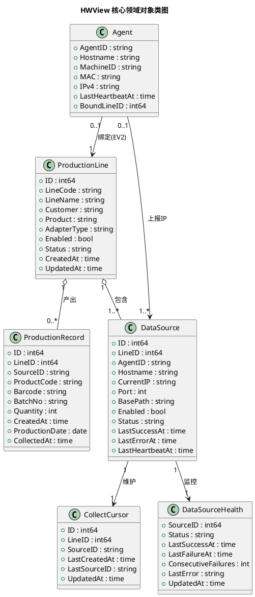

**对象关系与生命周期**：
- ProductionLine 聚合多个 DataSource（一条产线至少一个数据源，spec.md 第 6.1 章第 5 项）
- ProductionLine 产出多条 ProductionRecord（一对多）
- DataSource 维护一个 CollectCursor（一对一，Cursor 持久化，spec.md 第 9.5 章 9.5.2）
- DataSource 关联一个 DataSourceHealth（一对一健康监控）
- Agent 与 DataSource 为上报关系（EV2，一个 Agent 可上报多个数据源端点）
- Agent 与 ProductionLine 为可选绑定（EV2，未绑定时 Agent 状态为待绑定）

**持久化策略**：所有领域对象持久化至关系型数据库（SQLite/PostgreSQL，由部署环境决定），表名 `TBL_` 前缀。ProductionRecord 采用 UNIQUE(line_id, source_id) 约束 + 索引优化聚合查询。

#### 2.3.2.2 TBL_PRODUCTION_LINE DDL（产线表）

> 对应 spec.md 第 9.3.1 章。字段冻结，物理类型与索引由本 design.md 确定。

```sql
CREATE TABLE TBL_PRODUCTION_LINE (
    id           BIGINT       PRIMARY KEY AUTOINCREMENT,
    line_code    VARCHAR(64)  NOT NULL UNIQUE,
    line_name    VARCHAR(128) NOT NULL,
    customer     VARCHAR(64)  NOT NULL,
    product      VARCHAR(64)  NOT NULL,
    adapter_type VARCHAR(64)  NOT NULL,
    enabled      BOOLEAN      NOT NULL DEFAULT TRUE,
    status       VARCHAR(32)  NOT NULL DEFAULT 'UNCONFIGURED',
    created_at   TIMESTAMP    NOT NULL DEFAULT CURRENT_TIMESTAMP,
    updated_at   TIMESTAMP    NOT NULL DEFAULT CURRENT_TIMESTAMP
);

CREATE INDEX IDX_PRODUCTION_LINE_CUSTOMER ON TBL_PRODUCTION_LINE(customer);
CREATE INDEX IDX_PRODUCTION_LINE_PRODUCT  ON TBL_PRODUCTION_LINE(product);
CREATE INDEX IDX_PRODUCTION_LINE_ENABLED  ON TBL_PRODUCTION_LINE(enabled);
```

**字段说明**：
- `line_code`：产线编码，全局唯一，格式大写字母加连字符（如 HW102-COPY），不可变更（spec.md 第 6.1 章第 1 项）
- `adapter_type`：绑定的 Adapter 类型，取值为已注册 Adapter 之一（如 Huawei102Adapter）
- `status`：产线状态，取值范围 UNCONFIGURED/CONFIGURED/COLLECTING/ERROR（对应 spec.md 第 6.1 章第 6 项 未配置/已配置/采集中/异常）
- `enabled`：是否启用，禁用的产线不参与采集

**EV1 首条真实产线基线**（spec.md 第 9.3.1 章）：
```sql
INSERT INTO TBL_PRODUCTION_LINE (line_code, line_name, customer, product, adapter_type, enabled, status)
VALUES ('HW102-COPY', '华为102复制线', '华为', 'HW102', 'Huawei102Adapter', TRUE, 'UNCONFIGURED');
```

#### 2.3.2.3 TBL_DATA_SOURCE DDL（数据源表）

> 对应 spec.md 第 9.3.2 章。current_ip 必须为可变属性。

```sql
CREATE TABLE TBL_DATA_SOURCE (
    id              BIGINT       PRIMARY KEY AUTOINCREMENT,
    line_id         BIGINT       NOT NULL,
    agent_id        VARCHAR(64),
    hostname        VARCHAR(128),
    current_ip      VARCHAR(45)  NOT NULL,
    port            INT          NOT NULL,
    base_path       VARCHAR(256) NOT NULL,
    enabled         BOOLEAN      NOT NULL DEFAULT TRUE,
    status          VARCHAR(32)  NOT NULL DEFAULT 'OFFLINE',
    last_success_at TIMESTAMP,
    last_error_at   TIMESTAMP,
    last_heartbeat_at TIMESTAMP,
    created_at      TIMESTAMP    NOT NULL DEFAULT CURRENT_TIMESTAMP,
    updated_at      TIMESTAMP    NOT NULL DEFAULT CURRENT_TIMESTAMP,
    FOREIGN KEY (line_id) REFERENCES TBL_PRODUCTION_LINE(id) ON DELETE CASCADE
);

CREATE UNIQUE INDEX UQ_DATA_SOURCE_LINE_BASEPATH ON TBL_DATA_SOURCE(line_id, base_path);
CREATE INDEX IDX_DATA_SOURCE_AGENT   ON TBL_DATA_SOURCE(agent_id);
CREATE INDEX IDX_DATA_SOURCE_STATUS  ON TBL_DATA_SOURCE(status);
CREATE INDEX IDX_DATA_SOURCE_ENABLED ON TBL_DATA_SOURCE(enabled);
```

**关键约束**：
- `current_ip`：可变属性，可随 IP_CHANGED 事件更新（spec.md 第 9.3.2 章关键约束 + 第 10.2 章 TASK-HWV-EV1-002 禁止项）
- `agent_id`：EV2 绑定字段，EV1 可空
- `status`：数据源状态，取值 ONLINE/DEGRADED/OFFLINE/SWITCHING（spec.md 第 10.9 章 + 第 5.6 章）
- `last_heartbeat_at`：最近心跳时间，超过 60s 判定 Agent 离线（spec.md 第 5.2 章 5.2.1 第 4 项）
- 外键 ON DELETE CASCADE：产线删除时级联删除数据源

#### 2.3.2.4 TBL_PRODUCTION_RECORD DDL（生产记录表）

> 对应 spec.md 第 9.3.3 章。关键约束 UNIQUE(line_id, source_id)。

```sql
CREATE TABLE TBL_PRODUCTION_RECORD (
    id              BIGINT       PRIMARY KEY AUTOINCREMENT,
    line_id         BIGINT       NOT NULL,
    source_id       VARCHAR(128) NOT NULL,
    product_code    VARCHAR(64)  NOT NULL,
    barcode         VARCHAR(128) NOT NULL,
    batch_no        VARCHAR(64)  NOT NULL,
    quantity        INT          NOT NULL CHECK (quantity >= 0),
    created_at      TIMESTAMP    NOT NULL,
    production_date DATE         NOT NULL,
    collected_at    TIMESTAMP    NOT NULL DEFAULT CURRENT_TIMESTAMP,
    FOREIGN KEY (line_id) REFERENCES TBL_PRODUCTION_LINE(id) ON DELETE CASCADE
);

CREATE UNIQUE INDEX UQ_RECORD_LINE_SOURCE ON TBL_PRODUCTION_RECORD(line_id, source_id);
CREATE INDEX IDX_RECORD_LINE_DATE    ON TBL_PRODUCTION_RECORD(line_id, production_date);
CREATE INDEX IDX_RECORD_DATE         ON TBL_PRODUCTION_RECORD(production_date);
CREATE INDEX IDX_RECORD_BATCH        ON TBL_PRODUCTION_RECORD(line_id, production_date, batch_no);
CREATE INDEX IDX_RECORD_CREATED_AT   ON TBL_PRODUCTION_RECORD(line_id, created_at);
```

**关键约束**：
- `UNIQUE(line_id, source_id)`：Collector 反复扫描同一天数据也不产生重复记录（spec.md 第 9.3.3 章关键约束 + 第 10.3 章 TASK-HWV-EV1-003）。去重实现采用 `INSERT OR IGNORE`（SQLite）或 `ON CONFLICT (line_id, source_id) DO NOTHING`（PostgreSQL）
- `quantity`：非负整数，由 Adapter 映射得到（spec.md 第 6.4 章第 6 项）
- `source_id`：数据源端点标识（如华为102的箱码），用于 box_count = COUNT(DISTINCT source_id)
- `production_date`：生产日期，由 created_at 提取日期，用于按日聚合
- `collected_at`：采集入库时间，用于追踪采集延迟（spec.md 第 4.1 章 4.1.4）

**统计聚合索引设计**：
- `IDX_RECORD_LINE_DATE`：支持按产线+日期聚合（box_count/piece_count）
- `IDX_RECORD_BATCH`：支持批次明细查询
- `IDX_RECORD_CREATED_AT`：支持 Cursor 推进查询

#### 2.3.2.5 TBL_COLLECT_CURSOR DDL（Cursor 持久化表）

> 对应 spec.md 第 9.5 章 Cursor 机制。双键 last_created_at + last_source_id 避免相同时间戳漏记录。

```sql
CREATE TABLE TBL_COLLECT_CURSOR (
    id             BIGINT       PRIMARY KEY AUTOINCREMENT,
    line_id        BIGINT       NOT NULL,
    source_id      VARCHAR(128) NOT NULL,
    last_created_at TIMESTAMP   NOT NULL,
    last_source_id VARCHAR(128) NOT NULL,
    updated_at     TIMESTAMP    NOT NULL DEFAULT CURRENT_TIMESTAMP,
    FOREIGN KEY (line_id) REFERENCES TBL_PRODUCTION_LINE(id) ON DELETE CASCADE
);

CREATE UNIQUE INDEX UQ_CURSOR_LINE ON TBL_COLLECT_CURSOR(line_id);
```

**Cursor 推进逻辑**：
- 首次同步：读取历史数据全量入库，保存 Cursor 为最后一条记录的 (created_at, source_id)
- 增量同步：查询条件 `WHERE created_at > last_created_at OR (created_at = last_created_at AND source_id > last_source_id)`，按 (created_at, source_id) 二级排序，避免相同时间戳漏记录（spec.md 第 9.5 章 9.5.1）
- Cursor 持久化：禁止仅存在于内存，Collector 重启后从 TBL_COLLECT_CURSOR 恢复（spec.md 第 9.5 章 9.5.2）

#### 2.3.2.6 TBL_DATA_SOURCE_HEALTH DDL（健康监控表）

> 对应 spec.md 第 10.9 章 TASK-HWV-EV1-009 + 第 5.6 章数据源健康监控。

```sql
CREATE TABLE TBL_DATA_SOURCE_HEALTH (
    source_id            BIGINT       PRIMARY KEY,
    status               VARCHAR(32)  NOT NULL DEFAULT 'OFFLINE',
    last_success_at      TIMESTAMP,
    last_failure_at      TIMESTAMP,
    consecutive_failures INT          NOT NULL DEFAULT 0,
    last_error           TEXT,
    updated_at           TIMESTAMP    NOT NULL DEFAULT CURRENT_TIMESTAMP,
    FOREIGN KEY (source_id) REFERENCES TBL_DATA_SOURCE(id) ON DELETE CASCADE
);

CREATE INDEX IDX_HEALTH_STATUS ON TBL_DATA_SOURCE_HEALTH(status);
```

**字段说明**：
- `status`：ONLINE/DEGRADED/OFFLINE/SWITCHING（spec.md 第 10.9 章状态基线 + 第 2.1.3.1 章状态机）
- `consecutive_failures`：连续失败计数，达阈值转 DEGRADED，达 offline_threshold 转 OFFLINE
- `last_error`：最近错误信息，用于 Dashboard 展示与告警
- 禁止仅用单一时间点判定产线健康（spec.md 第 10.9 章禁止项），需结合 consecutive_failures 与 last_success_at 综合判定

#### 2.3.2.7 TBL_AGENT DDL（Agent 表，EV2 预定义）

> 对应 spec.md 第 6.2 章 Agent 数据约束 + 第 12 章 EV2 Agent 接口预定义。EV1 可建表但不实现 Agent 端。

```sql
CREATE TABLE TBL_AGENT (
    agent_id         VARCHAR(64)  PRIMARY KEY,
    hostname         VARCHAR(128) NOT NULL,
    machine_id       VARCHAR(128) NOT NULL,
    mac              VARCHAR(32)  NOT NULL,
    ipv4             VARCHAR(45)  NOT NULL,
    last_heartbeat_at TIMESTAMP   NOT NULL,
    bound_line_id    BIGINT,
    status           VARCHAR(32)  NOT NULL DEFAULT 'PENDING_BIND',
    created_at       TIMESTAMP    NOT NULL DEFAULT CURRENT_TIMESTAMP,
    updated_at       TIMESTAMP    NOT NULL DEFAULT CURRENT_TIMESTAMP,
    FOREIGN KEY (bound_line_id) REFERENCES TBL_PRODUCTION_LINE(id)
);

CREATE INDEX IDX_AGENT_MACHINE ON TBL_AGENT(machine_id);
CREATE INDEX IDX_AGENT_STATUS  ON TBL_AGENT(status);
```

**字段说明**：
- `agent_id`：全局唯一，不可变更（spec.md 第 6.2 章第 1 项）
- `machine_id`：跨 IP 变化识别同一机器（spec.md 第 6.2 章第 3 项）
- `status`：PENDING_BIND（待绑定）/ BOUND（已绑定）/ OFFLINE（离线）
- `bound_line_id`：绑定的产线，空表示待绑定（spec.md 第 5.2 章 5.2.3 第 3 项）

#### 2.3.2.8 TBL_AUDIT_LOG DDL（审计日志表）

> 对应 spec.md 第 4.3 章 4.3.5 操作审计 + 第 4.3 章 4.3.7 特权操作审计。

```sql
CREATE TABLE TBL_AUDIT_LOG (
    id          BIGINT       PRIMARY KEY AUTOINCREMENT,
    actor       VARCHAR(128) NOT NULL,
    action      VARCHAR(64)  NOT NULL,
    target_type VARCHAR(64)  NOT NULL,
    target_id   VARCHAR(128),
    change      TEXT,
    sudo_used   BOOLEAN      NOT NULL DEFAULT FALSE,
    created_at  TIMESTAMP    NOT NULL DEFAULT CURRENT_TIMESTAMP
);

CREATE INDEX IDX_AUDIT_ACTOR ON TBL_AUDIT_LOG(actor);
CREATE INDEX IDX_AUDIT_TIME  ON TBL_AUDIT_LOG(created_at);
CREATE INDEX IDX_AUDIT_TARGET ON TBL_AUDIT_LOG(target_type, target_id);
```

**字段说明**：
- `actor`：操作人（运维管理员用户名或 agent_id）
- `action`：操作类型（CREATE/UPDATE/DELETE/BIND/IP_CHANGED/SUDO_EXEC 等）
- `sudo_used`：是否通过 sudo 提权执行（spec.md 第 4.3 章 4.3.7）
- `change`：变更内容 JSON，记录前后值

---

## 2.4 Adapter 接口设计

> 对应 spec.md 第 5.3 章数据源配置与适配 + 第 9.1 章 adapters 组件 + 第 10.4 章 TASK-HWV-EV1-004 Adapter Interface + 第 10.5 章 TASK-HWV-EV1-005 Huawei102Adapter。

### 2.4.1 ProductionAdapter 统一接口契约

> 对应 spec.md 第 10.4 章接口基线：discover() / fetch(start, end, cursor=None) / parse(response) / normalize(record)。使用 Go interface 表达，核心 Collector 仅依赖此接口。

```go
package adapters

import (
    "context"
    "time"
)

// ProductionRecord 统一生产记录结构（对应 spec.md 第 6.4 章）
type ProductionRecord struct {
    LineID        int64
    SourceID      string
    ProductCode   string
    Barcode       string
    BatchNo       string
    Quantity      int
    CreatedAt     time.Time
    ProductionDate string // YYYY-MM-DD
}

// Cursor 增量采集游标（对应 spec.md 第 9.5 章，双键 last_created_at + last_source_id）
type Cursor struct {
    LastCreatedAt time.Time
    LastSourceID  string
}

// DiscoverResult 数据源端点发现结果
type DiscoverResult struct {
    Available bool
    TotalEstimate int64 // 预估总记录数（可选）
}

// FetchResult 原始数据抓取结果
type FetchResult struct {
    RawData      []byte   // 原始页面数据（如 HTML）
    HasMore      bool     // 是否还有下一页
    NextPageToken string  // 下一页分页 token
    Records      []ProductionRecord // 已 normalize 的记录（parse+normalize 可合并）
}

// ProductionAdapter 统一适配器接口
// 所有具体 Adapter（Huawei102Adapter/BMWAdapter 等）必须实现此接口
// 核心 Collector 仅依赖此接口，禁止依赖任何具体 Adapter 实现（spec.md 第 9.2 章 + 第 13 章红线第 6 项）
type ProductionAdapter interface {
    // Name 返回 Adapter 标识（如 "Huawei102Adapter"）
    Name() string

    // Discover 探测数据源端点是否可达
    Discover(ctx context.Context, sourceURL string) (*DiscoverResult, error)

    // Fetch 按日期范围与 Cursor 拉取原始数据
    // start/end 为日期范围；cursor 为增量游标（nil 表示首次全量）
    Fetch(ctx context.Context, sourceURL string, start, end time.Time, cursor *Cursor) (*FetchResult, error)

    // Parse 解析原始响应为中间结构（HTML→字段映射）
    Parse(ctx context.Context, rawData []byte) ([]map[string]interface{}, error)

    // Normalize 将中间结构映射为统一 ProductionRecord
    Normalize(ctx context.Context, lineID int64, raw map[string]interface{}) (*ProductionRecord, error)
}
```

**接口设计原则**：
- **类型安全**：使用 Go 强类型结构体，禁止 `map[string]interface{}` 作为最终输出（仅在 Parse 中间层使用）
- **Context 传递**：所有方法接受 `context.Context`，支持超时取消（采集延迟 ≤10s，spec.md 第 4.1 章 4.1.4）
- **Cursor 透传**：Fetch 接受 Cursor 参数，Adapter 内部按 (created_at, source_id) 二级排序返回增量数据
- **错误返回**：使用 Go 多返回值 `(result, error)`，错误由 Collector Health Monitor 统一处理

### 2.4.2 Huawei102Adapter 实现设计

> 对应 spec.md 第 10.5 章 TASK-HWV-EV1-005。流程基线：GET /Cron/Jili/lists/ → 日期过滤 → 分页发现 → 逐页抓取 → HTML Parse → source_id/barcode/quantity/batch_no/created_at。

**实现流程**：

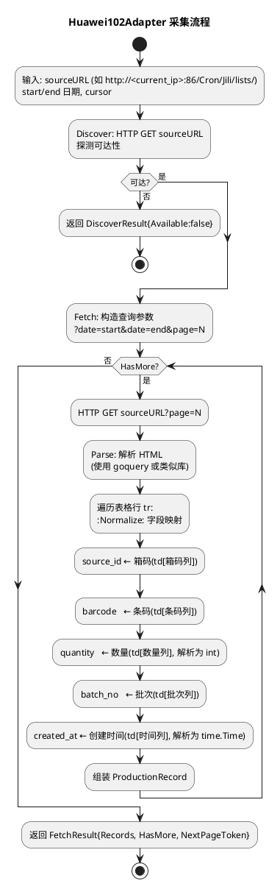

**字段映射规则**（封装在 Adapter 内，禁止进入 Collector Core，spec.md 第 13 章红线第 6 项）：
- `source_id`：华为102页面的"箱码"字段（用于 box_count = COUNT(DISTINCT source_id)）
- `barcode`：华为102页面的"条码"字段
- `quantity`：华为102页面的"数量"字段，解析为非负整数（spec.md 第 6.4 章第 6 项）
- `batch_no`：华为102页面的"批次"字段（如 Q0926-078）
- `created_at`：华为102页面的"创建时间"字段，解析为 time.Time
- `product_code`：从产线配置的 product 字段读取（如 HW102）

**Golden Evidence 验收**（spec.md 第 10.5 章 + 第 11 章）：
- Huawei102Adapter Integration Test 必须以 Golden Evidence（433 records / 5395 pieces / Q0926-078）作为验收基准
- 测试输入：HW102-COPY 产线 / 2026-09-07 日期
- 测试输出断言：`len(records) == 433` && `sum(quantity) == 5395` && `distinct(batch_no) == ["Q0926-078"]`

**禁止项**：
- 禁止将华为102解析逻辑（如 `quantity = td[2]`）放入 Collector Core（spec.md 第 5.3 章 5.3.1 第 5 项禁止项 + 第 13 章红线第 6 项）
- 禁止 IP 写死：sourceURL 中的 IP 必须由调用方（Source Resolver）从 TBL_DATA_SOURCE.current_ip 动态注入（spec.md 第 9.2 章 IP 禁止硬编码原则 + 第 13 章红线第 2 项）

### 2.4.3 Adapter 注册与加载机制

> 对应 spec.md 第 5.3 章 5.3.1 第 2/4 项 Adapter 插件化规则 + 第 4.4 章 4.4.5 Adapter 可独立新增。新增产线不改 Core。

```go
package adapters

// AdapterRegistry Adapter 注册中心
type AdapterRegistry struct {
    adapters map[string]ProductionAdapter
}

// Register 注册 Adapter（按 Name() 索引）
func (r *AdapterRegistry) Register(adapter ProductionAdapter) {
    r.adapters[adapter.Name()] = adapter
}

// Get 按 Adapter 类型名加载（如 "Huawei102Adapter"）
func (r *AdapterRegistry) Get(name string) (ProductionAdapter, error) {
    a, ok := r.adapters[name]
    if !ok {
        return nil, fmt.Errorf("adapter %q not registered", name)
    }
    return a, nil
}

// List 返回所有已注册 Adapter 名称（供运维选择）
func (r *AdapterRegistry) List() []string { ... }
```

**注册时机**：应用启动时统一注册所有内置 Adapter：
```go
func RegisterBuiltins(reg *AdapterRegistry) {
    reg.Register(&Huawei102Adapter{})
    reg.Register(&Huawei102LineAdapter{})
    reg.Register(&BMWAdapter{})
    reg.Register(&SchaefflerAdapter{})
    reg.Register(&MagnaAdapter{})
    reg.Register(&GenericAdapter{})
}
```

**插件化设计决策**：
- **选择理由**：采用 Go interface + 注册表模式，而非 Go plugin 包（plugin 包有平台限制与版本兼容问题）。Adapter 作为独立包编译进二进制，通过 init() 或显式注册，新增 Adapter 只需新建包并在 RegisterBuiltins 中加一行
- **新增产线零核心改动**：新增 BMW 产线时，仅需（1）新建 `adapters/bmw/bmw_adapter.go` 实现 ProductionAdapter；（2）在 RegisterBuiltins 中加一行 `reg.Register(&BMWAdapter{})`；（3）通过 Registry 配置产线选择 BMWAdapter。Collector Core 代码无变更（spec.md 第 4.4 章 4.4.4 + 第 5.1 章 5.1.1 第 4 项 + 第 13 章红线第 1 项）
- **Adapter 命名规则**：按产线类型命名，必须提供 Huawei102Adapter/Huawei102LineAdapter/BMWAdapter/SchaefflerAdapter/MagnaAdapter/GenericAdapter 至少六类（spec.md 第 5.3 章 5.3.1 第 4 项）
- **GenericAdapter 兜底**：通用 Adapter，用于未识别产线类型的最小化兼容（仅做字段透传，不做业务映射）

---

## 2.5 Incremental Collector 详细设计

> 对应 spec.md 第 9.4 章 Incremental Collection + 第 10.6 章 TASK-HWV-EV1-006。主流程见第 2.1.3.2 章，本节补充 Cursor 推进与产线隔离细节。

### 2.5.1 Cursor 推进逻辑

> 对应 spec.md 第 9.5 章 Cursor 机制。双键 last_created_at + last_source_id 避免相同时间戳漏记录。

**首次同步**（Cursor 不存在）：
1. 从 Adapter 全量拉取历史数据（start=产线启用日, end=now）
2. 按 (created_at, source_id) 升序排序
3. 逐条 Dedup + INSERT
4. 保存 Cursor 为最后一条记录的 (created_at, source_id)

**增量同步**（Cursor 已存在）：
1. 从 TBL_COLLECT_CURSOR 读取 (last_created_at, last_source_id)
2. 调用 `Adapter.Fetch(start=last_created_at, end=now, cursor=cursor)`
3. Adapter 内部查询条件：`WHERE created_at > last_created_at OR (created_at = last_created_at AND source_id > last_source_id)`，按 (created_at, source_id) 升序
4. 逐条 Dedup + INSERT
5. 更新 Cursor 为本批次最后一条记录的 (created_at, source_id)

**相同时间戳处理**：
- 当多条记录 created_at 相同时，通过 last_source_id 二级排序确保不漏采（spec.md 第 9.5 章 9.5.1 验收条件）
- 例：三条记录 (T, "S1"), (T, "S2"), (T, "S3")，Cursor 为 (T, "S1") 时，下次查询 `created_at = T AND source_id > "S1"` 返回 S2/S3

**Cursor 持久化**：
- Cursor 存储于 TBL_COLLECT_CURSOR（第 2.3.2.5 章 DDL）
- 每次 INSERT 成功后更新 Cursor（同事务，确保一致性）
- Collector 重启后从 TBL_COLLECT_CURSOR 恢复（spec.md 第 9.5 章 9.5.2）

### 2.5.2 产线隔离设计

> 对应 spec.md 第 9.4 章 9.4.5 产线隔离规则 + 第 4.2 章 4.2.3 Collector 故障隔离。

**实现策略**：
- 每条产线采集在独立 goroutine 中执行，配合 `defer recover()` 捕获 panic
- 单产线失败（Adapter 异常/数据源不可达/解析错误）仅影响该产线，其他产线继续采集
- Health Monitor 独立维护每条产线状态，单产线 DEGRADED/OFFLINE 不影响其他产线 ONLINE

**伪结构**：
```go
func (c *Collector) runCycle(ctx context.Context) {
    lines := c.sourceResolver.GetAllEnabledLines()
    var wg sync.WaitGroup
    for _, line := range lines {
        wg.Add(1)
        go func(l Line) {
            defer wg.Done()
            defer func() {
                if r := recover(); r != nil {
                    c.healthMon.MarkFailure(l.ID, fmt.Errorf("panic: %v", r))
                    // 产线隔离：单产线 panic 不影响其他产线
                }
            }()
            c.collectLine(ctx, l) // 单产线采集子流程
        }(line)
    }
    wg.Wait()
}
```

### 2.5.3 可重复执行与失败可继续

> 对应 spec.md 第 9.4 章 9.4.3 可重复执行规则 + 9.4.4 失败可继续规则。

- **可重复执行**：Dedup 应用层检查 + 数据库 UNIQUE(line_id, source_id) 约束兜底（INSERT OR IGNORE / ON CONFLICT DO NOTHING），多次执行 Collector DB 无重复记录
- **失败可继续**：Cursor 持久化，采集中途失败后重启从 Cursor 断点继续，已采集数据不丢不重
- **禁止全量重采**：禁止每次采集重复 INSERT（spec.md 第 10.6 章 TASK-HWV-EV1-006 禁止项 + 第 13 章红线第 4 项）

---

## 2.6 Statistics Engine 设计

> 对应 spec.md 第 5.5 章统一生产记录与统计 + 第 10.7 章 TASK-HWV-EV1-007 Production Statistics Engine。

### 2.6.1 统计公式实现

> 对应 spec.md 第 10.7 章公式冻结：box_count = COUNT(DISTINCT source_id)；piece_count = SUM(quantity)。

**单产线单日统计 SQL**：
```sql
SELECT
    COUNT(DISTINCT source_id) AS box_count,
    SUM(quantity) AS piece_count,
    COUNT(DISTINCT batch_no) AS batch_count,
    MIN(created_at) AS first_production_at,
    MAX(created_at) AS last_production_at
FROM TBL_PRODUCTION_RECORD
WHERE line_id = ? AND production_date = ?;
```

**全厂单日总览 SQL**：
```sql
SELECT
    COUNT(DISTINCT source_id) AS total_box_count,
    SUM(quantity) AS total_piece_count
FROM TBL_PRODUCTION_RECORD
WHERE production_date = ?;
```

**批次明细 SQL**：
```sql
SELECT
    batch_no,
    COUNT(DISTINCT source_id) AS box_count,
    SUM(quantity) AS piece_count
FROM TBL_PRODUCTION_RECORD
WHERE line_id = ? AND production_date = ?
GROUP BY batch_no
ORDER BY batch_no;
```

**公式冻结约束**（spec.md 第 10.7 章禁止项 + 第 13 章红线第 3 项）：
- `piece_count = SUM(quantity)`，禁止用记录条数代替（禁止把记录数当产品数量）
- `box_count = COUNT(DISTINCT source_id)`，禁止 `box_count = COUNT(*)`（除非一一对应）
- 统计输出仅出现统一 ProductionRecord 字段，禁止保留产线专属字段名（如 Serial/Part No，spec.md 第 5.5 章 5.5.1 第 6 项禁止项）

### 2.6.2 Golden Evidence 验证机制

> 对应 spec.md 第 11 章 Golden Evidence + 第 10.7 章 Acceptance。

**Golden Result 断言**（HW102-COPY / 2026-09-07）：
```go
func TestStatisticsEngine_GoldenEvidence(t *testing.T) {
    result := statsEngine.Compute("HW102-COPY", "2026-09-07")
    assert.Equal(t, int64(433), result.BoxCount)      // boxes=433
    assert.Equal(t, int64(5395), result.PieceCount)    // pieces=5395
    assert.Equal(t, []string{"Q0926-078"}, result.Batches) // batch=Q0926-078
}
```

**Golden Evidence 不可变规则**（spec.md 第 11 章）：一经冻结禁止在未通过 PM 裁决情况下修改。

### 2.6.3 每日/批次统计聚合逻辑

> 对应 spec.md 第 5.5 章 5.5.1 第 2/3/4 项。

- **每日产量统计**：按日期+产线维度 SUM(quantity)（spec.md 第 5.5 章 5.5.1 第 2 项）
- **每日箱数统计**：按日期+产线维度 COUNT(DISTINCT source_id)（spec.md 第 5.5 章 5.5.1 第 3 项）
- **批次统计**：按日期+产线维度 GROUP BY batch_no，返回各批次及其产量明细（spec.md 第 5.5 章 5.5.1 第 4 项）
- **跨产线统一统计**：BMW 与华为虽原始网页不同，都能按 日期/产线/客户/产品/箱数/生产数量 统一统计（spec.md 第 5.5 章 5.5.1 第 5 项）

**性能保障**：
- 聚合查询走 IDX_RECORD_LINE_DATE / IDX_RECORD_BATCH 索引（第 2.3.2.4 章）
- 支持 ≥20 QPS（spec.md 第 4.1 章 4.1.5）
- 总览响应 ≤2s、详情响应 ≤3s（spec.md 第 4.1 章 4.1.1/4.1.2）

---

## 2.7 Scheduler 设计

> 对应 spec.md 第 10.8 章 TASK-HWV-EV1-008 Scheduler。

### 2.7.1 调度策略

- **默认周期**：5 分钟，可通过配置文件/环境变量 `collection_interval` 调整（spec.md 第 10.8 章基线）
- **触发方式**：内部 ticker 定时触发 + REST API `POST /api/v1/collect/trigger` 手动触发
- **调度范围**：每个周期对所有 enabled=true 且 status=CONFIGURED 的产线执行采集
- **产线关机处理**：20:30 产线关机后，HWView 不能把当天数据显示成 0，必须保持 Last Successful Collection 并明确 Source Offline（spec.md 第 10.8 章特殊要求 + 第 13 章红线第 5 项）

### 2.7.2 Source Offline 处理设计

**问题场景**：产线 20:30 关机后，数据源不可达，若直接重新查询当日产量会返回 0，误导监控员。

**解决方案**：
- 当数据源不可达（OFFLINE）时，统计查询仍返回 TBL_PRODUCTION_RECORD 中已采集的当日数据（Last Successful Collection）
- Dashboard 同时展示状态标记 "Source Offline"，明确区分"当日无生产"与"数据源离线"
- 禁止 Source Offline 时将当日产量置 0（spec.md 第 10.8 章禁止项 + 第 13 章红线第 5 项）

**实现**：
- Statistics Engine 查询 TBL_PRODUCTION_RECORD（已采集数据），不依赖数据源实时可达性
- Health Monitor 维护 status=OFFLINE，Dashboard 渲染时叠加状态标记

---

## 2.8 Health Monitor 设计

> 对应 spec.md 第 5.6 章数据源健康监控 + 第 10.9 章 TASK-HWV-EV1-009 Health Monitor。状态机见第 2.1.3.1 章。

### 2.8.1 状态机实现

- **状态基线**：ONLINE / DEGRADED / OFFLINE（spec.md 第 10.9 章状态基线）+ SWITCHING（IP 切换中，spec.md 第 5.4 章）
- **状态持久化**：存储于 TBL_DATA_SOURCE_HEALTH（第 2.3.2.6 章 DDL）
- **状态转换**：见第 2.1.3.1 章状态机图，每次采集成功/失败触发状态评估

### 2.8.2 consecutive_failures 阈值与状态转换

- `consecutive_failures < degraded_threshold`：状态保持 ONLINE
- `consecutive_failures >= degraded_threshold`：状态转 DEGRADED，触发告警（spec.md 第 5.6 章 5.6.1 第 3 项）
- `consecutive_failures >= offline_threshold` 或 Agent 离线（心跳 >60s）：状态转 OFFLINE，Collector 暂停采集（spec.md 第 5.6 章 5.6.1 第 4 项）
- 采集成功：consecutive_failures 重置为 0，状态恢复 ONLINE（OFFLINE → ONLINE 需 Agent 恢复 + 数据源可达，自动恢复禁止人工重启，spec.md 第 5.6 章 5.6.1 第 5 项禁止项）

**阈值配置**：
- `degraded_threshold`：默认 3（连续失败 3 次转 DEGRADED）
- `offline_threshold`：默认 10（连续失败 10 次转 OFFLINE）
- 阈值可通过配置文件调整

### 2.8.3 监控指标暴露

> 对应 spec.md 第 4.4 章 4.4.2 关键监控指标。

- 产线在线数
- Collector 同步状态（ONLINE/DEGRADED/OFFLINE/SWITCHING）
- 采集错误计数（consecutive_failures）
- IP 切换次数（审计日志统计）
- 通过 REST API `GET /api/v1/health/datasources` 与 `GET /api/v1/health/lines` 暴露

---

## 2.9 Web Dashboard 设计

> 对应 spec.md 第 5.7 章 Web Dashboard 产线监控总览 + 第 4.5 章 4.5.4 技术栈约束。

### 2.9.1 技术栈

- **框架**：React 18
- **语言**：TypeScript（Strict 模式，禁止 `any`，spec.md 第 4.5 章 4.5.4 + 用户偏好 PREFERENCE_1/PREFERENCE_8）
- **构建工具**：Vite
- **数据获取**：React Query（近实时轮询，spec.md 第 5.7 章 5.7.1 第 4 项实时性规则）
- **图表库**：Recharts（产量趋势/批次分布可视化）
- **路由**：React Router
- **HTTP 客户端**：fetch / axios（封装统一错误处理）

### 2.9.2 页面结构与路由

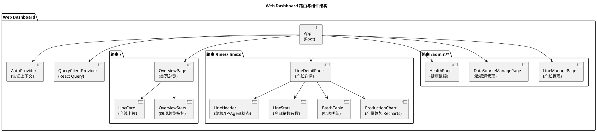

### 2.9.3 首页全厂总览设计

> 对应 spec.md 第 5.7 章 5.7.1 第 1/2 项。

**展示内容**：
- **四项全厂总览指标**（spec.md 第 5.7 章 5.7.1 第 1 项）：
  - 今日总产量（total_piece_count = SUM(quantity) 全厂）
  - 今日箱数（total_box_count = COUNT(DISTINCT source_id) 全厂）
  - 在线产线数（online_line_count）
  - 数据源数（data_source_count）
- **各产线列表**（spec.md 第 5.7 章 5.7.1 第 2 项）：每条产线显示产线名、今日产量、状态

**数据获取**：React Query 调用 `GET /api/v1/stats/overview?date=today`，配置 `refetchInterval` 实现近实时刷新

**禁止项**：禁止在首页展示某客户专属的非统一字段（spec.md 第 5.7 章 5.7.1 第 6 项禁止项），仅展示统一 ProductionRecord 衍生的指标

### 2.9.4 单产线详情页设计

> 对应 spec.md 第 5.7 章 5.7.1 第 3 项。

**展示内容**（六类信息）：
- 当前终端（hostname）
- 当前 IP（current_ip，按权限脱敏，spec.md 第 4.3 章 4.3.4）
- Agent 状态（ONLINE/OFFLINE）
- 数据源状态（ONLINE/DEGRADED/OFFLINE/SWITCHING）
- 今日箱数（box_count）+ 今日只数（piece_count）
- 批次明细（BatchTable：各批次 box_count/piece_count）

**辅助可视化**：ProductionChart（Recharts 折线图）展示当日产量趋势

**数据获取**：React Query 调用 `GET /api/v1/stats/lines/{line_id}?date=today`

### 2.9.5 权限区分设计

> 对应 spec.md 第 5.7 章 5.7.1 第 5 项 + 第 4.3 章 4.3.2。

- **运维管理员**：可访问 `/admin/*` 路由（产线管理/数据源管理/健康监控），可执行配置类操作
- **生产监控员**：仅可访问 `/` 与 `/lines/:lineId`，配置类操作不可见不可执行
- **实现**：AuthProvider 维护当前用户角色，路由守卫拦截越权访问；配置类操作按钮按角色条件渲染

---

## 2.10 EV2 Agent 接口设计（仅接口，不实现）

> 对应 spec.md 第 12 章 EV2 Agent 接口预定义。EV1 不实现 Agent 端，仅预定义接口与 Server 端响应逻辑。

### 2.10.1 Heartbeat 协议

> 对应 spec.md 第 12.2 章 Heartbeat 接口基线。

**协议字段**（spec.md 第 6.2 章 Agent 数据约束）：
- `agent_id`：全局唯一，不可变更（spec.md 第 6.2 章第 1 项）
- `hostname`：宿主主机名，由终端 OS 上报（spec.md 第 6.2 章第 2 项）
- `machine_id`：终端机器唯一标识，跨 IP 变化识别同一机器（spec.md 第 6.2 章第 3 项）
- `MAC`：网卡 MAC 地址，辅助机器识别（spec.md 第 6.2 章第 4 项）
- `IPv4`：当前 IPv4，可随 DHCP 动态变化（spec.md 第 6.2 章第 5 项）
- `source endpoints`：本机数据源端点列表（spec.md 第 6.2 章第 7 项）
- `ts`：上报时间戳

**接口签名**：见第 2.2.2.3 章 HeartbeatRequest/HeartbeatResponse

**上报频率**：≤30s/次（spec.md 第 5.2 章 5.2.1 第 3 项）

**Server 端响应逻辑**：
- 校验 agent_id 凭证（spec.md 第 4.3 章 4.3.3）
- 首次上报：自动登记为待绑定 Agent（status=PENDING_BIND，spec.md 第 5.2 章 5.2.3 第 3 项）
- 已绑定：刷新 last_heartbeat_at，若 IPv4 变化则触发 IP_CHANGED 处理
- 身份冲突：保留先注册者，拒绝后者并告警审计（spec.md 第 5.2 章 5.2.3 第 1 项）
- 心跳超 60s 未上报：标记离线，关联 Collector 暂停（spec.md 第 5.2 章 5.2.1 第 4 项）

### 2.10.2 IP_CHANGED 事件协议

> 对应 spec.md 第 12.2 章 IP_CHANGED 接口 + 第 12.3 章 IP 变化处理流程。

**协议字段**：
- `agent_id`：上报 Agent 标识
- `old_ip`：旧 IPv4
- `new_ip`：新 IPv4
- `ts`：事件时间戳

**接口签名**：见第 2.2.2.4 章 IPChangedRequest

**Server 端处理流程**：见第 2.1.3.3 章 IP_CHANGED 处理流程图

### 2.10.3 DataSource.current_ip 更新与 Collector 自动恢复

> 对应 spec.md 第 12.3 章 IP 变化处理流程第 3/4 步。

1. Server 收到 IP_CHANGED，更新 TBL_DATA_SOURCE.current_ip = new_ip（WHERE agent_id = ? AND current_ip = old_ip）
2. Health Monitor 状态转 SWITCHING
3. Collector 下个调度周期使用新 current_ip 重连
4. 新 IP 可达：状态转 ONLINE，从 Cursor 断点继续采集（切换完成 ≤30s，spec.md 第 4.2 章 4.2.5）
5. 新 IP 不可达：持续重试，超时 >30s 转 OFFLINE 并告警（spec.md 第 5.4 章 5.4.3 第 1/2 项）
6. **约束**：DHCP 变化不导致产线采集配置失效（spec.md 第 12.3 章约束），禁止要求人工修改 Data Source 配置（spec.md 第 5.4 章 5.4.1 第 6 项禁止项）

---

## 2.11 部署设计

> 对应 spec.md 第 4.6 章部署性 + 第 7.2 章 C6/C7/C8 部署约束 + 第 9.1 章 hwview-server 组件。

### 2.11.1 部署架构

```plantuml
@startuml
title HWView 部署架构

node "192.168.2.110\n(Debian 系 Linux)" as Server {
  user "debian\n(普通用户, sudo 提权)" as DebianUser
  rectangle "hwview-server.service\n(systemd, debian 用户运行)" as Svc
  rectangle "hwview-server 二进制\n(Go + Gin)" as Bin
  rectangle "Web Dashboard 构建产物\n(React dist/)" as Dist
  database "DB\n(SQLite/PostgreSQL)" as DB
  file "deploy.sh\n(部署脚本)" as Deploy
  file "hwview-server.service\n(systemd 单元)" as Unit
  file "init_schema.sql\n(建表脚本)" as Schema
}

node "产线终端 PC 1\n(Windows)" as PC1 {
  rectangle "hwview-agent\n(EV2, Windows 安装包)" as Agent1
}

node "产线终端 PC N\n(Windows)" as PCN {
  rectangle "hwview-agent\n(EV2)" as AgentN
}

cloud "各产线数据源\n(HTTP :86)" as Sources

DebianUser --> Svc : 运行服务
Svc --> Bin : 启动
Bin --> DB : 读写
Bin --> Dist : 静态资源
Agent1 --> Bin : Heartbeat/IP_CHANGED\n(EV2)
AgentN --> Bin : Heartbeat/IP_CHANGED\n(EV2)
Bin --> Sources : HTTP 拉取\n(按 current_ip)

@enduml
```

**部署位置约束**：
- HWView Server（后端 + 前端构建产物 + 数据库）部署在 192.168.2.110，以 debian 用户运行（spec.md 第 4.6 章 4.6.1 + 第 7.2 章 C6）
- Agent 部署在各产线终端 PC，禁止部署在 192.168.2.110（spec.md 第 4.6 章 4.6.2）
- 系统级操作通过 sudo 提权，禁止 root 长期运行服务进程（spec.md 第 4.6 章 4.6.4）

### 2.11.2 systemd 服务单元设计

> 对应 spec.md 第 4.6 章 4.6.3 部署自动化规则。

**`hwview-server.service`**：
```ini
[Unit]
Description=HWView Server (Go + Gin)
After=network.target

[Service]
Type=simple
User=debian
Group=debian
WorkingDirectory=/opt/hwview
ExecStart=/opt/hwview/bin/hwview-server --config /opt/hwview/config.yaml
Restart=on-failure
RestartSec=5
Environment=HWVIEW_DB_PATH=/opt/hwview/data/hwview.db
Environment=HWVIEW_COLLECTION_INTERVAL=5m
Environment=HWVIEW_LOG_LEVEL=info
# 凭据通过环境变量注入（spec.md 第 4.6 章 4.6.5）
# 实际值由部署时环境变量注入，禁止明文写入本文件
Environment=DEPLOY_USER_PASSWORD=<DEPLOY_USER_PASSWORD>
Environment=DEPLOY_SUDO_PASSWORD=<DEPLOY_SUDO_PASSWORD>

[Install]
WantedBy=multi-user.target
```

**设计要点**：
- `User=debian`：以 debian 普通用户运行，非 root（spec.md 第 4.6 章 4.6.4）
- `Restart=on-failure`：进程异常退出自动重启
- 凭据占位符 `<DEPLOY_USER_PASSWORD>` / `<DEPLOY_SUDO_PASSWORD>`：实际值由部署环境变量注入，禁止明文（spec.md 第 4.6 章 4.6.5/4.6.6 + 第 4.3 章 4.3.6）

### 2.11.3 部署脚本设计

> 对应 spec.md 第 4.6 章 4.6.3 + 第 7.2 章 C8 部署自动化。使用 sudo 提权，凭据通过环境变量注入。

**`deploy.sh`**（PowerShell 风格注释，但部署目标为 Linux，故用 bash）：
```bash
#!/usr/bin/env bash
set -euo pipefail

# 部署脚本：HWView Server 部署到 192.168.2.110
# 凭据通过环境变量注入，禁止明文（spec.md 第 4.6 章 4.6.5）
# 使用占位符 <DEPLOY_USER_PASSWORD> / <DEPLOY_SUDO_PASSWORD>

: "${DEPLOY_USER_PASSWORD:?请通过环境变量设置 DEPLOY_USER_PASSWORD}"
: "${DEPLOY_SUDO_PASSWORD:?请通过环境变量设置 DEPLOY_SUDO_PASSWORD}"

DEPLOY_HOST="192.168.2.110"
DEPLOY_USER="debian"
DEPLOY_DIR="/opt/hwview"

# 1. 构建后端（Go）
go vet ./...
go build -o bin/hwview-server ./cmd/hwview-server
go test ./...

# 2. 构建前端（React + Vite）
cd web && npm ci && npm run build && cd ..

# 3. 上传产物到 192.168.2.110（scp，使用 sshpass 注入凭据）
sshpass -p "$DEPLOY_USER_PASSWORD" scp -r \
  bin/hwview-server web/dist config.yaml deploy/init_schema.sql \
  "$DEPLOY_USER@$DEPLOY_HOST:$DEPLOY_DIR/"

# 4. 远程执行初始化与服务注册（sudo 提权）
sshpass -p "$DEPLOY_USER_PASSWORD" ssh "$DEPLOY_USER@$DEPLOY_HOST" \
  "echo '$DEPLOY_SUDO_PASSWORD' | sudo -S bash $DEPLOY_DIR/deploy/install_remote.sh"

echo "部署完成：HWView Server 运行于 $DEPLOY_HOST 的 $DEPLOY_USER 用户下"
```

**`install_remote.sh`**（远程执行，sudo 提权）：
```bash
#!/usr/bin/env bash
set -euo pipefail

DEPLOY_DIR="/opt/hwview"

# 系统级操作通过 sudo 提权（spec.md 第 4.6 章 4.6.4）
sudo cp $DEPLOY_DIR/deploy/hwview-server.service /etc/systemd/system/
sudo systemctl daemon-reload
sudo systemctl enable hwview-server   # 开机自启
sudo systemctl restart hwview-server  # 启动服务

# 数据库初始化
sqlite3 $DEPLOY_DIR/data/hwview.db < $DEPLOY_DIR/deploy/init_schema.sql

# 审计日志：记录 sudo 操作（spec.md 第 4.3 章 4.3.7）
echo "$(date) sudo deploy by debian" | sudo tee -a /var/log/hwview-sudo-audit.log
```

**设计要点**：
- 凭据占位符 `<DEPLOY_USER_PASSWORD>` / `<DEPLOY_SUDO_PASSWORD>`：实际值由部署环境变量注入，禁止明文写入脚本或文档（spec.md 第 4.6 章 4.6.5/4.6.6 + 第 4.3 章 4.3.6）
- 系统级操作（服务注册/端口绑定/防火墙）通过 sudo 提权，服务进程以 debian 用户运行（spec.md 第 4.6 章 4.6.4）
- sudo 操作记录审计日志（spec.md 第 4.3 章 4.3.7）
- 构建验证：`go vet` + `go build` + `go test`（用户偏好 PREFERENCE_12）

### 2.11.4 Agent Windows 安装包设计（EV2）

> 对应 spec.md 第 12.1 章 Agent 部署位置。EV1 不实现，仅设计。

- 打包格式：Windows MSI 或 NSIS 安装包
- 安装内容：hwview-agent 二进制 + 配置模板（agent_id/Server URL/心跳间隔）
- 运行方式：Windows 服务（开机自启）
- 配置：agent_id 在安装时生成或手动指定，Server URL 指向 192.168.2.110

---

## 2.12 技术栈约束

> 对应 spec.md 第 4.5 章 4.5.4 技术栈约束 + 第 7.2 章 C4/C5 + 用户偏好。

### 2.12.1 后端技术栈

- **语言**：Go（用户偏好 PREFERENCE_11/PREFERENCE_12）
- **Web 框架**：Gin
- **验证命令**：`go vet` + `go build` + `go test`（用户偏好 PREFERENCE_12）
- **HTTP 客户端**：标准库 `net/http` 或 `resty`
- **HTML 解析**：`goquery`（Huawei102Adapter HTML Parse）
- **日志**：结构化日志（`slog` 或 `zap`，spec.md 第 4.4 章 4.4.1）
- **配置**：Viper（YAML + 环境变量覆盖）

### 2.12.2 前端技术栈

- **框架**：React 18（用户偏好 PREFERENCE_1）
- **语言**：TypeScript Strict 模式，禁止 `any`（用户偏好 PREFERENCE_8）
- **构建工具**：Vite
- **数据获取**：React Query
- **图表库**：Recharts
- **路由**：React Router

### 2.12.3 数据库与命名规范

- **数据库**：SQLite（开发/单机部署）或 PostgreSQL（生产多并发），由部署配置决定
- **表命名**：`TBL_` 前缀加下划线分隔大写格式（如 TBL_PRODUCTION_LINE、TBL_DATA_SOURCE、TBL_PRODUCTION_RECORD，spec.md 第 4.5 章 4.5.4 + 用户偏好 PREFERENCE_17）
- **项目命名**：大写字母加连字符风格（如 HWView-EV1，spec.md 第 4.5 章 4.5.5 + 用户偏好 PREFERENCE_4）
- **结构化命名**：带前缀和版本号层级命名（如 TASK-HWV-EV1-001，spec.md 第 4.5 章 4.5.5 + 用户偏好 PREFERENCE_7）
- **文件命名**：snake_case（如 `init_schema.sql`、`deploy.sh`，用户偏好 PREFERENCE_3）

### 2.12.4 部署脚本环境

- **本地构建**：Windows PowerShell（用户偏好 PREFERENCE_16）触发跨平台构建
- **远程部署**：bash + sshpass + sudo（目标为 Debian 系 Linux）

---

## 2.13 EV1 红线落实

> 对应 spec.md 第 13 章 EV1 红线（8 项禁止项）。本节明确设计中如何避免每项禁止项。

| 红线编号 | 禁止项 | 设计中的落实措施 | 追溯章节 |
|---------|--------|----------------|---------|
| 1 | 禁止只支持华为102 | ProductionAdapter 接口 + Adapter Registry 支持 Huawei102Adapter/Huawei102LineAdapter/BMWAdapter/SchaefflerAdapter/MagnaAdapter/GenericAdapter 六类；TBL_PRODUCTION_LINE 支持 ≥5 条产线配置；新增产线仅通过 Registry 配置完成 | 2.4.1 / 2.4.3 / 2.3.2.2 |
| 2 | 禁止 IP 写死 | current_ip 作为 TBL_DATA_SOURCE 可变属性；Source Resolver 动态读取 current_ip 注入 Adapter.Fetch；Collector Core 不出现任何具体终端 IP 硬编码 | 2.3.2.3 / 2.4.2 / 2.1.3.2 |
| 3 | 禁止把记录数当产品数量 | Statistics Engine 公式冻结：piece_count = SUM(quantity)、box_count = COUNT(DISTINCT source_id)；Integration Test 断言 Golden Evidence (433/5395) | 2.6.1 / 2.6.2 |
| 4 | 禁止每次采集重复 INSERT | Incremental Collector + Cursor 双键 + Dedup 应用层检查 + UNIQUE(line_id, source_id) 数据库约束兜底（INSERT OR IGNORE） | 2.5 / 2.3.2.4 |
| 5 | 禁止 Source Offline = 今日产量 0 | Statistics Engine 查询 TBL_PRODUCTION_RECORD 已采集数据，不依赖实时可达性；Dashboard 叠加 Source Offline 状态标记 | 2.7.2 |
| 6 | 禁止 Adapter 逻辑进入 Collector Core | ProductionAdapter Go interface + Adapter Registry；Collector Core 仅依赖 interface，禁止依赖任何具体 Adapter 实现；华为102解析逻辑封装在 Huawei102Adapter 内 | 2.4.1 / 2.4.2 / 2.4.3 |
| 7 | 禁止为每条产线复制一套 Collector | 单一 hwview-collector 实例 + 多 Adapter；Scheduler 每周期对所有产线调度，每产线独立 goroutine 执行（产线隔离） | 2.1.2 / 2.5.2 |
| 8 | 禁止现在就做复杂 AI/预测 | EV1 范围仅含数据采集基线（Registry/Adapter/Collector/Statistics/Dashboard/Health）；不引入任何 AI/预测模块 | 全文（无 AI 相关设计） |

---

## 2.14 与 spec.md 的追溯矩阵

> 每项设计决策追溯到 spec.md 的需求条款，确保设计覆盖所有需求。

| spec.md 需求条款 | 需求内容 | design.md 对应设计章节 |
|-----------------|---------|---------------------|
| 1.1-1.4 组件定位 | 采集与聚合多产线数据 | 2.1.1 上下文视图 + 2.1.2 组件架构 |
| 2 领域术语 | ProductionLine/Agent/Adapter/ProductionRecord 等 | 2.3.2 领域对象类图 + 2.4 Adapter 接口 |
| 3.1-3.3 角色与边界 | 运维管理员/监控员/操作员 + 外部系统 | 2.1.1 上下文视图 + 2.9.5 权限区分 |
| 4.1 性能 | Dashboard ≤2s/≤3s、≥100 Agent、≤10s 采集延迟、≥20 QPS | 2.2.2.5 统计接口性能约束 + 2.6.3 性能保障 |
| 4.2 可靠性 | 99.5% 可用性、60s 离线判定、Collector 隔离、IP 切换 ≤30s | 2.1.3.1 状态机 + 2.5.2 产线隔离 + 2.1.3.3 IP 切换 |
| 4.3 安全性 | 认证鉴权/脱敏/审计/凭据占位符 | 2.2.2 接口前置条件 + 2.3.2.8 审计表 + 2.11 部署凭据 |
| 4.4 可维护性 | 结构化日志/监控指标/链路追踪/零核心改动 | 2.8.3 监控指标 + 2.4.3 Adapter 插件化 |
| 4.5 兼容性 | 产线格式差异/DHCP/Adapter 扩展/技术栈 | 2.4 Adapter 接口 + 2.10 IP_CHANGED + 2.12 技术栈 |
| 4.6 部署性 | 192.168.2.110/debian/sudo/自动化/凭据 | 2.11 部署设计 |
| 5.1 产线注册与管理 | line_id 唯一/必填属性/绑定/扩展 | 2.2.2.1 产线管理接口 + 2.3.2.2 TBL_PRODUCTION_LINE |
| 5.2 Agent 管理与动态发现 | Agent 身份/心跳/离线判定/动态发现 | 2.10 EV2 Agent 接口 + 2.3.2.7 TBL_AGENT |
| 5.3 数据源配置与适配 | Data Source 四要素/Adapter 插件化/命名 | 2.2.2.2 数据源接口 + 2.4 Adapter 接口 |
| 5.4 数据采集与 IP 自动切换 | 采集触发/统一记录/IP_CHANGED/无感切换 | 2.1.3.2 采集流程 + 2.1.3.3 IP 切换 + 2.10.3 |
| 5.5 统一生产记录与统计 | 统一结构/每日产量/箱数/批次/跨产线 | 2.6 Statistics Engine + 2.3.2.4 TBL_PRODUCTION_RECORD |
| 5.6 数据源健康监控 | 四项状态/健康暴露/错误告警/Agent 联动 | 2.8 Health Monitor + 2.3.2.6 健康表 |
| 5.7 Web Dashboard | 总览首页/产线列表/详情/实时/权限 | 2.9 Web Dashboard |
| 6 数据约束 | 各领域对象逻辑约束 | 2.3.2 各表 DDL + DDL 注释 |
| 7 利益相关者与假设 | C1-C8 约束 + A1-A5 假设 | 2.11 部署设计（C6-C8/A5）+ 2.4 Adapter（C2/C3）+ 2.10（C1） |
| 8 覆盖矩阵 | 10 项第一阶段核心能力 | 全文覆盖（①-⑩） |
| 9.1 架构组件基线 | 四大组件 | 2.1.2 组件架构 |
| 9.2 核心原则 | 身份分离/IP 禁止硬编码/Adapter 解耦 | 2.4.2 + 2.13 红线 2/6 |
| 9.3 数据模型冻结 | 三张表字段基线 | 2.3.2.2 / 2.3.2.3 / 2.3.2.4 |
| 9.4 Incremental Collection | 首次/增量/可重复/失败可继续/产线隔离 | 2.5 Incremental Collector |
| 9.5 Cursor 机制 | 双键/持久化 | 2.5.1 Cursor 推进 + 2.3.2.5 TBL_COLLECT_CURSOR |
| 10.1-10.9 EV1 任务清单 | 9 项 TASK | 全文对应（每项 TASK 在设计中有对应章节） |
| 10.7 Statistics 公式冻结 | box_count/piece_count 公式 | 2.6.1 统计公式 |
| 10.8 Scheduler | 5 分钟/可配置/关机不置 0 | 2.7 Scheduler |
| 10.9 Health Monitor | ONLINE/DEGRADED/OFFLINE + 四项状态 | 2.8 Health Monitor |
| 11 Golden Evidence | 433/5395/Q0926-078 不可变 | 2.6.2 Golden Evidence 验证 |
| 12 EV2 Agent 接口预定义 | Heartbeat/IP_CHANGED | 2.10 EV2 Agent 接口 |
| 13 EV1 红线 | 8 项禁止项 | 2.13 EV1 红线落实 |
| 14 执行顺序与 PM 裁决 | EV1-001→...→EV1-009→Gate→EV2 | 2.14 追溯矩阵（设计覆盖全部 9 项 TASK） |

---

# 三、102日产出计划导出报表增量设计（EV1-R4）

> 对应 spec.md §18（102日产出计划导出报表，EV1-R4 新增能力）。
> 上游裁决约束：§16（R2 CLOSED，源系统 quantity = 补打标签数量）+ §17（R3 CLOSED，192.168.30.2 无生产数量数据源）+ Production Quantity FROZEN。
> 设计基线：在 §一、§二（EV1 主链 2.1-2.14）已冻结设计之上增量新增，不修改已有 7 张表 DDL 与已定义接口契约。
> 命名合规：本报表命名为"102日产出计划报表"，既非 §17.3 禁用的"生产数量报表"，亦非"标签补打记录报表"，属独立新报表类型（spec.md §18 开头命名合规性声明）。

## 3.1 需求与裁决约束继承

### 3.1.1 裁决约束继承（R2 / R3 / FROZEN）

> 对应 spec.md §18.1.2 裁决约束继承。本子能力所有设计决策必须满足以下三项不可变约束。

| 约束编号 | 约束内容 | 对设计的强制影响 | spec.md 追溯 |
|---------|---------|----------------|-------------|
| R2 继承 | 源系统 `192.168.30.2:86/Cron/Jili/lists/` 的 `quantity` 为补打标签数量，**禁止**作为报表"实际完成数量"行数据来源 | 报表核心 10 行（§18.2.2）数据**禁止**来自 `TBL_PRODUCTION_RECORD.quantity` 求和；标签补打数据仅可进入独立参考区域 | §16.2 / §18.1.2 第 1 项 |
| R3 继承 | 192.168.30.2 上不存在生产数量数据源 | 报表核心数据行（目标/实际完成/入库/出货/库存）**必须**通过人工录入接口或外部系统（MES/ERP）导入获得，设计须提供人工录入 API | §17.2 / §18.1.2 第 2 项 |
| Production Quantity FROZEN | 找到真实生产数据源前禁止自动推导生产数量 | 标签补打数据**仅**作辅助参考列或独立参考区域，**禁止**进入核心数据行；报表生成逻辑中不得存在 `核心行 ← SUM(TBL_PRODUCTION_RECORD.quantity)` 推导路径 | §18.1.2 第 3 项 |

### 3.1.2 命名合规约束

> 对应 spec.md §18.1.3 命名规则。违反命名规则即判 R4 不通过。

1. **报表命名规则**：界面标题、导出文件名、API 路径**必须**含"102日产出计划"字样，**禁止**含"生产数量"字样（spec.md §18.1.3 第 1 项）。
2. **报表隔离规则**：本报表与"标签补打记录报表"（§17.3 第 3 项）**禁止**合并为同一报表；两类数据分属不同区域或不同报表（spec.md §18.1.3 第 2 项）。
3. **表命名规则**：新增表**必须**采用 `TBL_` 前缀加下划线分隔大写格式（如 `TBL_DAILY_PRODUCTION_PLAN`、`TBL_HOLIDAY_CALENDAR`，spec.md §18.9.3 第 2 项 + PREFERENCE_17）。

## 3.2 需求与存量功能关系分析（R4 子范围）

> 在 §1.1（EV1 主链存量分析）基础上，针对 R4 报表子能力重新对比需求与已冻结的 EV1 存量（7 张表 + 已定义接口 + 已选型技术栈），明确复用、扩展、新增边界。

### 3.2.1 已实现功能复用

> 以下 EV1 已冻结存量可被 R4 直接复用，无需改造。

| R4 需求功能 | 复用的存量功能 | 代码位置 / 设计章节 | 匹配度 |
|------------|--------------|-------------------|--------|
| 标签补打参考区域数据源（A/B/C/D） | `TBL_PRODUCTION_RECORD` 已采集数据 + Statistics Engine 聚合（box_count/piece_count/记录数） | design.md §2.3.2.4 / §2.6.1 | 100% |
| 录入/覆盖/导出审计日志 | `TBL_AUDIT_LOG` + Audit Log 模块（actor/action/target_type/change） | design.md §2.3.2.8 / §2.2.2.1 后置条件 | 100% |
| 认证鉴权中间件 | Auth Middleware（Gin，已校验运维管理员/生产监控员） | design.md §2.2.2.1 前置条件 / §2.9.5 | 75% |
| 后端 Web 框架与 ORM | Gin + GORM + SQLite（glebarez/sqlite 无 CGO） | design.md §2.12.1 / §2.11.1 | 100% |
| 前端技术栈 | React 18 + TypeScript(Strict) + Vite + React Query + Recharts | design.md §2.9.1 / §2.12.2 | 100% |
| 部署与 systemd 集成 | hwview-server.service + deploy.sh + GORM AutoMigrate 机制 | design.md §2.11.2 / §2.11.3 | 100% |

**匹配度判定依据**：
- `TBL_PRODUCTION_RECORD` 与 Statistics Engine 已实现 box_count=COUNT(DISTINCT source_id)、piece_count=SUM(quantity)、记录数聚合，恰好对应 R4 参考区域所需的 A（记录数）/B（唯一条码）/D（quantity 求和），无需新增聚合逻辑（design.md §2.6.1 SQL 直接复用）。
- Auth Middleware 匹配度 75%：已支持运维管理员/生产监控员两角色，但 R4 需新增"生产管理员"角色（spec.md §18.8.1），需扩展角色枚举与权限判定，故非 100%。

### 3.2.2 需要扩展的功能

| R4 需求功能 | 复用的存量功能 | 差异说明 | 扩展方向 |
|------------|--------------|---------|---------|
| 生产管理员角色与录入权限 | Auth Middleware 两角色体系 | 需新增第三角色"生产管理员"，具备录入权限；生产监控员禁止录入（spec.md §18.8.2 第 1 项） | 扩展角色枚举 + 路由守卫 + 录入接口权限校验 |
| 录入/导出审计 action | TBL_AUDIT_LOG action 字段 | 现有 action 取值 CREATE/UPDATE/DELETE/BIND/IP_CHANGED/SUDO_EXEC，需新增 REPORT_INPUT / REPORT_EXPORT / HOLIDAY_CONFIG | 扩展 action 取值枚举，DDL 无变更（VARCHAR(64) 足界） |
| GORM AutoMigrate 注册 | 现有 migration 注册机制（design.md §2.3.2 各表迁移） | 需将新增 2 张表纳入 AutoMigrate 列表，与现有 7 张表共用同一迁移入口 | 在 `internal/store/migration/migration.go` 注册 DailyProductionPlan / HolidayCalendar |

### 3.2.3 需要新增的功能或接口

> 以下功能在 EV1 存量中完全没有对应实现，需从零新增。按后端/前端/导出三层分组。

**后端新增**：
- `TBL_DAILY_PRODUCTION_PLAN` 表（日产出计划录入项，spec.md §18.7.1）
- `TBL_HOLIDAY_CALENDAR` 表（节假日日历，spec.md §18.7.2）
- `internal/store/daily_production_plan_repo.go`（CRUD 仓储）
- `internal/store/holiday_repo.go`（CRUD 仓储）
- `internal/server/report_service.go`（报表聚合 + 自动计算 + 数据分离编排）
- `internal/server/excel_exporter.go`（excelize 生成 .xlsx，含颜色编码）
- REST API：日计划 CRUD / 节假日 CRUD / 报表聚合 / Excel 导出 / 标签补打参考数据

**前端新增**：
- `web/src/pages/reports/` 目录（报表预览页 / 录入表单 / 节假日配置）
- 报表矩阵组件（10 行 × N 列 + 累计列，颜色编码渲染）
- 导出按钮（调用导出 API，触发浏览器下载 .xlsx）

**导出依赖新增**：
- Go Excel 库 `excelize`（纯 Go，无 CGO，与 glebarez/sqlite 无 CGO 约束兼容，spec.md §18.9.3 第 1 项）

## 3.3 数据模型设计

### 3.3.1 设计目标

> 对应 spec.md §18.7 数据约束 + §18.2 报表结构定义 + §16.4 R2-AMENDMENT 对 R4 数据模型的影响。

**需支持的业务场景**：
- 按"日期 × 行号"粒度的人工录入与覆盖更新（spec.md §18.4.2 第 2/3 项）
- 报表矩阵聚合：10 行 × N 日列 + 累计列，含自动计算行（行6=行2+3+5，行9=累计入库-累计出货，spec.md §18.4.1，R4-BLOCKER-02 修正）
- 节假日配置与黄色标注（spec.md §18.4.3）
- 标签补打参考区域数据聚合（A/B/C/D，来源于 TBL_PRODUCTION_RECORD，spec.md §18.7.3）
- 数据来源分离：核心行仅来自人工录入，参考区域来自自动采集（spec.md §18.3）
- **R2-AMENDMENT 箱数/散件/实际件数换算**（spec.md §16.4 + §18.2.4 + §18.7.5）：实际完成数量行（行2/行3/行5，行4 为目标数量新线 TARGET 不适用，R4-BLOCKER-02）支持从"整箱数 + 散件数"换算为"实际产出件数"，公式 `actual_quantity = carton_count × units_per_carton + loose_quantity`（17 × 30 + 9 = 519）
- **装箱规格配置化管理**（spec.md §18.7.4 + §18.9.4 第 3 项）：units_per_carton 必须通过 TBL_CARTON_SPECIFICATION 配置对象管理（按 product+line+date 三维，R4-BLOCKER-01），禁止硬编码于源代码/配置文件常量/Adapter 内
- **实际完成合计公式修正**（spec.md §18.4.1 第 4/5 项 + R4-BLOCKER-02）：行6 = 行2 + 行3 + 行5（行4 为目标数量新线 TARGET，不参与计算），禁止包含行1/行4 目标数量行

**性能、容量、扩展性目标**：
- 报表预览响应 ≤3s（95 分位，30 日列 × 10 行聚合，spec.md §18.9.1 第 1 项）
- Excel 导出 ≤5s（95 分位，30 日范围，spec.md §18.9.1 第 2 项）
- 装箱规格配置查询 ≤100ms（单产线单产品配置查询，用于 actual_quantity 实时计算）

**与存量数据的兼容策略**：
- 新增 3 张表（TBL_DAILY_PRODUCTION_PLAN / TBL_HOLIDAY_CALENDAR / TBL_CARTON_SPECIFICATION）与现有 7 张表通过 GORM AutoMigrate 统一管理，不修改已有表 DDL。
- `TBL_DAILY_PRODUCTION_PLAN` 不与 `TBL_PRODUCTION_RECORD` 建立外键，物理隔离两类数据来源（落实 R2/FROZEN 约束）。
- `TBL_HOLIDAY_CALENDAR` 独立配置，不依赖产线/数据源。
- `TBL_CARTON_SPECIFICATION` 与 `TBL_PRODUCTION_LINE` 弱关联（line_code 字符串 + product_code），不建物理外键以保持与 R4 报表数据隔离；units_per_carton 由 report_service 在计算 actual_quantity 时动态读取，TBL_DAILY_PRODUCTION_PLAN 中保留 units_per_carton_snapshot 作为历史快照（避免后续配置变更影响已录入历史数据的可重现性）。

### 3.3.2 TBL_DAILY_PRODUCTION_PLAN DDL（日产出计划录入表）

> 对应 spec.md §18.7.1 DailyProductionPlan 数据约束 + §18.7.5 CartonBasedActualQuantity（R2-AMENDMENT 新增）。存储人工录入的核心 10 行数据（行6/行9 不存储，由系统计算）。行2-行5（实际完成数量）支持两种录入模式：直接录入 value（传统模式）或录入 carton_count + loose_quantity 由系统计算 actual_quantity（R2-AMENDMENT 箱数换算模式）。

```sql
CREATE TABLE TBL_DAILY_PRODUCTION_PLAN (
    id            BIGINT       PRIMARY KEY AUTOINCREMENT,
    plan_date     DATE         NOT NULL,
    row_no        INT          NOT NULL CHECK (row_no BETWEEN 1 AND 10),
    value         INT,                                     -- 传统录入值（行1/7/8/10 使用，单位"只"）
    -- R2-AMENDMENT 箱数换算字段（仅行2/行3/行5 使用，行4 为目标数量新线 TARGET 不适用，R4-BLOCKER-02，spec.md §18.7.5）
    carton_count  INT,                                     -- 整箱数（非负，来源于源系统 quantity 或人工录入）
    units_per_carton_snapshot INT,                         -- 每箱标准装箱数快照（录入时从 TBL_CARTON_SPECIFICATION 读取并冻结，避免后续配置变更影响历史可重现性）
    loose_quantity INT,                                    -- 散件数（非负，不足一箱的散件）
    actual_quantity INT,                                   -- 实际产出件数（系统自动计算 = carton_count × units_per_carton_snapshot + loose_quantity，禁止人工录入）
    line_code     VARCHAR(64)  NOT NULL DEFAULT 'HW102',
    input_by      VARCHAR(128) NOT NULL,
    input_at      TIMESTAMP    NOT NULL DEFAULT CURRENT_TIMESTAMP,
    updated_at    TIMESTAMP    NOT NULL DEFAULT CURRENT_TIMESTAMP,
    UNIQUE (plan_date, row_no, line_code),
    -- R2-AMENDMENT 约束：actual_quantity 必须由公式计算（应用层强制，DDL 层用 CHECK 兜底）
    CHECK (
        actual_quantity IS NULL
        OR actual_quantity = COALESCE(carton_count, 0) * COALESCE(units_per_carton_snapshot, 0) + COALESCE(loose_quantity, 0)
    )
);

CREATE UNIQUE INDEX UQ_PLAN_DATE_ROW_LINE ON TBL_DAILY_PRODUCTION_PLAN(plan_date, row_no, line_code);
CREATE INDEX IDX_PLAN_DATE      ON TBL_DAILY_PRODUCTION_PLAN(plan_date);
CREATE INDEX IDX_PLAN_LINE_DATE ON TBL_DAILY_PRODUCTION_PLAN(line_code, plan_date);
CREATE INDEX IDX_PLAN_ROW       ON TBL_DAILY_PRODUCTION_PLAN(row_no);
CREATE INDEX IDX_PLAN_CARTON    ON TBL_DAILY_PRODUCTION_PLAN(plan_date, row_no, line_code)
    WHERE carton_count IS NOT NULL;  -- 仅索引含箱数换算的记录，加速 actual_quantity 聚合
```

**字段说明**：
- `plan_date`：计划日期，格式 YYYY-MM-DD，与 row_no、line_code 共同构成唯一键（spec.md §18.7.1 第 1 项）
- `row_no`：行号，取值 1-10，对应 §18.2.2 报表行结构（spec.md §18.7.1 第 2 项）
- `value`：传统录入值，可空，非负整数，单位"只"。行1（目标数量老线）/行4（目标数量新线）/行7（成品入库）/行8（出货）/行10（产线成品剩余）使用此字段（spec.md §18.7.1 第 3 项 + R4-BLOCKER-02：行4 为 TARGET）
- `carton_count`：**R2-AMENDMENT 新增**。整箱数，可空，非负整数。仅实际完成数量行（行2/行3/行5，老线白班/老线夜班/新线）使用，行4 目标数量新线不使用（R4-BLOCKER-02）。来源于源系统 quantity 字段（R2-AMENDMENT 修正语义为 carton_count）或人工录入（spec.md §18.7.5 第 4 项）
- `units_per_carton_snapshot`：**R2-AMENDMENT 新增**。每箱标准装箱数快照，可空，正整数。录入时从 `TBL_CARTON_SPECIFICATION` 按 (product_code, line_code, plan_date) 三维读取当前生效配置并冻结到本记录（R4-BLOCKER-01），避免后续配置变更影响历史数据可重现性。**禁止**由人工直接录入此字段（必须由 report_service 从配置表读取后写入，spec.md §18.7.5 第 5 项 + §18.7.4 第 9 项配置化优先约束）
- `loose_quantity`：**R2-AMENDMENT 新增**。散件数，可空，非负整数，不足一箱的散件数。仅实际完成数量行（行2/行3/行5）使用（spec.md §18.7.5 第 6 项 + R4-BLOCKER-02）
- `actual_quantity`：**R2-AMENDMENT 新增**。实际产出件数，可空，非负整数。**系统自动计算** = `carton_count × units_per_carton_snapshot + loose_quantity`，**禁止**人工录入（spec.md §18.7.5 第 7/8 项）。CHECK 约束兜底确保公式一致性
- `line_code`：产线编码，默认 'HW102'（102 产线），预留多产线扩展，不建外键以保持与 TBL_PRODUCTION_RECORD 物理隔离
- `input_by`：录入人，生产管理员用户标识（spec.md §18.7.1 第 4 项）
- `input_at` / `updated_at`：录入时间 / 最近更新时间戳（spec.md §18.7.1 第 5 项）

**关键约束**：
- `UNIQUE(plan_date, row_no, line_code)`：同一日期同一行同一产线仅一条记录，支持覆盖更新（spec.md §18.4.2 第 3 项录入覆盖规则）
- **行号可录入性约束**：应用层强制禁止写入 row_no=6（合计行）与 row_no=9（库存行）的记录，该两行由系统自动计算（spec.md §18.7.1 第 6 项 + §18.4.2 第 4 项禁止项）。DDL 层不排除该两值（保留 row_no 1-10 完整性用于报表渲染），由 report_service 在写入前校验拒绝
- **非负约束**：value / carton_count / loose_quantity / actual_quantity 均为非负整数，应用层校验（spec.md §18.7.1 第 3 项 + §18.7.5 第 4/6 项）
- **行号与字段使用对应约束**（R2-AMENDMENT，应用层强制）：
  - row_no ∈ {1, 7, 8, 10}：使用 `value` 字段，carton_count/units_per_carton_snapshot/loose_quantity/actual_quantity 必须为 NULL
  - row_no ∈ {2, 3, 4, 5}：使用 `carton_count` + `loose_quantity` + `actual_quantity` + `units_per_carton_snapshot` 字段，`value` 必须为 NULL；报表渲染时取 `actual_quantity` 作为该单元格显示值（spec.md §18.2.4 第 3 项实际完成数据来源修正规则）
  - row_no ∈ {6, 9}：禁止录入（自动计算行）
- **actual_quantity 公式计算约束**（R2-AMENDMENT，spec.md §18.7.5 第 8 项）：actual_quantity 必须等于 `carton_count × units_per_carton_snapshot + loose_quantity`，由 report_service 在写入时自动计算并填充，CHECK 约束兜底；尝试人工直接录入 actual_quantity 将被应用层拒绝（spec.md §18.7.5 第 7 项）
- **units_per_carton_snapshot 来源约束**（R2-AMENDMENT，spec.md §18.7.5 第 5 项 + §18.7.4 第 9 项）：units_per_carton_snapshot 必须由 report_service 从 `TBL_CARTON_SPECIFICATION` 读取当前生效配置后写入，**禁止**由 API 请求体直接传入或硬编码常量

**R2-AMENDMENT 验收基准**（spec.md §18.2.4）：
- 录入 carton_count=17, units_per_carton=30（从 TBL_CARTON_SPECIFICATION 读取）, loose_quantity=9 → actual_quantity 自动计算为 519
- 报表行2-行5 显示 actual_quantity=519，**禁止**显示 carton_count 原值 17（spec.md §18.2.4 第 3 项）

### 3.3.3 TBL_HOLIDAY_CALENDAR DDL（节假日日历表）

> 对应 spec.md §18.7.2 HolidayCalendar 数据约束。可配置的节假日清单，驱动报表黄色标注。

```sql
CREATE TABLE TBL_HOLIDAY_CALENDAR (
    id           BIGINT       PRIMARY KEY AUTOINCREMENT,
    holiday_date DATE         NOT NULL UNIQUE,
    holiday_name VARCHAR(128) NOT NULL,
    is_rest      BOOLEAN      NOT NULL DEFAULT TRUE,
    config_by    VARCHAR(128) NOT NULL,
    config_at    TIMESTAMP    NOT NULL DEFAULT CURRENT_TIMESTAMP,
    updated_at   TIMESTAMP    NOT NULL DEFAULT CURRENT_TIMESTAMP
);

CREATE UNIQUE INDEX UQ_HOLIDAY_DATE ON TBL_HOLIDAY_CALENDAR(holiday_date);
CREATE INDEX IDX_HOLIDAY_REST ON TBL_HOLIDAY_CALENDAR(is_rest);
```

**字段说明**：
- `holiday_date`：节假日日期，格式 YYYY-MM-DD，全局唯一（spec.md §18.7.2 第 1 项）
- `holiday_name`：节假日名称，如"中秋休息""国庆假期"（spec.md §18.7.2 第 2 项）
- `is_rest`：是否休息，true 时报表该列黄色背景（spec.md §18.7.2 第 3 项 + §18.2.1 第 3 项节假日标注规则）
- `config_by`：配置人，运维管理员或生产管理员用户标识（spec.md §18.7.2 第 4 项）
- `config_at` / `updated_at`：配置时间 / 最近更新时间戳（spec.md §18.7.2 第 5 项）

**关键约束**：
- `UNIQUE(holiday_date)`：同一日期仅一条节假日配置，避免冲突（spec.md §18.6 第 3 项节假日配置冲突场景：以最后生效配置为准，由 UPSERT 实现）
- 节假日列**允许**录入数据（如加班生产），**禁止**强制置空（spec.md §18.4.3 第 2 项）——此为应用层渲染规则，不由 DDL 强制

### 3.3.4 TBL_CARTON_SPECIFICATION DDL（装箱规格配置表，R2-AMENDMENT 新增，R4-BLOCKER-01 强化适用范围维度）

> 对应 spec.md §18.7.4 CartonSpecification 数据约束 + §16.4.3 对 R4 数据模型的影响 + §18.9.4 第 3 项装箱规格配置化规则。每箱标准装箱数必须通过本配置对象管理，**禁止**硬编码于源代码/配置文件常量/Adapter 内。
>
> **R4-BLOCKER-01 修正（2026-09-08）**：本表**必须**支持装箱规格的适用范围/维度，至少能够区分产品（product_code）、产线（line_code）、生效时间（effective_from / effective_to）三个维度。**禁止**将 units_per_carton（如 30 或 60）作为全局单一常量。不同产品/产线/时间可同时存在不同的 units_per_carton 取值（如产品A 老线 60 只/箱 与产品B 新线 30 只/箱 可同时生效），两份业务证据（§18.2.3 "60 只/箱" 与 §16.4.1 "30 件/箱"）不必互相否定。本表 line_code + product_code + effective_from/effective_to 三维唯一性约束保证同一维度下规格唯一，同时允许不同维度并存多条规格。

```sql
CREATE TABLE TBL_CARTON_SPECIFICATION (
    id               BIGINT       PRIMARY KEY AUTOINCREMENT,
    line_code        VARCHAR(64)  NOT NULL,                  -- 关联产线（如 HW102），不建外键以保持与 R4 报表数据隔离
    product_code     VARCHAR(64)  NOT NULL,                  -- 产品编码（如 HW102）
    units_per_carton INT          NOT NULL CHECK (units_per_carton > 0),  -- 每箱标准装箱数，正整数，单位"件/箱"
    effective_from   DATE         NOT NULL,                  -- 生效起始日期
    effective_to     DATE,                                   -- 失效日期，NULL 表示长期生效
    config_by        VARCHAR(128) NOT NULL,                  -- 配置人（运维管理员或生产管理员）
    config_at        TIMESTAMP    NOT NULL DEFAULT CURRENT_TIMESTAMP,
    updated_at       TIMESTAMP    NOT NULL DEFAULT CURRENT_TIMESTAMP
);

-- 唯一性约束：同一 line_code + product_code 在同一时间段内必须唯一生效，禁止时间重叠（spec.md §18.7.4 第 8 项）
CREATE UNIQUE INDEX UQ_CARTON_SPEC_LINE_PROD_TIME ON TBL_CARTON_SPECIFICATION(line_code, product_code, effective_from);
CREATE INDEX IDX_CARTON_SPEC_LINE_PROD  ON TBL_CARTON_SPECIFICATION(line_code, product_code);
CREATE INDEX IDX_CARTON_SPEC_EFFECTIVE  ON TBL_CARTON_SPECIFICATION(effective_from, effective_to);
```

**字段说明**：
- `line_code`：产线编码，关联 §6.1 Production Line，标识本装箱规格适用的产线（spec.md §18.7.4 第 1 项）。不建外键以保持与 R4 报表数据物理隔离
- `product_code`：产品编码，标识本装箱规格适用的产品型号（spec.md §18.7.4 第 2 项）
- `units_per_carton`：每箱标准装箱数，正整数，单位"件/箱"（spec.md §18.7.4 第 3 项）。**禁止**硬编码于源代码，**必须**通过本配置对象管理
- `effective_from`：生效起始日期，格式 YYYY-MM-DD（spec.md §18.7.4 第 4 项）
- `effective_to`：失效日期，可空，格式 YYYY-MM-DD，空值表示长期生效（spec.md §18.7.4 第 5 项）
- `config_by`：配置人，运维管理员或生产管理员用户标识（spec.md §18.7.4 第 6 项）
- `config_at` / `updated_at`：配置时间 / 最近更新时间戳（spec.md §18.7.4 第 7 项）

**关键约束**：
- **时间段唯一性约束**（spec.md §18.7.4 第 8 项）：同一 line_code + product_code 在同一时间段内必须唯一生效，禁止存在时间重叠的多条生效记录。由应用层在 UPSERT 时校验（查询现有生效记录的 effective_from/effective_to 是否与新记录重叠，重叠则返回 409 Conflict）
- **配置化优先约束**（spec.md §18.7.4 第 9 项 + §18.9.4 第 3 项）：任何读取 units_per_carton 的代码路径必须经过本表查询，禁止使用常量、字面量或 Adapter 内硬编码。report_service 在计算 actual_quantity 时通过 `GetEffectiveCartonSpec(line_code, product_code, plan_date)` 查询本表
- **生效日期查询逻辑**：给定 plan_date，查询条件为 `effective_from <= plan_date AND (effective_to IS NULL OR effective_to >= plan_date)`，返回唯一生效记录（由时间段唯一性约束保证）

**R4-BLOCKER-01 多规格并存约束**（spec.md §18.7.4 第 11 项 + §18.2.4 第 2 项）：
- §18.2.3 品质部确认的"60 只/箱"与本表配置的"30 件/箱"（R2-AMENDMENT 证据）可分别对应不同 product_code/line_code/时间段同时生效，**不必**互相否定
- **禁止**将 30 或 60 作为全局常量；本表 units_per_carton 字段值由配置接口按 (product_code, line_code, 生效时间) 三维写入，不出现于源代码常量
- 查询 units_per_carton **必须**提供 (product_code, line_code, 查询日期) 三元组，返回该三元组下唯一生效记录（spec.md §18.7.4 第 10 项适用范围维度查询约束）

**配置示例**（R4-BLOCKER-01 多规格并存，30 与 60 同时生效）：
```sql
-- 产品A 老线：60 只/箱（品质部门业务证据，§18.2.3）
INSERT INTO TBL_CARTON_SPECIFICATION (line_code, product_code, units_per_carton, effective_from, effective_to, config_by)
VALUES ('HW102_OLD', 'PRODUCT_A', 60, '2026-09-01', NULL, '<pm_user>');

-- 产品B 新线：30 件/箱（R2-AMENDMENT 9月7日 17×30+9=519 业务证据，§16.4.1）
INSERT INTO TBL_CARTON_SPECIFICATION (line_code, product_code, units_per_carton, effective_from, effective_to, config_by)
VALUES ('HW102_NEW', 'PRODUCT_B', 30, '2026-09-01', NULL, '<pm_user>');

-- 两条记录同时合法生效，查询各自维度返回各自取值：
-- GetEffectiveCartonSpec('HW102_OLD', 'PRODUCT_A', '2026-09-07') → units_per_carton = 60
-- GetEffectiveCartonSpec('HW102_NEW', 'PRODUCT_B', '2026-09-07') → units_per_carton = 30
```

### 3.3.5 领域对象类图

> 对应 spec.md §18.7 数据约束 + §18.7.4 CartonSpecification + §18.7.5 CartonBasedActualQuantity（R2-AMENDMENT 新增）。展示 R4 新增领域对象及与 EV1 存量对象的引用关系（物理隔离，无外键）。

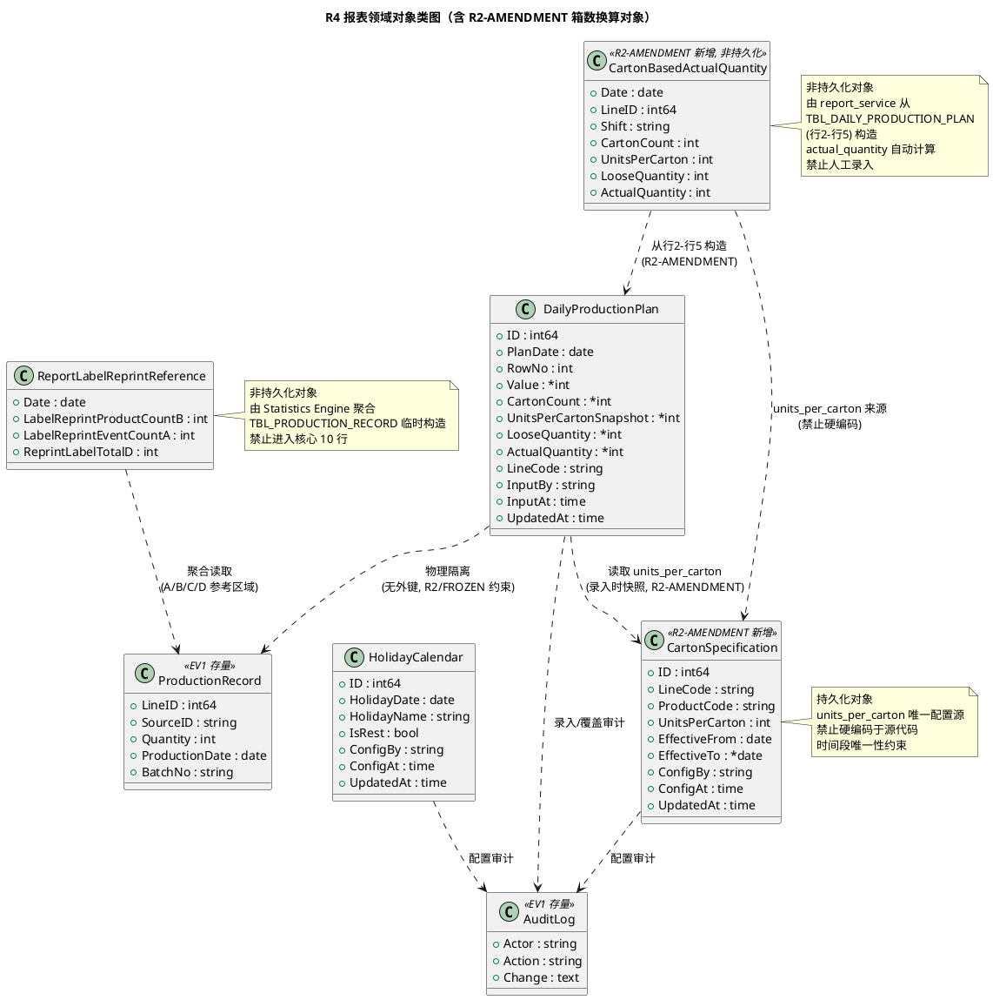

**对象关系与生命周期**：
- `DailyProductionPlan`：持久化对象，按"日期 × 行号 × 产线"唯一，支持覆盖更新；行6/行9 不持久化（由 report_service 实时计算）；行2-行5 含 carton_count/units_per_carton_snapshot/loose_quantity/actual_quantity 字段（R2-AMENDMENT）
- `HolidayCalendar`：持久化对象，按日期唯一，支持 UPSERT 覆盖
- `CartonSpecification`：**R2-AMENDMENT 新增**持久化对象，按"line_code + product_code + effective_from"唯一，支持时间段唯一性约束；units_per_carton 的唯一配置源，禁止硬编码
- `CartonBasedActualQuantity`：**R2-AMENDMENT 新增非持久化**对象，由 report_service 从 TBL_DAILY_PRODUCTION_PLAN 行2-行5 构造，actual_quantity 自动计算 = carton_count × units_per_carton + loose_quantity，禁止人工录入（spec.md §18.7.5 第 7/8 项）
- `ReportLabelReprintReference`：**非持久化**对象，每次报表生成时由 Statistics Engine 从 `TBL_PRODUCTION_RECORD` 聚合构造（A=记录数、B=唯一条码数、D=SUM(quantity)），仅用于参考区域渲染，**禁止**写入核心行（spec.md §18.7.3 第 5 项数据用途约束）

**持久化策略**：
- `TBL_DAILY_PRODUCTION_PLAN` 与 `TBL_HOLIDAY_CALENDAR` 通过 GORM AutoMigrate 创建，与现有 7 张表共用同一 SQLite/PostgreSQL 实例
- `DailyProductionPlan` 与 `ProductionRecord` **物理隔离**（无外键、无 JOIN 推导核心行），从数据模型层面落实 R2/FROZEN 约束，防止标签补打数据误入核心行

### 3.3.6 与现有 7 张表的协调

> 对应任务要求"需与现有7张表协调，使用 GORM AutoMigrate"。明确新增表与存量表的边界与共存策略。

| 新增表 | 与存量表关系 | 协调策略 |
|--------|------------|---------|
| TBL_DAILY_PRODUCTION_PLAN | 与 TBL_PRODUCTION_RECORD 物理隔离（无外键） | 共用 DB 实例与 AutoMigrate 入口；report_service 分别读取两表，在应用层编排数据分离，**禁止** SQL JOIN 将 quantity 求和写入核心行 |
| TBL_DAILY_PRODUCTION_PLAN | 与 TBL_AUDIT_LOG 通过应用层关联（录入审计） | 录入/覆盖时由 report_service 写入 TBL_AUDIT_LOG（action=REPORT_INPUT，target_id=plan_date+row_no），不建物理外键 |
| TBL_HOLIDAY_CALENDAR | 与所有存量表独立 | 纯配置表，无任何外键依赖；报表生成时由 report_service 读取并应用黄色标注 |
| TBL_CARTON_SPECIFICATION | 与 TBL_PRODUCTION_LINE 弱关联（line_code 字符串） | **R2-AMENDMENT 新增**。纯配置表，不建物理外键以保持与 R4 报表数据隔离；report_service 在录入行2-行5 时通过 line_code + product_code + plan_date 查询当前生效的 units_per_carton，读取后作为快照写入 TBL_DAILY_PRODUCTION_PLAN.units_per_carton_snapshot |
| TBL_CARTON_SPECIFICATION | 与 TBL_DAILY_PRODUCTION_PLAN 应用层关联 | 配置变更不影响已录入历史数据（历史记录的 units_per_carton_snapshot 已冻结）；新增/修改配置仅影响后续录入 |
| 两张新增表（TBL_DAILY_PRODUCTION_PLAN / TBL_HOLIDAY_CALENDAR） | 与 TBL_PRODUCTION_LINE 弱关联（line_code 字符串） | TBL_DAILY_PRODUCTION_PLAN.line_code 默认 'HW102'，不建外键以保持物理隔离；未来多产线报表扩展时可选择关联 |

**AutoMigrate 注册设计**：
- 在 `internal/store/migration/migration.go` 的统一迁移函数中追加注册，与现有 7 张表共用同一入口，确保部署时一次性建表
- 迁移顺序：先现有 7 张表（保持 EV1 依赖顺序），后新增 3 张表（TBL_CARTON_SPECIFICATION 优先于 TBL_DAILY_PRODUCTION_PLAN，因后者录入时需读取前者配置；TBL_HOLIDAY_CALENDAR 无依赖，顺序无约束）
- SQLite 与 PostgreSQL 兼容：DDL 采用标准类型（BIGINT/DATE/TIMESTAMP/BOOLEAN/VARCHAR/INT），避免方言差异；CHECK 约束在两方言下均支持

## 3.4 接口设计

> 对应 spec.md §18.4 业务规则 + §18.5 交互流程 + §18.8 角色权限。接口风格继承 §2.2（RESTful + `/api/v1/` 版本前缀 + JSON + Go 强类型结构体）。

### 3.4.1 总体设计

> 对应 spec.md §18.4 业务规则 + §18.5 交互流程 + §18.8 角色权限 + §18.7.4 CartonSpecification 配置接口（R2-AMENDMENT）。接口风格继承 §2.2（RESTful + `/api/v1/` 版本前缀 + JSON + Go 强类型结构体）。

| 接口分类 | 接口名称 | 调用方 | 稳定性等级 | spec.md 追溯 |
|---------|---------|--------|-----------|-------------|
| 日计划录入 | `POST/GET/PUT/DELETE /api/v1/reports/daily-plan/entries` | 生产管理员 | 稳定 | §18.4.2 录入规则 + §18.7.5 R2-AMENDMENT |
| 日计划批量录入 | `POST /api/v1/reports/daily-plan/entries/batch` | 生产管理员 | 稳定 | §18.4.2 第 2 项录入粒度 |
| 节假日配置 | `POST/GET/PUT/DELETE /api/v1/reports/holidays` | 运维管理员/生产管理员 | 稳定 | §18.4.3 节假日配置 |
| 装箱规格配置（R2-AMENDMENT 新增） | `GET/POST/PUT/DELETE /api/v1/config/carton-spec` | 运维管理员/生产管理员 | 稳定 | §18.7.4 CartonSpecification + §18.9.4 第 3 项 |
| 报表聚合 | `GET /api/v1/reports/daily-output-plan?start_date=&end_date=&line_code=` | 生产管理员/生产监控员 | 稳定 | §18.2 报表结构 + §18.5.2 + §18.2.4 R2-AMENDMENT |
| Excel 导出 | `GET /api/v1/reports/daily-output-plan/export?start_date=&end_date=&format=xlsx` | 生产管理员/生产监控员 | 稳定 | §18.4.4 导出规则 |
| 标签补打参考 | `GET /api/v1/reports/label-reprint-reference?start_date=&end_date=` | 生产管理员/生产监控员 | 稳定 | §18.3.2 + §18.7.3 |

**接口变更策略**：
- 全部接口含 `/api/v1/` 版本前缀，与 §2.2.1 变更策略一致
- 导出接口返回二进制流（.xlsx），其余接口返回 JSON
- 所有写入接口经 Auth Middleware 校验"生产管理员"角色（spec.md §18.8.2 第 1 项）；查询/导出接口允许生产监控员访问（spec.md §18.8.2 第 2 项）
- 装箱规格配置接口（R2-AMENDMENT 新增）归入 `/api/v1/config/*` 路径组，与报表数据接口分离，强调其"配置"语义而非"业务数据"语义

### 3.4.2 DailyProductionPlan CRUD 接口

> 对应 spec.md §18.4.2 录入规则 + §18.7.5 CartonBasedActualQuantity（R2-AMENDMENT）。支持两种录入模式：传统模式（行1/7/8/10 直接录入 value）与箱数换算模式（行2-行5 录入 carton_count + loose_quantity，系统自动计算 actual_quantity）。

**接口签名**：
```go
// POST /api/v1/reports/daily-plan/entries
type CreatePlanEntryRequest struct {
    PlanDate string `json:"plan_date" binding:"required"` // YYYY-MM-DD
    RowNo    int    `json:"row_no" binding:"required"`    // 1-10
    LineCode string `json:"line_code"`                   // 默认 HW102

    // 传统录入模式（行1/7/8/10 使用，spec.md §18.7.1 第 3 项）
    Value    *int   `json:"value"`                        // 非负整数，可空

    // R2-AMENDMENT 箱数换算模式（仅行2/行3/行5 使用，行4 为目标数量新线 TARGET 不适用，R4-BLOCKER-02，spec.md §18.7.5）
    CartonCount   *int `json:"carton_count"`              // 整箱数，非负
    LooseQuantity *int `json:"loose_quantity"`            // 散件数，非负
    // 注意：units_per_carton 由后端从 TBL_CARTON_SPECIFICATION 读取，禁止请求体传入
    // 注意：actual_quantity 由后端自动计算，禁止请求体传入
}

// PUT /api/v1/reports/daily-plan/entries/{id}  (覆盖更新)
type UpdatePlanEntryRequest struct {
    Value          *int `json:"value"`                     // 传统模式
    CartonCount    *int `json:"carton_count"`              // R2-AMENDMENT 箱数换算模式
    LooseQuantity  *int `json:"loose_quantity"`            // R2-AMENDMENT
}

type PlanEntryResponse struct {
    ID                    int64  `json:"id"`
    PlanDate              string `json:"plan_date"`
    RowNo                 int    `json:"row_no"`
    Value                 *int   `json:"value"`                     // 传统模式值
    CartonCount           *int   `json:"carton_count"`              // R2-AMENDMENT 整箱数
    UnitsPerCartonSnapshot *int  `json:"units_per_carton_snapshot"` // R2-AMENDMENT 装箱规格快照（录入时从配置读取）
    LooseQuantity         *int   `json:"loose_quantity"`            // R2-AMENDMENT 散件数
    ActualQuantity        *int   `json:"actual_quantity"`           // R2-AMENDMENT 实际产出件数（系统自动计算）
    LineCode              string `json:"line_code"`
    InputBy               string `json:"input_by"`
    InputAt               string `json:"input_at"`
    UpdatedAt             string `json:"updated_at"`
    Source                string `json:"source"`                   // MANUAL（人工录入）/ AUTO_CALC（actual_quantity 自动计算）
}
```

**业务说明**：按"日期 × 行号"粒度录入或覆盖核心数据行数据（spec.md §18.4.2 第 2 项录入粒度规则）。行2-行5 采用 R2-AMENDMENT 箱数换算模式，系统从 TBL_CARTON_SPECIFICATION 读取当前生效的 units_per_carton，自动计算 `actual_quantity = carton_count × units_per_carton + loose_quantity`（spec.md §18.7.5 第 7 项）。

**前置条件**：
- 调用者已认证且具备"生产管理员"角色（spec.md §18.8.2 第 1 项）
- **R2-AMENDMENT 箱数换算模式额外前置**：row_no ∈ {2,3,4,5} 时，TBL_CARTON_SPECIFICATION 必须存在 (line_code, product_code, plan_date) 生效记录；若不存在返回 412 Precondition Failed（提示"未配置当前产线装箱规格，请先配置 units_per_carton"）

**后置条件**：
- `TBL_DAILY_PRODUCTION_PLAN` UPSERT（UNIQUE(plan_date, row_no, line_code) 兜底）
- **R2-AMENDMENT 箱数换算模式**：report_service 从 TBL_CARTON_SPECIFICATION 读取 units_per_carton 写入 units_per_carton_snapshot；自动计算 actual_quantity = carton_count × units_per_carton_snapshot + loose_quantity 写入 actual_quantity 字段（spec.md §18.7.5 第 7/8 项）
- `TBL_AUDIT_LOG` 记录变更（action=REPORT_INPUT，change 含旧值/新值/carton_count/loose_quantity/actual_quantity，spec.md §18.9.2 第 1 项录入审计规则）
- report_service 触发合计行（行6）与库存行（行9）重算（仅内存，不持久化该两行）

**异常映射**：
- `400 Bad Request`：row_no 不在 1-10；value/carton_count/loose_quantity 为负数；plan_date 格式非法；行号与字段使用对应约束违反（如 row_no=2 但传入 value，或 row_no=7 但传入 carton_count）
- `403 Forbidden`：调用者非生产管理员（生产监控员尝试录入，spec.md §18.8.2 第 1 项）
- `409 Conflict`：行号为 6 或 9（自动计算行禁止录入，spec.md §18.4.2 第 4 项禁止项 + §18.6 第 2 项异常场景）
- `412 Precondition Failed`：**R2-AMENDMENT** row_no ∈ {2,3,4,5} 但 TBL_CARTON_SPECIFICATION 无生效配置（spec.md §18.7.4 配置化优先约束）
- `422 Unprocessable Entity`：**R2-AMENDMENT** 请求体含 units_per_carton 或 actual_quantity 字段（该两字段由系统填充，禁止人工传入，spec.md §18.7.5 第 7/8 项）

**调用示例**：
```bash
# 传统模式：录入行7 成品入库数量
curl -X POST https://192.168.2.110/api/v1/reports/daily-plan/entries \
  -H "Authorization: Bearer <token>" \
  -H "Content-Type: application/json" \
  -d '{"plan_date":"2026-09-06","row_no":7,"value":1980,"line_code":"HW102"}'

# R2-AMENDMENT 箱数换算模式：录入行2 老线白班实际完成（carton_count=17, loose_quantity=9）
# 系统从 TBL_CARTON_SPECIFICATION 读取 units_per_carton=30，自动计算 actual_quantity=17×30+9=519
curl -X POST https://192.168.2.110/api/v1/reports/daily-plan/entries \
  -H "Authorization: Bearer <token>" \
  -H "Content-Type: application/json" \
  -d '{"plan_date":"2026-09-07","row_no":2,"carton_count":17,"loose_quantity":9,"line_code":"HW102"}'
# 响应：actual_quantity=519, units_per_carton_snapshot=30, source="AUTO_CALC"
```

### 3.4.3 HolidayCalendar CRUD 接口

**接口签名**：
```go
// POST /api/v1/reports/holidays
type CreateHolidayRequest struct {
    HolidayDate string `json:"holiday_date" binding:"required"` // YYYY-MM-DD
    HolidayName string `json:"holiday_name" binding:"required"`
    IsRest      bool   `json:"is_rest"`
}

type HolidayResponse struct {
    ID          int64  `json:"id"`
    HolidayDate string `json:"holiday_date"`
    HolidayName string `json:"holiday_name"`
    IsRest      bool   `json:"is_rest"`
    ConfigBy    string `json:"config_by"`
    ConfigAt    string `json:"config_at"`
}
```

**业务说明**：配置节假日清单，驱动报表黄色标注（spec.md §18.4.3 第 1 项）。
**前置条件**：调用者已认证且具备运维管理员或生产管理员角色。
**后置条件**：`TBL_HOLIDAY_CALENDAR` UPSERT（UNIQUE(holiday_date) 兜底，spec.md §18.6 第 3 项冲突场景以最后生效为准）；`TBL_AUDIT_LOG` 记录（action=HOLIDAY_CONFIG）。
**异常映射**：`400`（日期格式非法/名称为空）/ `403`（权限不足）。

### 3.4.4 装箱规格配置接口（R2-AMENDMENT 新增，R4-BLOCKER-01 强化三维查询）

> 对应 spec.md §18.7.4 CartonSpecification 数据约束 + §18.9.4 第 3 项装箱规格配置化规则 + §16.4.4 第 1 项 units_per_carton 配置化约束。每箱标准装箱数的唯一配置入口，**禁止**硬编码于源代码/配置文件常量/Adapter 内。
>
> **R4-BLOCKER-01 修正（2026-09-08）**：查询有效装箱规格**必须**按 (product_code, line_code, effective_date) 三维条件查询（spec.md §18.7.4 第 10 项适用范围维度查询约束），**禁止**仅按单一维度或全局查询。不同 (product_code, line_code) 或不同时间段可并存不同 units_per_carton 取值（30 与 60 可同时生效），由三维查询条件保证返回唯一生效记录。

**接口签名**：
```go
// POST /api/v1/config/carton-spec  (新增配置)
type CreateCartonSpecRequest struct {
    LineCode        string `json:"line_code" binding:"required"`         // 如 HW102
    ProductCode     string `json:"product_code" binding:"required"`      // 如 HW102
    UnitsPerCarton  int    `json:"units_per_carton" binding:"required,min=1"` // 每箱标准装箱数，正整数
    EffectiveFrom   string `json:"effective_from" binding:"required"`    // YYYY-MM-DD
    EffectiveTo     *string `json:"effective_to"`                        // YYYY-MM-DD，可空表示长期生效
}

// PUT /api/v1/config/carton-spec/{id}  (修改配置)
type UpdateCartonSpecRequest struct {
    UnitsPerCarton *int    `json:"units_per_carton"`                    // 修改装箱数
    EffectiveTo    *string `json:"effective_to"`                        // 修改失效日期
}

// GET /api/v1/config/carton-spec?line_code=&product_code=&effective_date=  (查询生效配置)
type CartonSpecQuery struct {
    LineCode       string `form:"line_code" binding:"required"`
    ProductCode    string `form:"product_code" binding:"required"`
    EffectiveDate  string `form:"effective_date" binding:"required"`    // 查询该日期生效的配置
}

type CartonSpecResponse struct {
    ID              int64  `json:"id"`
    LineCode        string `json:"line_code"`
    ProductCode     string `json:"product_code"`
    UnitsPerCarton  int    `json:"units_per_carton"`
    EffectiveFrom   string `json:"effective_from"`
    EffectiveTo     *string `json:"effective_to"`
    ConfigBy        string `json:"config_by"`
    ConfigAt        string `json:"config_at"`
    UpdatedAt       string `json:"updated_at"`
}
```

**业务说明**：
- `POST`：新增装箱规格配置，校验时间段唯一性（同 line_code + product_code 在 effective_from 起不得与现有生效记录重叠，spec.md §18.7.4 第 8 项）。不同 (line_code, product_code) 可并存不同 units_per_carton 取值（R4-BLOCKER-01，spec.md §18.7.4 第 11 项多规格并存约束）
- `GET`：**按 (product_code, line_code, effective_date) 三维查询**生效的配置（R4-BLOCKER-01，spec.md §18.7.4 第 10 项适用范围维度查询约束），查询条件 `effective_from <= effective_date AND (effective_to IS NULL OR effective_to >= effective_date)`，返回该三维条件下唯一生效记录（由时间段唯一性约束保证）。**禁止**仅按单一维度或全局查询
- `PUT`：修改配置（如调整失效日期），校验修改后不违反时间段唯一性
- `DELETE`：删除配置（仅允许删除未关联任何 TBL_DAILY_PRODUCTION_PLAN 记录的配置，避免历史数据失去可重现性）

**前置条件**：调用者已认证且具备运维管理员或生产管理员角色（spec.md §18.7.4 第 6 项配置人）。

**后置条件**：
- `TBL_CARTON_SPECIFICATION` UPSERT/UPDATE/DELETE
- `TBL_AUDIT_LOG` 记录（action=CARTON_SPEC_CONFIG，change 含旧值/新值/units_per_carton，spec.md §18.9.2 第 1 项录入审计规则）
- **不影响已录入历史数据**：TBL_DAILY_PRODUCTION_PLAN 中已存在的 units_per_carton_snapshot 不变（历史快照已冻结，spec.md §3.3.6 协调策略）

**异常映射**：
- `400 Bad Request`：units_per_carton < 1；日期格式非法；effective_to < effective_from；**GET 查询缺失 product_code/line_code/effective_date 任一三维条件**（R4-BLOCKER-01，spec.md §18.7.4 第 10 项）
- `403 Forbidden`：权限不足（非运维管理员/生产管理员）
- `409 Conflict`：时间段唯一性冲突（同 line_code + product_code 在 effective_from 起存在时间重叠的生效记录，spec.md §18.7.4 第 8 项验收条件）
- `412 Precondition Failed`：DELETE 时存在关联的 TBL_DAILY_PRODUCTION_PLAN 记录（避免历史数据失去可重现性）

**R4-BLOCKER-01 多规格并存约束**（spec.md §18.7.4 第 11 项 + §18.2.4 第 2 项）：
- 本接口允许配置 units_per_carton=30 或 60（或其它正整数），分别对应不同 (product_code, line_code) 或不同时间段同时生效
- 30 与 60 可并存，两份业务证据（§18.2.3 "60 只/箱" 与 §16.4.1 "30 件/箱"）不必互相否定
- **禁止**在源代码中出现 `units_per_carton = 30` 或 `UNITS_PER_CARTON = 60` 等硬编码常量（spec.md §18.7.4 第 9 项配置化优先约束 + §18.9.4 第 3 项）

**调用示例**（R4-BLOCKER-01 多规格并存）：
```bash
# 配置产品A 老线 units_per_carton=60（品质部门业务证据）
curl -X POST https://192.168.2.110/api/v1/config/carton-spec \
  -H "Authorization: Bearer <token>" \
  -H "Content-Type: application/json" \
  -d '{"line_code":"HW102_OLD","product_code":"PRODUCT_A","units_per_carton":60,"effective_from":"2026-09-01"}'

# 配置产品B 新线 units_per_carton=30（R2-AMENDMENT 9月7日业务证据）
curl -X POST https://192.168.2.110/api/v1/config/carton-spec \
  -H "Authorization: Bearer <token>" \
  -H "Content-Type: application/json" \
  -d '{"line_code":"HW102_NEW","product_code":"PRODUCT_B","units_per_carton":30,"effective_from":"2026-09-01"}'

# 按 (product_code, line_code, effective_date) 三维查询生效配置
curl -X GET "https://192.168.2.110/api/v1/config/carton-spec?line_code=HW102_NEW&product_code=PRODUCT_B&effective_date=2026-09-07" \
  -H "Authorization: Bearer <token>"
# 响应：units_per_carton=30（返回该三维条件下唯一生效记录）
```

### 3.4.5 报表数据聚合接口

> 对应 spec.md §18.5.2 报表生成与导出流程前半段 + §18.2.4 R2-AMENDMENT 实际完成数据来源修正规则。聚合人工录入数据 + 标签补打参考数据 + 自动计算行 + 节假日标注，返回完整报表矩阵供前端预览。**R2-AMENDMENT**：行2-行5 的 Values 取自 actual_quantity（经箱数换算后的实际件数），**禁止**直接使用 carton_count 原值。

**接口签名**：
```go
// GET /api/v1/reports/daily-output-plan?start_date=2026-09-05&end_date=2026-09-30&line_code=HW102
type DailyOutputPlanReportResponse struct {
    LineCode   string         `json:"line_code"`
    StartDate  string         `json:"start_date"`
    EndDate    string         `json:"end_date"`
    Dates      []string       `json:"dates"`      // 列：日期序列 ["2026-09-05",...,"2026-09-30"]
    Holidays   map[string]HolidayResponse `json:"holidays"` // 日期→节假日配置
    CoreRows   []ReportRow    `json:"core_rows"`  // 10 个核心数据行
    Reference  ReportReferenceArea `json:"reference"` // 标签补打参考区域
    GeneratedAt string       `json:"generated_at"`
}

type ReportRow struct {
    RowNo    int     `json:"row_no"`     // 1-10
    RowName  string  `json:"row_name"`   // §18.2.2 行名称
    Values   []*int  `json:"values"`     // 各日期列值（nil=未录入）
    Total    int     `json:"total"`      // 累计列：该行所有日期值之和
    IsAuto   bool    `json:"is_auto"`    // 是否自动计算行（行6/行9）
    Source   string  `json:"source"`     // 数据来源标注：MANUAL / AUTO_CALC / REFERENCE / CARTON_CALC（R2-AMENDMENT）

    // R2-AMENDMENT 辅助明细（仅行2-行5 含箱数换算数据时填充，用于前端展示箱数/散件明细，spec.md §18.2.4）
    CartonDetails []CartonDetail `json:"carton_details,omitempty"` // 各日期列的箱数/散件明细
}

// R2-AMENDMENT 箱数换算明细（行2-行5 辅助列，spec.md §18.7.5）
type CartonDetail struct {
    Date              string `json:"date"`
    CartonCount       *int   `json:"carton_count"`        // 整箱数
    UnitsPerCarton    *int   `json:"units_per_carton"`    // 每箱标准装箱数（快照）
    LooseQuantity     *int   `json:"loose_quantity"`      // 散件数
    ActualQuantity    *int   `json:"actual_quantity"`     // 实际产出件数（= carton_count × units_per_carton + loose_quantity）
    HasCartonData     bool   `json:"has_carton_data"`     // 是否含箱数换算数据（false 表示该单元格为传统录入或未录入）
}

type ReportReferenceArea struct {
    Dates []string               `json:"dates"`
    Rows  []ReportReferenceRow   `json:"rows"` // A/B/D 三行参考数据
}

type ReportReferenceRow struct {
    Code   string  `json:"code"`   // "A"=事件数 / "B"=产品数 / "D"=标签总数
    Name   string  `json:"name"`
    Values []*int  `json:"values"` // 各日期列值（来源于 TBL_PRODUCTION_RECORD 聚合）
    Total  int     `json:"total"`
}
```

**业务说明**：
- 读取 `TBL_DAILY_PRODUCTION_PLAN`（核心行 1/2/3/4/5/7/8/10 人工录入值；行4 为"目标数量新线"TARGET，行1 为"目标数量老线"TARGET）
- **R2-AMENDMENT 实际完成数量行（行2/行3/行5）数据来源**（spec.md §18.2.4 第 3 项 + R4-BLOCKER-02）：
  - 行2/行3/行5 的 `Values[d]` 取自 `actual_quantity`（经箱数换算后的实际件数），**禁止**直接使用 `carton_count` 原值（如 carton_count=17 不应显示为 17，应显示 actual_quantity=519）
  - 行2/行3/行5 的 `CartonDetails[d]` 填充箱数/散件明细，供前端展示辅助列（carton_count/units_per_carton/loose_quantity/actual_quantity）
  - 行2/行3/行5 的 `Source` 标注为 `CARTON_CALC`（箱数换算模式）
  - 行4"目标数量新线"为 TARGET 行，不涉及箱数换算，`Source` 标注为 `MANUAL`，无 CartonDetails
- 读取 `TBL_PRODUCTION_RECORD` 聚合 A/B/D（参考区域，复用 §2.6.1 Statistics Engine SQL）
- **自动计算行6**（R2-AMENDMENT + R4-BLOCKER-02 公式修正，spec.md §18.4.1 第 4 项）：行6[d] = 行2[d] + 行3[d] + 行5[d]，按日列分别求和；**禁止**包含行1、行4 目标数量行（spec.md §18.4.1 第 5 项实际完成合计与目标分离约束）
- **自动计算行9**：行9[d] = 累计入库(行7 截至 d) - 累计出货(行8 截至 d)，按日列累计差（spec.md §18.4.1 第 3 项）
- **累计列**：每行 Total = SUM(该行所有日期 Values)（spec.md §18.4.1 第 1 项）
- 读取 `TBL_HOLIDAY_CALENDAR` 应用黄色标注（is_rest=true 的日期列）
- **数据来源标注**（R4-BLOCKER-02）：核心行 Source=MANUAL（行1/行4 目标数量 TARGET + 行7/8/10 传统录入）/ CARTON_CALC（行2/行3/行5 箱数换算，actual_quantity 自动计算）/ AUTO_CALC（行6/行9 系统自动计算），参考区域 Source=REFERENCE，前端据此渲染数据来源标签（spec.md §18.3 数据来源分离 + §18.2.4 R2-AMENDMENT）

**前置条件**：调用者已认证（生产管理员或生产监控员均可，spec.md §18.8.2 第 2 项）。
**后置条件**：无（只读聚合查询）。
**异常映射**：`400`（日期格式非法/起止顺序倒置）/ `504`（查询超时，返回部分数据）。
**性能约束**：响应 ≤3s（95 分位，30 日列 × 10 行聚合，spec.md §18.9.1 第 1 项）。

### 3.4.6 Excel 导出接口

> 对应 spec.md §18.4.4 导出规则 + §18.5.2 流程后半段。生成 .xlsx 二进制流，保留颜色编码。

**接口签名**：
```go
// GET /api/v1/reports/daily-output-plan/export?start_date=2026-09-05&end_date=2026-09-30&format=xlsx
// 响应：Content-Type: application/vnd.openxmlformats-officedocument.spreadsheetml.sheet
//       Content-Disposition: attachment; filename="102日产出计划报表_20260905-20260930.xlsx"
type ExportReportQuery struct {
    StartDate string `form:"start_date" binding:"required"`
    EndDate   string `form:"end_date" binding:"required"`
    LineCode  string `form:"line_code"`   // 默认 HW102
    Format    string `form:"format"`      // 仅支持 xlsx
}
```

**业务说明**：调用 report_service 聚合报表矩阵（同 §3.4.4），交由 excel_exporter 生成 .xlsx，返回二进制流供浏览器下载（spec.md §18.4.4 第 1 项导出格式规则）。
**前置条件**：调用者已认证（生产管理员或生产监控员，spec.md §18.8.2 第 2 项导出权限规则）。
**后置条件**：`TBL_AUDIT_LOG` 记录导出事件（action=REPORT_EXPORT，change 含日期范围，spec.md §18.9.2 第 2 项导出权限审计规则）。
**异常映射**：`400`（日期格式非法）/ `415`（format 非 xlsx）/ `500`（Excel 生成异常，spec.md §18.6 第 4 项导出失败场景：中止导出、记录错误日志、保留前端预览）。
**性能约束**：导出 ≤5s（95 分位，30 日范围，spec.md §18.9.1 第 2 项）。
**命名约束**：文件名必须形如 `102日产出计划报表_YYYYMMDD-YYYYMMDD.xlsx`，禁止含"生产数量"字样（spec.md §18.4.4 第 2 项导出命名规则）。

### 3.4.7 标签补打参考数据接口

> 对应 spec.md §18.3.2 自动填充范围 + §18.7.3 ReportLabelReprintReference。独立暴露参考区域数据，供前端独立渲染与数据来源审计。

**接口签名**：
```go
// GET /api/v1/reports/label-reprint-reference?start_date=2026-09-05&end_date=2026-09-30
type LabelReprintReferenceResponse struct {
    Dates []string                  `json:"dates"`
    Rows  []LabelReprintReferenceRow `json:"rows"`
}

type LabelReprintReferenceRow struct {
    Code   string  `json:"code"`   // "A" / "B" / "D"
    Name   string  `json:"name"`   // 标签补打事件数 / 标签补打产品数 / 补打标签总数
    Values []*int  `json:"values"` // 各日期列值
    Total  int     `json:"total"`
    Source string  `json:"source"` // 固定 "REFERENCE"
}
```

**业务说明**：从 `TBL_PRODUCTION_RECORD` 聚合 A（记录数）/B（唯一条码数 COUNT(DISTINCT barcode)）/D（SUM(quantity)），按日期序列返回（spec.md §18.7.3）。复用 §2.6.1 Statistics Engine 聚合 SQL。
**前置条件**：调用者已认证。
**后置条件**：无（只读聚合）。
**数据用途约束**：本接口数据**禁止**被 report_service 写入核心数据行，仅用于参考区域（spec.md §18.7.3 第 5 项 + §18.3.1 数据分离规则）。该约束由 report_service 内部编排逻辑保证，接口本身不提供写入核心行的能力。

## 3.5 Excel 导出实现设计

> 对应 spec.md §18.4.4 导出规则 + §18.9.3 第 1 项技术栈约束（Go 生态成熟库）。

### 3.5.1 Excel 库选型

**选型决策**：采用 `github.com/xuri/excelize/v2`（excelize）。

**选择理由**：
- **纯 Go 实现，无 CGO 依赖**：与现有 `glebarez/sqlite`（无 CGO）约束兼容，保持构建链纯净（spec.md §18.9.3 第 1 项 + 任务要求"excelize 或类似纯Go库"）
- **成熟活跃**：Go 生态最主流的 Excel 库，支持 .xlsx 读写、单元格样式、颜色填充、合并单元格、公式
- **样式能力满足需求**：支持单元格背景色（黄/绿/蓝）、字体、边框，满足 §18.2.2 颜色编码规则
- **流式写入**：支持 StreamWriter，应对大日期范围（如年度报表）性能需求

**备选与排除**：
- `tealeg/xlsx`：维护活跃度下降，排除
- `qax-os/excelize`：已迁移至 `xuri/excelize`，采用新仓库
- CGO 依赖库（如 libxlsxwriter 绑定）：违反无 CGO 约束，排除

### 3.5.2 报表矩阵结构

> 对应 spec.md §18.2 报表结构定义 + §18.2.4 R2-AMENDMENT 箱数/散件/实际件数验收基准。10 行 × N 列 + 累计列 + R2-AMENDMENT 辅助列（行2-行5 显示箱数/散件明细）。

**矩阵布局**（以 9/5-9/30 共 26 日为例）：

| 区域 | 行/列范围 | 内容 |
|------|----------|------|
| 标题行 | 行1 | "102日产出计划报表（2026-09-05 至 2026-09-30）" 合并单元格 |
| 表头行 | 行2 | 列1="行名称" / 列2..列27=日期(9/5..9/30) / 列28="累计数量" / 列29-列32="箱数/装箱规格/散件/实际件数"（R2-AMENDMENT 辅助列，仅行2-行5 填充） |
| 核心数据行 | 行3-行12 | 10 个核心行（§18.2.2 顺序），各日期列值 + 累计列 + R2-AMENDMENT 辅助列（行2-行5） |
| 参考区域标题 | 行14 | "标签补打参考区域（数据来源：TBL_PRODUCTION_RECORD 自动采集）" |
| 参考数据行 | 行15-行17 | A/B/D 三行参考数据 + 累计列 |
| 数据来源说明 | 行19 | "核心数据行来源：人工录入/MES导入；参考区域来源：自动采集（R2 裁决：禁止进入核心行）；行2/行3/行5 实际完成数量来源：actual_quantity = carton_count × units_per_carton + loose_quantity（R2-AMENDMENT）；行4 为目标数量新线 TARGET（R4-BLOCKER-02）" |

**R2-AMENDMENT 辅助列设计**（spec.md §18.2.4 + §18.7.5 + R4-BLOCKER-02）：
- 辅助列位于累计列右侧，共 4 列：箱数（carton_count）/ 装箱规格（units_per_carton_snapshot）/ 散件（loose_quantity）/ 实际件数（actual_quantity）
- 仅实际完成数量行（行2/行3/行5，老线白班/老线夜班/新线）填充辅助列；行4"目标数量新线"为 TARGET 行不填充辅助列；其他行辅助列为空
- **主显示列（日期列 + 累计列）取 actual_quantity**，**禁止**显示 carton_count 原值（spec.md §18.2.4 第 3 项实际完成数据来源修正规则）
- 辅助列用于审计与可追溯性，便于人工核对箱数换算过程（如 17 × 30 + 9 = 519）
- 辅助列样式：浅灰背景（区别于主数据列），字体加粗显示 actual_quantity（强调其为计算结果）

**行顺序冻结**（spec.md §18.2.2 第 1 项行顺序规则 + R4-BLOCKER-02，禁止调整）：
1. 目标数量老线（TARGET）→ 2. 实际完成（老线白班，ACTUAL）→ 3. 实际完成（老线夜班，ACTUAL）→ 4. 目标数量新线（TARGET）→ 5. 实际完成（新线，ACTUAL）→ 6. 合计（AUTO_CALC，行2+3+5）→ 7. 成品入库 → 8. 出货 → 9. 成品库存 → 10. 产线成品剩余

### 3.5.3 颜色编码与样式

> 对应 spec.md §18.2.2 第 2 项颜色编码规则 + §18.2.1 第 3 项节假日标注规则。

| 样式对象 | 颜色 | excelize 样式字段 | spec.md 追溯 |
|---------|------|------------------|-------------|
| 行1（目标数量老线）整行 | 绿色背景 | `Fill{Type:"pattern",Color:["#92D050"]}` | §18.2.2 行1 绿色 |
| 行4（目标数量新线）整行 | 绿色背景 | `Fill{Type:"pattern",Color:["#92D050"]}` | §18.2.2 行4 绿色（R4-BLOCKER-02：行4 为 TARGET） |
| 行6（合计）整行 | 蓝色背景 | `Fill{Type:"pattern",Color:["#BDD7EE"]}` | §18.2.2 行6 藍色 |
| 节假日列（is_rest=true 的日期列） | 黄色背景 | `Fill{Type:"pattern",Color:["#FFE699"]}` | §18.2.1 第 3 项 + §18.4.3 第 1 项 |
| 累计列（最右列） | 浅灰背景（辅助识别） | `Fill{Type:"pattern",Color:["#F2F2F2"]}` | §18.2.1 第 2 项累计列规则 |
| 参考区域标题行 | 浅蓝背景 | `Fill{Type:"pattern",Color:["#DEEBF7"]}` | §18.3 数据来源分离视觉区分 |

**样式应用策略**：
- 颜色编码**必须**保留至导出 .xlsx（spec.md §18.4.4 第 1 项导出格式规则）
- 节假日列黄色优先级高于行颜色（如行1 的节假日单元格显示黄色而非绿色，spec.md §18.4.3 第 1 项节假日标注规则优先）
- excelize 通过 `NewStyle` 创建样式 ID，按行列坐标 `SetCellStyle` 批量应用，避免逐单元格创建样式（性能优化）

### 3.5.4 自动计算行与累计列

> 对应 spec.md §18.4.1 累计计算规则 + §18.4.1 第 4/5 项 R2-AMENDMENT 实际完成合计公式修正。在 excel_exporter 中实现，**禁止**依赖 Excel 公式（确保导出文件打开即显示计算值，兼容只读查看器）。

**行6（合计）计算**（R2-AMENDMENT + R4-BLOCKER-02 公式修正，spec.md §18.4.1 第 4 项）：
- 对每个日期列 d：`行6[d] = 行2[d] + 行3[d] + 行5[d]`（nil 视为 0；行4 目标数量新线不参与计算）
- **禁止**将行1"目标数量老线"、行4"目标数量新线"或任何目标数量行加入实际完成合计（spec.md §18.4.1 第 4 项实际完成合计公式约束）
- **目标与实际分离**：行1、行4（目标数量 TARGET）与行6（实际完成合计 AUTO_CALC）分属不同行，**禁止**合并或相加（spec.md §18.4.1 第 5 项实际完成合计与目标分离约束）
- 累计列：`行6.Total = SUM(行6 所有日期列)`
- spec.md §18.4.1 第 2 项合计行计算规则

**R4-BLOCKER-02 行6 计算示例**（spec.md §18.4.1 第 4 项验收条件）：
- 行1 目标=2000，行4 目标=2000，行2/3/5 实际=500/500/500 → 行6 合计=1500（实际完成之和），**而非 5500**（含行1+行4 目标）
- 行2/行3/行5 的值取自 actual_quantity（经箱数换算后的实际件数），**禁止**取 carton_count 原值；行4 为目标数量，不涉及箱数换算

**行9（成品库存）计算**：
- 对每个日期列 d：`行9[d] = SUM(行7[起始..d]) - SUM(行8[起始..d])`（累计入库 - 累计出货，截至当日）
- 累计列：`行9.Total = SUM(行7 所有日期) - SUM(行8 所有日期)`
- spec.md §18.4.1 第 3 项库存计算规则

**累计列计算**（所有行）：
- `行X.Total = SUM(行X 所有日期列 Values)`（nil 视为 0）
- spec.md §18.4.1 第 1 项累计列计算规则
- **R2-AMENDMENT + R4-BLOCKER-02**：行2/行3/行5 的 Values 取自 actual_quantity，故累计列亦为 actual_quantity 之和；行4 为目标数量，累计列为目标数量之和

**业务台账基准校验**（spec.md §18.2.3）：
- 录入 2026-09-06 完整台账后，行6 累计应 = E1=2000，行7 累计 = E2=1980，行8 累计 = E3=1680，行9 = E4=300
- 该校验作为 R4 Evidence Gate 验收项（spec.md §18.10），非运行时强制断言

**R2-AMENDMENT 箱数换算基准校验**（spec.md §18.2.4）：
- 录入 carton_count=17, units_per_carton=30（从 TBL_CARTON_SPECIFICATION 按 product+line+date 三维读取，R4-BLOCKER-01）, loose_quantity=9 → actual_quantity 自动计算为 519
- 报表行2/行3/行5 主显示列显示 actual_quantity=519，辅助列显示 17/30/9/519；行4 目标数量新线不涉及箱数换算（R4-BLOCKER-02）
- 该校验作为 R4 Evidence Gate 验收项（spec.md §18.10 "R2-AMENDMENT 实际件数计算"），非运行时强制断言

### 3.5.5 导出流程

> 对应 spec.md §18.5.2 报表生成与导出流程 + §18.2.4 R2-AMENDMENT 实际完成数据来源修正规则。

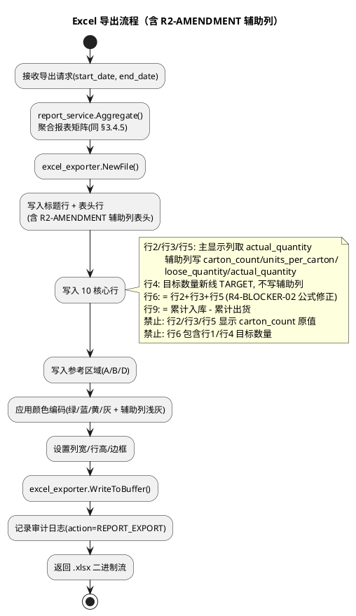

**关键设计决策**：
- **内存缓冲而非临时文件**：excel_exporter 写入 `bytes.Buffer` 后直接通过 HTTP 响应返回，避免磁盘 IO 与临时文件清理（spec.md §18.6 第 4 项导出失败场景：异常时 Buffer 释放，无残留）
- **导出完整性**：导出 Excel 必须与前端预览完全一致（数据、颜色、行列顺序，spec.md §18.4.4 第 3 项导出完整性规则）——通过 report_service.Aggregate() 单一数据源保证，前端预览与 Excel 导出共用同一聚合结果
- **R2-AMENDMENT + R4-BLOCKER-02 辅助列写入**：行2/行3/行5 的辅助列（carton_count/units_per_carton_snapshot/loose_quantity/actual_quantity）必须写入 Excel，便于审计与可追溯性；行4 目标数量新线不写辅助列；主显示列（日期列 + 累计列）取 actual_quantity，**禁止**显示 carton_count 原值（spec.md §18.2.4 第 3 项）
- **R4-BLOCKER-02 行6 公式修正**：行6 = 行2 + 行3 + 行5（行4 为目标数量新线 TARGET，不参与计算），**禁止**包含行1/行4 目标数量（spec.md §18.4.1 第 4/5 项）

## 3.6 前端页面设计

> 对应 spec.md §18.5 交互流程 + §18.8 角色权限 + §18.9.3 第 1 项技术栈约束。继承 §2.9 Web Dashboard 技术栈与路由风格。

### 3.6.1 路由与页面结构

> 对应任务要求"新增 web/src/pages/reports/ 目录"。在 §2.9.2 路由结构基础上新增 `/reports/*` 路由组。

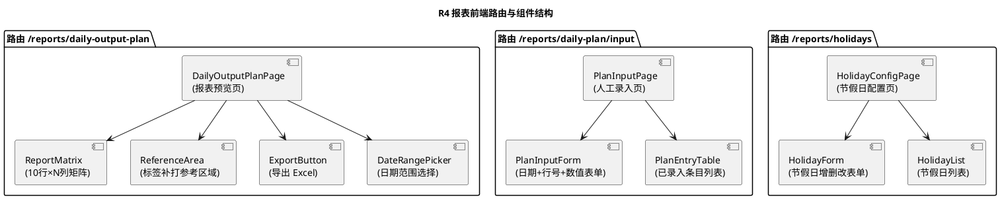

**目录结构新增**：
```
web/src/pages/reports/
  daily_output_plan_page.tsx   (报表预览页)
  plan_input_page.tsx          (人工录入页)
  holiday_config_page.tsx      (节假日配置页)
  components/
    report_matrix.tsx          (10行×N列矩阵组件)
    reference_area.tsx         (参考区域组件)
    plan_input_form.tsx        (录入表单)
    holiday_form.tsx           (节假日表单)
  hooks/
    use_daily_output_plan.ts   (React Query: 报表聚合)
    use_plan_entries.ts        (React Query: 日计划 CRUD)
    use_holidays.ts            (React Query: 节假日 CRUD)
    use_export_report.ts       (导出触发 hook)
  types/
    report.ts                  (TS 类型定义，禁止 any)
```

### 3.6.2 报表预览页面设计

> 对应 spec.md §18.5.2 报表生成与导出流程 + §18.2 报表结构定义。

**展示内容**：
- **日期范围选择器**（DateRangePicker）：默认近 30 日，可调整（spec.md §18.2.1 第 1 项日期列规则）
- **核心矩阵**（ReportMatrix）：10 行 × N 列 + 累计列
  - 行顺序冻结（§18.2.2 第 1 项），行1 绿色背景、行6 蓝色背景、节假日列黄色背景（§3.5.3 颜色编码）
  - 行6/行9 单元格只读，标注"自动计算"（spec.md §18.4.2 第 4 项禁止录入）
  - 累计列最右，浅灰背景
  - 每个单元格标注数据来源标签（MANUAL/AUTO_CALC/REFERENCE，spec.md §18.3 数据来源分离）
- **参考区域**（ReferenceArea）：A/B/D 三行，独立区块，标题明确标注"数据来源：TBL_PRODUCTION_RECORD 自动采集（R2 裁决：禁止进入核心行）"
- **导出按钮**（ExportButton）：触发 Excel 导出

**数据获取**：React Query 调用 `GET /api/v1/reports/daily-output-plan`，配置 `refetchInterval` 近实时刷新（继承 §2.9.3 风格）。

**权限控制**：
- 生产管理员与生产监控员均可查看预览（spec.md §18.8.2 第 2 项）
- 导出按钮对两角色均可见

### 3.6.3 人工录入表单设计

> 对应 spec.md §18.5.1 人工录入流程 + §18.4.2 录入规则。

**展示内容**：
- **录入表单**（PlanInputForm）：
  - 日期选择（DatePicker，单日）
  - 行号选择（Select，选项 1-10，但**排除**行6 与行9，spec.md §18.4.2 第 4 项禁止录入自动计算行）
  - 数值输入（NumberInput，非负整数，可空）
  - 产线选择（默认 HW102）
  - 提交按钮（调用 `POST /api/v1/reports/daily-plan/entries`）
- **已录入条目列表**（PlanEntryTable）：展示当前日期已录入的各行值，支持点击编辑（覆盖更新，spec.md §18.4.2 第 3 项录入覆盖规则）

**交互流程**（spec.md §18.5.1）：
1. 生产管理员登录 → 认证成功
2. 选择日期 + 行号 + 数值 → 提交
3. 前端校验行号非 6/9（双重保障，后端亦校验）
4. 调用录入 API → 后端 UPSERT + 审计 + 重算行6/行9
5. 返回更新后报表预览（React Query invalidate 触发重新聚合）

**权限控制**：仅生产管理员可访问（spec.md §18.8.2 第 1 项录入权限规则）；生产监控员访问该路由时重定向至报表预览页并提示权限不足。

### 3.6.4 节假日配置页面设计

> 对应 spec.md §18.4.3 节假日配置规则 + §18.9.4 第 1 项可维护规则。

**展示内容**：
- **节假日表单**（HolidayForm）：日期 + 名称 + 是否休息，提交调用 `POST /api/v1/reports/holidays`
- **节假日列表**（HolidayList）：已配置节假日，支持编辑/删除（调用 PUT/DELETE）

**权限控制**：运维管理员或生产管理员可访问（spec.md §18.7.2 第 4 项配置人）。
**可维护性**：节假日清单通过界面增删改查，**禁止**硬编码于源代码（spec.md §18.9.4 第 1 项节假日配置可维护规则）。

### 3.6.5 导出按钮与下载

> 对应 spec.md §18.4.4 导出规则。

**实现**：
- 导出按钮调用 `use_export_report` hook
- hook 通过 `fetch` 请求 `GET /api/v1/reports/daily-output-plan/export?format=xlsx`，响应类型 `blob`
- 浏览器原生下载（构造 `Blob` + `URL.createObjectURL` + 隐式 `<a download>` 点击），文件名由后端 `Content-Disposition` 指定
- 导出期间按钮显示 loading 状态，失败时提示"导出失败，请重试"（spec.md §18.6 第 4 项导出失败场景，前端预览仍可用）

**TypeScript 类型安全**：所有 API 响应类型定义于 `types/report.ts`，Strict 模式禁止 `any`（spec.md §18.9.3 第 1 项 + PREFERENCE_8）。

## 3.7 数据分离架构

> 对应 spec.md §18.3 数据来源分离策略。本节是 R4 核心架构决策，落实 R2/FROZEN 约束。

### 3.7.1 数据来源分类

> 对应 spec.md §18.3.1 数据来源分类 + §16.4.3 R2-AMENDMENT 对 R4 数据模型的影响。两类数据禁止混入同一数据行。R2-AMENDMENT 进一步细化行2-行5 的数据来源：carton_count/loose_quantity 来自人工录入，units_per_carton 来自配置，actual_quantity 来自 AUTO_CALC。

| 数据类别 | 来源 | 包含字段 | 用途 | 存储表 |
|---------|------|---------|------|--------|
| 自动采集数据（标签补打类） | HWView 数据库 `TBL_PRODUCTION_RECORD`（经 Huawei102Adapter 采集） | A（记录数）/ B（唯一条码数）/ D（quantity 求和） | 独立参考区域或辅助参考列 | TBL_PRODUCTION_RECORD（EV1 存量） |
| 人工录入数据（生产计划类，传统模式） | Web 录入接口或外部系统（MES/ERP）导入 | 目标数量（行1）/ 成品入库（行7）/ 出货（行8）/ 产线成品剩余（行10） | 核心 10 行 | TBL_DAILY_PRODUCTION_PLAN（R4 新增，value 字段） |
| 人工录入数据（R2-AMENDMENT 箱数换算模式） | Web 录入接口录入 carton_count + loose_quantity | 整箱数 carton_count / 散件数 loose_quantity（行2-行5） | 核心 10 行（行2-行5） | TBL_DAILY_PRODUCTION_PLAN（R4 新增，carton_count/loose_quantity 字段） |
| 配置数据（R2-AMENDMENT 装箱规格） | 装箱规格配置接口（PM 裁决后写入） | 每箱标准装箱数 units_per_carton | 行2-行5 actual_quantity 计算输入 | TBL_CARTON_SPECIFICATION（R2-AMENDMENT 新增） |
| 自动计算数据（R2-AMENDMENT 实际产出件数） | report_service 自动计算 = carton_count × units_per_carton + loose_quantity | 实际产出件数 actual_quantity（行2-行5） | 核心 10 行（行2-行5 主显示值） | TBL_DAILY_PRODUCTION_PLAN（R4 新增，actual_quantity 字段，AUTO_CALC） |

**R2-AMENDMENT 数据来源标注扩展**（spec.md §16.4.3 + §18.2.4）：
- `carton_count`：MANUAL（人工录入，来源于源系统 quantity 或人工录入）
- `units_per_carton`（snapshot）：CONFIG（从 TBL_CARTON_SPECIFICATION 读取并冻结为快照）
- `loose_quantity`：MANUAL（人工录入）
- `actual_quantity`：AUTO_CALC（系统自动计算 = carton_count × units_per_carton + loose_quantity，禁止人工录入）
- 报表行2-行5 主显示值取 actual_quantity，**禁止**显示 carton_count 原值（spec.md §18.2.4 第 3 项）

### 3.7.2 核心行 vs 参考区域

> 对应 spec.md §18.3.1 数据分离规则 + §18.3.2 自动填充范围。

**核心 10 行数据来源约束**（spec.md §18.3.1 第 2 项核心行数据来源规则）：
- 核心 10 行（§18.2.2 行1-行10）数据**必须**来自人工录入或外部系统导入
- **禁止**从 `TBL_PRODUCTION_RECORD` 自动推导核心行（R2/FROZEN 约束）
- 行6（合计）与行9（库存）由系统自动计算，**禁止**人工录入（spec.md §18.4.2 第 4 项）

**参考区域数据来源约束**（spec.md §18.3.2 自动填充规则）：
- 标签补打数据（A/B/D）**可**从 `TBL_PRODUCTION_RECORD` 自动填充至独立参考区域
- **禁止**自动填充至核心数据行（spec.md §18.3.2 第 1 项）

**report_service 编排逻辑**（数据分离的运行时保障，含 R2-AMENDMENT 箱数换算）：
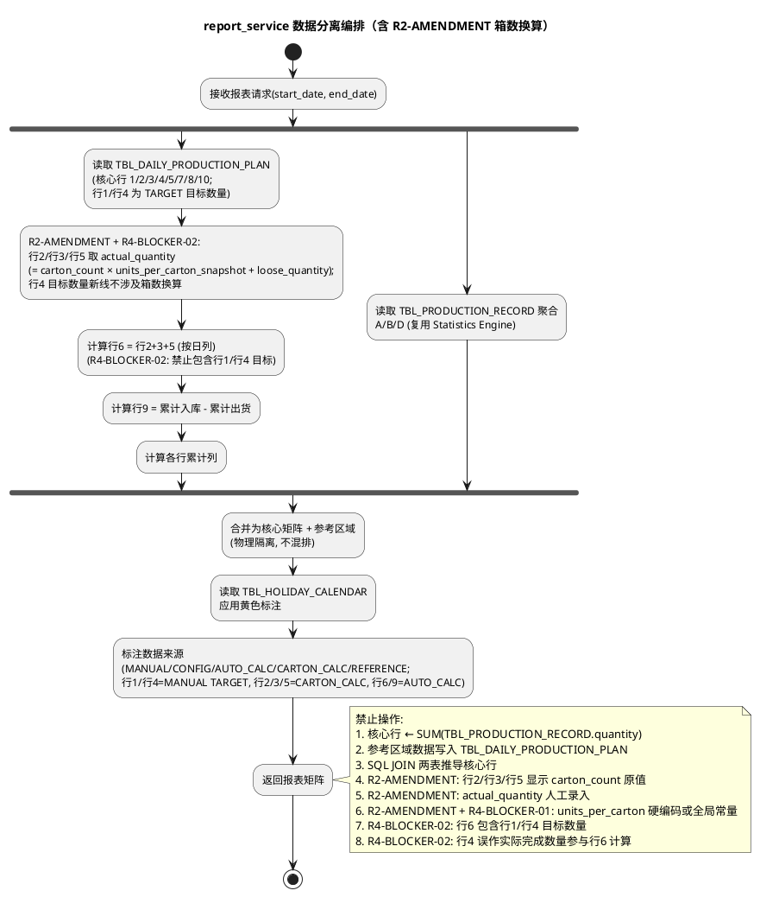

**数据分离的物理保障**：
- `TBL_DAILY_PRODUCTION_PLAN` 与 `TBL_PRODUCTION_RECORD` **无外键、无 JOIN**（§3.3.6 协调策略）
- report_service 分别独立读取两表，在应用层内存中合并为报表矩阵，从架构上杜绝误推导
- 标签补打参考接口（§3.4.7）独立暴露，不提供写入核心行能力
- **R2-AMENDMENT**：units_per_carton 必须从 TBL_CARTON_SPECIFICATION 读取，**禁止**硬编码；actual_quantity 必须由公式自动计算，**禁止**人工录入（spec.md §18.7.4 第 9 项 + §18.7.5 第 7/8 项）

### 3.7.3 数据来源标注

> 对应 spec.md §18.3 数据来源分离策略的可见性要求 + §16.4.3 R2-AMENDMENT 对 R4 数据模型的影响。在报表中明确标注数据来源，便于审计与追溯。

| 标注值 | 含义 | 应用位置 |
|--------|------|---------|
| MANUAL | 人工录入数据 | 核心行 1/4（目标数量 TARGET，R4-BLOCKER-02）/7/8/10 各单元格（传统录入 value）；行2/行3/行5 的 carton_count/loose_quantity 字段（R2-AMENDMENT 箱数换算模式人工录入） |
| CONFIG | 配置数据（R2-AMENDMENT 新增，R4-BLOCKER-01 三维） | 行2/行3/行5 的 units_per_carton_snapshot 字段（从 TBL_CARTON_SPECIFICATION 按 product+line+date 三维读取并冻结为快照） |
| AUTO_CALC | 系统自动计算 | 核心行 6（合计，= 行2+行3+行5）/ 行 9（库存）各单元格；行2/行3/行5 的 actual_quantity 字段（R2-AMENDMENT，= carton_count × units_per_carton + loose_quantity） |
| CARTON_CALC | 箱数换算模式（R2-AMENDMENT 新增） | 核心行 2/3/5 各单元格主显示值（取 actual_quantity，经箱数换算后的实际件数；行4 目标数量新线不适用，R4-BLOCKER-02） |
| REFERENCE | 自动采集参考数据 | 参考区域 A/B/D 各单元格 |

**前端渲染**（R4-BLOCKER-02）：
- 每个单元格角标显示数据来源标签（如小字"人工"/"配置"/"自动"/"箱数换算"/"参考"）
- 行1/行4（目标数量 TARGET）单元格主显示 value，角标标注"MANUAL"，绿色背景
- 行2/行3/行5 单元格主显示 actual_quantity，角标标注"CARTON_CALC"；辅助列显示 carton_count/units_per_carton/loose_quantity/actual_quantity 明细，分别标注 MANUAL/CONFIG/AUTO_CALC
- 导出 Excel 时在数据来源说明行（§3.5.2 行19）统一说明（spec.md §18.4.4 第 3 项导出完整性规则：前端预览与导出一致）

**R2-AMENDMENT + R4-BLOCKER-02 数据来源审计要点**（spec.md §16.4.4 + §18.2.4）：
- actual_quantity 必须可追溯至 carton_count × units_per_carton + loose_quantity 公式（辅助列提供完整明细）
- units_per_carton_snapshot 必须可追溯至 TBL_CARTON_SPECIFICATION 配置记录（config_by/config_at 审计，按 product+line+date 三维查询，R4-BLOCKER-01）
- **禁止**行2/行3/行5 主显示列出现 carton_count 原值（如 17），必须显示 actual_quantity（如 519）（spec.md §18.2.4 第 3 项）
- **禁止**行4"目标数量新线"参与行6 实际完成合计计算（R4-BLOCKER-02，行4 为 TARGET 非 ACTUAL）

## 3.8 与现有架构集成

> 对应任务要求"与现有架构的集成"。明确新增模块在 EV1 已冻结架构中的接入点。

### 3.8.1 后端模块新增

> 在 §2.1.2 hwview-server 组件架构基础上新增 report 模块。

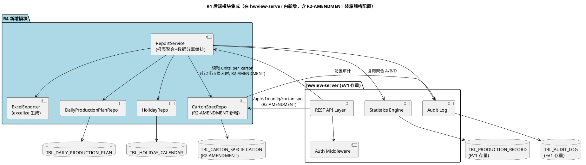

**新增文件清单**：
- `internal/server/report_service.go`：报表聚合 + 数据分离编排 + 自动计算 + R2-AMENDMENT actual_quantity 计算
- `internal/server/excel_exporter.go`：excelize 生成 .xlsx + 颜色编码 + R2-AMENDMENT 辅助列
- `internal/server/api/report_handler.go`：R4 REST API handler（注册到 §2.2.1 router）
- `internal/server/api/carton_spec_handler.go`：**R2-AMENDMENT 新增**装箱规格配置 API handler
- `internal/store/daily_production_plan_repo.go`：日计划 CRUD 仓储
- `internal/store/holiday_repo.go`：节假日 CRUD 仓储
- `internal/store/carton_spec_repo.go`：**R2-AMENDMENT 新增**装箱规格配置 CRUD 仓储
- `internal/store/migration/daily_production_plan.go`：GORM AutoMigrate 注册
- `internal/store/migration/holiday_calendar.go`：GORM AutoMigrate 注册
- `internal/store/migration/carton_specification.go`：**R2-AMENDMENT 新增**GORM AutoMigrate 注册
- `pkg/model/daily_production_plan.go`：领域对象（含 R2-AMENDMENT carton_count/units_per_carton_snapshot/loose_quantity/actual_quantity 字段）
- `pkg/model/holiday_calendar.go`：领域对象
- `pkg/model/carton_specification.go`：**R2-AMENDMENT 新增**领域对象

**接入点**：
- REST API handler 在 `internal/server/router.go` 注册 `/api/v1/reports/*` 路由组 + `/api/v1/config/carton-spec` 路由（R2-AMENDMENT，继承 §2.2.1 版本前缀策略）
- ReportService 复用 Statistics Engine（§2.6）聚合 A/B/D，不重复实现聚合 SQL
- ReportService 在录入行2-行5 时调用 CartonSpecRepo.GetEffectiveSpec(line_code, product_code, plan_date) 读取 units_per_carton，写入 units_per_carton_snapshot 并计算 actual_quantity（R2-AMENDMENT）
- Auth Middleware（§2.2.2.1 前置条件）扩展"生产管理员"角色判定

### 3.8.2 前端目录新增

> 在 §2.9.2 Web Dashboard 路由结构基础上新增 `/reports/*` 路由组（§3.6.1 已详述目录结构）。

**接入点**：
- `web/src/routes/` 注册 `/reports/*` 路由
- `web/src/pages/reports/` 新增页面组件
- `web/src/hooks/` 新增 R4 React Query hooks
- `web/src/types/report.ts` 新增 TS 类型定义
- AuthProvider（§2.9.5）扩展"生产管理员"角色，路由守卫拦截越权录入

### 3.8.3 GORM AutoMigrate 协调

> 对应任务要求"使用 GORM AutoMigrate" + §3.3.6 与现有7张表协调。

**迁移注册设计**：
- 在 `internal/store/migration/migration.go` 的统一迁移函数中追加：
  1. 现有 7 张表迁移（保持 EV1 顺序，design.md §2.3.2.2-2.3.2.8）
  2. `AutoMigrate(&CartonSpecification{})`（R2-AMENDMENT 新增，优先于 DailyProductionPlan，因后者录入时需读取前者配置）
  3. `AutoMigrate(&DailyProductionPlan{})`（R4 新增）
  4. `AutoMigrate(&HolidayCalendar{})`（R4 新增）
- 新增 3 张表中 TBL_CARTON_SPECIFICATION 必须先于 TBL_DAILY_PRODUCTION_PLAN 迁移（配置表优先，避免录入时无配置可读）；TBL_HOLIDAY_CALENDAR 无依赖，顺序无约束
- GORM AutoMigrate 自动创建表与索引，UNIQUE 约束通过 struct tag 声明（`gorm:"uniqueIndex:idx_name"`）；CHECK 约束通过 `gorm:"check:..."` 或迁移后手动执行 DDL 补充（SQLite/PostgreSQL 方言差异，由 migration.go 处理）

### 3.8.4 角色与权限扩展

> 对应 spec.md §18.8 角色与边界补充。在 §2.9.5 权限区分设计基础上扩展。

|&nbsp;| 运维管理员 | 生产管理员（R4 新增） | 生产监控员 |
|------|----------|-------------------|----------|
| 产线/数据源配置 | ✓ | ✗ | ✗ |
| 报表预览查看 | ✓ | ✓ | ✓ |
| 报表数据录入 | ✗ | ✓ | ✗ |
| 报表导出 | ✓ | ✓ | ✓ |
| 节假日配置 | ✓ | ✓ | ✗ |

**实现**：
- AuthProvider 角色枚举新增 `PRODUCTION_ADMIN`
- 录入接口（§3.4.2）前置条件校验 `role == PRODUCTION_ADMIN`（spec.md §18.8.2 第 1 项）
- 导出/预览接口允许 `PRODUCTION_ADMIN` 与 `MONITOR`（spec.md §18.8.2 第 2 项）
- 节假日配置允许 `OPS_ADMIN` 与 `PRODUCTION_ADMIN`（spec.md §18.7.2 第 4 项）
- 前端路由守卫：`/reports/daily-plan/input` 仅 `PRODUCTION_ADMIN` 可访问，越权重定向至预览页

## 3.9 R4 红线与裁决约束落实

> 对应 spec.md §18.1.2 裁决约束继承 + §18.10 验收基准 + §16.4.4 R2-AMENDMENT 关键约束。本节明确设计中如何落实每项 R4 约束，含 R2-AMENDMENT 新增的三项关键约束。

| 约束编号 | 约束内容 | 设计中的落实措施 | 追溯章节 |
|---------|---------|----------------|---------|
| R2 继承 | 核心行禁止来自 TBL_PRODUCTION_RECORD.quantity 求和 | TBL_DAILY_PRODUCTION_PLAN 与 TBL_PRODUCTION_RECORD 物理隔离（无外键/无 JOIN）；report_service 分别读取两表，应用层编排；核心行仅从 TBL_DAILY_PRODUCTION_PLAN 读取 | 3.3.5 / 3.7.2 / 3.8.1 |
| R3 继承 | 核心行必须人工录入或外部导入 | 提供 DailyProductionPlan CRUD 接口（§3.4.2）+ 前端录入表单（§3.6.3）；核心行数据来源标注 MANUAL/CARTON_CALC | 3.4.2 / 3.6.3 / 3.7.3 |
| Production Quantity FROZEN | 标签补打数据仅作参考区域 | ReportLabelReprintReference 非持久化对象，仅用于参考区域渲染；标签补打参考接口（§3.4.7）不提供写入核心行能力；数据来源标注 REFERENCE | 3.3.5 / 3.4.7 / 3.7.2 |
| 命名合规 | 报表命名"102日产出计划"，禁含"生产数量" | 界面标题/文件名/API 路径均含"102日产出计划"；导出文件名 `102日产出计划报表_YYYYMMDD-YYYYMMDD.xlsx` | 3.1.2 / 3.4.6 |
| 报表隔离 | 不与标签补打记录报表合并 | 核心矩阵与参考区域分属不同区块（§3.5.2 矩阵布局行14-17 独立参考区域） | 3.5.2 / 3.7.2 |
| 行顺序冻结 | 10 行顺序禁止调整 | ReportRow.RowNo 1-10 固定映射 §18.2.2 行名称；excel_exporter 按固定顺序写入 | 3.5.2 / 3.4.5 |
| 自动计算行禁录 | 行6/行9 禁止人工录入 | 录入接口校验 row_no ∉ {6,9}，返回 409；前端表单排除行6/行9 选项 | 3.4.2 / 3.6.3 |
| 数据来源分离 | 两类数据禁止混排 | report_service 物理隔离编排；数据来源标注 MANUAL/CONFIG/AUTO_CALC/CARTON_CALC/REFERENCE | 3.7.1 / 3.7.2 / 3.7.3 |
| 导出完整性 | Excel 与前端预览一致 | 共用 report_service.Aggregate() 单一数据源；颜色编码统一由 §3.5.3 定义 | 3.5.5 / 3.6.2 |
| 录入审计 | 录入/覆盖/导出记录审计 | 所有写入操作写 TBL_AUDIT_LOG（action=REPORT_INPUT/REPORT_EXPORT/HOLIDAY_CONFIG/CARTON_SPEC_CONFIG，含旧值/新值） | 3.4.2 / 3.4.6 / 3.4.3 / 3.4.4 |
| 节假日可配置 | 禁止硬编码节假日 | TBL_HOLIDAY_CALENDAR 配置表 + CRUD 接口 + 前端配置页 | 3.3.3 / 3.4.3 / 3.6.4 |
| **R2-AMENDMENT units_per_carton 禁止硬编码**（spec.md §16.4.4 第 1 项 + §18.7.4 第 9 项 + §18.9.4 第 3 项） | units_per_carton 必须通过 TBL_CARTON_SPECIFICATION 配置对象管理，禁止硬编码于源代码/配置文件常量/Adapter 内 | TBL_CARTON_SPECIFICATION 配置表 + 装箱规格配置接口（§3.4.4）+ report_service 从配置表读取 units_per_carton 写入 units_per_carton_snapshot；源代码审查不出现 `units_per_carton = 30` 或 `UNITS_PER_CARTON = 60` 等硬编码常量 | 3.3.4 / 3.4.4 / 3.7.1 |
| **R2-AMENDMENT actual_quantity 必须由公式计算**（spec.md §16.4.4 第 3 项 + §18.7.5 第 7/8 项） | actual_quantity 为计算字段，必须由公式 `carton_count × units_per_carton + loose_quantity` 自动计算，禁止人工录入 | TBL_DAILY_PRODUCTION_PLAN actual_quantity 字段由 report_service 自动计算填充 + CHECK 约束兜底 + 录入接口拒绝请求体含 actual_quantity（返回 422）+ 前端表单不提供 actual_quantity 输入框 | 3.3.2 / 3.4.2 / 3.7.1 |
| **R2-AMENDMENT + R4-BLOCKER-02 实际完成合计公式修正**（spec.md §18.4.1 第 4/5 项） | 行6 = 行2 + 行3 + 行5（行4 为目标数量新线 TARGET，不参与计算），禁止包含行1/行4 目标数量行；目标与实际分离 | report_service 行6 计算公式明确为行2+3+5，excel_exporter 同步；行1/行4 与行6 独立呈现，禁止合并或相加 | 3.4.5 / 3.5.4 / 3.7.2 |
| **R2-AMENDMENT + R4-BLOCKER-02 行2/行3/行5 显示 actual_quantity**（spec.md §18.2.4 第 3 项） | 报表行2/行3/行5 主显示列必须显示 actual_quantity，禁止显示 carton_count 原值；行4 为目标数量不适用 | report_service 行2/行3/行5 Values 取 actual_quantity + excel_exporter 主显示列写 actual_quantity + 辅助列显示 carton_count/units_per_carton/loose_quantity 明细 | 3.4.5 / 3.5.2 / 3.5.5 |
| **R4-BLOCKER-01 装箱规格适用范围维度**（spec.md §18.7.4 第 10/11 项 + §18.2.4 第 2 项） | TBL_CARTON_SPECIFICATION 必须支持 product_code + line_code + effective_from/to 三维适用范围；30 与 60 可并存（不同产品/产线/时间）；禁止全局常量；查询必须提供三维条件 | TBL_CARTON_SPECIFICATION 三维字段 + 唯一索引 + 装箱规格配置接口三维查询（§3.4.4）+ 多规格并存示例；GET 查询缺失三维条件返回 400 | 3.3.4 / 3.4.4 / 3.7.1 |
| **R4-BLOCKER-02 行4 目标数量新线 TARGET**（spec.md §18.2.2 / §18.4.1 第 2/4/5 项） | 行4 为"目标数量新线"(TARGET)非实际完成；行6 = 行2 + 行3 + 行5；禁止行1/行4 目标数量参与实际产量计算；行4 绿色背景；新线不再区分白/夜班 | report_service 行4 Source=MANUAL TARGET + 行6 公式行2+3+5 + excel_exporter 行4 绿色 + 行顺序冻结 + 班次从4改为3（老线白班/老线夜班/新线） | 3.4.5 / 3.5.2 / 3.5.3 / 3.5.4 / 3.7.2 / 3.7.3 |
| **R4-BLOCKER-01 装箱数歧义已解决**（spec.md §16.4.4 第 2 项 + §18.2.4 第 2 项 + §18.10） | §18.2.3 "60 只/箱"与 R2-AMENDMENT "30 件/箱"可并存（不同 product/line/时间），由 R4-BLOCKER-01 适用范围维度解决，不必互相否定 | TBL_CARTON_SPECIFICATION 支持多规格并存 + 配置接口允许同时配置 30 与 60（不同维度）+ 源代码不出现 30 或 60 硬编码 | 3.3.4 / 3.4.4 |
| **R2-AMENDMENT R2 核心结论保持**（spec.md §16.4.4 第 4 项） | R2-AMENDMENT 不改变 R2 核心结论"quantity 不是生产件数"，仅修正 quantity 具体语义 | 报表行2/行3/行5 数据来源仍不直接使用源系统 quantity 原值，需经 actual_quantity 公式转换（carton_count 来自源系统 quantity，但经换算为 actual_quantity 后才进入核心行） | 3.7.1 / 3.7.2 |

## 3.10 与 spec.md §18 的追溯矩阵

> 对应 spec.md §18 各需求条款 + §16.4 R2-AMENDMENT，确保设计覆盖所有 R4 需求与 R2-AMENDMENT 修正项。

| spec.md 需求条款 | 需求内容 | design.md 对应设计章节 |
|------------------|---------|---------------------|
| §16.4 R2-AMENDMENT | quantity=17 为 carton_count，actual_quantity = 17 × 30 + 9 = 519 | 3.3.2 / 3.3.4 / 3.4.2 / 3.4.4 / 3.5.4 / 3.7.1 / 3.9 |
| §16.4.1 新业务证据 | carton_count/units_per_carton/loose_quantity/actual_quantity 字段语义 | 3.3.2 TBL_DAILY_PRODUCTION_PLAN DDL + 3.7.1 数据来源分类 |
| §16.4.2 R2 裁决修正项 | quantity 语义修正为 carton_count，数据源性质修正为 Carton Count Event Source | 3.7.1 数据来源分类 + 3.9 R2-AMENDMENT R2 核心结论保持 |
| §16.4.3 对 R4 数据模型的影响 | carton_count/units_per_carton/loose_quantity/actual_quantity 四字段 | 3.3.2 / 3.3.4 / 3.3.5 领域对象类图 |
| §16.4.4 关键约束 | units_per_carton 配置化 + 装箱数歧义已由 R4-BLOCKER-01 解决（30 与 60 可并存）+ actual_quantity 自动计算 + R2 核心结论保持 | 3.3.4 / 3.4.4 / 3.9 R4 红线落实 |
| §18.1.1 核心职责 | 生成与导出 102 产线日产出计划跟踪报表 | 3.4 接口设计 + 3.5 Excel 导出 |
| §18.1.2 裁决约束继承 | R2/R3/FROZEN 三项约束 | 3.1.1 裁决约束继承 + 3.9 红线落实 |
| §18.1.3 命名规则 | 报表命名合规 + 报表隔离 | 3.1.2 命名合规约束 + 3.9 红线落实 |
| §18.2.1 列结构 | 日期列 + 累计列 + 节假日黄色标注 | 3.5.2 矩阵结构 + 3.5.3 颜色编码 |
| §18.2.2 行结构（含 R4-BLOCKER-02 修正） | 10 行顺序 + 颜色编码 + 行4 目标数量新线 TARGET + 行5 实际完成（新线）+ 行6=行2+3+5 | 3.5.2 矩阵结构 + 3.5.3 颜色编码（行4 绿色）+ 3.4.5 ReportRow + 3.9 |
| §18.2.3 业务台账基准 | 2026-09-06 E1/E2/E3/E4 校验 | 3.5.4 自动计算行（业务台账基准校验） |
| §18.2.4 箱数/散件/实际件数验收基准（R2-AMENDMENT） | carton_count=17/units_per_carton=30/loose_quantity=9/actual_quantity=519 校验 | 3.3.2 / 3.4.2 / 3.4.5 / 3.5.2 / 3.5.4 / 3.9 |
| §18.3.1 数据来源分类 | 自动采集 vs 人工录入分离 | 3.7.1 数据来源分类 |
| §18.3.1 数据分离规则 | 标签补打禁止进入核心行 | 3.7.2 核心行 vs 参考区域 |
| §18.3.2 自动填充范围 | 参考区域可自动填充，核心行禁止 | 3.7.2 + 3.4.7 标签补打参考接口 |
| §18.4.1 累计计算规则 | 累计列/合计行/库存行自动计算 | 3.5.4 自动计算行与累计列 |
| §18.4.1 第 4 项 实际完成合计公式约束（R2-AMENDMENT + R4-BLOCKER-02） | 行6 = 行2+行3+行5（行4 为 TARGET 不参与），禁止包含行1/行4 | 3.4.5 / 3.5.4 / 3.7.2 / 3.9 |
| §18.4.1 第 5 项 实际完成合计与目标分离（R2-AMENDMENT + R4-BLOCKER-02） | 行1/行4 与行6 独立呈现，禁止合并或相加 | 3.4.5 / 3.5.4 / 3.7.2 / 3.9 |
| §18.4.2 人工录入规则 | 角色/粒度/覆盖/禁录自动行 | 3.4.2 CRUD 接口 + 3.6.3 录入表单 + 3.8.4 权限 |
| §18.4.3 节假日配置规则 | 黄色标注 + 可配置 + 允许录入 | 3.3.3 TBL_HOLIDAY_CALENDAR + 3.4.3 CRUD + 3.6.4 配置页 |
| §18.4.4 导出规则 | .xlsx 格式 + 命名 + 完整性 | 3.4.6 导出接口 + 3.5 Excel 导出实现 |
| §18.5.1 人工录入流程 | 登录→校验→写入→重算→返回 | 3.6.3 录入表单交互流程 |
| §18.5.2 报表生成导出流程 | 聚合→参考→计算→标注→导出 | 3.4.5 聚合接口 + 3.5.5 导出流程 + 3.7.2 编排 |
| §18.6 异常场景 | 录入缺失/禁录行/冲突/导出失败/混排 | 3.4.2 异常映射 + 3.4.6 异常映射 + 3.6.5 导出失败 + 3.9 混排拒绝 |
| §18.7.1 DailyProductionPlan | 日期/行号/数值/录入人/时间/禁录行 | 3.3.2 TBL_DAILY_PRODUCTION_PLAN DDL |
| §18.7.2 HolidayCalendar | 日期/名称/是否休息/配置人/时间 | 3.3.3 TBL_HOLIDAY_CALENDAR DDL |
| §18.7.3 ReportLabelReprintReference | A/B/D 来源 + 用途约束 | 3.3.5 领域对象类图 + 3.4.7 参考接口 |
| §18.7.4 CartonSpecification（R2-AMENDMENT + R4-BLOCKER-01） | 装箱规格配置：line_code/product_code/units_per_carton/effective_from/effective_to + 时间段唯一性 + 配置化优先 + 适用范围维度查询 + 多规格并存（30 与 60 可并存） | 3.3.4 TBL_CARTON_SPECIFICATION DDL + 3.4.4 装箱规格配置接口（三维查询）+ 3.9 红线落实 |
| §18.7.5 CartonBasedActualQuantity（R2-AMENDMENT + R4-BLOCKER-02） | 基于箱数的实际产出：carton_count/units_per_carton/loose_quantity/actual_quantity + 公式计算约束 + 与报表行对应 + 班次从4改为3（老线白班/老线夜班/新线） | 3.3.2 / 3.3.5 领域对象类图 + 3.4.2 CRUD + 3.4.5 聚合接口 + 3.9 红线落实 |
| §18.8.1 新增角色 | 生产管理员 | 3.8.4 角色与权限扩展 |
| §18.8.2 角色权限约束 | 录入权限 + 导出权限 | 3.8.4 权限矩阵 + 3.4 各接口前置条件 |
| §18.9.1 性能 | 预览 ≤3s + 导出 ≤5s | 3.4.5 性能约束 + 3.4.6 性能约束 |
| §18.9.2 安全性 | 录入审计 + 导出审计 | 3.4.2/3.4.6 后置条件 + 3.9 红线落实 |
| §18.9.3 兼容性 | 技术栈继承 + 表命名 TBL_ | 3.5.1 库选型 + 3.3.2/3.3.3/3.3.4 表命名 + 3.6 TypeScript Strict |
| §18.9.4 可维护性 | 节假日可配置 + 行结构可配置 + 装箱规格配置化（R2-AMENDMENT） | 3.6.4 节假日配置页 + 3.5.2 行顺序冻结 + 3.3.4 / 3.4.4 装箱规格配置化 |
| §18.10 验收基准 | R4 Evidence Gate（含 R2-AMENDMENT 装箱规格配置化/实际件数计算/合计公式修正 + R4-BLOCKER-01 适用范围维度 + R4-BLOCKER-02 行4 TARGET/行6 公式修正） | 3.9 红线落实 + 3.5.4 业务台账基准校验 + 3.5.4 R2-AMENDMENT 箱数换算基准校验 |
| **R4-BLOCKER-01 装箱规格适用范围维度**（spec.md §18.7.4 第 10/11 项 + §18.2.4 第 2 项） | TBL_CARTON_SPECIFICATION 支持 product_code + line_code + effective_from/to 三维，30 与 60 可并存，禁止全局常量，查询必须三维条件 | 3.3.4 / 3.4.4 / 3.7.1 / 3.9 |
| **R4-BLOCKER-02 实际完成合计公式修正**（spec.md §18.2.2 / §18.4.1 第 2/4/5 项 / §18.7.5 第 3/9 项） | 行4 为"目标数量新线"(TARGET)非实际完成；行6 = 行2 + 行3 + 行5；禁止行1/行4 目标数量参与实际产量计算；新线不再区分白/夜班 | 3.4.5 / 3.5.2 / 3.5.3 / 3.5.4 / 3.7.2 / 3.7.3 / 3.9 |

---

> 文档结束。本 design.md 承接 spec.md 的"要做什么"，定义"怎么做"（架构/数据/接口/流程/部署）。§一、§二覆盖 EV1 主链（2.1-2.14），§三覆盖 EV1-R4 102日产出计划导出报表增量设计（3.1-3.10），含 2026-09-08 R2-AMENDMENT 设计同步更新（§3.3.2/§3.3.4/§3.3.5/§3.3.6 数据模型 + §3.4.2/§3.4.4/§3.4.5 接口 + §3.5.2/§3.5.4/§3.5.5 Excel 导出 + §3.7.1/§3.7.2/§3.7.3 数据分离 + §3.9 红线 + §3.10 追溯矩阵）+ 2026-09-08 R4-BLOCKER-01 装箱规格适用范围维度修正（§3.3.4/§3.4.4 三维查询 + §3.9 红线 + §3.10 追溯）+ 2026-09-08 R4-BLOCKER-02 实际完成合计公式修正（行4 TARGET + 行6=行2+3+5 + §3.4.5/§3.5.2/§3.5.3/§3.5.4/§3.7.2/§3.7.3 + §3.9 红线 + §3.10 追溯）。后续任务分解由 spec-task-agent 承担，代码实现由开发阶段承担。