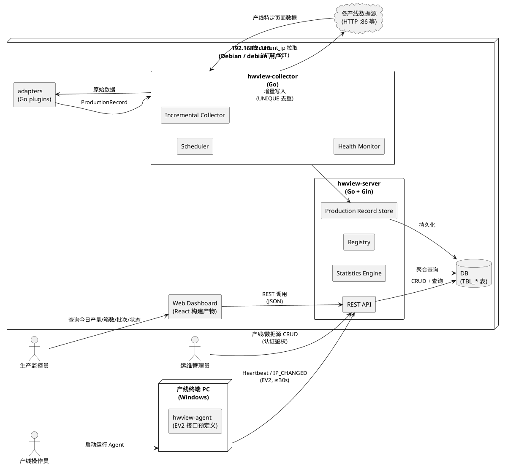
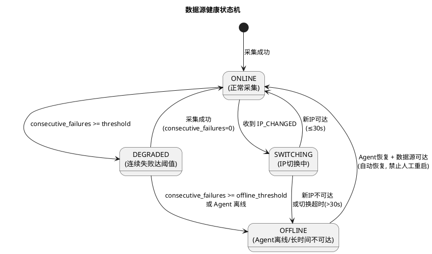
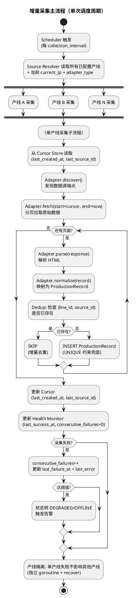
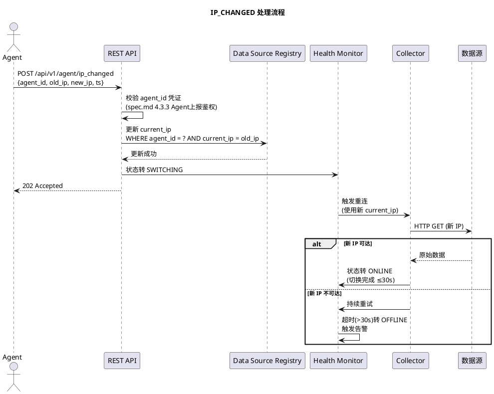
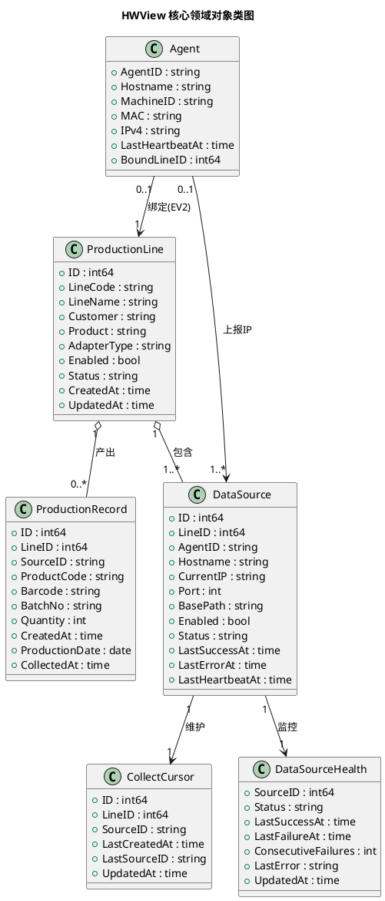
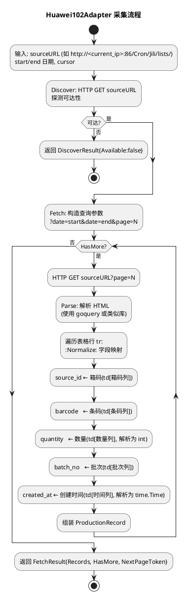
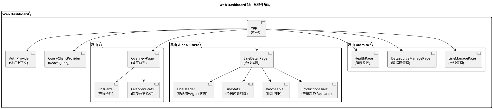

# HWView 多产线数据采集与可视化平台 技术设计文档

> 文档定位：本文件描述 HWView 平台"怎么做"（架构、数据模型、接口、流程、部署等实现细节），承接 spec.md 的"要做什么"。
> 阶段：第二阶段技术设计（Spec-Driven Development）
> 上游规格：`.codeartsdoer/specs/hwview_platform/spec.md`（14 章，869 行）
> 设计基线：EV1 设计基线（spec.md 第 9 章）+ EV1 任务清单（spec.md 第 10 章）+ EV1 红线（spec.md 第 13 章）
> 技术栈：后端 Go + Gin；前端 React 18 + TypeScript(Strict) + Vite + React Query + Recharts；数据库表名 `TBL_` 前缀加下划线分隔大写格式
> 命名规范：项目命名大写字母加连字符风格（HWView-EV1）；结构化命名带前缀和版本号层级命名（TASK-HWV-EV1-001）

---

# 一、需求与存量功能关系分析

## 1.1 需求功能与存量功能对比

### 1.1.1 已实现功能

> 当前代码库为全新项目（工作目录仅含 `.codeartsdoer/` 配置目录，无任何业务源代码）。EV0 阶段（spec.md 第 14.2 章）已对华为102真实数据源完成验证并 CLOSED，其验证产物（433 records / 5395 pieces / Q0926-078）作为 Golden Evidence（spec.md 第 11 章）冻结，构成"已验证未产品化"的存量知识基线，但不构成可复用代码存量。

| 需求功能 | 存量功能 | 代码位置 | 匹配度 |
|---------|---------|---------|--------|
| Golden Evidence 验收基准（433/5395/Q0926-078） | EV0 真实数据源验证产物（已冻结为不可变基准） | spec.md 第 11 章（无源代码，仅基准值） | 100% |
| 华为102 数据源可达性已验证（GET /Cron/Jili/lists/） | EV0 阶段已确认该端点可访问、可分页、可解析 | spec.md 第 14.2 章 HWView-EV0 PASS/CLOSED | 100% |
| 部署目标服务器环境（192.168.2.110 / debian / sudo） | 部署环境假设 A5（spec.md 第 7.2 章）已明确预置 | spec.md 第 4.6 章 + 第 7.2 章 C6/C7/C8 | 100% |

### 1.1.2 需要扩展的功能

> 由于代码库为空，本节"扩展"特指将 EV0 阶段已验证的华为102单产线采集逻辑，扩展为支持多产线、可插拔 Adapter、增量采集、统一统计的平台化能力。

| 需求功能 | 存量功能 | 差异说明 | 扩展方向 |
|---------|---------|---------|---------|
| 多产线注册（≥5 条） | EV0 仅验证华为102单产线 | 输入从单一产线扩展为产线注册表；需支持 HW102-COPY/HW102-LINE/BMW/SCHAEFFLER/MAGNA | 新建 `hwview-server` Production Line Registry 模块 + `TBL_PRODUCTION_LINE` 表 |
| 可插拔 Adapter | EV0 验证逻辑内嵌于脚本/手动验证 | 解析逻辑需从验证脚本抽离为独立 Adapter 组件，按产线类型命名注册 | 新建 `adapters/` 目录 + `ProductionAdapter` Go interface + `Huawei102Adapter` 首个实现 |
| 增量采集 + Cursor | EV0 为一次性全量验证（09:xx→15:xx→17:16 共 433 条） | 需从"每次全量"改为"Cursor 断点续采"，避免重复 INSERT | 新建 `hwview-collector` Incremental Collector + Cursor 持久化表 |
| 统一 ProductionRecord | EV0 产出为华为102专属字段（操作/条码/箱码/批次/创建时间） | 需将产线专属字段映射为统一结构（line_id/source_id/product_code/barcode/batch_no/quantity/created_at） | 新建 `TBL_PRODUCTION_RECORD` 表 + Adapter normalize() 方法 |
| 统计引擎（box_count/piece_count） | EV0 统计为人工核对（433/5395） | 需产品化为 SQL 聚合查询，公式冻结为 box_count=COUNT(DISTINCT source_id)、piece_count=SUM(quantity) | 新建 `hwview-server` Statistics Engine 模块 |
| Web Dashboard | EV0 无前端 | 需从零构建 React 18 + TypeScript(Strict) + Vite + React Query + Recharts 前端 | 新建前端工程（首页总览 + 产线详情页） |
| 部署自动化 | EV0 为手动验证 | 需提供 systemd 服务单元 + 部署脚本，凭据占位符注入 | 新建 `deploy/` 目录 + `hwview-server.service` + `deploy.sh` |

### 1.1.3 需要新增的功能或接口

> 以下功能在存量代码中完全没有对应实现，需从零新增。按 spec.md 第 9.1 章四大组件分组。

**hwview-server 组件新增**：
- Production Line Registry（产线注册中心）：CRUD 接口 + line_id 唯一性校验 + 审计日志
- Data Source Registry（数据源注册中心）：CRUD 接口 + current_ip 可变属性 + Adapter 绑定
- Production Record Store（生产记录存储）：写入接口 + UNIQUE(line_id, source_id) 约束 + 按日期/产线/客户/产品聚合查询
- Statistics Engine（统计引擎）：box_count/piece_count/batch_count/first_production_at/last_production_at 计算
- REST API 层：产线 CRUD / 数据源 CRUD / 采集触发 / 统计查询 / 健康查询 / Agent 心跳 / IP_CHANGED 上报
- 健康状态聚合：聚合 Collector 上报的 last_success_at/last_failure_at/consecutive_failures/last_error

**hwview-collector 组件新增**：
- Scheduler（调度器）：默认 5 分钟周期，可配置 collection_interval，产线关机不置 0
- Source Resolver（数据源解析器）：从 Registry 读取当前 current_ip + adapter_type
- Adapter Runtime（适配器运行时）：加载指定 Adapter，调用 discover/fetch/parse/normalize
- Incremental Collector（增量采集器）：Cursor 推进 + 去重 + 产线隔离 + 失败可继续
- Deduplication（去重器）：基于 (line_id, source_id) 唯一约束的 INSERT IGNORE / ON CONFLICT DO NOTHING
- Health Monitor（健康监控器）：ONLINE/DEGRADED/OFFLINE 状态机 + consecutive_failures 阈值

**adapters 组件新增**：
- ProductionAdapter Go interface（统一接口契约）
- Huawei102Adapter（华为102复制线）：GET /Cron/Jili/lists/ → 日期过滤 → 分页发现 → 逐页抓取 → HTML Parse → source_id/barcode/quantity/batch_no/created_at
- Huawei102LineAdapter（华为102 LINE）：接口预留，EV1 可暂不实现具体解析
- BMWAdapter / SchaefflerAdapter / MagnaAdapter：接口预留，EV1 可暂不实现具体解析
- GenericAdapter：通用兜底 Adapter
- Adapter 注册中心：插件化注册 + 按名加载，新增产线不改 Core

**hwview-agent 组件新增（EV2 接口预定义，EV1 不实现）**：
- Machine Identity（机器身份采集）：hostname/machine_id/MAC
- IPv4 Detection（IPv4 变化检测）：周期采集本机 IPv4 并比对
- Heartbeat（心跳上报）：周期 ≤30s 上报 agent_id/hostname/machine_id/MAC/IPv4/source endpoints
- IP Change Reporting（IP 变化上报）：检测到变化时上报 IP_CHANGED(old, new)

**部署相关新增**：
- systemd 服务单元 `hwview-server.service`
- 部署脚本 `deploy.sh`（sudo 提权 + 凭据环境变量注入）
- 数据库初始化脚本 `init_schema.sql`（三张基线表 + Cursor 表 + 健康监控表）

## 1.2 存量功能详细分析

> 由于代码库为空，本节对"已实现功能"（1.1.1）的深入解读聚焦于 EV0 验证产物与部署环境假设的约束条件，作为增量设计的输入约束。

### 1.2.1 Golden Evidence（EV0 验证产物）

- **接口契约**：不可变验收基准。Huawei102Adapter Integration Test 产出必须与 433 records / 5395 pieces / Q0926-078 完全一致；Statistics Engine 对 HW102-COPY / 2026-09-07 的统计结果必须为 boxes=433 / pieces=5395 / batch=Q0926-078。
- **业务规则**：Golden Evidence 一经冻结禁止在未通过 PM 裁决情况下修改（spec.md 第 11 章）。
- **扩展点**：无。Golden Evidence 为只读基准，不提供扩展接口。
- **约束**：作为 Adapter Integration Test 与 Statistics Engine 的双重验收基准，任何修改需 PM 裁决（spec.md 第 14.4 章 Evidence Gate 裁决规则）。

### 1.2.2 华为102 数据源可达性（EV0 已验证）

- **接口契约**：HTTP GET `/Cron/Jili/lists/`，支持日期过滤与分页参数，返回 HTML 页面。
- **业务规则**：页面包含操作/条码/箱码/批次/创建时间等字段（spec.md 第 4.5 章 4.5.1 兼容性）。
- **扩展点**：解析逻辑必须封装在 Huawei102Adapter 内，禁止进入 Collector Core（spec.md 第 13 章红线第 6 项）。
- **约束**：IP 禁止硬编码（spec.md 第 9.2 章 IP 禁止硬编码原则）；current_ip 必须作为 TBL_DATA_SOURCE 的可变属性读取。

### 1.2.3 部署目标服务器环境（192.168.2.110 / debian / sudo）

- **接口契约**：HWView Server 部署于 192.168.2.110，以 debian 普通用户运行，系统级操作经 sudo 提权。
- **业务规则**：禁止 root 长期运行服务进程（spec.md 第 4.6 章 4.6.4）；凭据通过环境变量注入，禁止明文（spec.md 第 4.6 章 4.6.5/4.6.6）。
- **扩展点**：部署脚本必须支持自动化，提供 systemd 服务单元（spec.md 第 4.6 章 4.6.3）。
- **约束**：
  - 凭据占位符 `<DEPLOY_USER_PASSWORD>` 与 `<DEPLOY_SUDO_PASSWORD>` 必须出现在文档与脚本中，实际值由部署环境变量注入（spec.md 第 4.3 章 4.3.6）。
  - Agent 部署在各产线终端 PC，禁止部署在 192.168.2.110（spec.md 第 4.6 章 4.6.2）。
  - 假设 A5：192.168.2.110 已预装 Debian 系 Linux，debian 用户已具备 sudo 提权权限，平台运行所需端口未被占用（spec.md 第 7.2 章）。

---

# 二、增量设计方案

## 2.1 实现模型

### 2.1.1 上下文视图

> 对应 spec.md 第 3.3 章交互上下文 + 第 9.1 章四大组件 + 第 4.6 章部署架构。展示 HWView 平台与外部系统的交互关系及部署位置。



**通信协议与调用频率**：
- 运维管理员 → REST API：HTTP/HTTPS，低频（配置变更）
- 生产监控员 → Dashboard：HTTP/HTTPS，中频（页面加载 + React Query 轮询）
- Agent → REST API：HTTP/HTTPS，高频（心跳 ≤30s/次，IP_CHANGED 事件触发）
- Collector → 数据源：HTTP，高频（默认 5 分钟/次，可配置）
- Collector → DB：SQL，高频（每次采集周期写入）
- Dashboard → REST API：HTTP/HTTPS，中频（页面加载 + 近实时轮询）

### 2.1.2 服务/组件总体架构

> 对应 spec.md 第 9.1 章四大组件基线 + 第 9.2 章核心原则。展示模块内部组成结构与依赖关系。

```plantuml
@startuml
top to bottom direction

package "hwview-server" {
  component [REST API Layer\n(Gin)] as API
  component [Production Line Registry] as LineReg
  component [Data Source Registry] as SrcReg
  component [Agent Registry\n(EV2)] as AgentReg
  component [Production Record Store] as RecStore
  component [Statistics Engine] as StatsEng
  component [Audit Log] as Audit
  component [Auth Middleware] as Auth
}

package "hwview-collector" {
  component [Scheduler\n(5min default)] as Sched
  component [Source Resolver] as SrcResolver
  component [Adapter Runtime] as AdaptRT
  component [Incremental Collector] as IncColl
  component [Deduplication] as Dedup
  component [Health Monitor\n(ONLINE/DEGRADED/OFFLINE)] as HMon
  component [Cursor Store] as CursorStore
}

package "adapters" {
  component [ProductionAdapter\n(interface)] as AdaptIf
  component [Huawei102Adapter] as HW102
  component [Huawei102LineAdapter] as HW102L
  component [BMWAdapter] as BMW
  component [SchaefflerAdapter] as SCH
  component [MagnaAdapter] as MAG
  component [GenericAdapter] as GEN
  component [Adapter Registry] as AdaptReg
}

package "hwview-agent (EV2)" {
  component [Machine Identity] as MachId
  component [IPv4 Detection] as IPv4Det
  component [Heartbeat] as HB
  component [IP Change Reporting] as IPChg
}

database "DB" as DB

' 依赖关系
API --> Auth
API --> LineReg
API --> SrcReg
API --> AgentReg
API --> RecStore
API --> StatsEng
API --> Audit
LineReg --> Audit
SrcReg --> Audit
SrcReg --> LineReg
StatsEng --> RecStore
RecStore --> DB

Sched --> SrcResolver
SrcResolver --> SrcReg
SrcResolver --> AdaptRT
AdaptRT --> AdaptReg
AdaptRT --> AdaptIf
IncColl --> AdaptRT
IncColl --> Dedup
IncColl --> RecStore
IncColl --> CursorStore
IncColl --> HMon
CursorStore --> DB
HMon --> SrcReg
HMon --> DB

HW102 ..up|> AdaptIf
HW102L ..up|> AdaptIf
BMW ..up|> AdaptIf
SCH ..up|> AdaptIf
MAG ..up|> AdaptIf
GEN ..up|> AdaptIf
AdaptReg --> AdaptIf

HB --> API
IPChg --> API
IPv4Det --> IPChg
MachId --> HB

@enduml
```

**模块划分与职责**：
- **hwview-server**：平台服务端，承载注册中心、记录存储、统计与 REST API。以 Gin 框架暴露 HTTP 接口，Auth Middleware 强制认证鉴权（spec.md 第 4.3 章），Audit Log 记录所有配置变更（spec.md 第 4.3 章 4.3.5）。
- **hwview-collector**：采集器，执行调度、解析、增量采集、去重与健康监控。单一 Collector 实例服务多产线（spec.md 第 13 章红线第 7 项），通过 Source Resolver 动态读取 current_ip（spec.md 第 9.2 章 IP 禁止硬编码原则）。
- **adapters**：可插拔数据源适配器集合。所有 Adapter 实现 ProductionAdapter interface，通过 Adapter Registry 按名加载。Collector Core 仅依赖 interface，禁止依赖任何具体 Adapter（spec.md 第 9.2 章 Adapter 与 Core 解耦原则）。
- **hwview-agent**：终端代理（EV2 接口预定义，EV1 不实现）。仅上报设备身份与 IP 变化，不内置任何产线解析逻辑（spec.md 第 5.2 章 5.2.1 第 6 项禁止项）。

**配置项及取值策略**：
- `collection_interval`：默认 5 分钟，可通过配置文件/环境变量调整（spec.md 第 10.8 章）
- `agent_heartbeat_timeout`：60 秒，超时判定离线（spec.md 第 5.2 章 5.2.1 第 4 项）
- `consecutive_failures_threshold`：连续失败阈值，达阈值转 DEGRADED/OFFLINE（spec.md 第 10.9 章）
- `ip_switch_timeout`：30 秒，IP 切换超时告警（spec.md 第 4.2 章 4.2.5）
- `dashboard_polling_interval`：前端 React Query 轮询间隔，近实时反映采集进展（spec.md 第 5.7 章 5.7.1 第 4 项）

### 2.1.3 实现设计文档

> 对应 spec.md 第 5.4 章数据采集与 IP 自动切换 + 第 9.4 章 Incremental Collection + 第 10.9 章 Health Monitor。展示核心状态机与流程分支。

#### 2.1.3.1 数据源健康状态机

> 对应 spec.md 第 10.9 章 Health Monitor + 第 5.6 章数据源健康监控。状态基线 ONLINE/DEGRADED/OFFLINE。



**状态转换触发条件与处理策略**：
- ONLINE → DEGRADED：Collector 连续采集失败次数达 `consecutive_failures_threshold`，触发告警，Dashboard 标记异常（spec.md 第 5.6 章 5.6.1 第 3 项）
- DEGRADED → ONLINE：采集成功，consecutive_failures 重置为 0，状态恢复
- DEGRADED → OFFLINE：连续失败达 `offline_threshold` 或关联 Agent 离线（心跳 >60s），Collector 暂停采集（spec.md 第 5.6 章 5.6.1 第 4 项）
- OFFLINE → ONLINE：Agent 恢复心跳且数据源可达，Collector 自动恢复采集，禁止要求人工手动重启（spec.md 第 5.6 章 5.6.1 第 5 项禁止项）
- ONLINE → SWITCHING：收到 IP_CHANGED 事件，更新 current_ip（spec.md 第 5.4 章 5.4.1 第 3/4 项）
- SWITCHING → ONLINE：新 IP 可达且切换完成 ≤30s，恢复采集（spec.md 第 4.2 章 4.2.5）
- SWITCHING → OFFLINE：新 IP 不可达或切换超时 >30s，触发告警（spec.md 第 5.4 章 5.4.3 第 1/2 项）

#### 2.1.3.2 增量采集主流程

> 对应 spec.md 第 9.4 章 Incremental Collection + 第 10.6 章 TASK-HWV-EV1-006。流程：Scheduler→Source Resolver→Adapter→Fetch→Normalize→Dedup→DB。



**关键设计决策**：
- **产线隔离**：每条产线采集在独立 goroutine 中执行，配合 `recover` 捕获 panic，确保单产线失败不影响其他产线（spec.md 第 9.4 章 9.4.5 产线隔离规则 + 第 4.2 章 4.2.3 Collector 故障隔离）
- **Cursor 双键**：采用 `last_created_at + last_source_id` 双键，避免相同时间戳漏记录（spec.md 第 9.5 章 9.5.1 Cursor 构成规则）。具体推进逻辑：下次采集 `WHERE created_at > last_created_at OR (created_at = last_created_at AND source_id > last_source_id)`
- **去重双层保障**：应用层 Dedup 检查 + 数据库 UNIQUE(line_id, source_id) 约束兜底（INSERT IGNORE / ON CONFLICT DO NOTHING），确保可重复执行不重复入库（spec.md 第 9.3.3 章 + 第 9.4 章 9.4.3 可重复执行规则）
- **失败可继续**：Cursor 持久化存储，Collector 重启后从 Cursor 断点继续（spec.md 第 9.5 章 9.5.2 + 第 9.4 章 9.4.4 失败可继续规则）

#### 2.1.3.3 IP_CHANGED 处理流程

> 对应 spec.md 第 5.4 章 5.4.2 交互流程 + 第 12.3 章 IP 变化处理流程。EV2 接口预定义，EV1 仅设计 Server 端响应逻辑。



**事务设计**：
- current_ip 更新与 SWITCHING 状态标记在同一数据库事务内完成，确保一致性
- 切换期间已采集数据不丢失（spec.md 第 4.2 章 4.2.5），Cursor 保持不变，新 IP 恢复后从断点继续

---

## 2.2 接口设计

### 2.2.1 总体设计

> 对应 spec.md 第 5.1-5.7 章核心能力 + 第 12 章 EV2 Agent 接口预定义。接口分类依据：按调用方与业务域分类。

| 接口分类 | 接口名称 | 调用方 | 稳定性等级 | spec.md 追溯 |
|---------|---------|--------|-----------|-------------|
| 产线管理 | `POST/GET/PUT/DELETE /api/v1/lines` | 运维管理员 | 稳定 | 5.1 产线注册与管理 |
| 数据源管理 | `POST/GET/PUT/DELETE /api/v1/datasources` | 运维管理员 | 稳定 | 5.3 数据源配置与适配 |
| Agent 管理（EV2） | `POST/GET /api/v1/agents` | 运维管理员 | 实验 | 5.2 Agent 管理与动态发现 |
| Agent 心跳（EV2） | `POST /api/v1/agent/heartbeat` | hwview-agent | 实验 | 5.2.2 交互流程 + 12.2 |
| IP_CHANGED（EV2） | `POST /api/v1/agent/ip_changed` | hwview-agent | 实验 | 5.4.2 + 12.3 |
| 采集控制 | `POST /api/v1/collect/trigger` | 运维管理员 | 稳定 | 5.4 数据采集 |
| 统计查询 | `GET /api/v1/stats/overview` | Dashboard | 稳定 | 5.5 + 5.7.1 总览首页 |
| 统计查询 | `GET /api/v1/stats/lines/{line_id}` | Dashboard | 稳定 | 5.7.1 产线详情 |
| 统计查询 | `GET /api/v1/stats/batches` | Dashboard | 稳定 | 5.5.1 批次统计 |
| 健康查询 | `GET /api/v1/health/datasources` | Dashboard/运维 | 稳定 | 5.6 数据源健康监控 |
| 健康查询 | `GET /api/v1/health/lines` | Dashboard/运维 | 稳定 | 5.6 + 10.9 |

**接口变更策略**：
- URL 含版本前缀 `/api/v1/`，破坏性变更升版本号
- EV2 Agent 接口标记为"实验"稳定性，EV1 Evidence Gate 通过后稳定化
- 所有接口遵循 RESTful 风格，JSON 请求/响应

### 2.2.2 接口清单

#### 2.2.2.1 产线管理接口

**接口签名**：
```go
// POST /api/v1/lines
type CreateLineRequest struct {
    LineCode    string `json:"line_code" binding:"required"`    // 如 HW102-COPY
    LineName    string `json:"line_name" binding:"required"`    // 如 华为102复制线
    Customer    string `json:"customer" binding:"required"`     // 如 华为
    Product     string `json:"product" binding:"required"`      // 如 HW102
    AdapterType string `json:"adapter_type" binding:"required"` // 如 Huawei102Adapter
    Enabled     bool   `json:"enabled"`
}

type LineResponse struct {
    ID          int64  `json:"id"`
    LineCode    string `json:"line_code"`
    LineName    string `json:"line_name"`
    Customer    string `json:"customer"`
    Product     string `json:"product"`
    AdapterType string `json:"adapter_type"`
    Enabled     bool   `json:"enabled"`
    Status      string `json:"status"` // 未配置/已配置/采集中/异常
    CreatedAt   string `json:"created_at"`
    UpdatedAt   string `json:"updated_at"`
}
```

**业务说明**：新增产线，需校验 line_code 唯一性与必填属性（spec.md 第 5.1 章 5.1.1 第 1/2 项）。
**前置条件**：调用者已通过认证鉴权，具备运维管理员权限（spec.md 第 4.3 章 4.3.1/4.3.2）。
**后置条件**：TBL_PRODUCTION_LINE 新增记录，审计日志记录操作人与变更内容（spec.md 第 4.3 章 4.3.5）。
**异常映射**：
- `400 Bad Request`：必填属性缺失，响应体明确缺失字段列表（spec.md 第 5.1 章 5.1.3 第 2 项）
- `409 Conflict`：line_code 已存在（spec.md 第 5.1 章 5.1.3 第 1 项）
- `401 Unauthorized`：未认证
- `403 Forbidden`：权限不足

**调用示例**：
```bash
curl -X POST https://192.168.2.110/api/v1/lines \
  -H "Authorization: Bearer <token>" \
  -H "Content-Type: application/json" \
  -d '{"line_code":"HW102-COPY","line_name":"华为102复制线","customer":"华为","product":"HW102","adapter_type":"Huawei102Adapter","enabled":true}'
```

#### 2.2.2.2 数据源管理接口

**接口签名**：
```go
// POST /api/v1/datasources
type CreateDataSourceRequest struct {
    LineID   int64  `json:"line_id" binding:"required"`
    AgentID  string `json:"agent_id"`              // EV2 绑定，EV1 可空
    Hostname string `json:"hostname"`              // 终端主机名
    CurrentIP string `json:"current_ip" binding:"required"` // 可变属性
    Port     int    `json:"port" binding:"required"`        // 如 86
    BasePath string `json:"base_path" binding:"required"`   // 如 /Cron/Jili/lists/
    Enabled  bool   `json:"enabled"`
}

type DataSourceResponse struct {
    ID           int64  `json:"id"`
    LineID       int64  `json:"line_id"`
    AgentID      string `json:"agent_id"`
    Hostname     string `json:"hostname"`
    CurrentIP    string `json:"current_ip"`
    Port         int    `json:"port"`
    BasePath     string `json:"base_path"`
    Enabled      bool   `json:"enabled"`
    Status       string `json:"status"` // ONLINE/DEGRADED/OFFLINE/SWITCHING
    LastSuccessAt string `json:"last_success_at"`
    LastErrorAt  string `json:"last_error_at"`
}
```

**业务说明**：配置数据源，current_ip 为可变属性，可随 IP_CHANGED 更新（spec.md 第 9.3.2 章 + 第 10.2 章 TASK-HWV-EV1-002）。
**前置条件**：line_id 已存在于 TBL_PRODUCTION_LINE。
**后置条件**：TBL_DATA_SOURCE 新增记录，Collector 下个调度周期自动纳入采集。
**异常映射**：`400`（必填缺失）/ `404`（line_id 不存在）/ `409`（重复配置）。

#### 2.2.2.3 Agent 心跳接口（EV2 预定义）

**接口签名**：
```go
// POST /api/v1/agent/heartbeat
type HeartbeatRequest struct {
    AgentID      string   `json:"agent_id" binding:"required"`
    Hostname     string   `json:"hostname" binding:"required"`
    MachineID    string   `json:"machine_id" binding:"required"`
    MAC          string   `json:"mac" binding:"required"`
    IPv4         string   `json:"ipv4" binding:"required"`
    SourceEndpoints []string `json:"source_endpoints" binding:"required"`
    Timestamp    int64    `json:"ts" binding:"required"` // Unix 时间戳
}

type HeartbeatResponse struct {
    Accepted bool   `json:"accepted"`
    AgentID  string `json:"agent_id"`
    Bound    bool   `json:"bound"`   // 是否已绑定产线
    LineID   *int64 `json:"line_id"` // 已绑定则返回
}
```

**业务说明**：Agent 周期上报身份与网络信息，间隔 ≤30s（spec.md 第 5.2 章 5.2.1 第 3 项 + 第 12.2 章）。
**前置条件**：Agent 携带有效 agent_id 凭证（spec.md 第 4.3 章 4.3.3）。
**后置条件**：刷新 TBL_DATA_SOURCE.last_heartbeat；若 agent_id 首次上报则自动登记为待绑定（spec.md 第 5.2 章 5.2.3 第 3 项）。
**异常映射**：`401`（凭证无效）/ `409`（身份冲突，保留先注册者，拒绝后者并告警，spec.md 第 5.2 章 5.2.3 第 1 项）。

#### 2.2.2.4 IP_CHANGED 接口（EV2 预定义）

**接口签名**：
```go
// POST /api/v1/agent/ip_changed
type IPChangedRequest struct {
    AgentID string `json:"agent_id" binding:"required"`
    OldIP   string `json:"old_ip" binding:"required"`
    NewIP   string `json:"new_ip" binding:"required"`
    Timestamp int64 `json:"ts" binding:"required"`
}
```

**业务说明**：Agent 检测到 IPv4 变化时上报，触发无感切换（spec.md 第 5.4 章 5.4.1 第 3/4 项 + 第 12.3 章）。
**前置条件**：agent_id 已注册且凭证有效。
**后置条件**：TBL_DATA_SOURCE.current_ip 更新为 new_ip；Health Monitor 状态转 SWITCHING；Collector 自动使用新 IP 重连；切换完成 ≤30s（spec.md 第 4.2 章 4.2.5）。
**异常映射**：`401`（凭证无效）/ `404`（agent_id 不存在）/ `409`（old_ip 与当前 current_ip 不匹配）。

#### 2.2.2.5 统计查询接口

**接口签名**：
```go
// GET /api/v1/stats/overview?date=2026-09-07
type OverviewResponse struct {
    Date             string `json:"date"`              // 2026-09-07
    TotalPieceCount  int64  `json:"total_piece_count"` // SUM(quantity) 全厂
    TotalBoxCount    int64  `json:"total_box_count"`   // COUNT(DISTINCT source_id) 全厂
    OnlineLineCount  int    `json:"online_line_count"` // 在线产线数
    DataSourceCount  int    `json:"data_source_count"` // 数据源数
    Lines []LineStats `json:"lines"`                   // 各产线列表
}

type LineStats struct {
    LineID       int64  `json:"line_id"`
    LineCode     string `json:"line_code"`
    LineName     string `json:"line_name"`
    PieceCount   int64  `json:"piece_count"`  // SUM(quantity)
    BoxCount     int64  `json:"box_count"`    // COUNT(DISTINCT source_id)
    Status       string `json:"status"`       // ONLINE/DEGRADED/OFFLINE
}

// GET /api/v1/stats/lines/{line_id}?date=2026-09-07
type LineDetailResponse struct {
    LineID         int64  `json:"line_id"`
    LineCode       string `json:"line_code"`
    LineName       string `json:"line_name"`
    CurrentTerminal string `json:"current_terminal"` // hostname
    CurrentIP      string `json:"current_ip"`        // 脱敏后
    AgentStatus    string `json:"agent_status"`      // ONLINE/OFFLINE
    DataSourceStatus string `json:"datasource_status"`
    BoxCount       int64  `json:"box_count"`
    PieceCount     int64  `json:"piece_count"`
    BatchCount     int    `json:"batch_count"`
    FirstProductionAt string `json:"first_production_at"`
    LastProductionAt  string `json:"last_production_at"`
    Batches []BatchDetail `json:"batches"`           // 批次明细
}

type BatchDetail struct {
    BatchNo    string `json:"batch_no"`
    BoxCount   int64  `json:"box_count"`
    PieceCount int64  `json:"piece_count"`
}
```

**业务说明**：
- `overview`：全厂总览，返回今日总产量/箱数/在线产线数/数据源数 + 各产线列表（spec.md 第 5.7 章 5.7.1 第 1/2 项）
- `lines/{line_id}`：单产线详情，返回当前终端/IP/Agent状态/数据源状态/今日箱数只数/批次明细（spec.md 第 5.7 章 5.7.1 第 3 项）
**前置条件**：调用者已认证；current_ip 等敏感信息按权限脱敏（spec.md 第 4.3 章 4.3.4）。
**后置条件**：无（只读查询）。
**异常映射**：`400`（日期格式非法）/ `404`（产线不存在）/ `504`（查询超时，返回部分数据，spec.md 第 5.7 章 5.7.3 第 1/2 项）。
**性能约束**：总览响应 ≤2s（95 分位），详情响应 ≤3s（95 分位），聚合查询 ≥20 QPS（spec.md 第 4.1 章）。

#### 2.2.2.6 健康查询接口

**接口签名**：
```go
// GET /api/v1/health/datasources
type DataSourceHealthResponse struct {
    DataSources []DataSourceHealth `json:"datasources"`
}

type DataSourceHealth struct {
    SourceID            int64  `json:"source_id"`
    LineID              int64  `json:"line_id"`
    Status              string `json:"status"` // ONLINE/DEGRADED/OFFLINE/SWITCHING
    LastSuccessAt       string `json:"last_success_at"`
    LastFailureAt       string `json:"last_failure_at"`
    ConsecutiveFailures int    `json:"consecutive_failures"`
    LastError           string `json:"last_error"`
}
```

**业务说明**：暴露每个数据源的健康状态（spec.md 第 5.6 章 5.6.1 第 2 项 + 第 10.9 章 TASK-HWV-EV1-009）。
**前置条件**：调用者已认证。
**后置条件**：无（只读查询）。

#### 2.2.2.7 采集触发接口

**接口签名**：
```go
// POST /api/v1/collect/trigger
type TriggerCollectRequest struct {
    LineID *int64 `json:"line_id"` // nil 表示触发所有产线
}

type TriggerCollectResponse struct {
    Triggered bool  `json:"triggered"`
    LineID    *int64 `json:"line_id"`
    TaskID    string `json:"task_id"` // 异步任务 ID
}
```

**业务说明**：手动触发采集（运维调试用），不改变调度周期（spec.md 第 5.4 章 5.4.1 第 1 项）。
**前置条件**：调用者具备运维管理员权限。
**后置条件**：Collector 异步执行一次采集，返回 task_id 供查询结果。

---

## 2.3 数据模型

### 2.3.1 设计目标

> 对应 spec.md 第 6 章数据约束 + 第 9.3 章数据模型冻结 + 第 9.5 章 Cursor 机制 + 第 10.9 章 Health Monitor。

**需支持的业务场景**：
- 多产线注册与配置（≥5 条产线，spec.md 第 9.3.1 章验收条件）
- 数据源 current_ip 可变属性更新（spec.md 第 9.3.2 章关键约束）
- 增量采集去重（UNIQUE(line_id, source_id)，spec.md 第 9.3.3 章关键约束）
- Cursor 断点续采（last_created_at + last_source_id 双键，spec.md 第 9.5 章）
- 健康监控状态持久化（last_success_at/last_failure_at/consecutive_failures/last_error，spec.md 第 10.9 章）
- 统计聚合查询（box_count/piece_count/batch_count，spec.md 第 10.7 章）

**性能、容量、扩展性目标**：
- 统计聚合查询 ≥20 QPS（spec.md 第 4.1 章 4.1.5）
- Dashboard 总览 ≤2s、详情 ≤3s（spec.md 第 4.1 章 4.1.1/4.1.2）
- 支持 ≥100 个 Agent 并发心跳（spec.md 第 4.1 章 4.1.3）

**与存量数据的兼容策略**：代码库为空，无存量数据兼容需求。Golden Evidence（433/5395/Q0926-078）作为验收基准，不作为存量数据迁移源。

### 2.3.2 模型实现

> 对应 spec.md 第 9.3 章三张基线表 + 第 9.5 章 Cursor 表 + 第 10.9 章健康监控表。表名遵循 `TBL_` 前缀加下划线分隔大写命名规范（spec.md 第 4.5 章 4.5.4 + 用户偏好 PREFERENCE_17）。

#### 2.3.2.1 核心领域对象类图



**对象关系与生命周期**：
- ProductionLine 聚合多个 DataSource（一条产线至少一个数据源，spec.md 第 6.1 章第 5 项）
- ProductionLine 产出多条 ProductionRecord（一对多）
- DataSource 维护一个 CollectCursor（一对一，Cursor 持久化，spec.md 第 9.5 章 9.5.2）
- DataSource 关联一个 DataSourceHealth（一对一健康监控）
- Agent 与 DataSource 为上报关系（EV2，一个 Agent 可上报多个数据源端点）
- Agent 与 ProductionLine 为可选绑定（EV2，未绑定时 Agent 状态为待绑定）

**持久化策略**：所有领域对象持久化至关系型数据库（SQLite/PostgreSQL，由部署环境决定），表名 `TBL_` 前缀。ProductionRecord 采用 UNIQUE(line_id, source_id) 约束 + 索引优化聚合查询。

#### 2.3.2.2 TBL_PRODUCTION_LINE DDL（产线表）

> 对应 spec.md 第 9.3.1 章。字段冻结，物理类型与索引由本 design.md 确定。

```sql
CREATE TABLE TBL_PRODUCTION_LINE (
    id           BIGINT       PRIMARY KEY AUTOINCREMENT,
    line_code    VARCHAR(64)  NOT NULL UNIQUE,
    line_name    VARCHAR(128) NOT NULL,
    customer     VARCHAR(64)  NOT NULL,
    product      VARCHAR(64)  NOT NULL,
    adapter_type VARCHAR(64)  NOT NULL,
    enabled      BOOLEAN      NOT NULL DEFAULT TRUE,
    status       VARCHAR(32)  NOT NULL DEFAULT 'UNCONFIGURED',
    created_at   TIMESTAMP    NOT NULL DEFAULT CURRENT_TIMESTAMP,
    updated_at   TIMESTAMP    NOT NULL DEFAULT CURRENT_TIMESTAMP
);

CREATE INDEX IDX_PRODUCTION_LINE_CUSTOMER ON TBL_PRODUCTION_LINE(customer);
CREATE INDEX IDX_PRODUCTION_LINE_PRODUCT  ON TBL_PRODUCTION_LINE(product);
CREATE INDEX IDX_PRODUCTION_LINE_ENABLED  ON TBL_PRODUCTION_LINE(enabled);
```

**字段说明**：
- `line_code`：产线编码，全局唯一，格式大写字母加连字符（如 HW102-COPY），不可变更（spec.md 第 6.1 章第 1 项）
- `adapter_type`：绑定的 Adapter 类型，取值为已注册 Adapter 之一（如 Huawei102Adapter）
- `status`：产线状态，取值范围 UNCONFIGURED/CONFIGURED/COLLECTING/ERROR（对应 spec.md 第 6.1 章第 6 项 未配置/已配置/采集中/异常）
- `enabled`：是否启用，禁用的产线不参与采集

**EV1 首条真实产线基线**（spec.md 第 9.3.1 章）：
```sql
INSERT INTO TBL_PRODUCTION_LINE (line_code, line_name, customer, product, adapter_type, enabled, status)
VALUES ('HW102-COPY', '华为102复制线', '华为', 'HW102', 'Huawei102Adapter', TRUE, 'UNCONFIGURED');
```

#### 2.3.2.3 TBL_DATA_SOURCE DDL（数据源表）

> 对应 spec.md 第 9.3.2 章。current_ip 必须为可变属性。

```sql
CREATE TABLE TBL_DATA_SOURCE (
    id              BIGINT       PRIMARY KEY AUTOINCREMENT,
    line_id         BIGINT       NOT NULL,
    agent_id        VARCHAR(64),
    hostname        VARCHAR(128),
    current_ip      VARCHAR(45)  NOT NULL,
    port            INT          NOT NULL,
    base_path       VARCHAR(256) NOT NULL,
    enabled         BOOLEAN      NOT NULL DEFAULT TRUE,
    status          VARCHAR(32)  NOT NULL DEFAULT 'OFFLINE',
    last_success_at TIMESTAMP,
    last_error_at   TIMESTAMP,
    last_heartbeat_at TIMESTAMP,
    created_at      TIMESTAMP    NOT NULL DEFAULT CURRENT_TIMESTAMP,
    updated_at      TIMESTAMP    NOT NULL DEFAULT CURRENT_TIMESTAMP,
    FOREIGN KEY (line_id) REFERENCES TBL_PRODUCTION_LINE(id) ON DELETE CASCADE
);

CREATE UNIQUE INDEX UQ_DATA_SOURCE_LINE_BASEPATH ON TBL_DATA_SOURCE(line_id, base_path);
CREATE INDEX IDX_DATA_SOURCE_AGENT   ON TBL_DATA_SOURCE(agent_id);
CREATE INDEX IDX_DATA_SOURCE_STATUS  ON TBL_DATA_SOURCE(status);
CREATE INDEX IDX_DATA_SOURCE_ENABLED ON TBL_DATA_SOURCE(enabled);
```

**关键约束**：
- `current_ip`：可变属性，可随 IP_CHANGED 事件更新（spec.md 第 9.3.2 章关键约束 + 第 10.2 章 TASK-HWV-EV1-002 禁止项）
- `agent_id`：EV2 绑定字段，EV1 可空
- `status`：数据源状态，取值 ONLINE/DEGRADED/OFFLINE/SWITCHING（spec.md 第 10.9 章 + 第 5.6 章）
- `last_heartbeat_at`：最近心跳时间，超过 60s 判定 Agent 离线（spec.md 第 5.2 章 5.2.1 第 4 项）
- 外键 ON DELETE CASCADE：产线删除时级联删除数据源

#### 2.3.2.4 TBL_PRODUCTION_RECORD DDL（生产记录表）

> 对应 spec.md 第 9.3.3 章。关键约束 UNIQUE(line_id, source_id)。

```sql
CREATE TABLE TBL_PRODUCTION_RECORD (
    id              BIGINT       PRIMARY KEY AUTOINCREMENT,
    line_id         BIGINT       NOT NULL,
    source_id       VARCHAR(128) NOT NULL,
    product_code    VARCHAR(64)  NOT NULL,
    barcode         VARCHAR(128) NOT NULL,
    batch_no        VARCHAR(64)  NOT NULL,
    quantity        INT          NOT NULL CHECK (quantity >= 0),
    created_at      TIMESTAMP    NOT NULL,
    production_date DATE         NOT NULL,
    collected_at    TIMESTAMP    NOT NULL DEFAULT CURRENT_TIMESTAMP,
    FOREIGN KEY (line_id) REFERENCES TBL_PRODUCTION_LINE(id) ON DELETE CASCADE
);

CREATE UNIQUE INDEX UQ_RECORD_LINE_SOURCE ON TBL_PRODUCTION_RECORD(line_id, source_id);
CREATE INDEX IDX_RECORD_LINE_DATE    ON TBL_PRODUCTION_RECORD(line_id, production_date);
CREATE INDEX IDX_RECORD_DATE         ON TBL_PRODUCTION_RECORD(production_date);
CREATE INDEX IDX_RECORD_BATCH        ON TBL_PRODUCTION_RECORD(line_id, production_date, batch_no);
CREATE INDEX IDX_RECORD_CREATED_AT   ON TBL_PRODUCTION_RECORD(line_id, created_at);
```

**关键约束**：
- `UNIQUE(line_id, source_id)`：Collector 反复扫描同一天数据也不产生重复记录（spec.md 第 9.3.3 章关键约束 + 第 10.3 章 TASK-HWV-EV1-003）。去重实现采用 `INSERT OR IGNORE`（SQLite）或 `ON CONFLICT (line_id, source_id) DO NOTHING`（PostgreSQL）
- `quantity`：非负整数，由 Adapter 映射得到（spec.md 第 6.4 章第 6 项）
- `source_id`：数据源端点标识（如华为102的箱码），用于 box_count = COUNT(DISTINCT source_id)
- `production_date`：生产日期，由 created_at 提取日期，用于按日聚合
- `collected_at`：采集入库时间，用于追踪采集延迟（spec.md 第 4.1 章 4.1.4）

**统计聚合索引设计**：
- `IDX_RECORD_LINE_DATE`：支持按产线+日期聚合（box_count/piece_count）
- `IDX_RECORD_BATCH`：支持批次明细查询
- `IDX_RECORD_CREATED_AT`：支持 Cursor 推进查询

#### 2.3.2.5 TBL_COLLECT_CURSOR DDL（Cursor 持久化表）

> 对应 spec.md 第 9.5 章 Cursor 机制。双键 last_created_at + last_source_id 避免相同时间戳漏记录。

```sql
CREATE TABLE TBL_COLLECT_CURSOR (
    id             BIGINT       PRIMARY KEY AUTOINCREMENT,
    line_id        BIGINT       NOT NULL,
    source_id      VARCHAR(128) NOT NULL,
    last_created_at TIMESTAMP   NOT NULL,
    last_source_id VARCHAR(128) NOT NULL,
    updated_at     TIMESTAMP    NOT NULL DEFAULT CURRENT_TIMESTAMP,
    FOREIGN KEY (line_id) REFERENCES TBL_PRODUCTION_LINE(id) ON DELETE CASCADE
);

CREATE UNIQUE INDEX UQ_CURSOR_LINE ON TBL_COLLECT_CURSOR(line_id);
```

**Cursor 推进逻辑**：
- 首次同步：读取历史数据全量入库，保存 Cursor 为最后一条记录的 (created_at, source_id)
- 增量同步：查询条件 `WHERE created_at > last_created_at OR (created_at = last_created_at AND source_id > last_source_id)`，按 (created_at, source_id) 二级排序，避免相同时间戳漏记录（spec.md 第 9.5 章 9.5.1）
- Cursor 持久化：禁止仅存在于内存，Collector 重启后从 TBL_COLLECT_CURSOR 恢复（spec.md 第 9.5 章 9.5.2）

#### 2.3.2.6 TBL_DATA_SOURCE_HEALTH DDL（健康监控表）

> 对应 spec.md 第 10.9 章 TASK-HWV-EV1-009 + 第 5.6 章数据源健康监控。

```sql
CREATE TABLE TBL_DATA_SOURCE_HEALTH (
    source_id            BIGINT       PRIMARY KEY,
    status               VARCHAR(32)  NOT NULL DEFAULT 'OFFLINE',
    last_success_at      TIMESTAMP,
    last_failure_at      TIMESTAMP,
    consecutive_failures INT          NOT NULL DEFAULT 0,
    last_error           TEXT,
    updated_at           TIMESTAMP    NOT NULL DEFAULT CURRENT_TIMESTAMP,
    FOREIGN KEY (source_id) REFERENCES TBL_DATA_SOURCE(id) ON DELETE CASCADE
);

CREATE INDEX IDX_HEALTH_STATUS ON TBL_DATA_SOURCE_HEALTH(status);
```

**字段说明**：
- `status`：ONLINE/DEGRADED/OFFLINE/SWITCHING（spec.md 第 10.9 章状态基线 + 第 2.1.3.1 章状态机）
- `consecutive_failures`：连续失败计数，达阈值转 DEGRADED，达 offline_threshold 转 OFFLINE
- `last_error`：最近错误信息，用于 Dashboard 展示与告警
- 禁止仅用单一时间点判定产线健康（spec.md 第 10.9 章禁止项），需结合 consecutive_failures 与 last_success_at 综合判定

#### 2.3.2.7 TBL_AGENT DDL（Agent 表，EV2 预定义）

> 对应 spec.md 第 6.2 章 Agent 数据约束 + 第 12 章 EV2 Agent 接口预定义。EV1 可建表但不实现 Agent 端。

```sql
CREATE TABLE TBL_AGENT (
    agent_id         VARCHAR(64)  PRIMARY KEY,
    hostname         VARCHAR(128) NOT NULL,
    machine_id       VARCHAR(128) NOT NULL,
    mac              VARCHAR(32)  NOT NULL,
    ipv4             VARCHAR(45)  NOT NULL,
    last_heartbeat_at TIMESTAMP   NOT NULL,
    bound_line_id    BIGINT,
    status           VARCHAR(32)  NOT NULL DEFAULT 'PENDING_BIND',
    created_at       TIMESTAMP    NOT NULL DEFAULT CURRENT_TIMESTAMP,
    updated_at       TIMESTAMP    NOT NULL DEFAULT CURRENT_TIMESTAMP,
    FOREIGN KEY (bound_line_id) REFERENCES TBL_PRODUCTION_LINE(id)
);

CREATE INDEX IDX_AGENT_MACHINE ON TBL_AGENT(machine_id);
CREATE INDEX IDX_AGENT_STATUS  ON TBL_AGENT(status);
```

**字段说明**：
- `agent_id`：全局唯一，不可变更（spec.md 第 6.2 章第 1 项）
- `machine_id`：跨 IP 变化识别同一机器（spec.md 第 6.2 章第 3 项）
- `status`：PENDING_BIND（待绑定）/ BOUND（已绑定）/ OFFLINE（离线）
- `bound_line_id`：绑定的产线，空表示待绑定（spec.md 第 5.2 章 5.2.3 第 3 项）

#### 2.3.2.8 TBL_AUDIT_LOG DDL（审计日志表）

> 对应 spec.md 第 4.3 章 4.3.5 操作审计 + 第 4.3 章 4.3.7 特权操作审计。

```sql
CREATE TABLE TBL_AUDIT_LOG (
    id          BIGINT       PRIMARY KEY AUTOINCREMENT,
    actor       VARCHAR(128) NOT NULL,
    action      VARCHAR(64)  NOT NULL,
    target_type VARCHAR(64)  NOT NULL,
    target_id   VARCHAR(128),
    change      TEXT,
    sudo_used   BOOLEAN      NOT NULL DEFAULT FALSE,
    created_at  TIMESTAMP    NOT NULL DEFAULT CURRENT_TIMESTAMP
);

CREATE INDEX IDX_AUDIT_ACTOR ON TBL_AUDIT_LOG(actor);
CREATE INDEX IDX_AUDIT_TIME  ON TBL_AUDIT_LOG(created_at);
CREATE INDEX IDX_AUDIT_TARGET ON TBL_AUDIT_LOG(target_type, target_id);
```

**字段说明**：
- `actor`：操作人（运维管理员用户名或 agent_id）
- `action`：操作类型（CREATE/UPDATE/DELETE/BIND/IP_CHANGED/SUDO_EXEC 等）
- `sudo_used`：是否通过 sudo 提权执行（spec.md 第 4.3 章 4.3.7）
- `change`：变更内容 JSON，记录前后值

---

## 2.4 Adapter 接口设计

> 对应 spec.md 第 5.3 章数据源配置与适配 + 第 9.1 章 adapters 组件 + 第 10.4 章 TASK-HWV-EV1-004 Adapter Interface + 第 10.5 章 TASK-HWV-EV1-005 Huawei102Adapter。

### 2.4.1 ProductionAdapter 统一接口契约

> 对应 spec.md 第 10.4 章接口基线：discover() / fetch(start, end, cursor=None) / parse(response) / normalize(record)。使用 Go interface 表达，核心 Collector 仅依赖此接口。

```go
package adapters

import (
    "context"
    "time"
)

// ProductionRecord 统一生产记录结构（对应 spec.md 第 6.4 章）
type ProductionRecord struct {
    LineID        int64
    SourceID      string
    ProductCode   string
    Barcode       string
    BatchNo       string
    Quantity      int
    CreatedAt     time.Time
    ProductionDate string // YYYY-MM-DD
}

// Cursor 增量采集游标（对应 spec.md 第 9.5 章，双键 last_created_at + last_source_id）
type Cursor struct {
    LastCreatedAt time.Time
    LastSourceID  string
}

// DiscoverResult 数据源端点发现结果
type DiscoverResult struct {
    Available bool
    TotalEstimate int64 // 预估总记录数（可选）
}

// FetchResult 原始数据抓取结果
type FetchResult struct {
    RawData      []byte   // 原始页面数据（如 HTML）
    HasMore      bool     // 是否还有下一页
    NextPageToken string  // 下一页分页 token
    Records      []ProductionRecord // 已 normalize 的记录（parse+normalize 可合并）
}

// ProductionAdapter 统一适配器接口
// 所有具体 Adapter（Huawei102Adapter/BMWAdapter 等）必须实现此接口
// 核心 Collector 仅依赖此接口，禁止依赖任何具体 Adapter 实现（spec.md 第 9.2 章 + 第 13 章红线第 6 项）
type ProductionAdapter interface {
    // Name 返回 Adapter 标识（如 "Huawei102Adapter"）
    Name() string

    // Discover 探测数据源端点是否可达
    Discover(ctx context.Context, sourceURL string) (*DiscoverResult, error)

    // Fetch 按日期范围与 Cursor 拉取原始数据
    // start/end 为日期范围；cursor 为增量游标（nil 表示首次全量）
    Fetch(ctx context.Context, sourceURL string, start, end time.Time, cursor *Cursor) (*FetchResult, error)

    // Parse 解析原始响应为中间结构（HTML→字段映射）
    Parse(ctx context.Context, rawData []byte) ([]map[string]interface{}, error)

    // Normalize 将中间结构映射为统一 ProductionRecord
    Normalize(ctx context.Context, lineID int64, raw map[string]interface{}) (*ProductionRecord, error)
}
```

**接口设计原则**：
- **类型安全**：使用 Go 强类型结构体，禁止 `map[string]interface{}` 作为最终输出（仅在 Parse 中间层使用）
- **Context 传递**：所有方法接受 `context.Context`，支持超时取消（采集延迟 ≤10s，spec.md 第 4.1 章 4.1.4）
- **Cursor 透传**：Fetch 接受 Cursor 参数，Adapter 内部按 (created_at, source_id) 二级排序返回增量数据
- **错误返回**：使用 Go 多返回值 `(result, error)`，错误由 Collector Health Monitor 统一处理

### 2.4.2 Huawei102Adapter 实现设计

> 对应 spec.md 第 10.5 章 TASK-HWV-EV1-005。流程基线：GET /Cron/Jili/lists/ → 日期过滤 → 分页发现 → 逐页抓取 → HTML Parse → source_id/barcode/quantity/batch_no/created_at。

**实现流程**：



**字段映射规则**（封装在 Adapter 内，禁止进入 Collector Core，spec.md 第 13 章红线第 6 项）：
- `source_id`：华为102页面的"箱码"字段（用于 box_count = COUNT(DISTINCT source_id)）
- `barcode`：华为102页面的"条码"字段
- `quantity`：华为102页面的"数量"字段，解析为非负整数（spec.md 第 6.4 章第 6 项）
- `batch_no`：华为102页面的"批次"字段（如 Q0926-078）
- `created_at`：华为102页面的"创建时间"字段，解析为 time.Time
- `product_code`：从产线配置的 product 字段读取（如 HW102）

**Golden Evidence 验收**（spec.md 第 10.5 章 + 第 11 章）：
- Huawei102Adapter Integration Test 必须以 Golden Evidence（433 records / 5395 pieces / Q0926-078）作为验收基准
- 测试输入：HW102-COPY 产线 / 2026-09-07 日期
- 测试输出断言：`len(records) == 433` && `sum(quantity) == 5395` && `distinct(batch_no) == ["Q0926-078"]`

**禁止项**：
- 禁止将华为102解析逻辑（如 `quantity = td[2]`）放入 Collector Core（spec.md 第 5.3 章 5.3.1 第 5 项禁止项 + 第 13 章红线第 6 项）
- 禁止 IP 写死：sourceURL 中的 IP 必须由调用方（Source Resolver）从 TBL_DATA_SOURCE.current_ip 动态注入（spec.md 第 9.2 章 IP 禁止硬编码原则 + 第 13 章红线第 2 项）

### 2.4.3 Adapter 注册与加载机制

> 对应 spec.md 第 5.3 章 5.3.1 第 2/4 项 Adapter 插件化规则 + 第 4.4 章 4.4.5 Adapter 可独立新增。新增产线不改 Core。

```go
package adapters

// AdapterRegistry Adapter 注册中心
type AdapterRegistry struct {
    adapters map[string]ProductionAdapter
}

// Register 注册 Adapter（按 Name() 索引）
func (r *AdapterRegistry) Register(adapter ProductionAdapter) {
    r.adapters[adapter.Name()] = adapter
}

// Get 按 Adapter 类型名加载（如 "Huawei102Adapter"）
func (r *AdapterRegistry) Get(name string) (ProductionAdapter, error) {
    a, ok := r.adapters[name]
    if !ok {
        return nil, fmt.Errorf("adapter %q not registered", name)
    }
    return a, nil
}

// List 返回所有已注册 Adapter 名称（供运维选择）
func (r *AdapterRegistry) List() []string { ... }
```

**注册时机**：应用启动时统一注册所有内置 Adapter：
```go
func RegisterBuiltins(reg *AdapterRegistry) {
    reg.Register(&Huawei102Adapter{})
    reg.Register(&Huawei102LineAdapter{})
    reg.Register(&BMWAdapter{})
    reg.Register(&SchaefflerAdapter{})
    reg.Register(&MagnaAdapter{})
    reg.Register(&GenericAdapter{})
}
```

**插件化设计决策**：
- **选择理由**：采用 Go interface + 注册表模式，而非 Go plugin 包（plugin 包有平台限制与版本兼容问题）。Adapter 作为独立包编译进二进制，通过 init() 或显式注册，新增 Adapter 只需新建包并在 RegisterBuiltins 中加一行
- **新增产线零核心改动**：新增 BMW 产线时，仅需（1）新建 `adapters/bmw/bmw_adapter.go` 实现 ProductionAdapter；（2）在 RegisterBuiltins 中加一行 `reg.Register(&BMWAdapter{})`；（3）通过 Registry 配置产线选择 BMWAdapter。Collector Core 代码无变更（spec.md 第 4.4 章 4.4.4 + 第 5.1 章 5.1.1 第 4 项 + 第 13 章红线第 1 项）
- **Adapter 命名规则**：按产线类型命名，必须提供 Huawei102Adapter/Huawei102LineAdapter/BMWAdapter/SchaefflerAdapter/MagnaAdapter/GenericAdapter 至少六类（spec.md 第 5.3 章 5.3.1 第 4 项）
- **GenericAdapter 兜底**：通用 Adapter，用于未识别产线类型的最小化兼容（仅做字段透传，不做业务映射）

---

## 2.5 Incremental Collector 详细设计

> 对应 spec.md 第 9.4 章 Incremental Collection + 第 10.6 章 TASK-HWV-EV1-006。主流程见第 2.1.3.2 章，本节补充 Cursor 推进与产线隔离细节。

### 2.5.1 Cursor 推进逻辑

> 对应 spec.md 第 9.5 章 Cursor 机制。双键 last_created_at + last_source_id 避免相同时间戳漏记录。

**首次同步**（Cursor 不存在）：
1. 从 Adapter 全量拉取历史数据（start=产线启用日, end=now）
2. 按 (created_at, source_id) 升序排序
3. 逐条 Dedup + INSERT
4. 保存 Cursor 为最后一条记录的 (created_at, source_id)

**增量同步**（Cursor 已存在）：
1. 从 TBL_COLLECT_CURSOR 读取 (last_created_at, last_source_id)
2. 调用 `Adapter.Fetch(start=last_created_at, end=now, cursor=cursor)`
3. Adapter 内部查询条件：`WHERE created_at > last_created_at OR (created_at = last_created_at AND source_id > last_source_id)`，按 (created_at, source_id) 升序
4. 逐条 Dedup + INSERT
5. 更新 Cursor 为本批次最后一条记录的 (created_at, source_id)

**相同时间戳处理**：
- 当多条记录 created_at 相同时，通过 last_source_id 二级排序确保不漏采（spec.md 第 9.5 章 9.5.1 验收条件）
- 例：三条记录 (T, "S1"), (T, "S2"), (T, "S3")，Cursor 为 (T, "S1") 时，下次查询 `created_at = T AND source_id > "S1"` 返回 S2/S3

**Cursor 持久化**：
- Cursor 存储于 TBL_COLLECT_CURSOR（第 2.3.2.5 章 DDL）
- 每次 INSERT 成功后更新 Cursor（同事务，确保一致性）
- Collector 重启后从 TBL_COLLECT_CURSOR 恢复（spec.md 第 9.5 章 9.5.2）

### 2.5.2 产线隔离设计

> 对应 spec.md 第 9.4 章 9.4.5 产线隔离规则 + 第 4.2 章 4.2.3 Collector 故障隔离。

**实现策略**：
- 每条产线采集在独立 goroutine 中执行，配合 `defer recover()` 捕获 panic
- 单产线失败（Adapter 异常/数据源不可达/解析错误）仅影响该产线，其他产线继续采集
- Health Monitor 独立维护每条产线状态，单产线 DEGRADED/OFFLINE 不影响其他产线 ONLINE

**伪结构**：
```go
func (c *Collector) runCycle(ctx context.Context) {
    lines := c.sourceResolver.GetAllEnabledLines()
    var wg sync.WaitGroup
    for _, line := range lines {
        wg.Add(1)
        go func(l Line) {
            defer wg.Done()
            defer func() {
                if r := recover(); r != nil {
                    c.healthMon.MarkFailure(l.ID, fmt.Errorf("panic: %v", r))
                    // 产线隔离：单产线 panic 不影响其他产线
                }
            }()
            c.collectLine(ctx, l) // 单产线采集子流程
        }(line)
    }
    wg.Wait()
}
```

### 2.5.3 可重复执行与失败可继续

> 对应 spec.md 第 9.4 章 9.4.3 可重复执行规则 + 9.4.4 失败可继续规则。

- **可重复执行**：Dedup 应用层检查 + 数据库 UNIQUE(line_id, source_id) 约束兜底（INSERT OR IGNORE / ON CONFLICT DO NOTHING），多次执行 Collector DB 无重复记录
- **失败可继续**：Cursor 持久化，采集中途失败后重启从 Cursor 断点继续，已采集数据不丢不重
- **禁止全量重采**：禁止每次采集重复 INSERT（spec.md 第 10.6 章 TASK-HWV-EV1-006 禁止项 + 第 13 章红线第 4 项）

---

## 2.6 Statistics Engine 设计

> 对应 spec.md 第 5.5 章统一生产记录与统计 + 第 10.7 章 TASK-HWV-EV1-007 Production Statistics Engine。

### 2.6.1 统计公式实现

> 对应 spec.md 第 10.7 章公式冻结：box_count = COUNT(DISTINCT source_id)；piece_count = SUM(quantity)。

**单产线单日统计 SQL**：
```sql
SELECT
    COUNT(DISTINCT source_id) AS box_count,
    SUM(quantity) AS piece_count,
    COUNT(DISTINCT batch_no) AS batch_count,
    MIN(created_at) AS first_production_at,
    MAX(created_at) AS last_production_at
FROM TBL_PRODUCTION_RECORD
WHERE line_id = ? AND production_date = ?;
```

**全厂单日总览 SQL**：
```sql
SELECT
    COUNT(DISTINCT source_id) AS total_box_count,
    SUM(quantity) AS total_piece_count
FROM TBL_PRODUCTION_RECORD
WHERE production_date = ?;
```

**批次明细 SQL**：
```sql
SELECT
    batch_no,
    COUNT(DISTINCT source_id) AS box_count,
    SUM(quantity) AS piece_count
FROM TBL_PRODUCTION_RECORD
WHERE line_id = ? AND production_date = ?
GROUP BY batch_no
ORDER BY batch_no;
```

**公式冻结约束**（spec.md 第 10.7 章禁止项 + 第 13 章红线第 3 项）：
- `piece_count = SUM(quantity)`，禁止用记录条数代替（禁止把记录数当产品数量）
- `box_count = COUNT(DISTINCT source_id)`，禁止 `box_count = COUNT(*)`（除非一一对应）
- 统计输出仅出现统一 ProductionRecord 字段，禁止保留产线专属字段名（如 Serial/Part No，spec.md 第 5.5 章 5.5.1 第 6 项禁止项）

### 2.6.2 Golden Evidence 验证机制

> 对应 spec.md 第 11 章 Golden Evidence + 第 10.7 章 Acceptance。

**Golden Result 断言**（HW102-COPY / 2026-09-07）：
```go
func TestStatisticsEngine_GoldenEvidence(t *testing.T) {
    result := statsEngine.Compute("HW102-COPY", "2026-09-07")
    assert.Equal(t, int64(433), result.BoxCount)      // boxes=433
    assert.Equal(t, int64(5395), result.PieceCount)    // pieces=5395
    assert.Equal(t, []string{"Q0926-078"}, result.Batches) // batch=Q0926-078
}
```

**Golden Evidence 不可变规则**（spec.md 第 11 章）：一经冻结禁止在未通过 PM 裁决情况下修改。

### 2.6.3 每日/批次统计聚合逻辑

> 对应 spec.md 第 5.5 章 5.5.1 第 2/3/4 项。

- **每日产量统计**：按日期+产线维度 SUM(quantity)（spec.md 第 5.5 章 5.5.1 第 2 项）
- **每日箱数统计**：按日期+产线维度 COUNT(DISTINCT source_id)（spec.md 第 5.5 章 5.5.1 第 3 项）
- **批次统计**：按日期+产线维度 GROUP BY batch_no，返回各批次及其产量明细（spec.md 第 5.5 章 5.5.1 第 4 项）
- **跨产线统一统计**：BMW 与华为虽原始网页不同，都能按 日期/产线/客户/产品/箱数/生产数量 统一统计（spec.md 第 5.5 章 5.5.1 第 5 项）

**性能保障**：
- 聚合查询走 IDX_RECORD_LINE_DATE / IDX_RECORD_BATCH 索引（第 2.3.2.4 章）
- 支持 ≥20 QPS（spec.md 第 4.1 章 4.1.5）
- 总览响应 ≤2s、详情响应 ≤3s（spec.md 第 4.1 章 4.1.1/4.1.2）

---

## 2.7 Scheduler 设计

> 对应 spec.md 第 10.8 章 TASK-HWV-EV1-008 Scheduler。

### 2.7.1 调度策略

- **默认周期**：5 分钟，可通过配置文件/环境变量 `collection_interval` 调整（spec.md 第 10.8 章基线）
- **触发方式**：内部 ticker 定时触发 + REST API `POST /api/v1/collect/trigger` 手动触发
- **调度范围**：每个周期对所有 enabled=true 且 status=CONFIGURED 的产线执行采集
- **产线关机处理**：20:30 产线关机后，HWView 不能把当天数据显示成 0，必须保持 Last Successful Collection 并明确 Source Offline（spec.md 第 10.8 章特殊要求 + 第 13 章红线第 5 项）

### 2.7.2 Source Offline 处理设计

**问题场景**：产线 20:30 关机后，数据源不可达，若直接重新查询当日产量会返回 0，误导监控员。

**解决方案**：
- 当数据源不可达（OFFLINE）时，统计查询仍返回 TBL_PRODUCTION_RECORD 中已采集的当日数据（Last Successful Collection）
- Dashboard 同时展示状态标记 "Source Offline"，明确区分"当日无生产"与"数据源离线"
- 禁止 Source Offline 时将当日产量置 0（spec.md 第 10.8 章禁止项 + 第 13 章红线第 5 项）

**实现**：
- Statistics Engine 查询 TBL_PRODUCTION_RECORD（已采集数据），不依赖数据源实时可达性
- Health Monitor 维护 status=OFFLINE，Dashboard 渲染时叠加状态标记

---

## 2.8 Health Monitor 设计

> 对应 spec.md 第 5.6 章数据源健康监控 + 第 10.9 章 TASK-HWV-EV1-009 Health Monitor。状态机见第 2.1.3.1 章。

### 2.8.1 状态机实现

- **状态基线**：ONLINE / DEGRADED / OFFLINE（spec.md 第 10.9 章状态基线）+ SWITCHING（IP 切换中，spec.md 第 5.4 章）
- **状态持久化**：存储于 TBL_DATA_SOURCE_HEALTH（第 2.3.2.6 章 DDL）
- **状态转换**：见第 2.1.3.1 章状态机图，每次采集成功/失败触发状态评估

### 2.8.2 consecutive_failures 阈值与状态转换

- `consecutive_failures < degraded_threshold`：状态保持 ONLINE
- `consecutive_failures >= degraded_threshold`：状态转 DEGRADED，触发告警（spec.md 第 5.6 章 5.6.1 第 3 项）
- `consecutive_failures >= offline_threshold` 或 Agent 离线（心跳 >60s）：状态转 OFFLINE，Collector 暂停采集（spec.md 第 5.6 章 5.6.1 第 4 项）
- 采集成功：consecutive_failures 重置为 0，状态恢复 ONLINE（OFFLINE → ONLINE 需 Agent 恢复 + 数据源可达，自动恢复禁止人工重启，spec.md 第 5.6 章 5.6.1 第 5 项禁止项）

**阈值配置**：
- `degraded_threshold`：默认 3（连续失败 3 次转 DEGRADED）
- `offline_threshold`：默认 10（连续失败 10 次转 OFFLINE）
- 阈值可通过配置文件调整

### 2.8.3 监控指标暴露

> 对应 spec.md 第 4.4 章 4.4.2 关键监控指标。

- 产线在线数
- Collector 同步状态（ONLINE/DEGRADED/OFFLINE/SWITCHING）
- 采集错误计数（consecutive_failures）
- IP 切换次数（审计日志统计）
- 通过 REST API `GET /api/v1/health/datasources` 与 `GET /api/v1/health/lines` 暴露

---

## 2.9 Web Dashboard 设计

> 对应 spec.md 第 5.7 章 Web Dashboard 产线监控总览 + 第 4.5 章 4.5.4 技术栈约束。

### 2.9.1 技术栈

- **框架**：React 18
- **语言**：TypeScript（Strict 模式，禁止 `any`，spec.md 第 4.5 章 4.5.4 + 用户偏好 PREFERENCE_1/PREFERENCE_8）
- **构建工具**：Vite
- **数据获取**：React Query（近实时轮询，spec.md 第 5.7 章 5.7.1 第 4 项实时性规则）
- **图表库**：Recharts（产量趋势/批次分布可视化）
- **路由**：React Router
- **HTTP 客户端**：fetch / axios（封装统一错误处理）

### 2.9.2 页面结构与路由



### 2.9.3 首页全厂总览设计

> 对应 spec.md 第 5.7 章 5.7.1 第 1/2 项。

**展示内容**：
- **四项全厂总览指标**（spec.md 第 5.7 章 5.7.1 第 1 项）：
  - 今日总产量（total_piece_count = SUM(quantity) 全厂）
  - 今日箱数（total_box_count = COUNT(DISTINCT source_id) 全厂）
  - 在线产线数（online_line_count）
  - 数据源数（data_source_count）
- **各产线列表**（spec.md 第 5.7 章 5.7.1 第 2 项）：每条产线显示产线名、今日产量、状态

**数据获取**：React Query 调用 `GET /api/v1/stats/overview?date=today`，配置 `refetchInterval` 实现近实时刷新

**禁止项**：禁止在首页展示某客户专属的非统一字段（spec.md 第 5.7 章 5.7.1 第 6 项禁止项），仅展示统一 ProductionRecord 衍生的指标

### 2.9.4 单产线详情页设计

> 对应 spec.md 第 5.7 章 5.7.1 第 3 项。

**展示内容**（六类信息）：
- 当前终端（hostname）
- 当前 IP（current_ip，按权限脱敏，spec.md 第 4.3 章 4.3.4）
- Agent 状态（ONLINE/OFFLINE）
- 数据源状态（ONLINE/DEGRADED/OFFLINE/SWITCHING）
- 今日箱数（box_count）+ 今日只数（piece_count）
- 批次明细（BatchTable：各批次 box_count/piece_count）

**辅助可视化**：ProductionChart（Recharts 折线图）展示当日产量趋势

**数据获取**：React Query 调用 `GET /api/v1/stats/lines/{line_id}?date=today`

### 2.9.5 权限区分设计

> 对应 spec.md 第 5.7 章 5.7.1 第 5 项 + 第 4.3 章 4.3.2。

- **运维管理员**：可访问 `/admin/*` 路由（产线管理/数据源管理/健康监控），可执行配置类操作
- **生产监控员**：仅可访问 `/` 与 `/lines/:lineId`，配置类操作不可见不可执行
- **实现**：AuthProvider 维护当前用户角色，路由守卫拦截越权访问；配置类操作按钮按角色条件渲染

---

## 2.10 EV2 Agent 接口设计（仅接口，不实现）

> 对应 spec.md 第 12 章 EV2 Agent 接口预定义。EV1 不实现 Agent 端，仅预定义接口与 Server 端响应逻辑。

### 2.10.1 Heartbeat 协议

> 对应 spec.md 第 12.2 章 Heartbeat 接口基线。

**协议字段**（spec.md 第 6.2 章 Agent 数据约束）：
- `agent_id`：全局唯一，不可变更（spec.md 第 6.2 章第 1 项）
- `hostname`：宿主主机名，由终端 OS 上报（spec.md 第 6.2 章第 2 项）
- `machine_id`：终端机器唯一标识，跨 IP 变化识别同一机器（spec.md 第 6.2 章第 3 项）
- `MAC`：网卡 MAC 地址，辅助机器识别（spec.md 第 6.2 章第 4 项）
- `IPv4`：当前 IPv4，可随 DHCP 动态变化（spec.md 第 6.2 章第 5 项）
- `source endpoints`：本机数据源端点列表（spec.md 第 6.2 章第 7 项）
- `ts`：上报时间戳

**接口签名**：见第 2.2.2.3 章 HeartbeatRequest/HeartbeatResponse

**上报频率**：≤30s/次（spec.md 第 5.2 章 5.2.1 第 3 项）

**Server 端响应逻辑**：
- 校验 agent_id 凭证（spec.md 第 4.3 章 4.3.3）
- 首次上报：自动登记为待绑定 Agent（status=PENDING_BIND，spec.md 第 5.2 章 5.2.3 第 3 项）
- 已绑定：刷新 last_heartbeat_at，若 IPv4 变化则触发 IP_CHANGED 处理
- 身份冲突：保留先注册者，拒绝后者并告警审计（spec.md 第 5.2 章 5.2.3 第 1 项）
- 心跳超 60s 未上报：标记离线，关联 Collector 暂停（spec.md 第 5.2 章 5.2.1 第 4 项）

### 2.10.2 IP_CHANGED 事件协议

> 对应 spec.md 第 12.2 章 IP_CHANGED 接口 + 第 12.3 章 IP 变化处理流程。

**协议字段**：
- `agent_id`：上报 Agent 标识
- `old_ip`：旧 IPv4
- `new_ip`：新 IPv4
- `ts`：事件时间戳

**接口签名**：见第 2.2.2.4 章 IPChangedRequest

**Server 端处理流程**：见第 2.1.3.3 章 IP_CHANGED 处理流程图

### 2.10.3 DataSource.current_ip 更新与 Collector 自动恢复

> 对应 spec.md 第 12.3 章 IP 变化处理流程第 3/4 步。

1. Server 收到 IP_CHANGED，更新 TBL_DATA_SOURCE.current_ip = new_ip（WHERE agent_id = ? AND current_ip = old_ip）
2. Health Monitor 状态转 SWITCHING
3. Collector 下个调度周期使用新 current_ip 重连
4. 新 IP 可达：状态转 ONLINE，从 Cursor 断点继续采集（切换完成 ≤30s，spec.md 第 4.2 章 4.2.5）
5. 新 IP 不可达：持续重试，超时 >30s 转 OFFLINE 并告警（spec.md 第 5.4 章 5.4.3 第 1/2 项）
6. **约束**：DHCP 变化不导致产线采集配置失效（spec.md 第 12.3 章约束），禁止要求人工修改 Data Source 配置（spec.md 第 5.4 章 5.4.1 第 6 项禁止项）

---

## 2.11 部署设计

> 对应 spec.md 第 4.6 章部署性 + 第 7.2 章 C6/C7/C8 部署约束 + 第 9.1 章 hwview-server 组件。

### 2.11.1 部署架构

```plantuml
@startuml
title HWView 部署架构

node "192.168.2.110\n(Debian 系 Linux)" as Server {
  user "debian\n(普通用户, sudo 提权)" as DebianUser
  rectangle "hwview-server.service\n(systemd, debian 用户运行)" as Svc
  rectangle "hwview-server 二进制\n(Go + Gin)" as Bin
  rectangle "Web Dashboard 构建产物\n(React dist/)" as Dist
  database "DB\n(SQLite/PostgreSQL)" as DB
  file "deploy.sh\n(部署脚本)" as Deploy
  file "hwview-server.service\n(systemd 单元)" as Unit
  file "init_schema.sql\n(建表脚本)" as Schema
}

node "产线终端 PC 1\n(Windows)" as PC1 {
  rectangle "hwview-agent\n(EV2, Windows 安装包)" as Agent1
}

node "产线终端 PC N\n(Windows)" as PCN {
  rectangle "hwview-agent\n(EV2)" as AgentN
}

cloud "各产线数据源\n(HTTP :86)" as Sources

DebianUser --> Svc : 运行服务
Svc --> Bin : 启动
Bin --> DB : 读写
Bin --> Dist : 静态资源
Agent1 --> Bin : Heartbeat/IP_CHANGED\n(EV2)
AgentN --> Bin : Heartbeat/IP_CHANGED\n(EV2)
Bin --> Sources : HTTP 拉取\n(按 current_ip)

@enduml
```

**部署位置约束**：
- HWView Server（后端 + 前端构建产物 + 数据库）部署在 192.168.2.110，以 debian 用户运行（spec.md 第 4.6 章 4.6.1 + 第 7.2 章 C6）
- Agent 部署在各产线终端 PC，禁止部署在 192.168.2.110（spec.md 第 4.6 章 4.6.2）
- 系统级操作通过 sudo 提权，禁止 root 长期运行服务进程（spec.md 第 4.6 章 4.6.4）

### 2.11.2 systemd 服务单元设计

> 对应 spec.md 第 4.6 章 4.6.3 部署自动化规则。

**`hwview-server.service`**：
```ini
[Unit]
Description=HWView Server (Go + Gin)
After=network.target

[Service]
Type=simple
User=debian
Group=debian
WorkingDirectory=/opt/hwview
ExecStart=/opt/hwview/bin/hwview-server --config /opt/hwview/config.yaml
Restart=on-failure
RestartSec=5
Environment=HWVIEW_DB_PATH=/opt/hwview/data/hwview.db
Environment=HWVIEW_COLLECTION_INTERVAL=5m
Environment=HWVIEW_LOG_LEVEL=info
# 凭据通过环境变量注入（spec.md 第 4.6 章 4.6.5）
# 实际值由部署时环境变量注入，禁止明文写入本文件
Environment=DEPLOY_USER_PASSWORD=<DEPLOY_USER_PASSWORD>
Environment=DEPLOY_SUDO_PASSWORD=<DEPLOY_SUDO_PASSWORD>

[Install]
WantedBy=multi-user.target
```

**设计要点**：
- `User=debian`：以 debian 普通用户运行，非 root（spec.md 第 4.6 章 4.6.4）
- `Restart=on-failure`：进程异常退出自动重启
- 凭据占位符 `<DEPLOY_USER_PASSWORD>` / `<DEPLOY_SUDO_PASSWORD>`：实际值由部署环境变量注入，禁止明文（spec.md 第 4.6 章 4.6.5/4.6.6 + 第 4.3 章 4.3.6）

### 2.11.3 部署脚本设计

> 对应 spec.md 第 4.6 章 4.6.3 + 第 7.2 章 C8 部署自动化。使用 sudo 提权，凭据通过环境变量注入。

**`deploy.sh`**（PowerShell 风格注释，但部署目标为 Linux，故用 bash）：
```bash
#!/usr/bin/env bash
set -euo pipefail

# 部署脚本：HWView Server 部署到 192.168.2.110
# 凭据通过环境变量注入，禁止明文（spec.md 第 4.6 章 4.6.5）
# 使用占位符 <DEPLOY_USER_PASSWORD> / <DEPLOY_SUDO_PASSWORD>

: "${DEPLOY_USER_PASSWORD:?请通过环境变量设置 DEPLOY_USER_PASSWORD}"
: "${DEPLOY_SUDO_PASSWORD:?请通过环境变量设置 DEPLOY_SUDO_PASSWORD}"

DEPLOY_HOST="192.168.2.110"
DEPLOY_USER="debian"
DEPLOY_DIR="/opt/hwview"

# 1. 构建后端（Go）
go vet ./...
go build -o bin/hwview-server ./cmd/hwview-server
go test ./...

# 2. 构建前端（React + Vite）
cd web && npm ci && npm run build && cd ..

# 3. 上传产物到 192.168.2.110（scp，使用 sshpass 注入凭据）
sshpass -p "$DEPLOY_USER_PASSWORD" scp -r \
  bin/hwview-server web/dist config.yaml deploy/init_schema.sql \
  "$DEPLOY_USER@$DEPLOY_HOST:$DEPLOY_DIR/"

# 4. 远程执行初始化与服务注册（sudo 提权）
sshpass -p "$DEPLOY_USER_PASSWORD" ssh "$DEPLOY_USER@$DEPLOY_HOST" \
  "echo '$DEPLOY_SUDO_PASSWORD' | sudo -S bash $DEPLOY_DIR/deploy/install_remote.sh"

echo "部署完成：HWView Server 运行于 $DEPLOY_HOST 的 $DEPLOY_USER 用户下"
```

**`install_remote.sh`**（远程执行，sudo 提权）：
```bash
#!/usr/bin/env bash
set -euo pipefail

DEPLOY_DIR="/opt/hwview"

# 系统级操作通过 sudo 提权（spec.md 第 4.6 章 4.6.4）
sudo cp $DEPLOY_DIR/deploy/hwview-server.service /etc/systemd/system/
sudo systemctl daemon-reload
sudo systemctl enable hwview-server   # 开机自启
sudo systemctl restart hwview-server  # 启动服务

# 数据库初始化
sqlite3 $DEPLOY_DIR/data/hwview.db < $DEPLOY_DIR/deploy/init_schema.sql

# 审计日志：记录 sudo 操作（spec.md 第 4.3 章 4.3.7）
echo "$(date) sudo deploy by debian" | sudo tee -a /var/log/hwview-sudo-audit.log
```

**设计要点**：
- 凭据占位符 `<DEPLOY_USER_PASSWORD>` / `<DEPLOY_SUDO_PASSWORD>`：实际值由部署环境变量注入，禁止明文写入脚本或文档（spec.md 第 4.6 章 4.6.5/4.6.6 + 第 4.3 章 4.3.6）
- 系统级操作（服务注册/端口绑定/防火墙）通过 sudo 提权，服务进程以 debian 用户运行（spec.md 第 4.6 章 4.6.4）
- sudo 操作记录审计日志（spec.md 第 4.3 章 4.3.7）
- 构建验证：`go vet` + `go build` + `go test`（用户偏好 PREFERENCE_12）

### 2.11.4 Agent Windows 安装包设计（EV2）

> 对应 spec.md 第 12.1 章 Agent 部署位置。EV1 不实现，仅设计。

- 打包格式：Windows MSI 或 NSIS 安装包
- 安装内容：hwview-agent 二进制 + 配置模板（agent_id/Server URL/心跳间隔）
- 运行方式：Windows 服务（开机自启）
- 配置：agent_id 在安装时生成或手动指定，Server URL 指向 192.168.2.110

---

## 2.12 技术栈约束

> 对应 spec.md 第 4.5 章 4.5.4 技术栈约束 + 第 7.2 章 C4/C5 + 用户偏好。

### 2.12.1 后端技术栈

- **语言**：Go（用户偏好 PREFERENCE_11/PREFERENCE_12）
- **Web 框架**：Gin
- **验证命令**：`go vet` + `go build` + `go test`（用户偏好 PREFERENCE_12）
- **HTTP 客户端**：标准库 `net/http` 或 `resty`
- **HTML 解析**：`goquery`（Huawei102Adapter HTML Parse）
- **日志**：结构化日志（`slog` 或 `zap`，spec.md 第 4.4 章 4.4.1）
- **配置**：Viper（YAML + 环境变量覆盖）

### 2.12.2 前端技术栈

- **框架**：React 18（用户偏好 PREFERENCE_1）
- **语言**：TypeScript Strict 模式，禁止 `any`（用户偏好 PREFERENCE_8）
- **构建工具**：Vite
- **数据获取**：React Query
- **图表库**：Recharts
- **路由**：React Router

### 2.12.3 数据库与命名规范

- **数据库**：SQLite（开发/单机部署）或 PostgreSQL（生产多并发），由部署配置决定
- **表命名**：`TBL_` 前缀加下划线分隔大写格式（如 TBL_PRODUCTION_LINE、TBL_DATA_SOURCE、TBL_PRODUCTION_RECORD，spec.md 第 4.5 章 4.5.4 + 用户偏好 PREFERENCE_17）
- **项目命名**：大写字母加连字符风格（如 HWView-EV1，spec.md 第 4.5 章 4.5.5 + 用户偏好 PREFERENCE_4）
- **结构化命名**：带前缀和版本号层级命名（如 TASK-HWV-EV1-001，spec.md 第 4.5 章 4.5.5 + 用户偏好 PREFERENCE_7）
- **文件命名**：snake_case（如 `init_schema.sql`、`deploy.sh`，用户偏好 PREFERENCE_3）

### 2.12.4 部署脚本环境

- **本地构建**：Windows PowerShell（用户偏好 PREFERENCE_16）触发跨平台构建
- **远程部署**：bash + sshpass + sudo（目标为 Debian 系 Linux）

---

## 2.13 EV1 红线落实

> 对应 spec.md 第 13 章 EV1 红线（8 项禁止项）。本节明确设计中如何避免每项禁止项。

| 红线编号 | 禁止项 | 设计中的落实措施 | 追溯章节 |
|---------|--------|----------------|---------|
| 1 | 禁止只支持华为102 | ProductionAdapter 接口 + Adapter Registry 支持 Huawei102Adapter/Huawei102LineAdapter/BMWAdapter/SchaefflerAdapter/MagnaAdapter/GenericAdapter 六类；TBL_PRODUCTION_LINE 支持 ≥5 条产线配置；新增产线仅通过 Registry 配置完成 | 2.4.1 / 2.4.3 / 2.3.2.2 |
| 2 | 禁止 IP 写死 | current_ip 作为 TBL_DATA_SOURCE 可变属性；Source Resolver 动态读取 current_ip 注入 Adapter.Fetch；Collector Core 不出现任何具体终端 IP 硬编码 | 2.3.2.3 / 2.4.2 / 2.1.3.2 |
| 3 | 禁止把记录数当产品数量 | Statistics Engine 公式冻结：piece_count = SUM(quantity)、box_count = COUNT(DISTINCT source_id)；Integration Test 断言 Golden Evidence (433/5395) | 2.6.1 / 2.6.2 |
| 4 | 禁止每次采集重复 INSERT | Incremental Collector + Cursor 双键 + Dedup 应用层检查 + UNIQUE(line_id, source_id) 数据库约束兜底（INSERT OR IGNORE） | 2.5 / 2.3.2.4 |
| 5 | 禁止 Source Offline = 今日产量 0 | Statistics Engine 查询 TBL_PRODUCTION_RECORD 已采集数据，不依赖实时可达性；Dashboard 叠加 Source Offline 状态标记 | 2.7.2 |
| 6 | 禁止 Adapter 逻辑进入 Collector Core | ProductionAdapter Go interface + Adapter Registry；Collector Core 仅依赖 interface，禁止依赖任何具体 Adapter 实现；华为102解析逻辑封装在 Huawei102Adapter 内 | 2.4.1 / 2.4.2 / 2.4.3 |
| 7 | 禁止为每条产线复制一套 Collector | 单一 hwview-collector 实例 + 多 Adapter；Scheduler 每周期对所有产线调度，每产线独立 goroutine 执行（产线隔离） | 2.1.2 / 2.5.2 |
| 8 | 禁止现在就做复杂 AI/预测 | EV1 范围仅含数据采集基线（Registry/Adapter/Collector/Statistics/Dashboard/Health）；不引入任何 AI/预测模块 | 全文（无 AI 相关设计） |

---

## 2.14 与 spec.md 的追溯矩阵

> 每项设计决策追溯到 spec.md 的需求条款，确保设计覆盖所有需求。

| spec.md 需求条款 | 需求内容 | design.md 对应设计章节 |
|-----------------|---------|---------------------|
| 1.1-1.4 组件定位 | 采集与聚合多产线数据 | 2.1.1 上下文视图 + 2.1.2 组件架构 |
| 2 领域术语 | ProductionLine/Agent/Adapter/ProductionRecord 等 | 2.3.2 领域对象类图 + 2.4 Adapter 接口 |
| 3.1-3.3 角色与边界 | 运维管理员/监控员/操作员 + 外部系统 | 2.1.1 上下文视图 + 2.9.5 权限区分 |
| 4.1 性能 | Dashboard ≤2s/≤3s、≥100 Agent、≤10s 采集延迟、≥20 QPS | 2.2.2.5 统计接口性能约束 + 2.6.3 性能保障 |
| 4.2 可靠性 | 99.5% 可用性、60s 离线判定、Collector 隔离、IP 切换 ≤30s | 2.1.3.1 状态机 + 2.5.2 产线隔离 + 2.1.3.3 IP 切换 |
| 4.3 安全性 | 认证鉴权/脱敏/审计/凭据占位符 | 2.2.2 接口前置条件 + 2.3.2.8 审计表 + 2.11 部署凭据 |
| 4.4 可维护性 | 结构化日志/监控指标/链路追踪/零核心改动 | 2.8.3 监控指标 + 2.4.3 Adapter 插件化 |
| 4.5 兼容性 | 产线格式差异/DHCP/Adapter 扩展/技术栈 | 2.4 Adapter 接口 + 2.10 IP_CHANGED + 2.12 技术栈 |
| 4.6 部署性 | 192.168.2.110/debian/sudo/自动化/凭据 | 2.11 部署设计 |
| 5.1 产线注册与管理 | line_id 唯一/必填属性/绑定/扩展 | 2.2.2.1 产线管理接口 + 2.3.2.2 TBL_PRODUCTION_LINE |
| 5.2 Agent 管理与动态发现 | Agent 身份/心跳/离线判定/动态发现 | 2.10 EV2 Agent 接口 + 2.3.2.7 TBL_AGENT |
| 5.3 数据源配置与适配 | Data Source 四要素/Adapter 插件化/命名 | 2.2.2.2 数据源接口 + 2.4 Adapter 接口 |
| 5.4 数据采集与 IP 自动切换 | 采集触发/统一记录/IP_CHANGED/无感切换 | 2.1.3.2 采集流程 + 2.1.3.3 IP 切换 + 2.10.3 |
| 5.5 统一生产记录与统计 | 统一结构/每日产量/箱数/批次/跨产线 | 2.6 Statistics Engine + 2.3.2.4 TBL_PRODUCTION_RECORD |
| 5.6 数据源健康监控 | 四项状态/健康暴露/错误告警/Agent 联动 | 2.8 Health Monitor + 2.3.2.6 健康表 |
| 5.7 Web Dashboard | 总览首页/产线列表/详情/实时/权限 | 2.9 Web Dashboard |
| 6 数据约束 | 各领域对象逻辑约束 | 2.3.2 各表 DDL + DDL 注释 |
| 7 利益相关者与假设 | C1-C8 约束 + A1-A5 假设 | 2.11 部署设计（C6-C8/A5）+ 2.4 Adapter（C2/C3）+ 2.10（C1） |
| 8 覆盖矩阵 | 10 项第一阶段核心能力 | 全文覆盖（①-⑩） |
| 9.1 架构组件基线 | 四大组件 | 2.1.2 组件架构 |
| 9.2 核心原则 | 身份分离/IP 禁止硬编码/Adapter 解耦 | 2.4.2 + 2.13 红线 2/6 |
| 9.3 数据模型冻结 | 三张表字段基线 | 2.3.2.2 / 2.3.2.3 / 2.3.2.4 |
| 9.4 Incremental Collection | 首次/增量/可重复/失败可继续/产线隔离 | 2.5 Incremental Collector |
| 9.5 Cursor 机制 | 双键/持久化 | 2.5.1 Cursor 推进 + 2.3.2.5 TBL_COLLECT_CURSOR |
| 10.1-10.9 EV1 任务清单 | 9 项 TASK | 全文对应（每项 TASK 在设计中有对应章节） |
| 10.7 Statistics 公式冻结 | box_count/piece_count 公式 | 2.6.1 统计公式 |
| 10.8 Scheduler | 5 分钟/可配置/关机不置 0 | 2.7 Scheduler |
| 10.9 Health Monitor | ONLINE/DEGRADED/OFFLINE + 四项状态 | 2.8 Health Monitor |
| 11 Golden Evidence | 433/5395/Q0926-078 不可变 | 2.6.2 Golden Evidence 验证 |
| 12 EV2 Agent 接口预定义 | Heartbeat/IP_CHANGED | 2.10 EV2 Agent 接口 |
| 13 EV1 红线 | 8 项禁止项 | 2.13 EV1 红线落实 |
| 14 执行顺序与 PM 裁决 | EV1-001→...→EV1-009→Gate→EV2 | 2.14 追溯矩阵（设计覆盖全部 9 项 TASK） |

---

> 文档结束。本 design.md 承接 spec.md 的"要做什么"，定义"怎么做"（架构/数据/接口/流程/部署）。后续任务分解由 spec-task-agent 承担，代码实现由开发阶段承担。