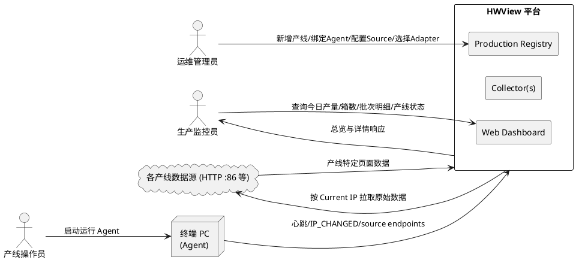
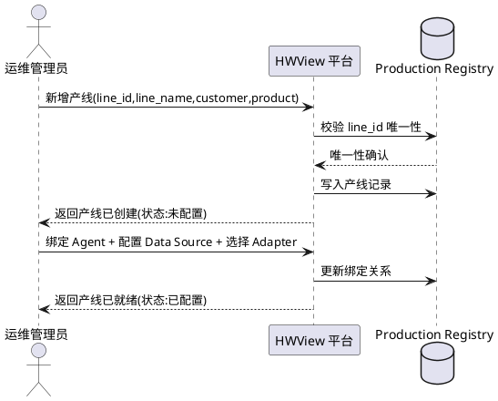
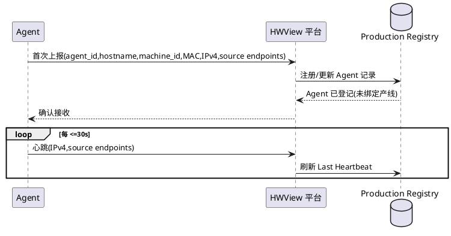
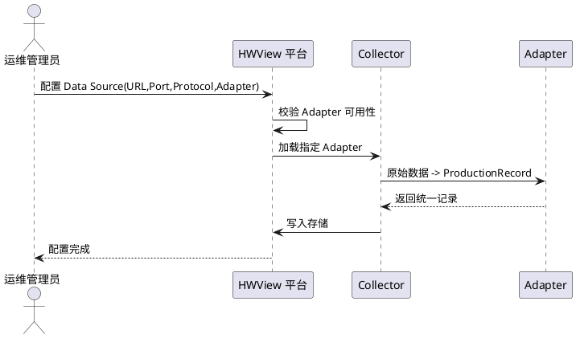
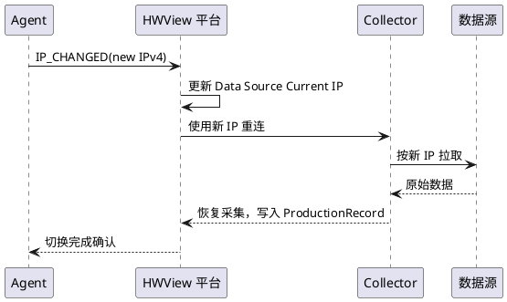
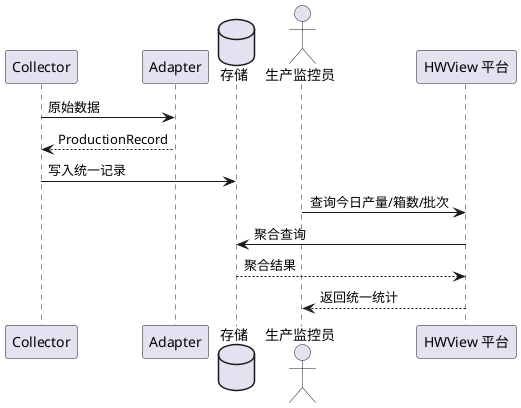
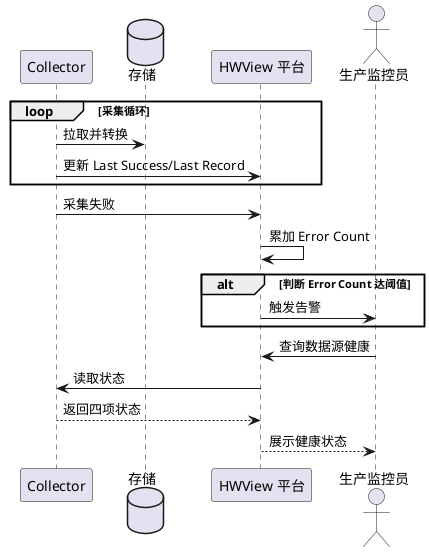
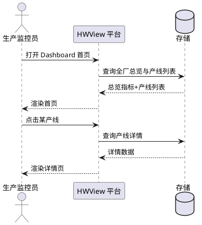
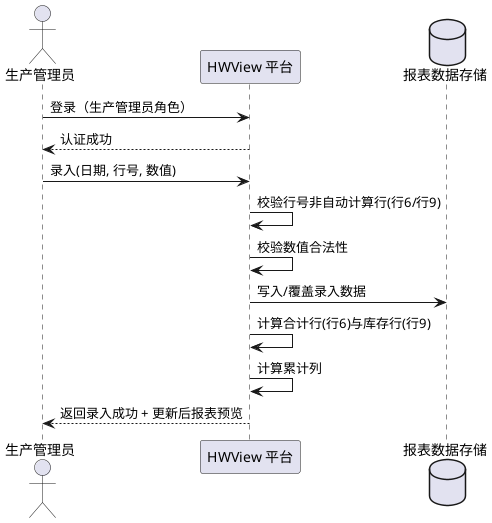
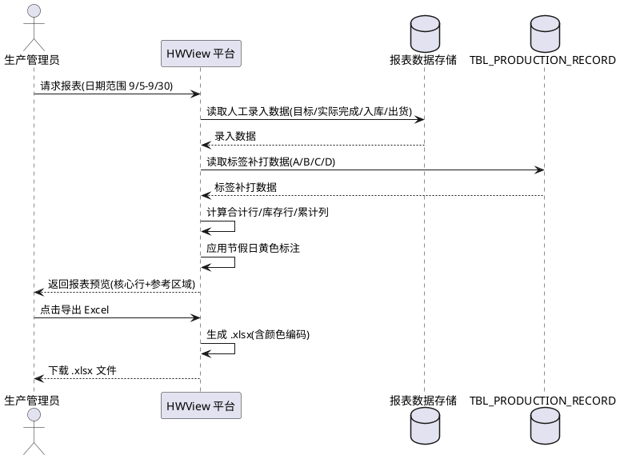

# HWView 多产线数据采集与可视化平台 需求规格说明书

> 文档定位：本文件描述 HWView 平台"要做什么"（业务行为、规则、验收条件），不描述"怎么做"（数据库表结构、类图、算法等实现细节由 design.md 承担）。
> 阶段：第一阶段需求规格设计（Spec-Driven Development）
> 核心定位：HWView — Production Data View & Collection Platform

---

# **1. 组件定位**

## **1.1 核心职责**
本组件负责 [采集与聚合] [多条产线的生产数据]，实现 [全工厂产线生产状态可视化与统一产量统计]。

## **1.2 核心输入**
1. **Agent 心跳与终端信息上报**：来源于部署在产线终端 PC 上的 Agent，内容包含 agent_id、hostname、machine_id、MAC、IPv4、source endpoints。
2. **Agent IP 变更事件（IP_CHANGED）**：来源于 Agent 在检测到本机 IPv4 变化时主动上报。
3. **各产线数据源原始数据**：来源于各产线终端上对外提供的 HTTP 页面服务（如 `:86` 端口），内容为该产线特定的页面结构数据（操作/条码/箱码/批次/创建时间等，不同产线字段不同）。
4. **运维管理员的配置指令**：来源于运维人员通过管理接口下发的产线新增、Agent 绑定、数据源配置、Adapter 选择等操作。
5. **Dashboard 用户的查询请求**：来源于生产监控人员通过 Web 界面发起的今日产量、箱数、批次明细、产线状态等查询。

## **1.3 核心输出**
1. **统一的 ProductionRecord 写入存储**：目标为平台内部生产记录存储，内容为标准化后的 line_id/source_id/product_code/barcode/batch_no/quantity/created_at。
2. **Dashboard 响应数据**：目标为浏览器端监控界面，内容为产线监控总览（今日总产量、今日箱数、在线产线数、数据源数）与单产线详情（当前终端、当前 IP、Agent 状态、数据源状态、今日箱数、今日只数、批次明细）。
3. **数据源健康状态与告警**：目标为运维监控渠道，内容为 Collector 的 Last Success、Last Record、Error Count、Sync Status 及异常告警。
4. **Collector 采集控制指令**：目标为内部采集器，内容为根据 Production Source 当前 IP 触发的重新连接指令。

## **1.4 职责边界**
本组件**不负责**以下事项，以防止职责蔓延：
1. **不负责**将某客户网页的具体 DOM 解析规则（如 `quantity = td[2]`）写死在平台核心中——该能力由可插拔的 Source Adapter 承担。
2. **不负责**对终端机器操作系统级别的资源监控（CPU/内存/磁盘等）——Agent 仅上报身份与网络信息及数据源可达性。
3. **不负责**替代各产线的 MES/ERP 业务系统——HWView 只做数据采集、聚合与可视化，不做生产排程、工艺下发等业务。
4. **不负责**Agent 进程的安装、升级与卸载——由独立部署流程承担。
5. **不负责**对原始数据做跨客户的业务语义翻译（如把 BMW 的"工单"语义化为华为的"批次"）——仅做字段映射到统一 ProductionRecord 的结构对齐。

---

# **2. 领域术语**

**Production Line（产线）**
: 一条逻辑独立的生产线单元，由 line_id 唯一标识，归属于某客户与某产品，绑定一个或多个 Data Source 与一个 Agent。
: 备注：示例包括 华为102复制线（HW102-COPY）、华为102 LINE（HW102-LINE）、BMW、舍弗勒（SCHAEFFLER）、麦格纳（MAGNA）。

**Agent（采集代理）**
: 部署在产线终端 PC 上的轻量进程，仅负责上报本机身份（hostname/machine_id/MAC/IPv4）与心跳，不绑定任何客户业务规则。
: 备注：同一台电脑换产线时无需重新开发 Agent。

**Source Adapter（数据源适配器）**
: 将某产线特定的原始页面数据结构转换为统一 ProductionRecord 的可插拔组件，按产线类型命名（如 Huawei102Adapter、BMWAdapter、SchaefflerAdapter、MagnaAdapter、GenericAdapter）。
: 备注：新增产线类型只需新增 Adapter，不改平台核心。

**ProductionRecord（生产记录）**
: 所有产线数据经 Adapter 转换后得到的统一结构化记录，是统计与可视化的唯一数据基础。

**Production Registry（产线注册中心）**
: 平台的总账，登记产线、Data Source、Agent、Collector 四类资源及其绑定关系，是新增产线的唯一入口。

**Collector（采集器）**
: 平台内部针对某 Data Source 执行实际拉取与转换的运行单元，维护采集状态（Last Success/Last Record/Error Count/Sync Status）。

**Data Source（数据源）**
: 一条产线上对外提供原始数据的端点，由 URL/Port/Protocol/Adapter 描述，其当前可达 IP 由所属 Agent 动态上报。

**Customer（客户）**
: 产线所属的外部客户实体（如 华为、BMW、舍弗勒、麦格纳）。

**Product（产品）**
: 产线所生产的产品型号（如 HW102）。

**IP_CHANGED 事件**
: Agent 检测到本机 IPv4 发生变化时向平台上报的事件，用于触发无感切换。

---

# **3. 角色与边界**

## **3.1 核心角色**
- **运维管理员**：负责新增产线、绑定 Agent、配置 Data Source、选择 Source Adapter，是 Production Registry 的主要操作者。
- **生产监控员**：通过 Web Dashboard 查看全厂产线生产总览与单产线详情，不修改配置。
- **产线操作员**：在产线终端 PC 上启动并运行 Agent，不直接与平台后端交互。

## **3.2 外部系统**
- **各产线数据源（HTTP 页面服务）**：上游被采集方，提供产线特定的原始页面数据（如 `:86` 端口）。
- **终端 PC（Agent 宿宿主）**：运行 Agent 的机器，其 IPv4 可能因 DHCP 动态变化。
- **未来扩展的客户产线系统**：BMW、舍弗勒、麦格纳及其他新增产线的原始数据系统，通过新增 Source Adapter 接入，不改核心。

## **3.3 交互上下文**



---

# **4. DFX约束**

## **4.1 性能**
1. **Dashboard 总览响应时间**：今日总览页加载响应时间必须 ≤ 2 秒（95 分位）。
2. **单产线详情响应时间**：产线详情页（含批次明细）加载响应时间必须 ≤ 3 秒（95 分位）。
3. **Agent 心跳处理吞吐**：平台必须支持 ≥ 100 个 Agent 并发心跳而不出现心跳堆积。
4. **采集延迟**：一条 ProductionRecord 从数据源可达到写入存储的端到端延迟必须 ≤ 10 秒。
5. **统计查询吞吐**：按日期/产线/客户/产品的聚合查询必须支持 ≥ 20 QPS。

## **4.2 可靠性**
1. **平台可用性目标**：核心采集与查询服务可用性必须 ≥ 99.5%（按月度统计）。
2. **Agent 心跳超时判定**：Agent 心跳超过 60 秒未上报时，必须标记该 Agent 为离线。
3. **Collector 故障隔离**：单个 Collector 异常必须不影响其他产线 Collector 的正常采集。
4. **数据源短暂不可达容错**：数据源单次拉取失败时，Collector 必须按重试策略重试并在连续失败达阈值时告警，不得丢弃已采集数据。
5. **IP 切换连续性**：IP_CHANGED 触发切换期间，已采集数据必须不丢失，切换完成时间必须 ≤ 30 秒。

## **4.3 安全性**
1. **管理接口认证**：Production Registry 的配置操作必须经过认证鉴权，匿名访问必须被拒绝。
2. **Dashboard 访问控制**：Dashboard 查询必须区分运维管理员与生产监控员权限，配置类操作仅运维管理员可执行。
3. **Agent 上报鉴权**：Agent 心跳与 IP_CHANGED 上报必须携带有效 agent_id 凭证，平台必须校验来源合法性。
4. **敏感信息保护**：终端机器的 MAC、IP 等网络标识信息在 Dashboard 展示时必须按权限脱敏或受限可见。
5. **操作审计**：产线新增、Agent 绑定、Data Source 配置变更必须记录审计日志，包含操作人、时间、变更内容。
6. **部署凭据管理**：部署服务器（192.168.2.110）的 OS 用户凭据（debian 用户及其 sudo 提权密码）必须通过环境变量或密钥管理方式注入，禁止以明文形式写入版本库、spec.md、design.md 或任何源代码文件。
   - 验收条件：[检查 spec.md/design.md/源代码/版本库] → [不出现 debian 用户密码与 sudo 密码的明文，仅出现占位符 `<DEPLOY_USER_PASSWORD>` 与 `<DEPLOY_SUDO_PASSWORD>`]
7. **特权操作审计**：通过 sudo 执行的系统级操作（服务注册、端口绑定 <1024、防火墙配置等）必须记录 sudo 审计日志，包含执行命令、提权用户、时间。

## **4.4 可维护性**
1. **结构化日志**：所有采集、切换、配置变更、异常必须输出结构化日志，包含 line_id、agent_id、timestamp、event_type 等可检索字段。
2. **关键监控指标**：必须暴露产线在线数、Collector 同步状态、采集错误计数、IP 切换次数等监控指标。
3. **链路追踪**：一次采集从拉取到写入 ProductionRecord 的全链路必须可追踪。
4. **新增产线零核心改动**：新增一条产线的标准操作必须仅通过 Production Registry 配置完成，禁止要求修改平台核心代码。
5. **Adapter 可独立新增**：新增 Source Adapter 必须可独立开发与注册，禁止要求改动已有 Adapter 或核心采集逻辑。

## **4.5 兼容性**
1. **产线数据格式差异兼容**：平台必须兼容不同产线原始页面字段结构差异（如华为102为操作/条码/箱码/批次/创建时间，BMW 为条码/数量/工单/产品/时间/状态，舍弗勒为 Serial/Part No/Qty/Order/Timestamp/Station），通过 Adapter 适配。
2. **DHCP 动态 IP 兼容**：平台必须兼容终端 IPv4 因 DHCP 动态变化的场景，无需人工修改配置即可维持采集连续性。
3. **Adapter 扩展兼容**：已接入产线的 Adapter 行为必须不因新增其他产线 Adapter 而改变。
4. **技术栈约束**：前端采用 React 18 + TypeScript(Strict) + Vite + React Query + Recharts；后端采用 Go + Gin；数据库表命名采用 `TBL_` 前缀加下划线分隔大写格式（如 `TBL_PRODUCTION_LINE`）。具体架构细节由 design.md 确定。
5. **命名规范约束**：项目命名采用大写字母加连字符风格；结构化命名采用带前缀和版本号的层级命名。

## **4.6 部署性**
1. **部署目标服务器规则**：HWView Server（Go+Gin 后端 + Web Dashboard 前端构建产物 + 数据库）必须部署在服务器 192.168.2.110 上，以普通用户 debian 运行，系统级操作通过 sudo 提权完成。
   - 验收条件：[部署 HWView Server] → [服务运行于 192.168.2.110 的 debian 用户下，系统级操作经 sudo 提权]
2. **Agent 部署位置规则**：Agent 必须部署在各产线终端机器上，禁止部署在 192.168.2.110 服务器上。
   - 验收条件：[部署 Agent] → [Agent 运行于产线终端 PC，而非 192.168.2.110]
3. **部署自动化规则**：部署过程应当支持自动化，必须提供 systemd 服务单元与部署脚本，禁止要求纯手工逐步操作。
   - 验收条件：[执行部署] → [通过部署脚本与 systemd 单元完成服务注册与开机自启]
4. **系统级操作提权规则**：端口绑定 <1024、服务注册、防火墙配置等系统级操作必须通过 sudo 提权完成，禁止以 root 身份长期运行服务进程。
   - 验收条件：[HWView Server 需绑定 <1024 端口或注册系统服务] → [通过 sudo 提权完成配置，服务进程以 debian 用户运行]
5. **凭据注入规则**：部署所需凭据（`<DEPLOY_USER_PASSWORD>`、`<DEPLOY_SUDO_PASSWORD>`）必须通过部署时环境变量或密钥管理注入，禁止硬编码于部署脚本或文档。
   - 验收条件：[部署脚本与文档检查] → [凭据以占位符表示，实际值由部署环境变量注入]
6. **禁止项**：禁止将部署服务器凭据明文记录于任何文档或版本库。
   - 验收条件：[文档与版本库审查] → [不出现明文密码，仅出现占位符]

---

# **5. 核心能力**

## **5.1 产线注册与管理**

### **5.1.1 业务规则**
1. **产线唯一标识规则**：每条产线必须拥有全局唯一的 line_id，line_id 不可重复且不可变更。
   - 验收条件：[运维管理员新增产线时提交已存在的 line_id] → [平台拒绝创建并返回唯一性冲突错误]
2. **产线必填属性规则**：新增产线必须提供 line_id、line_name、customer、product 四项基础属性。
   - 验收条件：[新增产线缺少任一必填属性] → [平台拒绝创建并明确指出缺失字段]
3. **产线绑定规则**：一条产线必须绑定至少一个 Data Source 与一个 Agent 方可进入采集状态。
   - 验收条件：[产线未完成 Agent 与 Data Source 绑定时] → [该产线状态为"未配置"，Collector 不启动]
4. **产线扩展规则**：新增 BMW、舍弗勒、麦格纳等产线必须仅通过 Production Registry 配置完成，禁止修改平台核心代码。
   - 验收条件：[运维管理员通过 Registry 新增产线并完成绑定与 Adapter 选择] → [新产线可被采集与统计，核心代码无变更]
5. **禁止项**：禁止将客户专属业务规则（如华为102的 quantity 取值方式）写入平台核心。
   - 验收条件：[新增非华为产线] → [平台核心采集与统计逻辑不出现该客户专属硬编码]

### **5.1.2 交互流程**


### **5.1.3 异常场景**
1. **line_id 冲突**
   - 触发条件：新增产线时 line_id 已存在
   - 系统行为：拒绝创建，记录审计日志
   - 用户感知：错误提示"产线标识已存在"
2. **必填属性缺失**
   - 触发条件：新增产线缺少 line_name/customer/product 任一项
   - 系统行为：拒绝创建并标识缺失字段
   - 用户感知：错误提示明确缺失字段列表
3. **绑定关系不完整**
   - 触发条件：产线仅绑定 Agent 或仅配置 Data Source
   - 系统行为：产线状态保持"未配置"，不启动 Collector
   - 用户感知：产线详情显示"配置未完成，采集未启动"

## **5.2 Agent 管理与动态发现**

### **5.2.1 业务规则**
1. **Agent 身份唯一规则**：每个 Agent 必须拥有唯一 agent_id，且必须上报 hostname、machine_id、MAC 用于身份识别。
   - 验收条件：[两个 Agent 上报相同 agent_id] → [平台拒绝后者并告警]
2. **Agent 客户无关规则**：Agent 必须不绑定任何客户业务规则，仅上报"我是这台机器，我现在在哪里"。
   - 验收条件：[同一台 PC 从产线 A 调拨到产线 B] → [Agent 无需重新开发，仅由平台侧重新绑定产线]
3. **Agent 心跳规则**：Agent 必须周期性上报心跳，心跳间隔必须 ≤ 30 秒。
   - 验收条件：[Agent 正常运行] → [平台持续收到心跳，Agent 状态为在线]
4. **Agent 离线判定规则**：Agent 心跳超过 60 秒未上报时，平台必须将其标记为离线。
   - 验收条件：[Agent 心跳中断 > 60 秒] → [Agent 状态变为离线，相关 Collector 标记数据源不可达]
5. **Agent 动态发现规则**：平台必须依据 Agent 上报的 source endpoints 与身份信息，由 Production Registry 决定该 Agent 属于哪条产线、采集什么、使用哪个 Parser。
   - 验收条件：[新 Agent 首次上报身份] → [平台在 Registry 中建立 Agent 记录，等待运维绑定产线]
6. **禁止项**：禁止在 Agent 中内置任何产线数据解析逻辑。
   - 验收条件：[产线数据格式变更] → [Agent 无需变更，仅对应 Adapter 变更]

### **5.2.2 交互流程**


### **5.2.3 异常场景**
1. **Agent 身份冲突**
   - 触发条件：两个 Agent 上报相同 agent_id
   - 系统行为：保留先注册者，拒绝后者并告警审计
   - 用户感知：后者 Agent 收到"身份冲突"错误
2. **Agent 离线**
   - 触发条件：心跳中断 > 60 秒
   - 系统行为：标记离线，关联 Collector 暂停采集并告警
   - 用户感知：Dashboard 该产线显示"Agent 离线"
3. **未知 Agent 首次上报**
   - 触发条件：Registry 中无该 agent_id
   - 系统行为：自动登记为待绑定 Agent，等待运维分配产线
   - 用户感知：Registry 待绑定列表出现新 Agent

## **5.3 数据源配置与适配**

### **5.3.1 业务规则**
1. **Data Source 描述规则**：每个 Data Source 必须由 URL、Port、Protocol、Adapter 四要素完整描述。
   - 验收条件：[配置 Data Source 缺少任一要素] → [平台拒绝保存并指出缺失项]
2. **Adapter 插件化规则**：Source Adapter 必须以可插拔方式注册，平台核心必须不依赖任一具体 Adapter 的实现。
   - 验收条件：[新增产线类型 Adapter] → [平台核心代码无变更，新 Adapter 可独立加载]
3. **Adapter 选择规则**：一条 Data Source 必须绑定一个 Adapter，Adapter 负责将该产线原始数据转换为统一 ProductionRecord。
   - 验收条件：[Collector 拉取到原始数据] → [经绑定 Adapter 转换为结构合法的 ProductionRecord]
4. **Adapter 命名规则**：Adapter 必须按产线类型命名，必须提供 Huawei102Adapter、Huawei102LineAdapter、BMWAdapter、SchaefflerAdapter、MagnaAdapter、GenericAdapter 至少六类。
   - 验收条件：[运维选择未提供的 Adapter] → [平台拒绝并提示可用 Adapter 列表]
5. **禁止项**：禁止将 `quantity = td[2]` 等具体解析规则写入平台核心。
   - 验收条件：[华为102页面结构变更] → [仅 Huawei102Adapter 变更，核心不变]

### **5.3.2 交互流程**


### **5.3.3 异常场景**
1. **Adapter 不存在**
   - 触发条件：选择的 Adapter 未在平台注册
   - 系统行为：拒绝配置，返回可用 Adapter 列表
   - 用户感知：错误提示"Adapter 不可用"
2. **Adapter 转换失败**
   - 触发条件：Adapter 转换产出非法 ProductionRecord
   - 系统行为：Collector 计入错误计数，丢弃该条并告警
   - 用户感知：Dashboard 该产线显示"采集异常"
3. **Data Source 不可达**
   - 触发条件：Data Source 的 URL/Port 无法连接
   - 系统行为：Collector 标记数据源不可达，按重试策略重试
   - 用户感知：Dashboard 该产线显示"数据源不可达"

## **5.4 数据采集与 IP 自动切换**

### **5.4.1 业务规则**
1. **采集触发规则**：产线状态为"已配置"且 Agent 在线且 Data Source 可达时，Collector 必须启动并周期性拉取原始数据。
   - 验收条件：[产线就绪且 Agent 在线且数据源可达] → [Collector 持续采集并产出 ProductionRecord]
2. **统一记录规则**：无论原始数据格式如何，所有采集结果必须经 Adapter 转换为统一 ProductionRecord 结构（line_id/source_id/product_code/barcode/batch_no/quantity/created_at）。
   - 验收条件：[Collector 采集到 BMW 原始数据] → [经 BMWAdapter 转换为含 line_id 的 ProductionRecord]
3. **IP_CHANGED 上报规则**：Agent 检测到本机 IPv4 变化时必须主动上报 IP_CHANGED 事件。
   - 验收条件：[终端 IPv4 由 DHCP 变更] → [Agent 上报 IP_CHANGED，平台更新 Data Source 的 Current IP]
4. **无感切换规则**：IP_CHANGED 触发后，Collector 必须自动使用新 IP 重新连接继续采集，禁止要求人工修改配置。
   - 验收条件：[IP_CHANGED 上报] → [Collector 自动重连，用户无感知，采集连续性恢复]
5. **切换期间数据不丢规则**：IP 切换期间已采集的数据必须不丢失，切换完成时间必须 ≤ 30 秒。
   - 验收条件：[IP 切换过程] → [切换前已采集数据完整保留，30 秒内恢复采集]
6. **禁止项**：禁止在 IP 变化时要求人工修改 Data Source 配置。
   - 验收条件：[DHCP 导致 IP 变化] → [配置自动更新，无需人工干预]

### **5.4.2 交互流程**


### **5.4.3 异常场景**
1. **IP 切换期间数据源持续不可达**
   - 触发条件：新 IP 仍无法连接数据源
   - 系统行为：Collector 持续重试并告警，保留切换前数据
   - 用户感知：Dashboard 显示"切换中-数据源不可达"
2. **切换超时**
   - 触发条件：切换超过 30 秒未恢复
   - 系统行为：标记切换超时告警，等待 Agent 下一次心跳
   - 用户感知：Dashboard 显示"IP 切换超时"
3. **采集过程中 Adapter 异常**
   - 触发条件：Adapter 转换抛出异常
   - 系统行为：Collector 计入错误计数，跳过该条并继续采集下一条
   - 用户感知：Dashboard 错误计数增加

## **5.5 统一生产记录与统计**

### **5.5.1 业务规则**
1. **统一结构规则**：所有产线数据必须最终转换为统一 ProductionRecord，字段包含 line_id、source_id、product_code、barcode、batch_no、quantity、created_at。
   - 验收条件：[任一产线采集完成] → [存储中写入符合统一结构的 ProductionRecord]
2. **每日产量统计规则**：平台必须按日期与产线维度统计每日生产数量（只数）。
   - 验收条件：[查询某产线今日产量] → [返回该产线当日 ProductionRecord 的 quantity 累加值]
3. **每日箱数统计规则**：平台必须按日期与产线维度统计今日箱数。
   - 验收条件：[查询某产线今日箱数] → [返回该产线当日不同箱码的计数]
4. **批次统计规则**：平台必须按日期与产线维度统计批次数与批次明细。
   - 验收条件：[查询某产线批次明细] → [返回该产线当日各批次及其产量明细]
5. **跨产线统一统计规则**：BMW 与华为虽原始网页不同，必须都能按 日期/产线/客户/产品/箱数/生产数量 统一统计。
   - 验收条件：[查询全厂今日总产量] → [返回所有产线 ProductionRecord 的统一聚合结果]
6. **禁止项**：禁止在统计层保留产线专属字段名（如 Serial/Part No）。
   - 验收条件：[统计输出] → [仅出现统一 ProductionRecord 字段]

### **5.5.2 交互流程**


### **5.5.3 异常场景**
1. **Adapter 转换产出非法记录**
   - 触发条件：ProductionRecord 缺失必填字段或字段格式非法
   - 系统行为：拒绝写入，计入错误计数并告警
   - 用户感知：Dashboard 该条记录标记"转换失败"
2. **统计查询超时**
   - 触发条件：聚合查询超过性能阈值
   - 系统行为：返回已缓存的部分结果并提示超时
   - 用户感知：Dashboard 提示"统计查询超时，显示部分数据"

## **5.6 数据源健康监控**

### **5.6.1 业务规则**
1. **Collector 状态记录规则**：每个 Collector 必须维护 Last Success、Last Record、Error Count、Sync Status 四项状态。
   - 验收条件：[Collector 运行中] → [四项状态实时更新并可查询]
2. **健康状态暴露规则**：Dashboard 必须暴露每个数据源的健康状态（正常/采集异常/不可达/切换中）。
   - 验收条件：[数据源状态变化] → [Dashboard 实时反映新状态]
3. **错误计数与告警规则**：Collector 连续采集失败达阈值时必须触发告警。
   - 验收条件：[连续失败次数达阈值] → [触发告警并标记数据源异常]
4. **Agent 状态联动规则**：Agent 离线时，其关联 Data Source 必须标记为不可达。
   - 验收条件：[Agent 离线] → [关联数据源状态变为不可达，Collector 暂停采集]
5. **禁止项**：禁止在数据源恢复可达后要求人工手动重启 Collector。
   - 验收条件：[数据源恢复可达] → [Collector 自动恢复采集]

### **5.6.2 交互流程**


### **5.6.3 异常场景**
1. **数据源长时间不可达**
   - 触发条件：数据源不可达持续超过告警阈值
   - 系统行为：持续告警，Dashboard 标记该产线异常
   - 用户感知：Dashboard 该产线显示"数据源长时间不可达"
2. **错误计数激增**
   - 触发条件：短时间内 Error Count 异常增长
   - 系统行为：触发告警，提示检查数据源或 Adapter
   - 用户感知：Dashboard 告警"采集错误激增"
3. **状态更新延迟**
   - 触发条件：Collector 状态更新延迟超过阈值
   - 系统行为：标记 Collector 状态陈旧并告警
   - 用户感知：Dashboard 提示"状态可能不准确"

## **5.7 Web Dashboard 产线监控总览**

### **5.7.1 业务规则**
1. **总览首页规则**：Dashboard 首页必须展示今日总产量、今日箱数、在线产线数、数据源数四项全厂总览指标。
   - 验收条件：[监控员打开 Dashboard 首页] → [展示四项全厂总览指标]
2. **产线列表规则**：首页必须展示各产线列表，每条产线显示产线名、今日产量、状态。
   - 验收条件：[首页加载完成] → [产线列表展示所有已注册产线及其今日产量与状态]
3. **产线详情规则**：点击某产线必须进入详情页，展示当前终端、当前 IP、Agent 状态、数据源状态、今日箱数、今日只数、批次明细。
   - 验收条件：[监控员点击某产线] → [进入详情页展示六类信息]
4. **实时性规则**：Dashboard 产线状态与今日产量必须近实时反映采集进展。
   - 验收条件：[采集产出新记录] → [Dashboard 在近实时内更新对应产线指标]
5. **权限区分规则**：Dashboard 必须区分运维管理员与生产监控员权限，配置类操作仅运维管理员可见可执行。
   - 验收条件：[生产监控员尝试配置操作] → [操作被拒绝，提示权限不足]
6. **禁止项**：禁止在 Dashboard 首页展示某客户专属的非统一字段。
   - 验收条件：[首页展示] → [仅展示统一 ProductionRecord 衍生的指标]

### **5.7.2 交互流程**


### **5.7.3 异常场景**
1. **总览查询超时**
   - 触发条件：总览聚合查询超过 2 秒
   - 系统行为：返回部分数据并提示加载延迟
   - 用户感知：首页提示"部分数据加载中"
2. **产线详情查询超时**
   - 触发条件：详情查询超过 3 秒
   - 系统行为：返回已得数据并提示超时
   - 用户感知：详情页提示"部分明细加载超时"
3. **权限不足访问**
   - 触发条件：生产监控员访问配置功能
   - 系统行为：拒绝访问并审计
   - 用户感知：提示"权限不足"

---

# **6. 数据约束**

> 说明：本章节定义核心领域对象的逻辑约束（业务含义、取值范围、格式、关联、唯一性、必填性），不定义数据库字段类型与存储方式。

## **6.1 Production Line（产线）**
1. **line_id**：产线全局唯一标识，必填，不可变更，格式为大写字母加连字符（如 HW102-COPY、HW102-LINE、BMW、SCHAEFFLER、MAGNA）。
2. **line_name**：产线显示名称，必填，简体中文可读名称（如"华为102复制线"）。
3. **customer**：产线所属客户，必填，取值为已登记客户实体（如 华为、BMW、舍弗勒、麦格纳）。
4. **product**：产线生产的产品型号，必填（如 HW102）。
5. **绑定关系**：必须绑定至少一个 Data Source 与一个 Agent 方可进入采集。
6. **状态**：取值范围为 未配置 / 已配置 / 采集中 / 异常 之一。

## **6.2 Agent（采集代理）**
1. **agent_id**：Agent 全局唯一标识，必填，不可变更。
2. **hostname**：Agent 宿主主机名，必填，由终端操作系统上报。
3. **machine_id**：终端机器唯一标识，必填，用于跨 IP 变化识别同一机器。
4. **MAC**：终端网卡 MAC 地址，必填，用于辅助机器识别。
5. **IPv4**：终端当前 IPv4 地址，必填，可随 DHCP 动态变化。
6. **heartbeat**：最近一次心跳时间戳，必填，超过 60 秒判定离线。
7. **source endpoints**：本机提供的数据源端点列表，必填，供平台发现与采集。
8. **客户绑定**：Agent 必须不内置任何客户业务规则，产线归属由平台侧决定。

## **6.3 Data Source（数据源）**
1. **source_id**：数据源全局唯一标识，必填。
2. **url**：数据源访问 URL，必填。
3. **port**：数据源端口，必填，取值为有效端口号（如 86）。
4. **protocol**：数据源访问协议，必填（如 HTTP）。
5. **adapter**：绑定的 Source Adapter 标识，必填，取值为已注册 Adapter 之一。
6. **current_ip**：数据源当前可达 IP，必填，由所属 Agent 动态上报，可随 IP_CHANGED 更新。
7. **所属产线**：必须归属于一条 Production Line。

## **6.4 ProductionRecord（生产记录）**
1. **line_id**：记录所属产线标识，必填，必须对应已注册产线。
2. **source_id**：记录来源数据源标识，必填，必须对应已配置数据源。
3. **product_code**：产品编码，必填，由 Adapter 从原始数据映射得到。
4. **barcode**：条码，必填，由 Adapter 映射得到。
5. **batch_no**：批次号，必填，由 Adapter 映射得到。
6. **quantity**：数量（只数），必填，取值为非负整数，由 Adapter 映射得到。
7. **created_at**：记录创建时间，必填，取值为有效时间戳。
8. **统一性**：所有产线记录必须符合本结构，禁止出现产线专属字段。

## **6.5 Collector（采集器）**
1. **所属 Data Source**：必填，一个 Collector 对应一个 Data Source。
2. **last_success**：最近一次成功采集时间戳，必填。
3. **last_record**：最近一条 ProductionRecord 时间戳，必填。
4. **error_count**：累计采集错误计数，必填，取值为非负整数。
5. **sync_status**：同步状态，必填，取值范围为 正常 / 采集中 / 异常 / 不可达 / 切换中 之一。

## **6.6 Production Registry（产线注册中心）**
1. **登记对象**：必须登记 Production Line、Data Source、Agent、Collector 四类资源。
2. **绑定关系**：必须维护产线与 Data Source、产线与 Agent、Data Source 与 Adapter、Data Source 与 Collector 的绑定关系。
3. **新增产线约束**：新增产线必须仅通过 Registry 配置完成，禁止要求修改平台核心代码。
4. **审计要求**：所有资源配置变更必须记录审计日志。

---

# **7. 利益相关者与假设**

## **7.1 利益相关者**
1. **运维管理员**：关注产线快速接入、IP 变化无感切换、新增产线零核心改动。
2. **生产监控员**：关注 Dashboard 全厂总览与单产线详情的实时性与准确性。
3. **产线操作员**：关注 Agent 部署简单、换产线无需重开发。
4. **工厂管理层**：关注跨客户跨产线的统一产量统计与产能可视化。
5. **未来客户（BMW/舍弗勒/麦格纳等）**：关注其产线数据格式差异被兼容接入。

## **7.2 约束与假设**
1. **约束 C1**：各产线终端 IPv4 可能因 DHCP 动态变化，平台必须兼容该场景。
2. **约束 C2**：不同产线原始页面字段结构可能完全不同，平台必须通过 Adapter 兼容。
3. **约束 C3**：新增产线必须仅通过配置完成，禁止修改平台核心代码。
4. **约束 C4**：前端技术栈为 React 18 + TypeScript(Strict) + Vite + React Query + Recharts；后端技术栈为 Go + Gin；数据库表命名采用 `TBL_` 前缀加下划线分隔大写格式。
5. **约束 C5**：项目命名采用大写字母加连字符风格；结构化命名采用带前缀和版本号的层级命名。
6. **假设 A1**：各产线数据源可通过 HTTP 协议访问且提供可被拉取的页面数据。
7. **假设 A2**：Agent 可部署在产线终端 PC 并能获取本机 hostname/MAC/IPv4。
8. **假设 A3**：同一台终端同一时刻仅服务于一条产线（调拨产线时先解绑再重绑）。
9. **假设 A4**：各 Adapter 可独立开发并按产线类型命名注册。
10. **约束 C6（部署环境）**：HWView Server 部署目标服务器为 192.168.2.110，OS 用户为 debian（普通用户，需通过 sudo 提权执行系统级操作）；该服务器承载 Go+Gin 后端、Web Dashboard 前端构建产物与数据库；Agent 部署在各产线终端机器上而非此服务器。
11. **约束 C7（部署凭据安全）**：部署服务器存在 debian 用户凭据与 sudo 提权凭据，其实际值必须通过部署时环境变量或密钥管理注入，文档中以占位符 `<DEPLOY_USER_PASSWORD>`、`<DEPLOY_SUDO_PASSWORD>` 表示，禁止明文存储。
12. **约束 C8（部署自动化）**：部署过程必须支持自动化（systemd 服务单元 + 部署脚本），禁止纯手工部署。
13. **假设 A5**：部署服务器 192.168.2.110 已预装 Debian 系 Linux，debian 用户已具备 sudo 提权权限，且平台运行所需端口未被占用。

---

# **8. 第一阶段核心能力覆盖矩阵**

| 编号 | 第一阶段核心能力 | 对应章节 |
|------|------------------|----------|
| ① | 多产线 | 5.1 产线注册与管理 |
| ② | 多数据源 | 5.3 数据源配置与适配 |
| ③ | Agent 动态发现终端 IP | 5.2 Agent 管理与动态发现 |
| ④ | Source Adapter 插件化 | 5.3 数据源配置与适配 |
| ⑤ | 统一 ProductionRecord | 5.5 统一生产记录与统计 |
| ⑥ | 每日产量/箱数/批次统计 | 5.5 统一生产记录与统计 |
| ⑦ | 数据源健康监控 | 5.6 数据源健康监控 |
| ⑧ | IP 变化自动切换 | 5.4 数据采集与 IP 自动切换 |
| ⑨ | Web Dashboard | 5.7 Web Dashboard 产线监控总览 |
| ⑩ | 后续可增加产线不改核心架构 | 5.1 产线注册与管理 + 4.4 可维护性 |

---

# **9. EV1 设计基线（Multi-Line Production Data Foundation）**

> 本章记录 PM 下发的 EV1 设计基线，作为需求验收条件的组成部分。EV1 状态：AUTHORIZED。

## **9.1 架构组件基线**

HWView 平台由以下四大组件构成，组件边界必须严格遵守：

| 组件 | 职责 | 包含子模块 |
|------|------|------------|
| **hwview-server** | 平台服务端，承载注册中心、记录存储、统计与 API | Production Line Registry / Data Source Registry / Production Record Store / Statistics Engine / REST API |
| **hwview-collector** | 采集器，执行调度、解析、增量采集、去重与健康监控 | Scheduler / Source Resolver / Adapter Runtime / Incremental Collector / Deduplication / Health Monitor |
| **adapters** | 可插拔数据源适配器集合 | Huawei102Adapter / Huawei102LineAdapter / BMWAdapter / SchaefflerAdapter / MagnaAdapter |
| **hwview-agent** | 终端代理，负责设备身份与 IP 变化上报 | Machine Identity / IPv4 Detection / Heartbeat / IP Change Reporting |

## **9.2 核心原则**
1. **身份分离原则**：Line 是业务身份，Agent 是设备身份，IP 是动态位置，Adapter 是数据源协议，四者必须严格分离，禁止混用。
2. **IP 禁止硬编码原则**：绝不允许把 `192.168.30.2` 等具体 IP 写死在 Collector 业务代码里。
   - 验收条件：[Collector 核心代码审查] → [不出现任何具体终端 IP 硬编码，IP 仅作为 Data Source 的可变属性读取]
3. **Adapter 与 Core 解耦原则**：核心 Collector 只认识 Adapter Interface，禁止任何具体 Adapter 逻辑进入 Collector Core。

## **9.3 数据模型冻结（3 张表字段基线）**

> 表名遵循 `TBL_` 前缀加下划线分隔大写命名规范。本节为逻辑字段基线，物理类型与索引由 design.md 确定。

### **9.3.1 TBL_PRODUCTION_LINE（产线表）**
| 字段 | 业务含义 |
|------|----------|
| id | 主键 |
| line_code | 产线编码（唯一，如 HW102-COPY） |
| line_name | 产线显示名称（如 华为102复制线） |
| customer | 客户 |
| product | 产品 |
| adapter_type | 绑定的 Adapter 类型（如 Huawei102Adapter） |
| enabled | 是否启用 |
| created_at | 创建时间 |
| updated_at | 更新时间 |

- 首条真实产线基线：line_code=HW102-COPY / line_name=华为102复制线 / adapter_type=Huawei102Adapter
- 验收条件：[EV1 交付] → [TBL_PRODUCTION_LINE 至少支持 HW102-COPY/HW102-LINE/BMW/SCHAEFFLER/MAGNA 五条产线配置]

### **9.3.2 TBL_DATA_SOURCE（数据源表）**
| 字段 | 业务含义 |
|------|----------|
| id | 主键 |
| line_id | 所属产线 |
| agent_id | 所属 Agent |
| hostname | 终端主机名 |
| current_ip | 当前可达 IP（**可变属性**） |
| port | 端口 |
| base_path | 访问基路径 |
| enabled | 是否启用 |
| status | 数据源状态 |
| last_success_at | 最近成功采集时间 |
| last_error_at | 最近错误时间 |

- **关键约束**：current_ip 必须是可变属性，可随 IP_CHANGED 事件更新。
- 验收条件：[Agent 上报 IP_CHANGED] → [TBL_DATA_SOURCE.current_ip 更新为新 IP，无需人工干预]

### **9.3.3 TBL_PRODUCTION_RECORD（生产记录表）**
| 字段 | 业务含义 |
|------|----------|
| id | 主键 |
| line_id | 所属产线 |
| source_id | 数据源端点标识 |
| barcode | 条码 |
| quantity | 数量（只数） |
| batch_no | 批次号 |
| created_at | 记录创建时间 |
| production_date | 生产日期 |
| collected_at | 采集入库时间 |

- **关键约束**：UNIQUE(line_id, source_id) —— Collector 反复扫描同一天数据也不产生重复记录。
- 验收条件：[Collector 对同一 (line_id, source_id) 重复采集] → [不产生重复记录，仅保留首次入库]

## **9.4 Incremental Collection 设计（EV1 最大变化）**

**背景基线**：已证明 09:xx→15:xx(419)→17:16(433)，正式 Collector 不应每次重新处理 433 条。

1. **首次同步规则**：第一次同步读取历史数据 → 按 source_id 去重 → 写入 DB → 保存 Cursor。
   - 验收条件：[首次同步执行] → [历史数据全量入库并建立 Cursor]
2. **增量同步规则**：下一次同步时，已存在 source_id 必须 SKIP，仅对新 source_id 执行 INSERT。
   - 验收条件：[增量同步执行] → [已入库记录被跳过，仅新记录入库]
3. **可重复执行规则**：Incremental Collector 必须可重复执行且不重复入库。
   - 验收条件：[对同一数据多次执行 Collector] → [DB 中无重复记录]
4. **失败可继续规则**：中途失败的采集必须可从断点继续，不丢失已采集进度。
   - 验收条件：[采集中途失败后重启] → [从 Cursor 断点继续，已采集数据不丢不重]
5. **产线隔离规则**：单产线采集失败必须不影响其他产线采集。
   - 验收条件：[产线 A 采集失败] → [产线 B/C 正常采集]

## **9.5 Cursor 机制**

1. **Cursor 构成规则**：第一版 Cursor 必须采用 `last_created_at + last_source_id` 双键，以避免相同时间戳漏记录。
   - 验收条件：[存在多条 created_at 相同的记录] → [Cursor 通过 last_source_id 二级排序不漏采]
2. **Cursor 持久化规则**：Cursor 必须持久化存储，禁止仅存在于内存。
   - 验收条件：[Collector 重启] → [Cursor 从持久化存储恢复，继续增量采集]

---

# **10. EV1 任务清单**

> 9 项 TASK-HWV-EV1-xxx 作为需求验收条件纳入。每项含目标、Acceptance、禁止项。

## **10.1 TASK-HWV-EV1-001 Production Line Registry**
- **目标**：建立多产线注册模型，支持 HW102-COPY/HW102-LINE/BMW/SCHAEFFLER/MAGNA 及未来任意新增产线。
- **Acceptance**：≥5 条产线配置能力；新增产线无需修改 Collector 核心代码。
- **禁止项**：禁止 `if line == "华为102":` 业务硬编码。
- 验收条件：[配置第 6 条新产线] → [仅通过 Registry 配置完成，Collector 核心代码无变更]

## **10.2 TASK-HWV-EV1-002 Data Source Registry**
- **目标**：建立 line/hostname/agent_id/current_ip/port/base_path/adapter/enabled/health 管理。
- **Acceptance**：IP 必须是可变属性，可随 IP_CHANGED 更新。
- **禁止项**：禁止将 IP 作为固定常量。
- 验收条件：[IP_CHANGED 上报] → [current_ip 更新，Collector 自动使用新 IP]

## **10.3 TASK-HWV-EV1-003 ProductionRecord Schema**
- **目标**：保存 source_id/barcode/quantity/batch_no/created_at/production_date/line_id/collected_at。
- **Acceptance**：建立 UNIQUE(line_id, source_id)。
- **禁止项**：禁止允许重复 (line_id, source_id) 入库。
- 验收条件：[重复采集同一 (line_id, source_id)] → [入库被拒绝/跳过，唯一约束生效]

## **10.4 TASK-HWV-EV1-004 Adapter Interface**
- **目标**：定义统一 Adapter 接口。
- **接口基线**：discover() / fetch(start, end, cursor=None) / parse(response) / normalize(record)。
- **Acceptance**：核心 Collector 只认识 Adapter Interface，不依赖任何具体 Adapter 实现。
- **禁止项**：禁止 Collector Core 直接调用某具体 Adapter 的私有方法。
- 验收条件：[新增 Adapter 类型] → [Collector Core 代码无变更，通过 Interface 调用]

## **10.5 TASK-HWV-EV1-005 Huawei102Adapter**
- **目标**：把已验证逻辑产品化。
- **流程基线**：GET /Cron/Jili/lists/ → 日期过滤 → 分页发现 → 逐页抓取 → HTML Parse → source_id/barcode/quantity/batch_no/created_at。
- **Acceptance**：必须以 Golden Evidence（433 records / 5395 pieces）作为 Adapter Integration Test 的 Golden Evidence。
- **禁止项**：禁止将华为102解析逻辑放入 Collector Core。
- 验收条件：[Huawei102Adapter Integration Test] → [产出 433 records / 5395 pieces，与 Golden Evidence 一致]

## **10.6 TASK-HWV-EV1-006 Incremental Collector**
- **目标**：实现 Scheduler→Source Resolver→Adapter→Fetch→Normalize→Dedup→DB 增量采集链。
- **Acceptance**：可重复执行 / 不重复入库 / 中途失败可继续 / 单产线失败不影响其他产线。
- **禁止项**：禁止每次采集重复 INSERT；禁止全量重采。
- 验收条件：[多次执行 Incremental Collector] → [DB 无重复记录，进度从 Cursor 继续]

## **10.7 TASK-HWV-EV1-007 Production Statistics Engine**
- **目标**：统一计算 box_count/piece_count/first_production_at/last_production_at/batch_count。
- **公式冻结**：box_count = COUNT(DISTINCT source_id)；piece_count = SUM(quantity)。
- **Acceptance**：Golden Result 必须为 HW102-COPY / 2026-09-07 / boxes=433 / pieces=5395 / batch=Q0926-078。
- **禁止项**：禁止把记录数当产品数量（box_count ≠ record_count 除非一一对应；piece_count 必须用 SUM(quantity)）。
- 验收条件：[对 HW102-COPY 2026-09-07 数据统计] → [boxes=433, pieces=5395, batch=Q0926-078]

## **10.8 TASK-HWV-EV1-008 Scheduler**
- **目标**：实现可配置调度器。
- **基线**：默认 5 分钟，可配置 collection_interval。
- **特殊要求**：20:30 产线关机后，HWView 不能把当天数据显示成 0，必须保持 Last Successful Collection 并明确 Source Offline。
- **禁止项**：禁止 Source Offline 时将当日产量置 0。
- 验收条件：[产线 20:30 关机后查询当日产量] → [显示 Last Successful Collection 数据，状态标记 Source Offline]

## **10.9 TASK-HWV-EV1-009 Health Monitor**
- **目标**：每条产线状态监控。
- **状态基线**：ONLINE / DEGRADED / OFFLINE。
- **Acceptance**：至少记录 last_success_at / last_failure_at / consecutive_failures / last_error。
- **禁止项**：禁止仅用单一时间点判定产线健康。
- 验收条件：[产线连续失败] → [consecutive_failures 递增，状态转为 DEGRADED 或 OFFLINE]

---

# **11. Golden Evidence（黄金证据）**

> Golden Evidence 作为 Adapter Integration Test 与 Statistics Engine 的不可变验收基准。

| 维度 | 基准值 |
|------|--------|
| 产线 | HW102-COPY（华为102复制线） |
| 日期 | 2026-09-07 |
| 记录数（boxes） | 433 records |
| 生产数量（pieces） | 5395 pieces |
| 批次 | Q0926-078 |
| 用途 | Huawei102Adapter Integration Test + Production Statistics Engine 验收 |

1. **Golden Evidence 不可变规则**：Golden Evidence 一经冻结必须作为验收基准，禁止在未通过 PM 裁决情况下修改。
   - 验收条件：[Huawei102Adapter Integration Test 运行] → [产出与 Golden Evidence 完全一致]
2. **Statistics Golden Result 规则**：Production Statistics Engine 对 HW102-COPY / 2026-09-07 的统计结果必须为 boxes=433 / pieces=5395 / batch=Q0926-078。
   - 验收条件：[统计引擎运行] → [结果与 Golden Result 一致]

---

# **12. EV2 Agent 接口预定义**

> 本章仅定义 HWView-Agent 接口，不进入 EV1 实现。EV2 在 EV1 Evidence Gate 通过后启动。

## **12.1 Agent 部署位置**
- Windows 产线机器安装 HWView-Agent，负责 Machine UUID / Hostname / MAC / IPv4 / Heartbeat / IP Change 上报。

## **12.2 Agent 上报接口基线**
| 接口 | 说明 |
|------|------|
| Heartbeat | 周期上报 agent_id / hostname / machine_id / MAC / IPv4 / source endpoints |
| IP_CHANGED | 检测到 IPv4 变化时上报 IP_CHANGED(old, new) |

## **12.3 IP 变化处理流程**
1. 场景：xiai-PC 由 192.168.30.2 → 192.168.30.27。
2. Agent 上报 IP_CHANGED(old=192.168.30.2, new=192.168.30.27)。
3. Server 更新 TBL_DATA_SOURCE.current_ip。
4. Collector 自动恢复采集。
5. **约束**：DHCP 变化不导致产线采集配置失效。
   - 验收条件：[DHCP 导致 Agent IP 变化] → [采集配置不失效，Collector 自动恢复]

---

# **13. EV1 红线（明确禁止项）**

> 以下 8 项为 EV1 阶段明确禁止事项，违反任一项即判 EV1 不通过。

1. **禁止只支持华为102**：平台必须支持多产线，禁止仅适配单一客户。
   - 验收条件：[EV1 交付审查] → [支持 ≥5 条产线配置，非华为102 专属]
2. **禁止 IP 写死**：禁止将任何具体终端 IP 硬编码于业务代码。
   - 验收条件：[代码审查] → [无具体 IP 硬编码]
3. **禁止把记录数当产品数量**：piece_count 必须用 SUM(quantity)，禁止用记录条数代替。
   - 验收条件：[统计实现审查] → [piece_count = SUM(quantity)]
4. **禁止每次采集重复 INSERT**：必须增量采集 + 去重，禁止全量重复入库。
   - 验收条件：[重复采集审查] → [无重复记录入库]
5. **禁止 Source Offline = 今日产量 0**：产线关机时必须保留 Last Successful Collection，禁止将当日产量置 0。
   - 验收条件：[产线关机后查询] → [显示 Last Successful Collection，非 0]
6. **禁止 Adapter 逻辑进入 Collector Core**：Adapter 必须可插拔，禁止解析逻辑写入核心。
   - 验收条件：[Collector Core 审查] → [无任何具体 Adapter 解析逻辑]
7. **禁止为每条产线复制一套 Collector**：必须单一 Collector + 多 Adapter，禁止产线级 Collector 复制。
   - 验收条件：[架构审查] → [单一 Collector 实例服务多产线]
8. **禁止现在就做复杂 AI/预测**：EV1 聚焦数据采集基线，禁止引入 AI/预测能力。
   - 验收条件：[EV1 范围审查] → [无 AI/预测相关实现]

---

# **14. 执行顺序与 PM 裁决状态**

## **14.1 执行顺序**
EV1 任务必须按以下顺序执行，禁止乱序：

```text
EV1-001 → EV1-002 → EV1-003 → EV1-004 → EV1-005 → EV1-006 → EV1-007 → EV1-008 → EV1-009 → EV1 Evidence Gate → EV2 HWView-Agent
```

- 验收条件：[EV1 任务执行] → [严格按上述顺序推进，前置任务未通过不启动后续]

## **14.2 PM 裁决状态**

| 里程碑 | 内容 | 状态 |
|--------|------|------|
| HWView-EV0 | 真实数据源验证 | PASS / CLOSED |
| HWView-EV1 | Multi-Line Production Data Foundation | AUTHORIZED |
| 当前执行任务 | TASK-HWV-EV1-001 Production Line Registry | 进行中 |

## **14.3 EV1 主链优先规则**
- 先不要开始 Agent，必须先打通主链：ProductionLine Registry → DataSource Registry → ProductionRecord → Adapter → Incremental Collector。
- 验收条件：[EV1 推进] → [主链打通后方可启动 EV2 Agent 相关工作]

## **14.4 Evidence Gate 裁决规则**
- EV1 代码任务执行完，必须提交 commit / 测试结果 / 实际采集 Evidence。
- PM 按项目经理模式逐项裁决：PASS / CONDITIONAL PASS / HOLD。
- 验收条件：[每项 TASK 完成] → [提交 Evidence，由 PM 裁决并记录裁决结果]

---

# **15. EV1-R1 实采验证裁决（CLOSED）**

> R1 Shadow Deployment + Evidence Gate 已于 2026-09-08 完成，10 项 Evidence 全 PASS。

## **15.1 R1 Evidence Gate 结果**

| 编号 | Evidence 项 | 结果 |
|------|------------|------|
| R1-EG-01 | Source TCP/HTTP 可达 | PASS |
| R1-EG-02 | Adapter Fetch 成功 | PASS |
| R1-EG-03 | Parse ≥30 条 | PASS (30) |
| R1-EG-04 | Pagination 翻页 | PASS |
| R1-EG-05 | DB INSERT 成功 | PASS (30) |
| R1-EG-06 | Dedup 0 重复 | PASS |
| R1-EG-07 | Cursor upsert | PASS |
| R1-EG-08 | Idempotency 30→30 | PASS |
| R1-EG-09 | Shadow Stats 显示 | PASS |
| R1-EG-10 | Quantity FROZEN | PASS |

## **15.2 R1 修复记录**

| 任务 | 内容 | 文件 |
|------|------|------|
| R1-001 | Parse 选择器修复 `tbody tr` + source_id 从 printload URL 提取 | huawei102_adapter.go |
| R1-002 | Pagination 修复 `len(rawMaps) > 0 && "下一页" && page < 10` | huawei102_adapter.go |
| R1-003 | Cursor upsert 修复 First+Update/Create 替代 Save() | production_record_repo.go |
| R1-004 | 实采验证 fetched=300, inserted=30, 0 duplicates | 部署验证 |

---

# **16. EV1-R2 业务数量语义确认裁决（CLOSED）**

> R2 核心验证已完成。结论：**源系统 quantity 字段不是生产件数，而是补打标签数量。**

## **16.1 R2 验证数据**

### 2026-09-06 全量数据（17页，500条）

| 指标 | 值 | 说明 |
|------|-----|------|
| A (总记录数) | 530 | 含30条分页重复 |
| B (唯一条码) | 500 | 去重后 |
| C (唯一source_id) | 500 | 与B一致 |
| D (quantity求和) | 2609 | quantity值1-9 |
| 操作类型 | 全部"补打" | 530/530 = 100% |
| 条码序列范围 | 1~967 | 覆盖率51.7% |
| 时间范围 | 07:15~15:44 | 约8.5小时 |
| 批次 | Q0926-078 | 单一批次 |

### 业务台账对比

| 指标 | 09-06值 | E1=2000(完成) | E2=1980(入库) | E3=1680(出货) | E4=300(库存) |
|------|---------|---------------|---------------|---------------|--------------|
| B=500 | — | 0.25x | 0.25x | 0.30x | 1.67x |
| D=2609 | — | 1.30x | 1.32x | 1.55x | 8.70x |

**A/B/C/D 均不匹配 E1/E2/E3/E4 中的任何一个。**

## **16.2 R2 正式裁决**

| 项目 | 裁决 |
|------|------|
| `quantity` 是否为生产件数 | **否** |
| `quantity` 实际语义 | **补打标签数量** |
| A=530 | 技术事实，含30条分页重复 |
| B=500 | 唯一条码/需补打标签产品数 |
| C=500 | 唯一 source_id |
| D=2609 | 补打标签总数量 |
| 生产数量 E1 | **保持 FROZEN，不从此端点推导** |
| 数据源性质 | **Label Reprint Event Source** |
| R2 | **PASS / CLOSED** |

## **16.3 R2 衍量指标重定义**

B=500 不应称为"产量"，应定义为：
- **标签补打产品数**：500
- **标签补打事件数**：530
- **补打标签总数**：2609
- **标签补打覆盖率** = 500/967 ≈ 51.7%

## **16.4 R2-AMENDMENT（2026-09-08 新业务证据修正）**

> 本节为 R2 裁决的修正补充，基于 PM 于 2026-09-08 提供的新业务证据。
> 原 §16.2 裁决中"quantity = 补打标签数量"的语义判断需修正，但"quantity 不是生产件数"的核心结论保持正确。

### **16.4.1 新业务证据**

2026-09-07 的 `quantity=17` 业务语义已进一步明确：

| 项目 | 值 | 说明 |
|------|-----|------|
| `quantity` | 17 | **整箱数**（carton_count），非 17 件，亦非补打标签数 |
| 每箱标准装箱数 units_per_carton | 30 件/箱 | 标准装箱规格 |
| 散件数 loose_quantity | 9 件 | 不足一箱的散件 |
| 实际产出件数 actual_quantity | 519 件 | 17 × 30 + 9 = 519 |

**实际产出计算公式**：

```
actual_quantity = carton_count × units_per_carton + loose_quantity
              = 17 × 30 + 9 = 519
```

### **16.4.2 R2 裁决修正项**

| 项目 | 原裁决（§16.2） | 修正裁决（R2-AMENDMENT） |
|------|----------------|------------------------|
| `quantity` 是否为生产件数 | 否 | **否（保持）** |
| `quantity` 实际语义 | 补打标签数量 | **整箱数（carton_count）** |
| 实际产出件数推导 | 不从此端点推导 | **actual_quantity = carton_count × units_per_carton + loose_quantity** |
| 数据源性质 | Label Reprint Event Source | **Carton Count Event Source（整箱计数事件源）** |

### **16.4.3 对 R4 数据模型的影响**

R4 数据模型不能仅设计单一 `quantity` 字段，至少应包含以下字段：

| 字段名 | 业务含义 | 来源 |
|--------|---------|------|
| `carton_count` | 整箱数 | 源系统 quantity 字段 |
| `units_per_carton` | 每箱标准装箱数 | **业务配置（禁止硬编码）** |
| `loose_quantity` | 散件数 | 源系统或人工录入 |
| `actual_quantity` | 实际产出件数 | **自动计算** = carton_count × units_per_carton + loose_quantity |

### **16.4.4 关键约束**

1. **units_per_carton 配置化约束**：`units_per_carton`（每箱标准装箱数）**必须**作为业务配置/规格数据管理，**禁止**硬编码于源代码。
   - 验收条件：[源代码审查] → [不出现 `units_per_carton = 30` 或 `units_per_carton = 60` 等硬编码常量]
2. **装箱数歧义待 PM 裁决**：§18.2.3 品质部确认的"1 箱 = 60 只"与本证据的"30 件/箱"可能对应不同产品/场景，**必须**由 PM 进一步确认哪个是当前产线的标准装箱数。
   - 验收条件：[R4 实现前] → [PM 明确裁决当前产线 units_per_carton 取值，并写入业务配置]
3. **actual_quantity 自动计算约束**：`actual_quantity` 为计算字段，**必须**由公式自动计算，**禁止**人工录入。
   - 验收条件：[尝试人工录入 actual_quantity] → [拒绝并提示"该字段为系统自动计算"]
4. **R2 核心结论保持约束**：R2-AMENDMENT 不改变 R2 的核心结论"quantity 不是生产件数"，仅修正 quantity 的具体语义。
   - 验收条件：[报表"实际完成数量"行数据来源审查] → [仍不直接使用源系统 quantity 原值作为生产件数，需经 actual_quantity 公式转换]

---

# **17. EV1-R3 生产数据源探索裁决（CLOSED）**

> R3 目标：在 192.168.30.2 上寻找真实生产数据源。结论：**该服务器上不存在生产数量数据源。**

## **17.1 R3 探索结果**

### 端口扫描

| 端口 | 状态 | 内容 |
|------|------|------|
| 80 | OPEN | phpStudy 探针 2014（管理界面） |
| 86 | OPEN | ThinkPHP 3.2.3 应用（华为在线包装系统） |
| 其他 | closed | 81-89, 443, 800, 8080, 8443, 8888, 9090, 3000, 5000, 7000, 9000 均关闭 |

### 端点探索

| 端点 | HTTP | 说明 |
|------|------|------|
| /Cron/Jili/lists/ | 200 | **唯一数据端点**，标签补打记录列表 |
| /Cron/Jili/show/id/{id} | 200 | 包装扫描工位 UI（华为在线包装） |
| /Cron/Jili/printload | 200 | "参数有误"错误页 |
| /Cron/Jili/saveSuccess | 200 | POST 端点，保存扫描数据 |
| /Cron/Jili/savePackInfo | 200 | POST 端点，保存包装信息 |
| /Cron/Jili/print_wei | 200 | POST 端点，打印尾箱 |
| /Cron/Jili/scan | 200 | 空响应（0 bytes） |
| /Cron/Jili/get/id/{id} | 200 | 空响应（0 bytes） |
| 其他 40+ 端点 | 404 | 不存在 |

### 过滤参数测试

| 参数 | 结果 |
|------|------|
| is_rework/0 | 无效，返回全部 144,874 条 |
| is_rework/2 | 无效，同上 |
| type/0, type/1 | 无效，同上 |
| op/初打 | 无效，同上 |

**所有过滤参数被忽略，系统仅支持日期范围过滤。**

### show 页面发现

`/Cron/Jili/show/id/146978` 是"华为在线包装"扫描工位，包含：
- 批次号：Q0926-078
- 物料编码：M10317010010500
- 周码：2635
- 产线：Q7
- 系统：SCII智能造部 / 西艾爱SRM智能系统

## **17.2 R3 正式裁决**

| 项目 | 裁决 |
|------|------|
| 192.168.30.2 是否有生产数量数据源 | **否** |
| 系统性质 | **标签补打记录 + 包装扫描工位** |
| 唯一数据端点 | `/Cron/Jili/lists/`（Label Reprint Log） |
| 全量记录数 | 144,874 条（全部历史） |
| 生产数量来源 | **需从其他系统获取（MES/ERP），或人工录入** |
| R3 | **PASS / CLOSED** |

## **17.3 R3 后续建议**

1. **Production Quantity 保持 FROZEN**：在找到真实生产数据源前，不自动推导生产数量
2. **当前数据源价值**：标签补打记录有独立业务价值（质量追溯、补打覆盖率监控）
3. **报表命名**：HWView 报表必须命名为"标签补打记录报表"，禁止命名为"生产数量报表"
4. **下一步方向**：需 PM 确认是否存在其他服务器（MES/ERP）可提供生产数量，或采用人工录入业务台账

---

# **18. 102日产出计划导出报表（EV1-R4 新增能力）**

> 本章为 HWView 平台新增"102日产出计划导出报表"功能的需求规格。
> 上游裁决约束：§16（R2 CLOSED）+ §17（R3 CLOSED）+ Production Quantity FROZEN。
> 命名合规性：本报表命名为"102日产出计划报表"，既非 §17.3 禁用的"生产数量报表"，亦非 §17.3 第 3 项所述"标签补打记录报表"（后者针对当前数据源自动产出），属独立的新报表类型，其核心数据行（实际完成/入库/出货/库存）来自人工录入或 MES/ERP 导入，不从 192.168.30.2 源系统自动推导。

## **18.1 功能定位与裁决约束**

### **18.1.1 核心职责**
本子能力负责 [生成与导出] [102 产线日产出计划跟踪报表]，实现 [生产计划与实际完成的多维度日级跟踪与可视化导出]。

### **18.1.2 裁决约束继承**
1. **R2 裁决继承（§16）**：源系统 `192.168.30.2:86/Cron/Jili/lists/` 的 `quantity` 字段为补打标签数量，**禁止**作为本报表"实际完成数量"行的数据来源。
   - 验收条件：[报表"实际完成数量"行数据来源审查] → [不来自 TBL_PRODUCTION_RECORD 的 quantity 求和，而来自人工录入或 MES/ERP 导入]
2. **R3 裁决继承（§17）**：192.168.30.2 上不存在生产数量数据源，本报表核心数据行（目标/实际完成/入库/出货/库存）**必须**通过人工录入接口或外部系统（MES/ERP）导入获得。
   - 验收条件：[报表核心数据行生成] → [数据来源为人工录入或外部导入，非源系统自动推导]
3. **Production Quantity FROZEN 约束**：在找到真实生产数据源前，本报表**禁止**自动推导生产数量；标签补打数据仅可作为辅助参考列或独立参考区域呈现。
   - 验收条件：[报表数据来源审查] → [标签补打数据不进入"实际完成数量"行，仅出现在独立参考区域]

### **18.1.3 命名规则**
1. **报表命名规则**：本报表**必须**命名为"102日产出计划报表"或"102日产出导出报表"，**禁止**命名为"生产数量报表"。
   - 验收条件：[报表导出文件名与界面标题审查] → [为"102日产出计划报表"或"102日产出导出报表"，不含"生产数量"字样]
2. **禁止项**：禁止将本报表与 §17.3 第 3 项所述"标签补打记录报表"合并为同一报表。
   - 验收条件：[报表结构审查] → [两类数据（标签补打 vs 生产计划）分属不同区域或不同报表]

## **18.2 报表结构定义**

### **18.2.1 列结构**
1. **日期列规则**：报表**必须**包含按日排列的日期列，日期范围由报表查询参数决定（示例：9/5 至 9/30）。
   - 验收条件：[生成 9/5-9/30 报表] → [日期列从 9/5 递增至 9/30，每日一列]
2. **累计数量列规则**：最右侧**必须**存在"累计数量"列，汇总该行所有日期数据。
   - 验收条件：[报表生成] → [最右列为"累计数量"，值为该行所有日期值之和]
3. **节假日标注规则**：节假日/休息日所在列**必须**以黄色背景标注。
   - 验收条件：[9/25 中秋休息日] → [9/25 列背景为黄色]

### **18.2.2 行结构**
报表**必须**按以下顺序包含 10 个数据行：

> **R4-BLOCKER-02 修正（2026-09-08）**：原行4"实际完成数量（新线白班）"修正为"目标数量新线"（TARGET），原行5"实际完成数量（新线夜班）"修正为"实际完成数量（新线）"（ACTUAL，新线不再区分白/夜班）。合计行6 公式由"行2+3+4+5"修正为"行2+3+5"，**禁止**将目标数量行（行1、行4）计入实际完成合计。

| 行号 | 行名称 | 数据语义 | 数据来源类别 | 颜色编码 |
|------|--------|---------|-------------|---------|
| 1 | 目标数量老线 | TARGET（目标） | 人工录入/计划导入 | 绿色背景 |
| 2 | 实际完成数量（老线白班） | ACTUAL（实际） | 人工录入/MES导入 | 默认 |
| 3 | 实际完成数量（老线夜班） | ACTUAL（实际） | 人工录入/MES导入 | 默认 |
| 4 | 目标数量新线 | TARGET（目标） | 人工录入/计划导入 | 绿色背景 |
| 5 | 实际完成数量（新线） | ACTUAL（实际） | 人工录入/MES导入 | 默认 |
| 6 | 合计（新老线实际完成数量） | AUTO_CALC | 自动计算（行2+3+5） | 藍色背景 |
| 7 | 成品入库数量 | ACTUAL（实际） | 人工录入/MES导入 | 默认 |
| 8 | 出货数量 | ACTUAL（实际） | 人工录入/ERP导入 | 默认 |
| 9 | 成品库存量 | AUTO_CALC | 自动计算（累计入库-累计出货） | 默认 |
| 10 | 产线成品剩余量 | ACTUAL（实际） | 人工录入 | 默认 |

1. **行顺序规则**：报表数据行**必须**严格按上表顺序排列，**禁止**调整顺序。
   - 验收条件：[报表生成] → [行顺序为 目标老线→老线白班实际→老线夜班实际→目标新线→新线实际→合计→入库→出货→库存→产线剩余]
2. **颜色编码规则**：目标/计划数据行（行1、行4）**必须**绿色背景；合计数据行（行6）**必须**蓝色背景；节假日列**必须**黄色背景。
   - 验收条件：[报表导出] → [行1 绿色、行4 绿色、行6 藍色、节假日列黄色]
3. **目标与实际分离规则（R4-BLOCKER-02）**：行1（目标数量老线）与行4（目标数量新线）为 TARGET 行，**禁止**参与实际完成数量计算；行2、行3、行5 为 ACTUAL 行（实际完成数量），行6 合计仅汇总 ACTUAL 行。
   - 验收条件：[报表行6 计算审查] → [行6 = 行2 + 行3 + 行5，不包含行1 与行4 目标数量]

### **18.2.3 业务台账验收基准（2026-09-06）**
> 以下为品质部确认的业务台账基准值，作为报表合计行的验收参考（非自动推导来源）。

| 指标 | 基准值 | 说明 |
|------|--------|------|
| 合计（实际完成）E1 | 2000 | 新老线四班次之和 |
| 成品入库 E2 | 1980 | 33 箱 × 60 只/箱 |
| 出货 E3 | 1680 | 28 箱 × 60 只/箱 |
| 成品库存 E4 | 300 | 5 箱 × 60 只/箱 |
| 箱容量 | 60 只/箱 | 品质部确认 |

1. **基准值校验规则**：当人工录入 2026-09-06 数据后，报表合计行（行6）累计值**应当**等于 E1=2000，入库行（行7）累计值**应当**等于 E2=1980，出货行（行8）累计值**应当**等于 E3=1680，库存行（行9）**应当**等于 E4=300。
   - 验收条件：[录入 2026-09-06 完整台账数据并生成报表] → [行6 累计=2000，行7 累计=1980，行8 累计=1680，行9=300]

### **18.2.4 箱数/散件/实际件数验收基准（2026-09-07，R2-AMENDMENT）**

> 以下为 2026-09-07 基于 R2-AMENDMENT（§16.4）新业务证据的箱数/散件/实际件数基准值，用于校验从"箱数+散件"到"实际件数"的换算逻辑。

| 项目 | 值 | 说明 |
|------|-----|------|
| 整箱数 carton_count | 17 | 源系统 quantity 字段（R2-AMENDMENT 修正语义） |
| 每箱标准装箱数 units_per_carton | 30 件/箱 | 业务配置（R2-AMENDMENT 证据） |
| 散件数 loose_quantity | 9 | 不足一箱的散件 |
| 实际产出件数 actual_quantity | 519 | 17 × 30 + 9 自动计算 |

1. **实际件数计算校验规则**：当录入 carton_count=17、units_per_carton=30、loose_quantity=9 后，actual_quantity **必须**自动显示 519。
   - 验收条件：[录入 carton_count=17, units_per_carton=30, loose_quantity=9] → [actual_quantity 自动计算为 519]
2. **装箱数歧义解决规则（R4-BLOCKER-01）**：§18.2.3 的"60 只/箱"与本节"30 件/箱"原视为歧义，现由 R4-BLOCKER-01 适用范围维度解决——两者可分别对应不同 product_code/line_id/时间段同时生效，**不必**互相否定。**禁止**将 30 或 60 作为全局常量，**必须**按 (product_code, line_id, 生效时间) 三维配置。
   - 验收条件：[配置 产品A/老线=60 与 产品B/新线=30 同时生效] → [两条记录均合法，不出现全局硬编码 30 或 60]
3. **实际完成数据来源修正规则（R2-AMENDMENT + R4-BLOCKER-02）**：报表实际完成数量行（行2/行3/行5）的数据**必须**来源于 actual_quantity（经箱数换算后的实际件数），**禁止**直接使用 carton_count（整箱数）原值作为实际完成数量。行4"目标数量新线"为 TARGET 行，不适用本规则。
   - 验收条件：[报表行2/行3/行5 数据来源审查] → [来源为 actual_quantity，非 carton_count 原值 17]；[行4 数据来源审查] → [行4 为目标数量，不涉及箱数换算]

## **18.3 数据来源分离策略**

### **18.3.1 数据来源分类**
本报表数据**必须**明确区分为两类来源，**禁止**混入同一数据行：

1. **自动采集数据（标签补打类）**：来源于 HWView 数据库 TBL_PRODUCTION_RECORD，包括：
   - 标签补打产品数（唯一条码数 B）
   - 标签补打事件数（记录数 A）
   - 补打标签总数（quantity 求和 D）
2. **人工录入数据（生产计划类）**：通过 Web 录入接口或外部系统导入，包括：
   - 目标数量、实际完成（白班/夜班）、成品入库、出货、产线成品剩余

1. **数据分离规则**：自动采集数据（标签补打）**禁止**出现在报表 10 个核心数据行中，**必须**作为独立参考区域或辅助参考列呈现。
   - 验收条件：[报表结构审查] → [标签补打数据（A/B/C/D）位于独立参考区域，不与"实际完成数量"行混排]
2. **核心行数据来源规则**：报表 10 个核心数据行（§18.2.2）的数据**必须**来自人工录入或外部系统导入，**禁止**从 TBL_PRODUCTION_RECORD 自动推导。
   - 验收条件：[核心数据行数据来源审查] → [来源为人工录入或 MES/ERP 导入，非 quantity 求和]

### **18.3.2 自动填充范围**
1. **自动填充规则**：标签补打相关数据（A/B/C/D）**可**从数据库自动填充至报表的独立参考区域，**禁止**自动填充至核心数据行。
   - 验收条件：[报表生成时 TBL_PRODUCTION_RECORD 有数据] → [参考区域自动填充 A/B/C/D，核心数据行不被自动填充]

## **18.4 业务规则**

### **18.4.1 累计计算规则**
1. **累计列计算规则**：最右侧"累计数量"列**必须**自动汇总该行所有日期列数值，**禁止**人工录入累计值。
   - 验收条件：[某行日期列录入 100/200/300] → [该行累计列自动显示 600]
2. **合计行计算规则（R4-BLOCKER-02 修正）**：行6"合计（新老线实际完成数量）"**必须**等于行2+行3+行5（实际完成数量行之和，不含目标数量行），按日列分别求和，**禁止**人工录入合计值。
   - 验收条件：[行2/3/5 某日录入 100/200/300] → [行6 该日自动显示 600]；[行4 目标数量某日录入 500] → [行6 该日不变，不包含行4]
3. **库存计算规则**：行9"成品库存量"**必须**等于累计入库（行7 累计）减累计出货（行8 累计），**禁止**人工录入库存值。
   - 验收条件：[累计入库=1980，累计出货=1680] → [行9 自动显示 300]
4. **实际完成合计公式约束（R2-AMENDMENT + R4-BLOCKER-02 修正）**：行6"合计（新老线实际完成数量）"的计算公式**必须**为：

   ```
   实际完成合计 = 行2（老线白班实际）+ 行3（老线夜班实际）+ 行5（新线实际）
   ```

   **禁止**将行1"目标数量老线"、行4"目标数量新线"或任何目标数量行加入实际完成合计。
   - 验收条件：[行1 目标=2000，行4 目标=2000，行2/3/5 实际=500/500/500] → [行6 合计=1500（实际完成之和），而非 5500（含目标）]
5. **实际完成合计与目标分离约束（R2-AMENDMENT + R4-BLOCKER-02）**：目标数量行（行1、行4）与实际完成合计（行6）**必须**在报表中分属不同行，**禁止**合并或相加。
   - 验收条件：[报表结构审查] → [行1、行4 与行6 独立呈现，行6 计算不包含行1 与行4]

### **18.4.2 人工录入规则**
1. **录入角色规则**：每日目标/实际完成/入库/出货数据**必须**由生产管理员角色录入，**禁止**匿名录入。
   - 验收条件：[未认证用户尝试录入] → [拒绝并返回认证错误]
2. **录入粒度规则**：人工录入**必须**支持按"日期 × 行"粒度录入，即每个日期每个数据行可独立录入。
   - 验收条件：[生产管理员选择 9/6 行7] → [可单独录入 9/6 成品入库数量]
3. **录入覆盖规则**：同一日期同一行的数据**应当**支持覆盖更新，更新**必须**记录审计日志。
   - 验收条件：[对已录入的 9/6 行7 数据再次录入] → [新值覆盖旧值，审计日志记录变更]
4. **禁止项**：禁止人工录入合计行（行6）、库存行（行9）的值，该两行**必须**由系统自动计算。
   - 验收条件：[尝试录入行6 或行9] → [拒绝并提示"该行为系统自动计算，不可录入"]

### **18.4.3 节假日配置规则**
1. **节假日标注规则**：节假日/休息日**必须**在报表中以黄色背景标注，节假日清单**必须**可配置。
   - 验收条件：[配置 9/25 为中秋休息] → [报表 9/25 列黄色背景]
2. **节假日数据规则**：节假日列**允许**录入数据（如加班生产），**禁止**强制置空。
   - 验收条件：[9/25 节假日但录入产量 100] → [9/25 列黄色背景且显示 100]

### **18.4.4 导出规则**
1. **导出格式规则**：报表**必须**支持 Excel (.xlsx) 格式导出，导出文件**必须**保留颜色编码（黄/绿/蓝）与单元格格式。
   - 验收条件：[点击导出] → [生成 .xlsx 文件，打开后行1 绿色、行6 藍色、节假日列黄色]
2. **导出命名规则**：导出文件名**必须**包含"102日产出计划"字样与日期范围，**禁止**包含"生产数量"字样。
   - 验收条件：[导出 9/5-9/30 报表] → [文件名形如"102日产出计划报表_20260905-20260930.xlsx"]
3. **导出完整性规则**：导出的 Excel **必须**与前端预览的报表内容完全一致（数据、颜色、行列顺序）。
   - 验收条件：[对比前端预览与导出 Excel] → [数据、颜色、行列顺序完全一致]

## **18.5 交互流程**

### **18.5.1 人工录入流程**


### **18.5.2 报表生成与导出流程**


## **18.6 异常场景**

1. **人工录入数据缺失**
   - 触发条件：某日期某核心数据行未录入即请求生成报表
   - 系统行为：该单元格显示空值或 0，不影响其他单元格与累计计算
   - 用户感知：报表对应单元格为空，累计列仅汇总已录入值
2. **自动计算行被尝试录入**
   - 触发条件：生产管理员尝试对行6（合计）或行9（库存）录入数据
   - 系统行为：拒绝录入，返回业务规则错误
   - 用户感知：错误提示"该行为系统自动计算，不可录入"
3. **节假日配置冲突**
   - 触发条件：同一日期被配置为多个节假日类型
   - 系统行为：以最后生效配置为准，记录审计日志
   - 用户感知：该列黄色背景，配置变更记录可查
4. **导出失败**
   - 触发条件：Excel 生成过程异常（如数据量超限、文件占用）
   - 系统行为：中止导出，记录错误日志，保留前端预览
   - 用户感知：错误提示"导出失败，请重试"，前端预览仍可用
5. **标签补打数据与核心行混排尝试**
   - 触发条件：配置错误导致标签补打数据进入核心数据行
   - 系统行为：拒绝该配置，记录红线违规告警
   - 用户感知：配置被拒绝，告警提示"标签补打数据禁止进入核心数据行（R2 裁决约束）"

## **18.7 数据约束**

### **18.7.1 DailyProductionPlan（日产出计划录入项）**
1. **日期**：必填，格式 YYYY-MM-DD，单条记录的唯一标识组成部分
2. **行号**：必填，取值 1-10，标识所属数据行（§18.2.2）
3. **数值**：可空，非负整数，单位"只"；行6 与行9 由系统计算，禁止录入
4. **录入人**：必填，生产管理员用户标识
5. **录入时间**：必填，最近一次录入/更新时间戳
6. **行号与可录入性约束**：行号=6 或行号=9 的记录**禁止**存在人工录入数据

### **18.7.2 HolidayCalendar（节假日日历）**
1. **日期**：必填，格式 YYYY-MM-DD，唯一标识
2. **节假日名称**：必填，如"中秋休息""国庆假期"
3. **是否休息**：必填，布尔值，true 时报表该列黄色背景
4. **配置人**：必填，运维管理员或生产管理员用户标识
5. **配置时间**：必填，最近一次配置时间戳

### **18.7.3 ReportLabelReprintReference（标签补打参考数据）**
1. **日期**：必填，格式 YYYY-MM-DD
2. **标签补打产品数 B**：非负整数，来源于 TBL_PRODUCTION_RECORD 唯一条码数
3. **标签补打事件数 A**：非负整数，来源于 TBL_PRODUCTION_RECORD 记录数
4. **补打标签总数 D**：非负整数，来源于 TBL_PRODUCTION_RECORD quantity 求和
5. **数据用途约束**：本对象数据**禁止**作为核心数据行（行1-5/7/8/10）的数据来源，仅用于报表参考区域

### **18.7.4 CartonSpecification（装箱规格配置，R2-AMENDMENT 新增，R4-BLOCKER-01 强化适用范围维度）**

> 本对象对应 §16.4 R2-AMENDMENT 的数据模型影响，定义箱数/散件/实际件数的计算规格。每箱标准装箱数必须通过本配置对象管理，禁止硬编码。
>
> **R4-BLOCKER-01 修正（2026-09-08）**：装箱规格**必须**支持适用范围/维度，至少能够区分产品（product_code）、产线（line_id）、生效时间（effective_from / effective_to）三个维度。**禁止**将 units_per_carton（如 30 或 60）作为全局单一常量。不同产品/产线/时间可同时存在不同的 units_per_carton 取值（如产品A 老线 60 只/箱 与产品B 新线 30 只/箱 可同时成立），两份业务证据不必互相否定。

**适用范围维度设计示例**：

| product_code | line_id | 生效时间（effective_from） | units_per_carton | 业务证据来源 |
|--------------|---------|--------------------------|-----------------:|-------------|
| 产品A | 老线 | 2026-09-01 | 60 | 品质部门"60 只/箱"（§18.2.3） |
| 产品B | 新线 | 2026-09-01 | 30 | R2-AMENDMENT 9月7日 17×30+9=519（§16.4.1） |

1. **产线标识 line_id**：必填，关联 §6.1 Production Line，标识本装箱规格适用的产线（适用范围维度之一）
2. **产品编码 product_code**：必填，标识本装箱规格适用的产品型号（适用范围维度之一）
3. **每箱标准装箱数 units_per_carton**：必填，正整数，单位"件/箱"，**禁止**硬编码于源代码，**禁止**作为全局常量，**必须**通过本配置对象按 (product_code, line_id, 生效时间) 维度管理
4. **生效日期 effective_from**：必填，格式 YYYY-MM-DD，标识本规格生效起始日期（适用范围维度之一）
5. **失效日期 effective_to**：可空，格式 YYYY-MM-DD，空值表示长期生效
6. **配置人**：必填，运维管理员或生产管理员用户标识
7. **配置时间**：必填，最近一次配置时间戳
8. **唯一性约束**：同一 line_id + product_code 在同一时间段内**必须**唯一生效，**禁止**存在时间重叠的多条生效记录
   - 验收条件：[为 HW102 产线配置两条时间重叠的 units_per_carton] → [拒绝并提示"同产线同产品同时间段规格唯一性冲突"]
9. **配置化优先约束**：任何读取 units_per_carton 的代码路径**必须**经过本配置对象查询，**禁止**使用常量、字面量或 Adapter 内硬编码
   - 验收条件：[源代码与 Adapter 审查] → [不出现 `units_per_carton = 30`、`UNITS_PER_CARTON = 60` 等硬编码，均经 CartonSpecification 读取]
10. **适用范围维度查询约束（R4-BLOCKER-01）**：查询 units_per_carton **必须**提供 (product_code, line_id, 查询日期) 三元组，返回该三元组下唯一生效的规格记录。**禁止**仅按单一维度或全局查询。
    - 验收条件：[仅提供 line_id 查询 units_per_carton] → [拒绝并提示"必须提供 product_code + line_id + 日期 三维查询条件"]
11. **多规格并存约束（R4-BLOCKER-01）**：系统中**允许**同时存在多条 units_per_carton 取值不同的生效记录（如 30 与 60 并存），分别对应不同 (product_code, line_id) 或不同时间段。两份业务证据（§18.2.3 "60 只/箱" 与 §16.4.1 "30 件/箱"）**不必**互相否定。
    - 验收条件：[配置 产品A/老线=60 与 产品B/新线=30 同时生效] → [两条记录均合法，查询各自维度返回各自取值]

### **18.7.5 CartonBasedActualQuantity（基于箱数的实际产出，R2-AMENDMENT 新增，R4-BLOCKER-02 班次修正）**

> 本对象对应 §16.4 R2-AMENDMENT 的实际产出计算模型，用于从箱数+散件推导实际件数，作为报表实际完成数量行（行2/行3/行5）的数据来源。行4"目标数量新线"为 TARGET 行，不适用本箱数换算模型。

1. **日期**：必填，格式 YYYY-MM-DD，唯一标识组成部分
2. **产线标识 line_id**：必填，关联 §6.1 Production Line
3. **班次**：必填，取值 {老线白班, 老线夜班, 新线}，对应 §18.2.2 行2/行3/行5（R4-BLOCKER-02 修正：新线不再区分白/夜班，原"新线白班/新线夜班"合并为"新线"）
4. **整箱数 carton_count**：必填，非负整数，来源于源系统 quantity 字段（R2-AMENDMENT 修正语义）或人工录入
5. **每箱标准装箱数 units_per_carton**：必填，非负整数，**必须**来源于 §18.7.4 CartonSpecification 配置（按 product_code + line_id + 日期 三维查询，R4-BLOCKER-01），**禁止**硬编码
6. **散件数 loose_quantity**：必填，非负整数，不足一箱的散件数
7. **实际产出件数 actual_quantity**：**系统自动计算**，= carton_count × units_per_carton + loose_quantity，**禁止**人工录入
8. **actual_quantity 计算约束**：actual_quantity **必须**等于 carton_count × units_per_carton + loose_quantity，**禁止**独立录入或修改
   - 验收条件：[录入 carton_count=17, units_per_carton=30, loose_quantity=9] → [actual_quantity 自动为 519，不可手动修改]
9. **与报表行对应约束（R4-BLOCKER-02）**：本对象的 actual_quantity **必须**作为 §18.2.2 实际完成数量行（行2/行3/行5）的数据来源，**禁止**直接使用 carton_count 作为报表实际完成数量；行4"目标数量新线"为 TARGET 行，不适用本对象
   - 验收条件：[报表行2/行3/行5 数据来源审查] → [来源为 actual_quantity，非 carton_count 原值]；[行4 数据来源审查] → [行4 为目标数量，不涉及箱数换算]

## **18.8 角色与边界补充**

### **18.8.1 新增核心角色**
- **生产管理员**：负责每日通过 Web 界面录入 102 产线目标/实际完成/入库/出货数据，并导出"102日产出计划报表"，是本子能力的主要操作者。

### **18.8.2 角色权限约束**
1. **录入权限规则**：生产管理员**必须**具备报表数据录入权限，生产监控员**禁止**录入数据。
   - 验收条件：[生产监控员尝试录入] → [拒绝并返回权限不足错误]
2. **导出权限规则**：生产管理员与生产监控员**均可**导出与查看报表预览。
   - 验收条件：[生产监控员请求导出] → [允许导出，允许查看预览]

## **18.9 DFX 约束补充**

### **18.9.1 性能**
1. **报表预览响应时间**：报表预览页加载响应时间**必须** ≤ 3 秒（95 分位，含 30 日列 × 10 行数据聚合）。
   - 验收条件：[生成 30 日范围报表预览] → [响应时间 ≤ 3 秒（95 分位）]
2. **Excel 导出时间**：导出 .xlsx 文件**必须** ≤ 5 秒（95 分位，30 日范围）。
   - 验收条件：[导出 30 日范围报表] → [导出耗时 ≤ 5 秒（95 分位）]

### **18.9.2 安全性**
1. **录入审计规则**：所有人工录入与覆盖更新**必须**记录审计日志，包含录入人、日期、行号、旧值、新值、时间。
   - 验收条件：[任意录入或覆盖操作] → [审计日志完整记录变更前后值]
2. **导出权限审计规则**：报表导出操作**必须**记录审计日志，包含操作人、日期范围、导出时间。
   - 验收条件：[任意导出操作] → [审计日志记录导出事件]

### **18.9.3 兼容性**
1. **技术栈约束继承**：本子能力前端**必须**采用 React 18 + TypeScript(Strict) + Vite + React Query（继承 §4.5.4）；后端**必须**采用 Go + Gin；Excel 生成**应当**采用 Go 生态成熟库实现。
   - 验收条件：[本子能力实现审查] → [前端技术栈与 §4.5.4 一致，后端 Go+Gin]
2. **数据库表命名约束**：本子能力新增表**必须**采用 `TBL_` 前缀加下划线分隔大写格式（如 `TBL_DAILY_PRODUCTION_PLAN`、`TBL_HOLIDAY_CALENDAR`）。
   - 验收条件：[新增表审查] → [表名符合 TBL_ 前缀大写下划线规范]

### **18.9.4 可维护性**
1. **节假日配置可维护规则**：节假日清单**必须**可通过管理界面增删改查，**禁止**硬编码于源代码。
   - 验收条件：[新增节假日类型] → [通过界面配置生效，无需修改代码]
2. **报表行结构可配置规则**：报表行顺序与名称**应当**可通过配置调整，但默认**必须**为 §18.2.2 定义的 10 行结构。
   - 验收条件：[默认报表生成] → [行结构为 §18.2.2 定义的 10 行]
3. **装箱规格配置化规则（R2-AMENDMENT）**：`units_per_carton`（每箱标准装箱数）**必须**通过 §18.7.4 CartonSpecification 配置对象管理，**禁止**硬编码于源代码、配置文件常量或 Adapter 内。
   - 验收条件：[源代码与 Adapter 审查] → [不出现 `units_per_carton = 30`、`UNITS_PER_CARTON = 60` 等硬编码，均经配置对象读取]

## **18.10 验收基准与裁决状态**

| 项目 | 内容 | 状态 |
|------|------|------|
| EV1-R4 报表命名合规 | 命名为"102日产出计划报表"，非"生产数量报表" | 待验收 |
| EV1-R4 数据来源分离 | 标签补打数据不进入核心数据行 | 待验收 |
| EV1-R4 业务台账基准 | 2026-09-06 录入后行6=2000/行7=1980/行8=1680/行9=300 | 待验收 |
| EV1-R4 导出格式 | .xlsx 含颜色编码（黄/绿/蓝） | 待验收 |
| EV1-R4 Production Quantity FROZEN | 核心行不从源系统自动推导 | 待验收 |
| EV1-R4 R2-AMENDMENT 装箱规格配置化 | units_per_carton 通过 CartonSpecification 管理，非硬编码 | 待验收 |
| EV1-R4 R2-AMENDMENT 实际件数计算 | carton_count × units_per_carton + loose_quantity = actual_quantity（17×30+9=519） | 待验收 |
| EV1-R4 R2-AMENDMENT 合计公式修正 | 行6 实际完成合计不包含行1、行4 目标数量行 | 待验收 |
| EV1-R4 R2-AMENDMENT 装箱数歧义裁决 | 30 与 60 可并存（不同 product/line/时间），由 R4-BLOCKER-01 适用范围维度解决 | 已解决（R4-BLOCKER-01） |
| **EV1-R4 R4-BLOCKER-01 装箱规格适用范围维度** | TBL_CARTON_SPECIFICATION 支持 product_code + line_id + effective_from/to 三维适用范围，30 与 60 可并存，禁止全局常量 | 待验收 |
| **EV1-R4 R4-BLOCKER-02 实际完成合计公式修正** | 行4 为"目标数量新线"(TARGET)非实际完成；行6 = 行2 + 行3 + 行5，禁止行1/行4 目标数量参与实际产量计算 | 待验收 |

1. **R4 Evidence Gate 规则**：本子能力完成后**必须**提交 Evidence：报表预览截图、导出 .xlsx 文件、审计日志样本、业务台账基准校验结果，由 PM 裁决 PASS / CONDITIONAL PASS / HOLD。
   - 验收条件：[R4 任务完成] → [提交 Evidence，由 PM 裁决并记录裁决结果]

---

> 文档结束。后续技术设计由 spec-design-agent 承担，任务分解由 spec-task-agent 承担。
