# HWView 多产线数据采集与可视化平台 编码任务规划

> 文档定位：本文件将 spec.md 的需求规格与 design.md 的技术设计分解为可执行、可验收的编码任务清单。
> 阶段：第三阶段编码任务规划（Spec-Driven Development）
> 上游规格：`.codeartsdoer/specs/hwview_platform/spec.md`（18 章，1425 行，含 §16.4 R2-AMENDMENT + §18 EV1-R4 导出报表需求 + R4-BLOCKER-01/02 修正）
> 上游设计：`.codeartsdoer/specs/hwview_platform/design.md`（含 §1-§2 EV1 主链 + §3 导出报表增量设计 §3.1-§3.10，3118 行，含 R2-AMENDMENT + R4-BLOCKER-01/02 修正）
> 设计基线：EV1 设计基线（AUTHORIZED）+ 9 项 TASK-HWV-EV1-001~009 + Golden Evidence（433/5395/Q0926-078）+ EV1 红线 8 项 + EV1-R4 报表增量（5 主任务 / 35 子任务）+ R4 红线 11 项 + R4-BLOCKER-01 装箱规格三维适用范围 + R4-BLOCKER-02 实际完成合计公式修正
> 命名规范：任务 ID 大写连字符（TASK-HWV-EV1-XXX-NN / TASK-HWV-EV1-R4-XXX-NN）；文件名 snake_case；表名 TBL_ 前缀大写下划线；项目命名大写连字符（HWView-EV1）
> 技术栈：后端 Go + Gin + goquery + Viper + slog + excelize（R4 Excel 导出）；前端 React 18 + TypeScript(Strict) + Vite + React Query + Recharts；数据库 SQLite/PostgreSQL
> **修订记录**：
> - 2026-09-08 R2-AMENDMENT 任务同步更新：基于 spec.md §16.4 + design.md §3.3.4/§3.4.4 R2-AMENDMENT 设计，新增 TBL_CARTON_SPECIFICATION 表迁移 + CartonSpecRepo 仓储 + 装箱规格配置接口 + actual_quantity 公式计算任务。追溯：spec.md §16.4 / §18.7.4 / §18.7.5 / §18.10。
> - 2026-09-08 R4-BLOCKER-01 修正任务同步更新：TBL_CARTON_SPECIFICATION 必须支持三维适用范围（product_code + line_code + effective_from/effective_to），30 与 60 可并存；CartonSpecRepo 新增按 (product_code, line_code, date) 三维查询方法；新增三维查询测试（30 与 60 并存场景）。追溯：spec.md §18.7.4 第 10/11 项 / §18.2.4 第 2 项 / §18.10 / design.md §3.3.4 / §3.4.4。
> - 2026-09-08 R4-BLOCKER-02 修正任务同步更新：报表行6 实际完成合计公式由"行2+3+4+5"修正为"行2+3+5"（行4 为"目标数量新线"TARGET，不参与实际完成合计）；行5 由"实际完成数量（新线夜班）"修正为"实际完成数量（新线）"（新线不再区分白/夜班）；行4 标注 TARGET 绿色背景；新增合计公式验证测试。追溯：spec.md §18.2.2 / §18.4.1 第 2/4/5 项 / §18.7.5 第 3/9 项 / §18.10 / design.md §3.4.5 / §3.5.2 / §3.5.4 / §3.7.2 / §3.9。

---

## 0. 任务依赖图与执行顺序

### 0.1 任务依赖图（PlantUML）

```plantuml
@startuml
title HWView-EV1 任务依赖图

skinparam ranksep 40
skinparam nodesep 20

package "前置脚手架 (TASK-HWV-EV1-000)" as Scaffolding {
  [000-01 Go 项目初始化] as T0001
  [000-02 前端项目初始化] as T0002
  [000-03 数据库初始化脚本] as T0003
  [000-04 项目配置与命名规范] as T0004
}

package "TASK-HWV-EV1-001 Production Line Registry" as T001 {
  [001-01 表迁移] as T0011
  [001-02 model/repository] as T0012
  [001-03 service+审计] as T0013
  [001-04 REST API] as T0014
  [001-05 单元测试] as T0015
}

package "TASK-HWV-EV1-002 Data Source Registry" as T002 {
  [002-01 表迁移] as T0021
  [002-02 model/repository] as T0022
  [002-03 service] as T0023
  [002-04 REST API+IP 更更] as T0024
  [002-05 单元测试] as T0025
}

package "TASK-HWV-EV1-003 ProductionRecord Schema" as T003 {
  [003-01 表迁移+UNIQUE] as T0031
  [003-02 model/repository] as T0032
  [003-03 重复采集测试] as T0033
}

package "TASK-HWV-EV1-004 Adapter Interface" as T004 {
  [004-01 ProductionAdapter 接口] as T0041
  [004-02 Adapter Registry] as T0042
  [004-03 接口测试] as T0043
}

package "TASK-HWV-EV1-005 Huawei102Adapter" as T005 {
  [005-01 Adapter 实现] as T0051
  [005-02 HTML Parser] as T0052
  [005-03 Integration Test Golden] as T0053
}

package "TASK-HWV-EV1-006 Incremental Collector" as T006 {
  [006-01 Cursor 表迁移] as T0061
  [006-02 Source Resolver] as T0062
  [006-03 主流程] as T0063
  [006-04 Cursor 双键推进] as T0064
  [006-05 产线隔离] as T0065
  [006-06 集成测试] as T0066
}

package "TASK-HWV-EV1-007 Statistics Engine" as T007 {
  [007-01 公式实现] as T0071
  [007-02 每日/批次聚合] as T0072
  [007-03 REST API] as T0073
  [007-04 Golden 验证] as T0074
}

package "TASK-HWV-EV1-008 Scheduler" as T008 {
  [008-01 调度器实现] as T0081
  [008-02 Source Offline 不置 0] as T0082
  [008-03 调度测试] as T0083
}

package "TASK-HWV-EV1-009 Health Monitor" as T009 {
  [009-01 健康表迁移] as T0091
  [009-02 状态机] as T0092
  [009-03 阈值转换] as T0093
  [009-04 REST API] as T0094
  [009-05 状态机测试] as T0095
}

package "前端 Dashboard" as DASH {
  [DASH-01 路由+权限] as TD1
  [DASH-02 首页总览] as TD2
  [DASH-03 产线详情页] as TD3
  [DASH-04 React Query+Recharts] as TD4
}

package "部署" as DEPLOY {
  [DEPLOY-01 systemd 单元] as TP1
  [DEPLOY-02 deploy.sh] as TP2
  [DEPLOY-03 install_remote.sh] as TP3
}

package "EV2 接口预定义" as EV2 {
  [EV2-01 TBL_AGENT 迁移] as TE1
  [EV2-02 Heartbeat 协议] as TE2
  [EV2-03 IP_CHANGED 协议] as TE3
}

package "EV1-R4 报表数据库层" as R4DB {
  [R4-001-01 TBL_DAILY_PRODUCTION_PLAN] as R4D1
  [R4-001-02 TBL_HOLIDAY_CALENDAR] as R4D2
  [R4-001-03 AutoMigrate 集成] as R4D3
  [R4-001-04 PlanRepo CRUD] as R4D4
  [R4-001-05 HolidayRepo CRUD] as R4D5
  [R4-001-06 仓储单元测试] as R4D6
  [R4-001-07 TBL_CARTON_SPECIFICATION\n(R2-AMENDMENT+R4-BLOCKER-01)] as R4D7
  [R4-001-08 CartonSpecRepo 三维查询\n(R4-BLOCKER-01)] as R4D8
  [R4-001-09 CartonSpec 仓储单测\n(R4-BLOCKER-01 30/60 并存)] as R4D9
}

package "EV1-R4 报表后端服务" as R4BE {
  [R4-002-01 角色权限扩展] as R4B1
  [R4-002-02 report_service 聚合] as R4B2
  [R4-002-03 自动计算行+累计列\n(R4-BLOCKER-02 行6=2+3+5)] as R4B3
  [R4-002-04 标签补打参考聚合] as R4B4
  [R4-002-05 excelize 依赖] as R4B5
  [R4-002-06 excel_exporter] as R4B6
  [R4-002-07 REST API+路由] as R4B7
  [R4-002-08 service 单测] as R4B8
  [R4-002-09 exporter 单测] as R4B9
  [R4-002-10 装箱规格配置接口\n(R2-AMENDMENT+R4-BLOCKER-01 三维)] as R4B10
}

package "EV1-R4 报表前端" as R4FE {
  [R4-003-01 路由+类型+权限] as R4F1
  [R4-003-02 React Query hooks] as R4F2
  [R4-003-03 报表预览页\n(R4-BLOCKER-02 行4 TARGET)] as R4F3
  [R4-003-04 人工录入表单\n(R4-BLOCKER-02 行5 新线)] as R4F4
  [R4-003-05 节假日配置页] as R4F5
  [R4-003-06 导出按钮+下载] as R4F6
  [R4-003-07 装箱规格配置页\n(R2-AMENDMENT+R4-BLOCKER-01)] as R4F7
}

package "EV1-R4 测试与验证" as R4TV {
  [R4-004-01 API 集成测试] as R4T1
  [R4-004-02 业务台账基准校验\n(R4-BLOCKER-02 公式修正)] as R4T2
  [R4-004-03 数据分离红线核对] as R4T3
  [R4-004-04 端到端一致性] as R4T4
  [R4-004-05 三维查询测试\n(R4-BLOCKER-01 30/60 并存)] as R4T5
  [R4-004-06 合计公式验证测试\n(R4-BLOCKER-02 行6=2+3+5)] as R4T6
}

package "EV1-R4 部署与 Gate" as R4DG {
  [R4-005-01 交叉编译+远程更新] as R4G1
  [R4-005-02 R4 Evidence 生成] as R4G2
  [R4-005-03 PM 裁决准备] as R4G3
}

package "测试与验证" as TEST {
  [TEST-01 单元测试套件] as TT1
  [TEST-02 集成测试] as TT2
  [TEST-03 端到端测试] as TT3
  [TEST-04 go vet/build] as TT4
}

package "Evidence Gate" as GATE {
  [GATE-01 commit 提交] as TG1
  [GATE-02 测试结果收集] as TG2
  [GATE-03 实采 Evidence] as TG3
  [GATE-04 PM 裁决准备] as TG4
}

' 脚手架依赖
T0004 --> T0001
T0004 --> T0002
T0004 --> T0003

' 001 依赖
T0011 --> T0003
T0012 --> T0011
T0013 --> T0012
T0014 --> T0013
T0015 --> T0014

' 002 依赖
T0021 --> T0011
T0022 --> T0021
T0023 --> T0022
T0024 --> T0023
T0025 --> T0024

' 003 依赖
T0031 --> T0011
T0032 --> T0031
T0033 --> T0032

' 004 依赖
T0041 --> T0001
T0042 --> T0041
T0043 --> T0042

' 005 依赖
T0051 --> T0042
T0052 --> T0051
T0053 --> T0052
T0053 --> T0032

' 006 依赖
T0061 --> T0031
T0062 --> T0022
T0062 --> T0042
T0063 --> T0062
T0063 --> T0051
T0064 --> T0061
T0064 --> T0063
T0065 --> T0063
T0066 --> T0064
T0066 --> T0065

' 007 依赖
T0071 --> T0032
T0072 --> T0071
T0073 --> T0072
T0074 --> T0072
T0074 --> T0053

' 008 依赖
T0081 --> T0063
T0082 --> T0071
T0082 --> T0092
T0083 --> T0082

' 009 依赖
T0091 --> T0021
T0092 --> T0091
T0093 --> T0092
T0094 --> T0093
T0095 --> T0093

' Dashboard 依赖
TD1 --> T0002
TD2 --> T0073
TD2 --> TD1
TD3 --> T0073
TD3 --> T0094
TD3 --> TD1
TD4 --> TD2
TD4 --> TD3

' 部署依赖
TP1 --> T0001
TP2 --> TP1
TP2 --> TD4
TP3 --> TP2

' EV2 依赖
TE1 --> T0011
TE2 --> TE1
TE2 --> T0024
TE3 --> TE2

' R4 数据库层依赖
R4D1 --> T0003
R4D2 --> T0003
R4D7 --> T0003
R4D3 --> R4D1
R4D3 --> R4D2
R4D3 --> R4D7
R4D4 --> R4D1
R4D5 --> R4D2
R4D8 --> R4D7
R4D6 --> R4D4
R4D6 --> R4D5
R4D9 --> R4D8

' R4 后端服务依赖
R4B1 --> T0001
R4B2 --> R4D4
R4B2 --> R4D5
R4B2 --> R4D8
R4B3 --> R4B2
R4B4 --> T0072
R4B4 --> R4B2
R4B5 --> T0001
R4B6 --> R4B5
R4B6 --> R4B3
R4B7 --> R4B2
R4B7 --> R4B6
R4B7 --> R4B1
R4B10 --> R4D8
R4B10 --> R4B1
R4B8 --> R4B7
R4B8 --> R4B10
R4B9 --> R4B6

' R4 前端依赖
R4F1 --> T0002
R4F1 --> R4B1
R4F2 --> R4F1
R4F3 --> R4F2
R4F3 --> R4B7
R4F4 --> R4F2
R4F4 --> R4B7
R4F5 --> R4F2
R4F5 --> R4B7
R4F6 --> R4F3
R4F6 --> R4B7
R4F7 --> R4F2
R4F7 --> R4B10

' R4 测试依赖
R4T1 --> R4B7
R4T1 --> R4D6
R4T2 --> R4B8
R4T2 --> R4B9
R4T3 --> R4B2
R4T4 --> R4F6
R4T4 --> R4T1
R4T5 --> R4D9
R4T5 --> R4B10
R4T6 --> R4B8
R4T6 --> R4T2

' R4 部署与 Gate 依赖
R4G1 --> TP3
R4G1 --> R4T4
R4G1 --> R4T5
R4G1 --> R4T6
R4G2 --> R4G1
R4G2 --> R4T2
R4G2 --> R4T3
R4G2 --> R4T5
R4G2 --> R4T6
R4G3 --> R4G2

' 测试依赖
TT1 --> T0015
TT1 --> T0025
TT1 --> T0033
TT1 --> T0043
TT1 --> T0095
TT2 --> T0053
TT2 --> T0066
TT2 --> T0074
TT3 --> TT2
TT3 --> TD4
TT3 --> TP3
TT4 --> TT1

' Gate 依赖
TG1 --> TT4
TG2 --> TG1
TG3 --> TT3
TG4 --> TG2
TG4 --> TG3

@enduml
```



### 0.2 执行顺序（严格串行主链 + 可并行支链）

> 严格遵循 spec.md 第 14.1 章执行顺序：EV1-001→002→003→004→005→006→007→008→009→Evidence Gate→EV2

```text
[阶段 0 脚手架] 000-01 ∥ 000-02 ∥ 000-03 → 000-04
   ↓
[阶段 1 主链串行]
  001-01→001-02→001-03→001-04→001-05
  → 002-01→002-02→002-03→002-04→002-05
  → 003-01→003-02→003-03
  → 004-01→004-02→004-03
  → 005-01→005-02→005-03
  → 006-01→006-02→006-03→006-04→006-05→006-06
  → 007-01→007-02→007-03→007-04
  → 008-01→008-02→008-03
  → 009-01→009-02→009-03→009-04→009-05
   ↓
[阶段 2 支链并行]（主链 009 完成后可并行）
  DASH-01→DASH-02→DASH-03→DASH-04   ∥
  DEPLOY-01→DEPLOY-02→DEPLOY-03     ∥
  EV2-01→EV2-02→EV2-03
   ↓
[阶段 2.5 EV1-R4 报表增量]（EV1 主链 + EV2 + Deploy 完成后启动）
  > **STATUS: R4-001~004 CODING COMPLETE + R4-005 DEPLOYMENT VERIFIED (2026-09-08)**
  > - R4-001 DB层: 3表+3仓储 PASS | R4-002 服务层: report_service+Excel+API PASS
  > - R4-003 前端: 4页面+hooks PASS | R4-004 测试: 5单元测试全PASS
  > - R4-005 部署: E2E验证 PASS — row1=2000, row2=305, row5=519(R2-AMENDMENT), row6=824=row2+row3+row5(R4-BLOCKER-02)
  > - 修复: SQLite date格式 "2026-09-07T00:00:00Z" → normalizeDate() 提取YYYY-MM-DD (commit 868144b)
  > - 待完成: 前端npm build(需Node.js环境) + R4 Evidence包生成 + PM裁决
  R4-001-01∥R4-001-02∥R4-001-07 → R4-001-03 → R4-001-04∥R4-001-05∥R4-001-08 → R4-001-06∥R4-001-09
  → R4-002-01 → R4-002-02 → R4-002-03∥R4-002-04 → R4-002-05 → R4-002-06 → R4-002-07 → R4-002-10 → R4-002-08∥R4-002-09
  → R4-003-01 → R4-003-02 → R4-003-03 → R4-003-04∥R4-003-05∥R4-003-07 → R4-003-06
  → R4-004-01∥R4-004-02∥R4-004-03∥R4-004-05∥R4-004-06 → R4-004-04
  → R4-005-01 → R4-005-02 → R4-005-03
   ↓
[阶段 3 测试与验证] TEST-01→TEST-02→TEST-03→TEST-04
   ↓
[阶段 4 Evidence Gate] GATE-01→GATE-02→GATE-03→GATE-04
   ↓
[PM 裁决] PASS / CONDITIONAL PASS / HOLD
```

**并行机会标注**：
- 阶段 0：000-01（Go）与 000-02（前端）与 000-03（DB 脚本）三者可并行
- 阶段 2：Dashboard、Deploy、EV2 接口预定义三组可并行
- 009 Health Monitor 与 008 Scheduler 在 007 完成后可适度并行（008-02 依赖 009-02）
- 阶段 2.5 R4：R4-001-01∥R4-001-02∥R4-001-07（三表迁移可并行）；R4-001-04∥R4-001-05∥R4-001-08（三仓储可并行）；R4-001-06∥R4-001-09（PlanRepo/HolidayRepo 单测与 CartonSpecRepo 单测可并行）；R4-002-03∥R4-002-04（自动计算与参考聚合可并行）；R4-002-08∥R4-002-09（service 与 exporter 单测可并行）；R4-003-04∥R4-003-05∥R4-003-07（录入表单/节假日配置/装箱规格配置可并行）；R4-004-01∥R4-004-02∥R4-004-03∥R4-004-05∥R4-004-06（五类测试可并行）

---

## 1. 项目脚手架（前置任务）

> 对应 design.md 第 2.12 章技术栈约束 + 第 2.11 章部署设计。所有后续任务的前置依赖。

### 1.1 TASK-HWV-EV1-000-01 Go 项目初始化

- [ ] **任务描述**：初始化 Go 后端项目骨架，建立 `hwview-server`、`hwview-collector`、`adapters` 三大组件目录结构，引入 Gin 框架与基础依赖
- [ ] **输入依赖**：无
- [ ] **输出产物**：
  - `go.mod`（module 名 `github.com/hwview/hwview-server`，Go ≥1.21）
  - 目录结构：
    ```
    cmd/hwview-server/main.go
    cmd/hwview-collector/main.go
    internal/server/         (REST API + Registry + Statistics)
    internal/collector/      (Scheduler + Incremental + Health)
    internal/store/          (DB 访问层)
    internal/audit/          (审计日志)
    internal/auth/           (认证中间件)
    pkg/adapters/            (Adapter interface + 各产线实现)
    pkg/adapters/huawei102/
    pkg/adapters/bmw/
    pkg/adapters/schaeffler/
    pkg/adapters/magna/
    pkg/adapters/generic/
    pkg/model/               (领域对象)
    config/config.yaml
    ```
  - 引入依赖：`github.com/gin-gonic/gin`、`github.com/spf13/viper`、`github.com/PuerkitoBio/goquery`、`gorm.io/gorm` + `gorm.io/driver/sqlite` + `gorm.io/driver/postgres`
- [ ] **验收标准**：
  1. `go vet ./...` 通过
  2. `go build ./...` 通过
  3. 目录结构与 design.md 第 2.1.2 章组件架构一致
- [ ] **预估文件清单**：`go.mod`、`go.sum`、`cmd/hwview-server/main.go`、`cmd/hwview-collector/main.go`、`config/config.yaml`
- [ ] **对应条款**：design.md 2.1.2 / 2.12.1；spec.md 4.5.4 / 9.1

### 1.2 TASK-HWV-EV1-000-02 前端项目初始化

- [ ] **任务描述**：初始化前端工程，建立 Vite + React 18 + TypeScript(Strict) + React Query + Recharts + React Router 技术栈
- [ ] **输入依赖**：无
- [ ] **输出产物**：
  - `web/package.json`、`web/tsconfig.json`（`strict: true`，禁用 `any`）
  - `web/vite.config.ts`
  - 目录结构：
    ```
    web/src/main.tsx
    web/src/App.tsx
    web/src/routes/           (路由配置)
    web/src/pages/overview/   (首页总览)
    web/src/pages/line_detail/(产线详情)
    web/src/pages/admin/      (管理页)
    web/src/components/       (复用组件)
    web/src/hooks/            (React Query hooks)
    web/src/api/              (HTTP 客户端封装)
    web/src/types/            (TS 类型定义)
    web/src/auth/             (AuthProvider)
    ```
  - 依赖：`react@18`、`react-dom@18`、`react-router-dom`、`@tanstack/react-query`、`recharts`、`axios`
- [ ] **验收标准**：
  1. `npm run build` 通过，TypeScript Strict 模式无 `any` 报错
  2. `npm run dev` 可启动开发服务器
  3. tsconfig.json 中 `strict: true`、`noImplicitAny: true`、`strictNullChecks: true`
- [ ] **预估文件清单**：`web/package.json`、`web/tsconfig.json`、`web/vite.config.ts`、`web/src/main.tsx`、`web/src/App.tsx`
- [ ] **对应条款**：design.md 2.9.1 / 2.12.2；spec.md 4.5.4 / 5.7

### 1.3 TASK-HWV-EV1-000-03 数据库初始化脚本

- [ ] **任务描述**：编写 `init_schema.sql`，包含 7 张表的 DDL（TBL_PRODUCTION_LINE / TBL_DATA_SOURCE / TBL_PRODUCTION_RECORD / TBL_COLLECT_CURSOR / TBL_DATA_SOURCE_HEALTH / TBL_AGENT / TBL_AUDIT_LOG），含所有索引与约束
- [ ] **输入依赖**：无
- [ ] **输出产物**：`deploy/init_schema.sql`
- [ ] **验收标准**：
  1. 7 张表 DDL 与 design.md 第 2.3.2 章完全一致
  2. 表名全部使用 `TBL_` 前缀大写下划线格式（PREFERENCE_17）
  3. UNIQUE 约束：`UQ_RECORD_LINE_SOURCE(line_id, source_id)`、`UQ_DATA_SOURCE_LINE_BASEPATH(line_id, base_path)`、`UQ_CURSOR_LINE(line_id)`
  4. 索引：IDX_PRODUCTION_LINE_CUSTOMER/PRODUCT/ENABLED、IDX_DATA_SOURCE_AGENT/STATUS/ENABLED、IDX_RECORD_LINE_DATE/DATE/BATCH/CREATED_AT、IDX_HEALTH_STATUS、IDX_AGENT_MACHINE/STATUS、IDX_AUDIT_ACTOR/TIME/TARGET
  5. 外键 ON DELETE CASCADE 配置正确
  6. EV1 首条真实产线基线 INSERT 语句（HW102-COPY / 华为102复制线 / 华为 / HW102 / Huawei102Adapter）
  7. 脚本可在 SQLite 与 PostgreSQL 上执行（兼容语法）
- [ ] **预估文件清单**：`deploy/init_schema.sql`
- [ ] **对应条款**：design.md 2.3.2.2~2.3.2.8；spec.md 9.3 / 9.5 / 10.9

### 1.4 TASK-HWV-EV1-000-04 项目配置与命名规范落实

- [ ] **任务描述**：建立项目级配置文件与命名规范约束（.editorconfig、golangci-lint、ESLint、Prettier），落实 spec.md 第 4.5.5 章命名规范
- [ ] **输入依赖**：TASK-HWV-EV1-000-01、TASK-HWV-EV1-000-02、TASK-HWV-EV1-000-03
- [ ] **输出产物**：
  - `.editorconfig`、`.golangci.yml`、`web/.eslintrc.cjs`、`web/.prettierrc`
  - `config/config.yaml`（含 collection_interval=5m、agent_heartbeat_timeout=60s、consecutive_failures_threshold=3、offline_threshold=10、ip_switch_timeout=30s、dashboard_polling_interval=10s）
  - `README.md`（项目命名 HWView-EV1、技术栈、目录结构、构建命令）
- [ ] **验收标准**：
  1. 项目命名 HWView-EV1（大写连字符，PREFERENCE_4）
  2. 配置项取值与 design.md 第 2.1.2 章"配置项及取值策略"一致
  3. golangci-lint 与 ESLint 配置启用严格规则
- [ ] **预估文件清单**：`.editorconfig`、`.golangci.yml`、`web/.eslintrc.cjs`、`web/.prettierrc`、`config/config.yaml`、`README.md`
- [ ] **对应条款**：design.md 2.1.2 / 2.12；spec.md 4.5.4 / 4.5.5

---

## 2. TASK-HWV-EV1-001 Production Line Registry

> 对应 spec.md 第 10.1 章 + design.md 第 2.2.2.1 / 2.3.2.2 章。建立多产线注册模型，支持 ≥5 条产线配置。

### 2.1 TASK-HWV-EV1-001-01 TBL_PRODUCTION_LINE 表迁移

- [ ] **任务描述**：编写 TBL_PRODUCTION_LINE 表的 GORM AutoMigrate 或迁移脚本，确保表结构与 design.md 第 2.3.2.2 章 DDL 一致
- [ ] **输入依赖**：TASK-HWV-EV1-000-03
- [ ] **输出产物**：`internal/store/migration/production_line.go`、`internal/store/migration/migration.go`
- [ ] **验收标准**：
  1. 表名 `TBL_PRODUCTION_LINE`，字段 line_code/line_name/customer/product/adapter_type/enabled/status/created_at/updated_at 全部就位
  2. line_code 唯一约束生效
  3. 索引 IDX_PRODUCTION_LINE_CUSTOMER/PRODUCT/ENABLED 创建
  4. EV1 首条基线记录 HW102-COPY 可写入
- [ ] **对应条款**：design.md 2.3.2.2；spec.md 9.3.1

### 2.2 TASK-HWV-EV1-001-02 ProductionLine model/repository

- [ ] **任务描述**：实现 ProductionLine 领域对象（pkg/model/production_line.go）与仓储层（internal/store/production_line_repo.go），提供 CRUD + 按 line_code 查询能力
- [ ] **输入依赖**：TASK-HWV-EV1-001-01
- [ ] **输出产物**：`pkg/model/production_line.go`、`internal/store/production_line_repo.go`
- [ ] **验收标准**：
  1. ProductionLine 结构体字段与 design.md 第 2.3.2.1 章类图一致
  2. Repository 提供 Create/GetByID/GetByCode/List/Update/Delete 方法
  3. line_code 唯一性冲突返回明确错误（spec.md 5.1.3 第 1 项）
  4. 必填属性缺失返回明确错误并标识缺失字段（spec.md 5.1.3 第 2 项）
- [ ] **对应条款**：design.md 2.3.2.1 / 2.3.2.2；spec.md 5.1.1 / 6.1

### 2.3 TASK-HWV-EV1-001-03 ProductionLine service + 审计日志

- [ ] **任务描述**：实现 ProductionLine service 层（internal/server/production_line_service.go），封装业务规则校验与审计日志记录
- [ ] **输入依赖**：TASK-HWV-EV1-001-02
- [ ] **输出产物**：`internal/server/production_line_service.go`、`internal/audit/audit.go`、`internal/store/audit_repo.go`
- [ ] **验收标准**：
  1. 新增产线时校验 line_code 唯一性 + 必填属性（line_id/line_name/customer/product）
  2. 所有配置变更记录审计日志（actor/action/target_type/target_id/change/created_at，spec.md 4.3.5）
  3. 状态机：UNCONFIGURED → CONFIGURED → COLLECTING → ERROR（spec.md 6.1 第 6 项）
  4. 禁止 `if line == "华为102":` 业务硬编码（spec.md 10.1 禁止项 + 红线 1）
- [ ] **对应条款**：design.md 2.2.2.1；spec.md 4.3.5 / 5.1.1 / 10.1

### 2.4 TASK-HWV-EV1-001-04 REST API（产线 CRUD）

- [ ] **任务描述**：实现产线管理 REST API（POST/GET/PUT/DELETE /api/v1/lines），含认证鉴权中间件
- [ ] **输入依赖**：TASK-HWV-EV1-001-03
- [ ] **输出产物**：`internal/server/api/line_handler.go`、`internal/auth/middleware.go`、`internal/server/router.go`
- [ ] **验收标准**：
  1. 接口签名与 design.md 第 2.2.2.1 章 CreateLineRequest/LineResponse 一致
  2. URL 含版本前缀 `/api/v1/`
  3. 异常映射：400（必填缺失，明确缺失字段列表）/ 409（line_code 冲突）/ 401（未认证）/ 403（权限不足）
  4. 认证鉴权中间件强制校验运维管理员权限（spec.md 4.3.1/4.3.2）
  5. 调用示例可执行（参考 design.md 2.2.2.1 调用示例）
- [ ] **对应条款**：design.md 2.2.2.1 / 2.2.1；spec.md 4.3 / 5.1

### 2.5 TASK-HWV-EV1-001-05 单元测试（≥5 条产线配置）

- [ ] **任务描述**：编写 ProductionLine 单元测试，验证 ≥5 条产线配置能力与新增产线零核心改动
- [ ] **输入依赖**：TASK-HWV-EV1-001-04
- [ ] **输出产物**：`internal/server/production_line_service_test.go`、`internal/store/production_line_repo_test.go`
- [ ] **验收标准**：
  1. 测试用例覆盖 HW102-COPY/HW102-LINE/BMW/SCHAEFFLER/MAGNA 五条产线配置
  2. 测试用例：line_code 冲突返回 409
  3. 测试用例：必填缺失返回 400 并明确缺失字段
  4. 测试用例：新增第 6 条产线（如 AUDI）仅通过 Registry 配置完成，Collector 核心代码无变更（spec.md 10.1 验收条件）
  5. `go test ./internal/server/...` 全部通过
- [ ] **对应条款**：design.md 2.2.2.1；spec.md 9.3.1 / 10.1

---

## 3. TASK-HWV-EV1-002 Data Source Registry

> 对应 spec.md 第 10.2 章 + design.md 第 2.2.2.2 / 2.3.2.3 章。current_ip 必须为可变属性。

### 3.1 TASK-HWV-EV1-002-01 TBL_DATA_SOURCE 表迁移

- [ ] **任务描述**：编写 TBL_DATA_SOURCE 表迁移，确保 current_ip 为可变属性
- [ ] **输入依赖**：TASK-HWV-EV1-001-01
- [ ] **输出产物**：`internal/store/migration/data_source.go`
- [ ] **验收标准**：
  1. 表结构与 design.md 第 2.3.2.3 章 DDL 一致
  2. 字段 current_ip/last_success_at/last_error_at/last_heartbeat_at/status 就位
  3. 外键 line_id ON DELETE CASCADE
  4. 唯一索引 UQ_DATA_SOURCE_LINE_BASEPATH(line_id, base_path)
- [ ] **对应条款**：design.md 2.3.2.3；spec.md 9.3.2

### 3.2 TASK-HWV-EV1-002-02 DataSource model/repository

- [ ] **任务描述**：实现 DataSource 领域对象与仓储层，提供 CRUD + current_ip 更新能力
- [ ] **输入依赖**：TASK-HWV-EV1-002-01
- [ ] **输出产物**：`pkg/model/data_source.go`、`internal/store/data_source_repo.go`
- [ ] **验收标准**：
  1. DataSource 结构体字段与 design.md 第 2.3.2.1 章类图一致
  2. Repository 提供 Create/GetByID/GetByLineID/List/Update/Delete/UpdateCurrentIP 方法
  3. UpdateCurrentIP 方法支持 current_ip 可变属性更新（spec.md 9.3.2 关键约束）
  4. line_id 不存在时返回 404
- [ ] **对应条款**：design.md 2.3.2.1 / 2.3.2.3；spec.md 6.3 / 9.3.2

### 3.3 TASK-HWV-EV1-002-03 DataSource service

- [ ] **任务描述**：实现 DataSource service 层，封装四要素校验（URL/Port/Protocol/Adapter）+ Adapter 可用性校验 + 审计
- [ ] **输入依赖**：TASK-HWV-EV1-002-02
- [ ] **输出产物**：`internal/server/data_source_service.go`
- [ ] **验收标准**：
  1. 配置 Data Source 缺少任一要素时拒绝保存并指出缺失项（spec.md 5.3.1 第 1 项）
  2. Adapter 不存在时拒绝配置并返回可用 Adapter 列表（spec.md 5.3.3 第 1 项）
  3. 禁止将 IP 作为固定常量（spec.md 10.2 禁止项 + 红线 2）
  4. 配置变更记录审计日志
- [ ] **对应条款**：design.md 2.2.2.2；spec.md 5.3.1 / 10.2

### 3.4 TASK-HWV-EV1-002-04 REST API（CRUD + IP 更更）

- [ ] **任务描述**：实现数据源管理 REST API（POST/GET/PUT/DELETE /api/v1/datasources），含 current_ip 更新端点
- [ ] **输入依赖**：TASK-HWV-EV1-002-03
- [ ] **输出产物**：`internal/server/api/datasource_handler.go`
- [ ] **验收标准**：
  1. 接口签名与 design.md 第 2.2.2.2 章 CreateDataSourceRequest/DataSourceResponse 一致
  2. 异常映射：400（必填缺失）/ 404（line_id 不存在）/ 409（重复配置）
  3. current_ip 更新端点：`PATCH /api/v1/datasources/{id}/ip`，更新后 Collector 下个调度周期自动纳入采集
  4. 响应包含 status/last_success_at/last_error_at 字段
- [ ] **对应条款**：design.md 2.2.2.2；spec.md 5.3 / 9.3.2

### 3.5 TASK-HWV-EV1-002-05 单元测试

- [ ] **任务描述**：编写 DataSource 单元测试，验证 current_ip 可变属性与四要素校验
- [ ] **输入依赖**：TASK-HWV-EV1-002-04
- [ ] **输出产物**：`internal/server/data_source_service_test.go`、`internal/store/data_source_repo_test.go`
- [ ] **验收标准**：
  1. 测试用例：current_ip 更新后查询返回新 IP
  2. 测试用例：缺少 URL/Port/Protocol/Adapter 任一要素返回 400
  3. 测试用例：line_id 不存在返回 404
  4. 测试用例：重复配置（line_id + base_path）返回 409
  5. `go test ./internal/server/...` 全部通过
- [ ] **对应条款**：design.md 2.2.2.2 / 2.3.2.3；spec.md 5.3.1 / 9.3.2

---

## 4. TASK-HWV-EV1-003 ProductionRecord Schema

> 对应 spec.md 第 10.3 章 + design.md 第 2.3.2.4 章。关键约束 UNIQUE(line_id, source_id)。

### 4.1 TASK-HWV-EV1-003-01 TBL_PRODUCTION_RECORD 表迁移

- [ ] **任务描述**：编写 TBL_PRODUCTION_RECORD 表迁移，含 UNIQUE(line_id, source_id) 约束
- [ ] **输入依赖**：TASK-HWV-EV1-001-01
- [ ] **输出产物**：`internal/store/migration/production_record.go`
- [ ] **验收标准**：
  1. 表结构与 design.md 第 2.3.2.4 章 DDL 一致
  2. 唯一索引 UQ_RECORD_LINE_SOURCE(line_id, source_id) 创建
  3. 索引 IDX_RECORD_LINE_DATE/DATE/BATCH/CREATED_AT 创建
  4. quantity 字段 CHECK (quantity >= 0) 约束
  5. 外键 line_id ON DELETE CASCADE
- [ ] **对应条款**：design.md 2.3.2.4；spec.md 9.3.3

### 4.2 TASK-HWV-EV1-003-02 ProductionRecord model/repository

- [ ] **任务描述**：实现 ProductionRecord 领域对象与仓储层，提供 INSERT OR IGNORE / ON CONFLICT DO NOTHING 去重写入
- [ ] **输入依赖**：TASK-HWV-EV1-003-01
- [ ] **输出产物**：`pkg/model/production_record.go`、`internal/store/production_record_repo.go`
- [ ] **验收标准**：
  1. ProductionRecord 结构体字段与 design.md 第 2.3.2.1 章类图一致（LineID/SourceID/ProductCode/Barcode/BatchNo/Quantity/CreatedAt/ProductionDate/CollectedAt）
  2. Repository 提供 InsertIgnore/BulkInsertIgnore/GetByLineAndDate/AggregateStats 方法
  3. InsertIgnore 使用 `INSERT OR IGNORE`（SQLite）或 `ON CONFLICT (line_id, source_id) DO NOTHING`（PostgreSQL）
  4. 禁止允许重复 (line_id, source_id) 入库（spec.md 10.3 禁止项）
- [ ] **对应条款**：design.md 2.3.2.1 / 2.3.2.4；spec.md 6.4 / 9.3.3

### 4.3 TASK-HWV-EV1-003-03 重复采集测试

- [ ] **任务描述**：编写测试验证 UNIQUE 约束生效，重复采集不产生重复记录
- [ ] **输入依赖**：TASK-HWV-EV1-003-02
- [ ] **输出产物**：`internal/store/production_record_repo_test.go`
- [ ] **验收标准**：
  1. 测试用例：对同一 (line_id, source_id) 重复 INSERT 返回跳过，DB 中仅 1 条记录
  2. 测试用例：BulkInsertIgnore 批量写入时重复记录被跳过
  3. 测试用例：quantity 为负数时拒绝写入
  4. `go test ./internal/store/...` 全部通过
- [ ] **对应条款**：design.md 2.3.2.4；spec.md 9.3.3 / 10.3

---

## 5. TASK-HWV-EV1-004 Adapter Interface

> 对应 spec.md 第 10.4 章 + design.md 第 2.4.1 / 2.4.3 章。核心 Collector 仅依赖 interface。

### 5.1 TASK-HWV-EV1-004-01 ProductionAdapter Go interface 定义

- [ ] **任务描述**：定义 ProductionAdapter Go interface，含 discover/fetch/parse/normalize 四方法 + ProductionRecord/Cursor/DiscoverResult/FetchResult 类型
- [ ] **输入依赖**：TASK-HWV-EV1-000-01
- [ ] **输出产物**：`pkg/adapters/adapter.go`、`pkg/adapters/types.go`
- [ ] **验收标准**：
  1. interface 定义与 design.md 第 2.4.1 章完全一致（Name/Discover/Fetch/Parse/Normalize）
  2. ProductionRecord/Cursor/DiscoverResult/FetchResult 结构体字段一致
  3. 所有方法接受 `context.Context` 支持超时取消
  4. Fetch 接受 Cursor 参数（nil 表示首次全量）
  5. 类型安全：禁止 `map[string]interface{}` 作为最终输出（仅 Parse 中间层可用）
- [ ] **对应条款**：design.md 2.4.1；spec.md 10.4

### 5.2 TASK-HWV-EV1-004-02 Adapter Registry 注册机制

- [ ] **任务描述**：实现 AdapterRegistry 注册中心 + RegisterBuiltins 函数，注册六类 Adapter（Huawei102Adapter/Huawei102LineAdapter/BMWAdapter/SchaefflerAdapter/MagnaAdapter/GenericAdapter）
- [ ] **输入依赖**：TASK-HWV-EV1-004-01
- [ ] **输出产物**：`pkg/adapters/registry.go`、`pkg/adapters/builtin.go`、`pkg/adapters/huawei102/huawei102_adapter.go`（占位）、`pkg/adapters/huawei102line/`、`pkg/adapters/bmw/`、`pkg/adapters/schaeffler/`、`pkg/adapters/magna/`、`pkg/adapters/generic/generic_adapter.go`
- [ ] **验收标准**：
  1. AdapterRegistry 提供 Register/Get/List 方法，与 design.md 第 2.4.3 章一致
  2. RegisterBuiltins 注册六类 Adapter
  3. Get 未注册的 Adapter 返回 `adapter %q not registered` 错误
  4. List 返回所有已注册 Adapter 名称
  5. GenericAdapter 兜底实现（仅做字段透传）
  6. EV1 阶段 BMW/Schaeffler/Magna/Huawei102Line 可仅实现 interface 占位（panic 或返回 NotImplemented），Huawei102Adapter 与 GenericAdapter 必须完整实现
- [ ] **对应条款**：design.md 2.4.3；spec.md 5.3.1 / 10.4

### 5.3 TASK-HWV-EV1-004-03 Adapter 接口测试

- [ ] **任务描述**：编写 Adapter Registry 与 interface 契约测试
- [ ] **输入依赖**：TASK-HWV-EV1-004-02
- [ ] **输出产物**：`pkg/adapters/registry_test.go`
- [ ] **验收标准**：
  1. 测试用例：RegisterBuiltins 后 List 返回六类 Adapter 名称
  2. 测试用例：Get 已注册 Adapter 返回实例
  3. 测试用例：Get 未注册 Adapter 返回错误
  4. 测试用例：新增 Adapter 类型时 Collector Core 代码无变更（通过 interface 调用，spec.md 10.4 验收条件）
  5. `go test ./pkg/adapters/...` 全部通过
- [ ] **对应条款**：design.md 2.4.3；spec.md 10.4

---

## 6. TASK-HWV-EV1-005 Huawei102Adapter

> 对应 spec.md 第 10.5 章 + design.md 第 2.4.2 章。Golden Evidence 433/5395/Q0926-078 验收基准。

### 6.1 TASK-HWV-EV1-005-01 Huawei102Adapter 实现

- [ ] **任务描述**：实现 Huawei102Adapter 的 discover/fetch/parse/normalize 四方法，流程：GET /Cron/Jili/lists/ → 日期过滤 → 分页发现 → 逐页抓取 → HTML Parse → 字段映射
- [ ] **输入依赖**：TASK-HWV-EV1-004-02
- [ ] **输出产物**：`pkg/adapters/huawei102/huawei102_adapter.go`、`pkg/adapters/huawei102/client.go`
- [ ] **验收标准**：
  1. Name() 返回 "Huawei102Adapter"
  2. Discover：HTTP GET sourceURL 探测可达性，返回 DiscoverResult{Available}
  3. Fetch：构造查询参数 `?date=start&date=end&page=N`，分页拉取
  4. Parse：使用 goquery 解析 HTML 表格
  5. Normalize：字段映射 source_id←箱码、barcode←条码、quantity←数量(解析为 int)、batch_no←批次、created_at←创建时间、product_code←产线配置的 product
  6. sourceURL 中的 IP 由调用方注入，禁止硬编码（spec.md 9.2 + 红线 2）
  7. 禁止将华为102解析逻辑放入 Collector Core（spec.md 10.5 禁止项 + 红线 6）
- [ ] **对应条款**：design.md 2.4.2；spec.md 10.5 / 13 红线 6

### 6.2 TASK-HWV-EV1-005-02 HTML Parser（goquery）

- [ ] **任务描述**：实现 Huawei102Adapter HTML 解析器，使用 goquery 解析表格行 tr，提取字段
- [ ] **输入依赖**：TASK-HWV-EV1-005-01
- [ ] **输出产物**：`pkg/adapters/huawei102/parser.go`、`pkg/adapters/huawei102/parser_test.go`
- [ ] **验收标准**：
  1. 解析 HTML 表格行 tr，提取操作/条码/箱码/批次/创建时间字段
  2. quantity 解析为非负整数，解析失败返回错误
  3. created_at 解析为 time.Time
  4. 字段映射规则封装在 Adapter 内，不进入 Collector Core
  5. 单元测试覆盖正常/异常 HTML 输入
- [ ] **对应条款**：design.md 2.4.2；spec.md 4.5.1 / 10.5

### 6.3 TASK-HWV-EV1-005-03 Adapter Integration Test（Golden Evidence）

- [ ] **任务描述**：编写 Huawei102Adapter Integration Test，以 Golden Evidence（433 records / 5395 pieces / Q0926-078）作为验收基准
- [ ] **输入依赖**：TASK-HWV-EV1-005-02、TASK-HWV-EV1-003-02
- [ ] **输出产物**：`pkg/adapters/huawei102/integration_test.go`、`test/golden_evidence/`（Golden 数据目录）
- [ ] **验收标准**：
  1. 测试输入：HW102-COPY 产线 / 2026-09-07 日期
  2. 测试输出断言：`len(records) == 433` && `sum(quantity) == 5395` && `distinct(batch_no) == ["Q0926-078"]`
  3. Golden Evidence 不可变，测试数据冻结于 `test/golden_evidence/`（spec.md 11 章）
  4. 测试可在离线环境运行（使用本地 Golden HTML fixture，不依赖真实数据源）
  5. `go test ./pkg/adapters/huawei102/... -run Integration` 通过
- [ ] **对应条款**：design.md 2.4.2 / 2.6.2；spec.md 10.5 / 11

---

## 7. TASK-HWV-EV1-006 Incremental Collector

> 对应 spec.md 第 10.6 章 + design.md 第 2.5 章。可重复执行 / 不重复入库 / 失败可继续 / 产线隔离。

### 7.1 TASK-HWV-EV1-006-01 TBL_COLLECT_CURSOR 表迁移

- [ ] **任务描述**：编写 TBL_COLLECT_CURSOR 表迁移，双键 last_created_at + last_source_id
- [ ] **输入依赖**：TASK-HWV-EV1-003-01
- [ ] **输出产物**：`internal/store/migration/collect_cursor.go`、`pkg/model/collect_cursor.go`、`internal/store/collect_cursor_repo.go`
- [ ] **验收标准**：
  1. 表结构与 design.md 第 2.3.2.5 章 DDL 一致
  2. 唯一索引 UQ_CURSOR_LINE(line_id)
  3. Repository 提供 Get/Save/Update 方法
  4. Cursor 持久化，禁止仅存在于内存（spec.md 9.5.2）
- [ ] **对应条款**：design.md 2.3.2.5 / 2.5.1；spec.md 9.5

### 7.2 TASK-HWV-EV1-006-02 Source Resolver

- [ ] **任务描述**：实现 Source Resolver，从 Registry 读取所有 enabled 产线的 current_ip + adapter_type + base_path，组装 Adapter 调用上下文
- [ ] **输入依赖**：TASK-HWV-EV1-002-02、TASK-HWV-EV1-004-02
- [ ] **输出产物**：`internal/collector/source_resolver.go`
- [ ] **验收标准**：
  1. GetAllEnabledLines() 返回所有 enabled=true 且 status=CONFIGURED 的产线
  2. 动态读取 current_ip 注入 Adapter.Fetch（禁止 IP 硬编码，spec.md 9.2 + 红线 2）
  3. 按 adapter_type 从 AdapterRegistry 加载对应 Adapter
  4. Adapter 不存在时跳过该产线并告警
- [ ] **对应条款**：design.md 2.1.2 / 2.1.3.2；spec.md 9.2

### 7.3 TASK-HWV-EV1-006-03 Incremental Collector 主流程

- [ ] **任务描述**：实现 Incremental Collector 主流程：Scheduler→Source Resolver→Adapter→Fetch→Normalize→Dedup→DB
- [ ] **输入依赖**：TASK-HWV-EV1-006-02、TASK-HWV-EV1-005-01
- [ ] **输出产物**：`internal/collector/collector.go`、`internal/collector/dedup.go`
- [ ] **验收标准**：
  1. 主流程与 design.md 第 2.1.3.2 章流程图一致
  2. 单次调度周期：fork 多产线并行采集
  3. Dedup：应用层检查 (line_id, source_id) 是否已存在 + 数据库 UNIQUE 约束兜底
  4. 已存在记录 SKIP，仅对新记录 INSERT
  5. 禁止每次采集重复 INSERT（spec.md 10.6 禁止项 + 红线 4）
  6. 禁止全量重采（增量采集，从 Cursor 继续）
- [ ] **对应条款**：design.md 2.1.3.2 / 2.5.3；spec.md 9.4 / 10.6

### 7.4 TASK-HWV-EV1-006-04 Cursor 双键推进逻辑

- [ ] **任务描述**：实现 Cursor 推进逻辑，双键 last_created_at + last_source_id 避免相同时间戳漏记录
- [ ] **输入依赖**：TASK-HWV-EV1-006-01、TASK-HWV-EV1-006-03
- [ ] **输出产物**：`internal/collector/cursor_manager.go`、`internal/collector/cursor_manager_test.go`
- [ ] **验收标准**：
  1. 首次同步：全量拉取 → 按 (created_at, source_id) 升序排序 → 逐条 Dedup + INSERT → 保存 Cursor
  2. 增量同步：查询条件 `WHERE created_at > last_created_at OR (created_at = last_created_at AND source_id > last_source_id)`
  3. 相同时间戳处理：通过 last_source_id 二级排序不漏采（spec.md 9.5.1 验收条件）
  4. Cursor 更新与 INSERT 在同一事务内
  5. Collector 重启后从 TBL_COLLECT_CURSOR 恢复（spec.md 9.5.2）
  6. 单元测试覆盖相同时间戳多条记录场景
- [ ] **对应条款**：design.md 2.5.1；spec.md 9.5

### 7.5 TASK-HWV-EV1-006-05 产线隔离

- [ ] **任务描述**：实现产线隔离机制，每条产线采集在独立 goroutine 中执行，配合 recover 捕获 panic
- [ ] **输入依赖**：TASK-HWV-EV1-006-03
- [ ] **输出产物**：`internal/collector/isolation.go`、`internal/collector/isolation_test.go`
- [ ] **验收标准**：
  1. 每条产线采集在独立 goroutine 中执行（design.md 2.5.2 伪结构）
  2. defer recover() 捕获 panic，单产线失败不影响其他产线
  3. 单产线失败时调用 Health Monitor MarkFailure
  4. 单一 Collector 实例服务多产线（禁止为每条产线复制一套 Collector，spec.md 红线 7）
  5. 测试用例：产线 A panic 时产线 B/C 正常采集
- [ ] **对应条款**：design.md 2.5.2；spec.md 9.4.5 / 4.2.3 / 红线 7

### 7.6 TASK-HWV-EV1-006-06 集成测试

- [ ] **任务描述**：编写 Incremental Collector 集成测试，验证可重复执行 / 不重复入库 / 失败可继续 / 产线隔离
- [ ] **输入依赖**：TASK-HWV-EV1-006-04、TASK-HWV-EV1-006-05
- [ ] **输出产物**：`internal/collector/collector_integration_test.go`
- [ ] **验收标准**：
  1. 测试用例：多次执行 Collector，DB 无重复记录（spec.md 9.4.3）
  2. 测试用例：采集中途失败后重启，从 Cursor 断点继续，已采集数据不丢不重（spec.md 9.4.4）
  3. 测试用例：产线 A 采集失败时产线 B 正常采集（spec.md 9.4.5）
  4. 测试用例：使用 Golden Evidence fixture 验证首次同步产出 433 records
  5. `go test ./internal/collector/... -run Integration` 通过
- [ ] **对应条款**：design.md 2.5.3；spec.md 9.4 / 10.6

---

## 8. TASK-HWV-EV1-007 Statistics Engine

> 对应 spec.md 第 10.7 章 + design.md 第 2.6 章。公式冻结 box_count=COUNT(DISTINCT source_id)、piece_count=SUM(quantity)。

### 8.1 TASK-HWV-EV1-007-01 统计公式实现

- [ ] **任务描述**：实现 Statistics Engine，公式 box_count=COUNT(DISTINCT source_id)、piece_count=SUM(quantity)、batch_count=COUNT(DISTINCT batch_no)、first/last_production_at
- [ ] **输入依赖**：TASK-HWV-EV1-003-02
- [ ] **输出产物**：`internal/server/statistics_engine.go`、`internal/server/statistics_engine_test.go`
- [ ] **验收标准**：
  1. 单产线单日统计 SQL 与 design.md 第 2.6.1 章一致
  2. piece_count = SUM(quantity)，禁止用记录条数代替（spec.md 10.7 禁止项 + 红线 3）
  3. box_count = COUNT(DISTINCT source_id)，禁止 box_count = COUNT(*)
  4. 统计输出仅出现统一 ProductionRecord 字段，禁止保留产线专属字段名（spec.md 5.5.1 第 6 项）
  5. 单元测试覆盖空数据/单条/多条场景
- [ ] **对应条款**：design.md 2.6.1；spec.md 10.7 / 5.5.1

### 8.2 TASK-HWV-EV1-007-02 每日/批次统计聚合

- [ ] **任务描述**：实现每日产量/箱数/批次明细/跨产线统一统计聚合查询
- [ ] **输入依赖**：TASK-HWV-EV1-007-01
- [ ] **输出产物**：`internal/server/statistics_aggregate.go`、`internal/server/statistics_aggregate_test.go`
- [ ] **验收标准**：
  1. 每日产量统计：按日期+产线维度 SUM(quantity)（spec.md 5.5.1 第 2 项）
  2. 每日箱数统计：按日期+产线维度 COUNT(DISTINCT source_id)（spec.md 5.5.1 第 3 项）
  3. 批次统计：GROUP BY batch_no，返回各批次 box_count/piece_count（spec.md 5.5.1 第 4 项）
  4. 全厂单日总览 SQL 与 design.md 第 2.6.1 章一致
  5. 跨产线统一统计：BMW 与华为都能按 日期/产线/客户/产品/箱数/生产数量 统一统计（spec.md 5.5.1 第 5 项）
  6. 聚合查询走 IDX_RECORD_LINE_DATE / IDX_RECORD_BATCH 索引
  7. 支持 ≥20 QPS（spec.md 4.1.5）
- [ ] **对应条款**：design.md 2.6.1 / 2.6.3；spec.md 5.5.1 / 4.1.5

### 8.3 TASK-HWV-EV1-007-03 统计查询 REST API

- [ ] **任务描述**：实现统计查询 REST API（GET /api/v1/stats/overview、GET /api/v1/stats/lines/{line_id}、GET /api/v1/stats/batches）
- [ ] **输入依赖**：TASK-HWV-EV1-007-02
- [ ] **输出产物**：`internal/server/api/stats_handler.go`
- [ ] **验收标准**：
  1. 接口签名与 design.md 第 2.2.2.5 章 OverviewResponse/LineStats/LineDetailResponse/BatchDetail 一致
  2. overview 返回今日总产量/箱数/在线产线数/数据源数 + 各产线列表
  3. lines/{line_id} 返回当前终端/IP/Agent状态/数据源状态/今日箱数只数/批次明细
  4. current_ip 等敏感信息按权限脱敏（spec.md 4.3.4）
  5. 异常映射：400（日期格式非法）/ 404（产线不存在）/ 504（查询超时返回部分数据）
  6. 性能约束：总览响应 ≤2s（95 分位），详情响应 ≤3s（95 分位）（spec.md 4.1.1/4.1.2）
- [ ] **对应条款**：design.md 2.2.2.5；spec.md 5.5 / 5.7.1 / 4.1

### 8.4 TASK-HWV-EV1-007-04 Golden Result 验证

- [ ] **任务描述**：编写 Statistics Engine Golden Result 验证测试，断言 HW102-COPY / 2026-09-07 / boxes=433 / pieces=5395 / batch=Q0926-078
- [ ] **输入依赖**：TASK-HWV-EV1-007-02、TASK-HWV-EV1-005-03
- [ ] **输出产物**：`internal/server/statistics_golden_test.go`
- [ ] **验收标准**：
  1. 测试用例与 design.md 第 2.6.2 章 TestStatisticsEngine_GoldenEvidence 一致
  2. 断言：BoxCount==433、PieceCount==5395、Batches==["Q0926-078"]
  3. Golden Evidence 不可变，测试数据冻结（spec.md 11 章）
  4. `go test ./internal/server/... -run GoldenEvidence` 通过
- [ ] **对应条款**：design.md 2.6.2；spec.md 10.7 / 11

---

## 9. TASK-HWV-EV1-008 Scheduler

> 对应 spec.md 第 10.8 章 + design.md 第 2.7 章。默认 5 分钟可配置，关机不置 0。

### 9.1 TASK-HWV-EV1-008-01 调度器实现

- [ ] **任务描述**：实现 Scheduler，默认 5 分钟周期，可通过配置文件/环境变量 collection_interval 调整
- [ ] **输入依赖**：TASK-HWV-EV1-006-03
- [ ] **输出产物**：`internal/collector/scheduler.go`、`internal/collector/scheduler_test.go`
- [ ] **验收标准**：
  1. 默认周期 5 分钟，可通过 config.yaml 或环境变量 HWVIEW_COLLECTION_INTERVAL 调整（spec.md 10.8 基线）
  2. 内部 ticker 定时触发 + REST API POST /api/v1/collect/trigger 手动触发
  3. 每个周期对所有 enabled=true 且 status=CONFIGURED 的产线执行采集
  4. 手动触发不改变调度周期（spec.md 5.4.1 第 1 项）
  5. 采集触发接口返回 task_id 供查询结果
- [ ] **对应条款**：design.md 2.7.1；spec.md 10.8

### 9.2 TASK-HWV-EV1-008-02 Source Offline 不置 0

- [ ] **任务描述**：实现 Source Offline 处理逻辑，产线关机时保留 Last Successful Collection，禁止将当日产量置 0
- [ ] **输入依赖**：TASK-HWV-EV1-007-01、TASK-HWV-EV1-009-02
- [ ] **输出产物**：`internal/collector/offline_handler.go`、`internal/server/api/stats_handler.go`（更新叠加状态标记）
- [ ] **验收标准**：
  1. 数据源不可达（OFFLINE）时，统计查询仍返回 TBL_PRODUCTION_RECORD 中已采集的当日数据（Last Successful Collection）
  2. Dashboard 同时展示状态标记 "Source Offline"（design.md 2.7.2）
  3. 禁止 Source Offline 时将当日产量置 0（spec.md 10.8 禁止项 + 红线 5）
  4. Statistics Engine 查询 TBL_PRODUCTION_RECORD，不依赖数据源实时可达性
  5. Health Monitor 维护 status=OFFLINE，Dashboard 渲染时叠加状态标记
- [ ] **对应条款**：design.md 2.7.2；spec.md 10.8 / 红线 5

### 9.3 TASK-HWV-EV1-008-03 调度测试

- [ ] **任务描述**：编写 Scheduler 测试，验证可配置周期与 Source Offline 不置 0
- [ ] **输入依赖**：TASK-HWV-EV1-008-02
- [ ] **输出产物**：`internal/collector/scheduler_test.go`（扩充）
- [ ] **验收标准**：
  1. 测试用例：collection_interval 配置生效
  2. 测试用例：产线 20:30 关机后查询当日产量，显示 Last Successful Collection 数据，状态标记 Source Offline
  3. 测试用例：手动触发不改变调度周期
  4. `go test ./internal/collector/...` 全部通过
- [ ] **对应条款**：design.md 2.7；spec.md 10.8

---

## 10. TASK-HWV-EV1-009 Health Monitor

> 对应 spec.md 第 10.9 章 + design.md 第 2.8 章。状态基线 ONLINE/DEGRADED/OFFLINE + SWITCHING。

### 10.1 TASK-HWV-EV1-009-01 TBL_DATA_SOURCE_HEALTH 表迁移

- [ ] **任务描述**：编写 TBL_DATA_SOURCE_HEALTH 表迁移
- [ ] **输入依赖**：TASK-HWV-EV1-002-01
- [ ] **输出产物**：`internal/store/migration/data_source_health.go`、`pkg/model/data_source_health.go`、`internal/store/data_source_health_repo.go`
- [ ] **验收标准**：
  1. 表结构与 design.md 第 2.3.2.6 章 DDL 一致
  2. 字段 source_id/status/last_success_at/last_failure_at/consecutive_failures/last_error/updated_at 就位
  3. source_id 为主键 + 外键 ON DELETE CASCADE
  4. 索引 IDX_HEALTH_STATUS 创建
- [ ] **对应条款**：design.md 2.3.2.6；spec.md 10.9

### 10.2 TASK-HWV-EV1-009-02 状态机实现

- [ ] **任务描述**：实现 ONLINE/DEGRADED/OFFLINE/SWITCHING 状态机，状态转换与 design.md 第 2.1.3.1 章一致
- [ ] **输入依赖**：TASK-HWV-EV1-009-01
- [ ] **输出产物**：`internal/collector/health_monitor.go`、`internal/collector/health_state_machine.go`
- [ ] **验收标准**：
  1. 状态基线：ONLINE/DEGRADED/OFFLINE/SWITCHING（spec.md 10.9 + design.md 2.1.3.1）
  2. 状态转换触发条件与 design.md 第 2.1.3.1 章"状态转换触发条件与处理策略"一致
  3. ONLINE → DEGRADED：consecutive_failures >= degraded_threshold
  4. DEGRADED → ONLINE：采集成功，consecutive_failures=0
  5. DEGRADED → OFFLINE：consecutive_failures >= offline_threshold 或 Agent 离线
  6. OFFLINE → ONLINE：Agent 恢复 + 数据源可达，自动恢复禁止人工重启（spec.md 5.6.1 第 5 项）
  7. ONLINE → SWITCHING：收到 IP_CHANGED 事件
  8. SWITCHING → ONLINE：新 IP 可达且切换完成 ≤30s
  9. SWITCHING → OFFLINE：新 IP 不可达或切换超时 >30s
  10. 状态持久化至 TBL_DATA_SOURCE_HEALTH
- [ ] **对应条款**：design.md 2.1.3.1 / 2.8.1；spec.md 10.9 / 5.6.1

### 10.3 TASK-HWV-EV1-009-03 consecutive_failures 阈值与状态转换

- [ ] **任务描述**：实现 consecutive_failures 阈值配置与状态转换逻辑
- [ ] **输入依赖**：TASK-HWV-EV1-009-02
- [ ] **输出产物**：`internal/collector/health_threshold.go`、`internal/collector/health_threshold_test.go`
- [ ] **验收标准**：
  1. degraded_threshold 默认 3，offline_threshold 默认 10（design.md 2.8.2）
  2. 阈值可通过配置文件调整
  3. consecutive_failures < degraded_threshold：状态保持 ONLINE
  4. consecutive_failures >= degraded_threshold：状态转 DEGRADED，触发告警（spec.md 5.6.1 第 3 项）
  5. consecutive_failures >= offline_threshold 或 Agent 离线（心跳 >60s）：状态转 OFFLINE，Collector 暂停采集（spec.md 5.6.1 第 4 项）
  6. 采集成功：consecutive_failures 重置为 0
  7. 禁止仅用单一时间点判定产线健康（spec.md 10.9 禁止项）
- [ ] **对应条款**：design.md 2.8.2；spec.md 5.6.1 / 10.9

### 10.4 TASK-HWV-EV1-009-04 健康查询 REST API

- [ ] **任务描述**：实现健康查询 REST API（GET /api/v1/health/datasources、GET /api/v1/health/lines）
- [ ] **输入依赖**：TASK-HWV-EV1-009-03
- [ ] **输出产物**：`internal/server/api/health_handler.go`
- [ ] **验收标准**：
  1. 接口签名与 design.md 第 2.2.2.6 章 DataSourceHealthResponse/DataSourceHealth 一致
  2. 返回每个数据源的 status/last_success_at/last_failure_at/consecutive_failures/last_error
  3. 暴露产线在线数、Collector 同步状态、采集错误计数、IP 切换次数（spec.md 4.4.2）
  4. 调用者已认证
- [ ] **对应条款**：design.md 2.2.2.6 / 2.8.3；spec.md 5.6 / 4.4.2

### 10.5 TASK-HWV-EV1-009-05 状态机测试

- [ ] **任务描述**：编写 Health Monitor 状态机测试，验证所有状态转换路径
- [ ] **输入依赖**：TASK-HWV-EV1-009-03
- [ ] **输出产物**：`internal/collector/health_state_machine_test.go`
- [ ] **验收标准**：
  1. 测试用例：ONLINE → DEGRADED（连续失败 3 次）
  2. 测试用例：DEGRADED → ONLINE（采集成功）
  3. 测试用例：DEGRADED → OFFLINE（连续失败 10 次或 Agent 离线）
  4. 测试用例：OFFLINE → ONLINE（Agent 恢复 + 数据源可达，自动恢复）
  5. 测试用例：ONLINE → SWITCHING → ONLINE（IP_CHANGED 成功切换 ≤30s）
  6. 测试用例：ONLINE → SWITCHING → OFFLINE（IP 切换超时 >30s）
  7. 测试用例：产线连续失败时 consecutive_failures 递增，状态转为 DEGRADED 或 OFFLINE（spec.md 10.9 验收条件）
  8. `go test ./internal/collector/...` 全部通过
- [ ] **对应条款**：design.md 2.1.3.1 / 2.8；spec.md 10.9

---

## 11. 前端 Dashboard

> 对应 spec.md 第 5.7 章 + design.md 第 2.9 章。React 18 + TypeScript(Strict) + Vite + React Query + Recharts。

### 11.1 TASK-HWV-EV1-DASH-01 路由设计 + 权限区分

- [ ] **任务描述**：实现 React Router 路由配置 + AuthProvider 认证上下文 + 路由守卫
- [ ] **输入依赖**：TASK-HWV-EV1-000-02
- [ ] **输出产物**：`web/src/routes/index.tsx`、`web/src/auth/AuthProvider.tsx`、`web/src/auth/RouteGuard.tsx`、`web/src/types/auth.ts`
- [ ] **验收标准**：
  1. 路由结构：`/`（首页总览）、`/lines/:lineId`（产线详情）、`/admin/*`（管理页）与 design.md 第 2.9.2 章一致
  2. AuthProvider 维护当前用户角色（运维管理员/生产监控员）
  3. 路由守卫拦截越权访问（生产监控员访问 `/admin/*` 时拒绝并提示权限不足，spec.md 5.7.1 第 5 项）
  4. 配置类操作按钮按角色条件渲染
  5. TypeScript Strict 模式，无 `any`
- [ ] **对应条款**：design.md 2.9.2 / 2.9.5；spec.md 5.7.1 / 4.3.2

### 11.2 TASK-HWV-EV1-DASH-02 首页全厂总览

- [ ] **任务描述**：实现首页全厂总览页，展示四项全厂总览指标 + 各产线列表
- [ ] **输入依赖**：TASK-HWV-EV1-007-03、TASK-HWV-EV1-DASH-01
- [ ] **输出产物**：`web/src/pages/overview/OverviewPage.tsx`、`web/src/pages/overview/OverviewStats.tsx`、`web/src/pages/overview/LineCard.tsx`、`web/src/hooks/useOverviewStats.ts`、`web/src/api/stats.ts`
- [ ] **验收标准**：
  1. 四项全厂总览指标：今日总产量（total_piece_count）、今日箱数（total_box_count）、在线产线数（online_line_count）、数据源数（data_source_count）（spec.md 5.7.1 第 1 项）
  2. 各产线列表：每条产线显示产线名、今日产量、状态（spec.md 5.7.1 第 2 项）
  3. React Query 调用 `GET /api/v1/stats/overview?date=today`，配置 refetchInterval 实现近实时刷新（design.md 2.9.3）
  4. 禁止在首页展示某客户专属的非统一字段（spec.md 5.7.1 第 6 项）
  5. 总览查询超时时返回部分数据并提示加载延迟（spec.md 5.7.3 第 1 项）
  6. 响应时间 ≤2s（95 分位）
- [ ] **对应条款**：design.md 2.9.3；spec.md 5.7.1

### 11.3 TASK-HWV-EV1-DASH-03 单产线详情页

- [ ] **任务描述**：实现单产线详情页，展示六类信息（当前终端/IP/Agent状态/数据源状态/今日箱数只数/批次明细）
- [ ] **输入依赖**：TASK-HWV-EV1-007-03、TASK-HWV-EV1-009-04、TASK-HWV-EV1-DASH-01
- [ ] **输出产物**：`web/src/pages/line_detail/LineDetailPage.tsx`、`web/src/pages/line_detail/LineHeader.tsx`、`web/src/pages/line_detail/LineStats.tsx`、`web/src/pages/line_detail/BatchTable.tsx`、`web/src/hooks/useLineDetail.ts`
- [ ] **验收标准**：
  1. 展示六类信息：当前终端（hostname）、当前 IP（current_ip 按权限脱敏）、Agent 状态、数据源状态、今日箱数+只数、批次明细（spec.md 5.7.1 第 3 项）
  2. BatchTable 展示各批次 box_count/piece_count
  3. React Query 调用 `GET /api/v1/stats/lines/{line_id}?date=today`
  4. current_ip 按权限脱敏（spec.md 4.3.4）
  5. 详情查询超时时返回已得数据并提示超时（spec.md 5.7.3 第 2 项）
  6. 响应时间 ≤3s（95 分位）
- [ ] **对应条款**：design.md 2.9.4；spec.md 5.7.1 / 4.3.4

### 11.4 TASK-HWV-EV1-DASH-04 React Query 数据获取 + Recharts 图表

- [ ] **任务描述**：实现 React Query 全局配置 + Recharts 产量趋势图表 + 统一 HTTP 客户端封装
- [ ] **输入依赖**：TASK-HWV-EV1-DASH-02、TASK-HWV-EV1-DASH-03
- [ ] **输出产物**：`web/src/App.tsx`（QueryClientProvider 配置）、`web/src/components/ProductionChart.tsx`、`web/src/api/client.ts`、`web/src/hooks/useLineDetail.ts`
- [ ] **验收标准**：
  1. QueryClientProvider 全局配置，refetchInterval 实现近实时刷新（spec.md 5.7.1 第 4 项）
  2. ProductionChart 使用 Recharts 折线图展示当日产量趋势
  3. HTTP 客户端封装统一错误处理（401/403/404/500/504）
  4. dashboard_polling_interval 可配置（默认 10s）
  5. TypeScript Strict 模式，类型定义完整
  6. `npm run build` 通过
- [ ] **对应条款**：design.md 2.9.1 / 2.9.4；spec.md 5.7.1

---

## 12. 部署任务

> 对应 spec.md 第 4.6 章 + design.md 第 2.11 章。192.168.2.110 / debian / sudo。

### 12.1 TASK-HWV-EV1-DEPLOY-01 systemd 服务单元

- [ ] **任务描述**：编写 hwview-server.service systemd 服务单元
- [ ] **输入依赖**：TASK-HWV-EV1-000-01
- [ ] **输出产物**：`deploy/hwview-server.service`
- [ ] **验收标准**：
  1. 与 design.md 第 2.11.2 章配置一致
  2. User=debian、Group=debian，以普通用户运行非 root（spec.md 4.6.4）
  3. WorkingDirectory=/opt/hwview
  4. ExecStart=/opt/hwview/bin/hwview-server --config /opt/hwview/config.yaml
  5. Restart=on-failure、RestartSec=5
  6. Environment 配置 HWVIEW_DB_PATH/HWVIEW_COLLECTION_INTERVAL/HWVIEW_LOG_LEVEL
  7. 凭据占位符 `<DEPLOY_USER_PASSWORD>` / `<DEPLOY_SUDO_PASSWORD>`，实际值由部署环境变量注入，禁止明文（spec.md 4.6.5/4.6.6 + 4.3.6）
  8. WantedBy=multi-user.target
- [ ] **对应条款**：design.md 2.11.2；spec.md 4.6.3 / 4.6.4 / 4.6.5

### 12.2 TASK-HWV-EV1-DEPLOY-02 deploy.sh 部署脚本

- [ ] **任务描述**：编写 deploy.sh 部署脚本，含构建 + 上传 + 远程执行，凭据通过环境变量注入
- [ ] **输入依赖**：TASK-HWV-EV1-DEPLOY-01、TASK-HWV-EV1-DASH-04
- [ ] **输出产物**：`deploy/deploy.sh`
- [ ] **验收标准**：
  1. 与 design.md 第 2.11.3 章 deploy.sh 一致
  2. `set -euo pipefail` 严格模式
  3. 凭据环境变量校验：`: "${DEPLOY_USER_PASSWORD:?...}"`、`: "${DEPLOY_SUDO_PASSWORD:?...}"`
  4. 构建后端：`go vet ./...` + `go build -o bin/hwview-server ./cmd/hwview-server` + `go test ./...`（PREFERENCE_12）
  5. 构建前端：`cd web && npm ci && npm run build`
  6. 上传产物到 192.168.2.110（scp + sshpass 注入凭据）
  7. 远程执行 install_remote.sh（sudo 提权）
  8. 禁止明文密码，仅使用占位符（spec.md 4.6.5/4.6.6 + 红线）
- [ ] **对应条款**：design.md 2.11.3；spec.md 4.6.3 / 4.6.5

### 12.3 TASK-HWV-EV1-DEPLOY-03 install_remote.sh 远程安装脚本

- [ ] **任务描述**：编写 install_remote.sh 远程安装脚本，sudo 提权执行系统级操作 + 审计日志
- [ ] **输入依赖**：TASK-HWV-EV1-DEPLOY-02
- [ ] **输出产物**：`deploy/install_remote.sh`
- [ ] **验收标准**：
  1. 与 design.md 第 2.11.3 章 install_remote.sh 一致
  2. 系统级操作通过 sudo 提权：cp 服务单元到 /etc/systemd/system/、systemctl daemon-reload、enable、restart
  3. 数据库初始化：`sqlite3 ... < init_schema.sql`
  4. sudo 操作记录审计日志到 /var/log/hwview-sudo-audit.log（spec.md 4.3.7）
  5. 服务进程以 debian 用户运行（spec.md 4.6.4）
  6. 禁止 root 长期运行服务进程
- [ ] **对应条款**：design.md 2.11.3；spec.md 4.3.7 / 4.6.4

---

## 13. EV2 Agent 接口预定义（仅接口，不实现）

> 对应 spec.md 第 12 章 + design.md 第 2.10 章。EV1 不实现 Agent 端，仅预定义接口与 Server 端响应逻辑。

### 13.1 TASK-HWV-EV1-EV2-01 TBL_AGENT 表迁移

- [ ] **任务描述**：编写 TBL_AGENT 表迁移（EV2 预定义，EV1 可建表但不实现 Agent 端）
- [ ] **输入依赖**：TASK-HWV-EV1-001-01
- [ ] **输出产物**：`internal/store/migration/agent.go`、`pkg/model/agent.go`、`internal/store/agent_repo.go`
- [ ] **验收标准**：
  1. 表结构与 design.md 第 2.3.2.7 章 DDL 一致
  2. agent_id 为主键，不可变更（spec.md 6.2 第 1 项）
  3. 字段 hostname/machine_id/mac/ipv4/last_heartbeat_at/bound_line_id/status 就位
  4. 索引 IDX_AGENT_MACHINE/STATUS 创建
  5. status 取值 PENDING_BIND/BOUND/OFFLINE
- [ ] **对应条款**：design.md 2.3.2.7；spec.md 6.2 / 12

### 13.2 TASK-HWV-EV1-EV2-02 Heartbeat 协议定义

- [ ] **任务描述**：预定义 Heartbeat 接口协议 + Server 端响应逻辑（EV1 仅定义，不实现 Agent 端）
- [ ] **输入依赖**：TASK-HWV-EV1-EV2-01、TASK-HWV-EV1-002-04
- [ ] **输出产物**：`internal/server/api/agent_handler.go`、`pkg/model/heartbeat.go`
- [ ] **验收标准**：
  1. 接口签名与 design.md 第 2.2.2.3 章 HeartbeatRequest/HeartbeatResponse 一致
  2. 协议字段：agent_id/hostname/machine_id/MAC/IPv4/source_endpoints/ts（spec.md 6.2 + 12.2）
  3. 上报频率 ≤30s/次（spec.md 5.2.1 第 3 项）
  4. Server 端响应逻辑：
     - 校验 agent_id 凭证（spec.md 4.3.3）
     - 首次上报：自动登记为待绑定 Agent（status=PENDING_BIND，spec.md 5.2.3 第 3 项）
     - 已绑定：刷新 last_heartbeat_at，若 IPv4 变化则触发 IP_CHANGED 处理
     - 身份冲突：保留先注册者，拒绝后者并告警审计（spec.md 5.2.3 第 1 项）
     - 心跳超 60s 未上报：标记离线，关联 Collector 暂停（spec.md 5.2.1 第 4 项）
  5. 异常映射：401（凭证无效）/ 409（身份冲突）
  6. URL：`POST /api/v1/agent/heartbeat`，标记为"实验"稳定性
- [ ] **对应条款**：design.md 2.2.2.3 / 2.10.1；spec.md 5.2 / 12.2

### 13.3 TASK-HWV-EV1-EV2-03 IP_CHANGED 事件协议定义

- [ ] **任务描述**：预定义 IP_CHANGED 事件协议 + Server 端处理流程（EV1 仅定义，不实现 Agent 端）
- [ ] **输入依赖**：TASK-HWV-EV1-EV2-02
- [ ] **输出产物**：`pkg/model/ip_changed.go`、`internal/server/api/agent_handler.go`（扩充）
- [ ] **验收标准**：
  1. 接口签名与 design.md 第 2.2.2.4 章 IPChangedRequest 一致
  2. 协议字段：agent_id/old_ip/new_ip/ts（spec.md 12.3）
  3. Server 端处理流程与 design.md 第 2.1.3.3 章一致：
     - 校验 agent_id 凭证
     - 更新 TBL_DATA_SOURCE.current_ip = new_ip（WHERE agent_id = ? AND current_ip = old_ip）
     - Health Monitor 状态转 SWITCHING
     - Collector 下个调度周期使用新 current_ip 重连
     - 新 IP 可达：状态转 ONLINE，从 Cursor 断点继续采集（切换完成 ≤30s，spec.md 4.2.5）
     - 新 IP 不可达：持续重试，超时 >30s 转 OFFLINE 并告警（spec.md 5.4.3 第 1/2 项）
  4. current_ip 更新与 SWITCHING 状态标记在同一数据库事务内完成
  5. 切换期间已采集数据不丢失（Cursor 保持不变，spec.md 4.2.5）
  6. DHCP 变化不导致产线采集配置失效（spec.md 12.3 约束）
  7. 异常映射：401（凭证无效）/ 404（agent_id 不存在）/ 409（old_ip 与当前 current_ip 不匹配）
  8. URL：`POST /api/v1/agent/ip_changed`，标记为"实验"稳定性
- [ ] **对应条款**：design.md 2.2.2.4 / 2.1.3.3 / 2.10.2 / 2.10.3；spec.md 5.4 / 12.3

---

## 14. EV1-R4 102日产出计划导出报表（增量）

> 对应 spec.md §18（EV1-R4 新增能力）+ design.md §3（导出报表增量设计 §3.1-§3.10）。
> 前置裁决：R2 CLOSED（§16）+ R3 CLOSED（§17）+ Production Quantity FROZEN。
> 命名约束：报表命名"102日产出计划报表"，禁含"生产数量"字样；表名 TBL_ 前缀大写下划线（PREFERENCE_17）。
> 数据分离红线：核心 10 行仅来自人工录入（TBL_DAILY_PRODUCTION_PLAN），标签补打数据（A/B/D）仅入参考区域，禁止进入核心行（R2/FROZEN 约束）。

### 14.1 TASK-HWV-EV1-R4-001 数据库层（3 张新表 + 仓储）

> 含 R2-AMENDMENT 新增 TBL_CARTON_SPECIFICATION 装箱规格配置表（R4-BLOCKER-01 强化三维适用范围）。

#### 14.1.1 TASK-HWV-EV1-R4-001-01 TBL_DAILY_PRODUCTION_PLAN 表迁移 + model

- [ ] **任务描述**：编写 `TBL_DAILY_PRODUCTION_PLAN` 表迁移与 GORM model 定义，存储人工录入的核心 10 行数据（行6/行9 不存储，由系统计算），含 R2-AMENDMENT 箱数换算字段（carton_count/units_per_carton_snapshot/loose_quantity/actual_quantity，仅行2/行3/行5 使用）
- [ ] **输入依赖**：TASK-HWV-EV1-000-03（数据库初始化脚本）
- [ ] **输出产物**：
  - `pkg/model/daily_production_plan.go`（领域对象 DailyProductionPlan，字段 ID/PlanDate/RowNo/Value/CartonCount/UnitsPerCartonSnapshot/LooseQuantity/ActualQuantity/LineCode/ProductCode/InputBy/InputAt/UpdatedAt）
  - `internal/store/migration/daily_production_plan.go`（迁移注册）
- [ ] **验收标准**：
  1. 表结构与 design.md §3.3.2 DDL 一致：`id BIGINT PK AUTOINCREMENT` / `plan_date DATE NOT NULL` / `row_no INT NOT NULL CHECK 1-10` / `value INT NULL` / `carton_count INT NULL`（R2-AMENDMENT，行2/3/5 整箱数）/ `units_per_carton_snapshot INT NULL`（R2-AMENDMENT，从 TBL_CARTON_SPECIFICATION 读取并冻结为快照）/ `loose_quantity INT NULL`（R2-AMENDMENT，散件数）/ `actual_quantity INT NULL`（R2-AMENDMENT，AUTO_CALC = carton_count × units_per_carton_snapshot + loose_quantity）/ `line_code VARCHAR(64) NOT NULL DEFAULT 'HW102'` / `product_code VARCHAR(64) NULL`（R2-AMENDMENT，行2/3/5 关联装箱规格三维查询维度之一）/ `input_by VARCHAR(128) NOT NULL` / `input_at TIMESTAMP NOT NULL DEFAULT CURRENT_TIMESTAMP` / `updated_at TIMESTAMP NOT NULL DEFAULT CURRENT_TIMESTAMP`
  2. 唯一索引 `UQ_PLAN_DATE_ROW_LINE (plan_date, row_no, line_code)` 创建（spec.md §18.4.2 第 3 项录入覆盖规则）
  3. 辅助索引 `IDX_PLAN_DATE` / `IDX_PLAN_LINE_DATE` / `IDX_PLAN_ROW` / `IDX_PLAN_PRODUCT_LINE_DATE (product_code, line_code, plan_date)`（R2-AMENDMENT 三维查询辅助）创建
  4. GORM struct tag 声明 `gorm:"uniqueIndex:uq_plan_date_row_line,priority:1"` 等
  5. 表名常量 `TBL_DAILY_PRODUCTION_PLAN` 符合 TBL_ 前缀大写下划线规范（spec.md §18.9.3 第 2 项 + PREFERENCE_17）
  6. value/carton_count/units_per_carton_snapshot/loose_quantity/actual_quantity 字段均为 `*int`（可空，未录入或非箱数换算行时 NULL，spec.md §18.7.1 第 3 项 + §18.7.5）
  7. **R2-AMENDMENT 行4 不涉及箱数换算约束**：行4（目标数量新线 TARGET）仅使用 value 字段，carton_count/units_per_carton_snapshot/loose_quantity/actual_quantity 均为 NULL（spec.md §18.7.5 第 9 项 + R4-BLOCKER-02）
- [ ] **对应条款**：design.md 3.3.2 / 3.8.1；spec.md 18.7.1 / 18.7.5 / 18.9.3

#### 14.1.2 TASK-HWV-EV1-R4-001-02 TBL_HOLIDAY_CALENDAR 表迁移 + model

- [ ] **任务描述**：编写 `TBL_HOLIDAY_CALENDAR` 表迁移与 GORM model 定义，存储可配置的节假日清单，驱动报表黄色标注
- [ ] **输入依赖**：TASK-HWV-EV1-000-03
- [ ] **输出产物**：
  - `pkg/model/holiday_calendar.go`（领域对象 HolidayCalendar，字段 ID/HolidayDate/HolidayName/IsRest/ConfigBy/ConfigAt/UpdatedAt）
  - `internal/store/migration/holiday_calendar.go`（迁移注册）
- [ ] **验收标准**：
  1. 表结构与 design.md §3.3.3 DDL 一致：`id BIGINT PK` / `holiday_date DATE NOT NULL UNIQUE` / `holiday_name VARCHAR(128) NOT NULL` / `is_rest BOOLEAN NOT NULL DEFAULT TRUE` / `config_by VARCHAR(128) NOT NULL` / `config_at TIMESTAMP NOT NULL DEFAULT CURRENT_TIMESTAMP` / `updated_at TIMESTAMP NOT NULL DEFAULT CURRENT_TIMESTAMP`
  2. 唯一索引 `UQ_HOLIDAY_DATE (holiday_date)` 创建（spec.md §18.6 第 3 项冲突场景以最后生效为准，UPSERT 兜底）
  3. 辅助索引 `IDX_HOLIDAY_REST` 创建
  4. 表名常量 `TBL_HOLIDAY_CALENDAR` 符合 TBL_ 前缀规范
  5. IsRest 字段类型为 `bool`，GORM tag `gorm:"default:true"`
- [ ] **对应条款**：design.md 3.3.3 / 3.8.1；spec.md 18.7.2 / 18.4.3

#### 14.1.3 TASK-HWV-EV1-R4-001-03 GORM AutoMigrate 集成

- [ ] **任务描述**：将新增 3 张表（TBL_DAILY_PRODUCTION_PLAN / TBL_HOLIDAY_CALENDAR / TBL_CARTON_SPECIFICATION）纳入 `internal/store/migration/migration.go` 统一迁移函数，与现有 7 张表共用同一 AutoMigrate 入口
- [ ] **输入依赖**：TASK-HWV-EV1-R4-001-01、TASK-HWV-EV1-R4-001-02、TASK-HWV-EV1-R4-001-07
- [ ] **输出产物**：`internal/store/migration/migration.go`（追加注册）
- [ ] **验收标准**：
  1. 迁移顺序（design.md §3.3.6 + §3.8.3）：先现有 7 张表（保持 EV1 依赖顺序，design.md §2.3.2），后新增 3 张表，顺序为 `TBL_CARTON_SPECIFICATION` → `TBL_DAILY_PRODUCTION_PLAN` → `TBL_HOLIDAY_CALENDAR`（配置表优先于 DailyProductionPlan，因后者录入时需读取前者配置；HolidayCalendar 无依赖）
  2. 调用 `db.AutoMigrate(&CartonSpecification{}, &DailyProductionPlan{}, &HolidayCalendar{})` 一次性建表
  3. SQLite 与 PostgreSQL 兼容：DDL 采用标准类型（BIGINT/DATE/TIMESTAMP/BOOLEAN/VARCHAR/INT），避免方言差异；CHECK 约束在两方言下均支持
  4. 部署时一次性建表，不修改已有 7 张表 DDL（design.md §3.3.6 协调策略）
  5. 迁移幂等：重复执行不报错、不丢数据
- [ ] **对应条款**：design.md 3.3.6 / 3.8.3；spec.md 18.9.3

#### 14.1.4 TASK-HWV-EV1-R4-001-04 DailyProductionPlanRepo CRUD 仓储

- [ ] **任务描述**：实现 `DailyProductionPlanRepo` 仓储，提供按"日期 × 行号 × 产线"粒度的 CRUD 与批量查询，支持 UPSERT 覆盖更新；含 R2-AMENDMENT 箱数换算字段（carton_count/units_per_carton_snapshot/loose_quantity/actual_quantity）处理
- [ ] **输入依赖**：TASK-HWV-EV1-R4-001-01、TASK-HWV-EV1-R4-001-08（CartonSpecRepo，用于行2/3/5 录入时三维查询 units_per_carton 并写入 snapshot）
- [ ] **输出产物**：`internal/store/daily_production_plan_repo.go`
- [ ] **验收标准**：
  1. 方法签名：`CreateOrUpdate(ctx, *DailyProductionPlan) error`（UPSERT，UNIQUE(plan_date, row_no, line_code) 兜底，spec.md §18.4.2 第 3 项录入覆盖规则）
  2. `GetByDateAndRow(ctx, planDate, rowNo, lineCode) (*DailyProductionPlan, error)`
  3. `ListByDateRange(ctx, startDate, endDate, lineCode) ([]DailyProductionPlan, error)`（报表聚合用）
  4. `DeleteByID(ctx, id) error`
  5. `BatchCreateOrUpdate(ctx, []DailyProductionPlan) error`（事务批量录入，spec.md §18.4.2 第 2 项录入粒度）
  6. **行号可录入性约束**：写入前校验 `row_no ∉ {6, 9}`，拒绝并返回 `ErrAutoCalcRowNotWritable`（spec.md §18.7.1 第 6 项 + §18.4.2 第 4 项禁止项）
  7. **非负约束**：value/carton_count/loose_quantity/actual_quantity 非 nil 时校验 `>= 0`，拒绝负数（spec.md §18.7.1 第 3 项 + §18.7.5）
  8. **R2-AMENDMENT actual_quantity 自动计算约束**（spec.md §18.7.5 第 7/8 项）：
     - 当 row_no ∈ {2, 3, 5} 且 carton_count 与 loose_quantity 非 nil 时：
       - 调用 `CartonSpecRepo.GetEffectiveSpec(line_code, product_code, plan_date)` 三维查询获取 units_per_carton（R4-BLOCKER-01，spec.md §18.7.4 第 !0 项）
       - 写入 `units_per_carton_snapshot = 查询结果`（冻结快照，design.md §3.3.6 协调策略）
       - 自动计算并写入 `actual_quantity = carton_count × units_per_carton_snapshot + loose_quantity`
       - 拒绝请求体含 actual_quantity 字段（返回 422 Unprocessable Entity，spec.md §18.7.5 第 8 项）
     - 当 row_no ∈ {1, 4, 7, 8, 10}（TARGET 或传统录入行）时：carton_count/units_per_carton_snapshot/loose_quantity/actual_quantity 均置 NULL，仅使用 value 字段
  9. **R4-BLOCKER-02 行4 TARGET 约束**：row_no=4（目标数量新线）仅写入 value 字段，禁止写入 carton_count 等箱数换算字段（spec.md §18.7.5 第 9 项）
  10. 错误码采用 HTK-E- 前缀结构化（PREFERENCE_2）
- [ ] **对应条款**：design.md 3.3.2 / 3.4.2 / 3.8.1；spec.md 18.4.2 / 18.7.1 / 18.7.5

#### 14.1.5 TASK-HWV-EV1-R4-001-05 HolidayRepo CRUD 仓储

- [ ] **任务描述**：实现 `HolidayRepo` 仓储，提供节假日 CRUD 与按日期范围批量查询
- [ ] **输入依赖**：TASK-HWV-EV1-R4-001-02
- [ ] **输出产物**：`internal/store/holiday_repo.go`
- [ ] **验收标准**：
  1. 方法签名：`Upsert(ctx, *HolidayCalendar) error`（UNIQUE(holiday_date) 兜底，spec.md §18.6 第 3 项冲突场景以最后生效为准）
  2. `GetByDate(ctx, date) (*HolidayCalendar, error)`
  3. `ListByDateRange(ctx, startDate, endDate) ([]HolidayCalendar, error)`（报表黄色标注用）
  4. `ListAll(ctx) ([]HolidayCalendar, error)`（配置页列表用）
  5. `DeleteByDate(ctx, date) error`
  6. UPSERT 实现：存在则更新（holiday_name/is_rest/config_by/updated_at），不存在则插入
  7. 错误码采用 HTK-E- 前缀结构化
- [ ] **对应条款**：design.md 3.3.3 / 3.4.3；spec.md 18.4.3 / 18.7.2

#### 14.1.6 TASK-HWV-EV1-R4-001-06 仓储单元测试

- [ ] **任务描述**：为 `DailyProductionPlanRepo` 与 `HolidayRepo` 编写单元测试，覆盖 CRUD + 约束 + 边界 + R2-AMENDMENT 箱数换算字段处理
- [ ] **输入依赖**：TASK-HWV-EV1-R4-001-04、TASK-HWV-EV1-R4-001-05
- [ ] **输出产物**：`internal/store/daily_production_plan_repo_test.go`、`internal/store/holiday_repo_test.go`
- [ ] **验收标准**：
  1. DailyProductionPlanRepo 测试用例 ≥12 条：
     - 正常录入（行1/2/3/4/5/7/8/10）
     - 行6 录入拒绝（返回 ErrAutoCalcRowNotWritable）
     - 行9 录入拒绝
     - value 为负数拒绝
     - value 为 nil 允许（未录入）
     - 同日期同行同产线 UPSERT 覆盖（旧值被新值替换）
     - 批量录入事务回滚（部分失败全回滚）
     - ListByDateRange 返回正确范围
     - **R2-AMENDMENT 行2/3/5 箱数换算**：录入 carton_count=17 + loose_quantity=9 + product_code + line_code，自动从 CartonSpecRepo 三维查询获取 units_per_carton_snapshot，actual_quantity 自动计算（spec.md §18.7.5 第 7/8 项）
     - **R2-AMENDMENT actual_quantity 拒绝人工录入**：请求体含 actual_quantity 字段返回 422（spec.md §18.7.5 第 8 项）
     - **R4-BLOCKER-02 行4 TARGET**：row_no=4 录入 carton_count 字段拒绝（行4 为目标数量不涉及箱数换算，spec.md §18.7.5 第 9 项）
     - **R2-AMENDMENT 行1/4/7/8/10 传统录入**：carton_count/units_per_carton_snapshot/loose_quantity/actual_quantity 均置 NULL，仅 value 生效
  2. HolidayRepo 测试用例 ≥5 条：
     - 正常 UPSERT（新增）
     - 同日期 UPSERT 覆盖（更新 holiday_name/is_rest）
     - GetByDate 命中/未命中
     - ListByDateRange 返回正确范围
     - DeleteByDate 删除后 GetByDate 返回 NotFound
  3. 测试使用 SQLite 内存数据库 `:memory:`，无外部依赖
  4. `go test ./internal/store/... -v -cover` 全部通过
- [ ] **对应条款**：design.md 3.3.2 / 3.3.3；spec.md 18.7.1 / 18.7.2 / 18.7.5

#### 14.1.7 TASK-HWV-EV1-R4-001-07 TBL_CARTON_SPECIFICATION 表迁移 + model（R2-AMENDMENT + R4-BLOCKER-01）

- [ ] **任务描述**：编写 `TBL_CARTON_SPECIFICATION` 表迁移与 GORM model 定义，存储装箱规格配置（每箱标准装箱数 units_per_carton），支持 R4-BLOCKER-01 三维适用范围（product_code + line_code + effective_from/effective_to），30 与 60 可并存
- [ ] **输入依赖**：TASK-HWV-EV1-000-03（数据库初始化脚本）
- [ ] **输出产物**：
  - `pkg/model/carton_specification.go`（领域对象 CartonSpecification，字段 ID/LineCode/ProductCode/UnitsPerCarton/EffectiveFrom/EffectiveTo/ConfigBy/ConfigAt/UpdatedAt）
  - `internal/store/migration/carton_specification.go`（迁移注册）
- [ ] **验收标准**：
  1. 表结构与 design.md §3.3.4 DDL 一致：`id BIGINT PK AUTOINCREMENT` / `line_code VARCHAR(64) NOT NULL` / `product_code VARCHAR(64) NOT NULL` / `units_per_carton INT NOT NULL CHECK > 0` / `effective_from DATE NOT NULL` / `effective_to DATE NULL`（NULL 表示长期生效）/ `config_by VARCHAR(128) NOT NULL` / `config_at TIMESTAMP NOT NULL DEFAULT CURRENT_TIMESTAMP` / `updated_at TIMESTAMP NOT NULL DEFAULT CURRENT_TIMESTAMP`
  2. **R4-BLOCKER-01 三维唯一性约束**：唯一索引 `UQ_CARTON_SPEC_LINE_PROD_TIME (line_code, product_code, effective_from)` 创建（spec.md §18.7.4 第 8 项时间段唯一性约束）
  3. 辅助索引 `IDX_CARTON_SPEC_LINE_PROD (line_code, product_code)` / `IDX_CARTON_SPEC_EFFECTIVE (effective_from, effective_to)` 创建（三维查询辅助，design.md §3.3.4）
  4. 表名常量 `TBL_CARTON_SPECIFICATION` 符合 TBL_ 前缀大写下划线规范（spec.md §18.9.3 第 2 项 + PREFERENCE_17）
  5. UnitsPerCarton 字段类型为 `int`，GORM tag `gorm:"not null;check:units_per_carton > 0"`
  6. EffectiveTo 字段类型为 `*string`（可空，NULL 表示长期生效，spec.md §18.7.4 第 5 项）
  7. **不建外键**：line_code 不建外键关联 TBL_PRODUCTION_LINE，保持与 R4 报表数据物理隔离（design.md §3.3.4 + §3.3.6 协调策略）
- [ ] **对应条款**：design.md 3.3.4 / 3.8.1；spec.md 18.7.4 / 18.9.3 / 18.10

#### 14.1.8 TASK-HWV-EV1-R4-001-08 CartonSpecRepo CRUD 仓储 + 三维查询（R2-AMENDMENT + R4-BLOCKER-01）

- [ ] **任务描述**：实现 `CartonSpecRepo` 仓储，提供装箱规格配置 CRUD 与按 (product_code, line_code, effective_date) 三维查询有效规格方法，落实 R4-BLOCKER-01 三维查询约束与多规格并存（30 与 60 可同时生效）
- [ ] **输入依赖**：TASK-HWV-EV1-R4-001-07
- [ ] **输出产物**：`internal/store/carton_spec_repo.go`
- [ ] **验收标准**：
  1. 方法签名：
     - `Create(ctx, *CartonSpecification) error`（新增配置，校验时间段唯一性）
     - `Update(ctx, id, *UpdateCartonSpecParams) error`（修改配置，校验修改后不违反时间段唯一性）
     - `DeleteByID(ctx, id) error`（删除配置，仅允许删除未关联任何 TBL_DAILY_PRODUCTION_PLAN 记录的配置，避免历史数据失去可重现性，design.md §3.4.4 异常 412）
     - `GetByID(ctx, id) (*CartonSpecification, error)`
     - `ListAll(ctx) ([]CartonSpecification, error)`（配置页列表用）
     - **`GetEffectiveSpec(ctx, lineCode, productCode, effectiveDate) (*CartonSpecification, error)`**（R4-BLOCKER-01 三维查询，按 product+line+date 查有效规格）
  2. **R4-BLOCKER-01 三维查询约束**（spec.md §18.7.4 第 10 项 + design.md §3.3.4）：
     - 查询 SQL 条件：`line_code = ? AND product_code = ? AND effective_from <= ? AND (effective_to IS NULL OR effective_to >= ?)`，参数依次为 lineCode/productCode/effectiveDate/effectiveDate
     - 返回该三维条件下唯一生效记录（由时间段唯一性约束保证）
     - **禁止**仅按单一维度或全局查询：GetEffectiveSpec 三个参数均为必填，缺失任一返回 ErrInvalidQueryParams（spec.md §18.7.4 第 10 项验收条件）
     - 未找到生效记录返回 ErrCartonSpecNotFound
  3. **R4-BLOCKER-01 多规格并存约束**（spec.md §18.7.4 第 11 项 + design.md §3.3.4）：
     - 允许同时存在 units_per_carton=30 与 units_per_carton=60 的生效记录（分别对应不同 product_code/line_code 或不同时间段）
     - Create 时仅校验同 (line_code, product_code) 时间段重叠，不限制 units_per_carton 取值
     - 30 与 60 可并存，两份业务证据（§18.2.3 "60 只/箱" 与 §16.4.1 "30 件/箱"）不必互相否定
  4. **时间段唯一性约束**（spec.md §18.7.4 第 8 项）：Create/Update 时查询现有生效记录的 effective_from/effective_to 是否与新记录重叠，重叠则返回 ErrCartonSpecTimeOverlap（409 Conflict）
  5. **配置化优先约束**（spec.md §18.7.4 第 9 项 + §18.9.4 第 3 项）：本仓储为 units_per_carton 的唯一配置入口，禁止源代码出现 `units_per_carton = 30` 或 `UNITS_PER_CARTON = 60` 等硬编码常量
  6. 错误码采用 HTK-E- 前缀结构化（PREFERENCE_2）
- [ ] **对应条款**：design.md 3.3.4 / 3.4.4 / 3.8.1；spec.md 18.7.4 / 18.9.4 / 18.10

#### 14.1.9 TASK-HWV-EV1-R4-001-09 CartonSpecRepo 仓储单元测试（R4-BLOCKER-01 30/60 并存）

- [ ] **任务描述**：为 `CartonSpecRepo` 编写单元测试，覆盖 CRUD + 三维查询 + 时间段唯一性 + 多规格并存（30 与 60 同时生效）+ 边界
- [ ] **输入依赖**：TASK-HWV-EV1-R4-001-08
- [ ] **输出产物**：`internal/store/carton_spec_repo_test.go`
- [ ] **验收标准**：
  1. 测试用例 ≥10 条：
     - 正常 Create（新增配置）
     - **R4-BLOCKER-01 多规格并存**：同时配置 (line_code='HW102_OLD', product_code='PRODUCT_A', units_per_carton=60) 与 (line_code='HW102_NEW', product_code='PRODUCT_B', units_per_carton=30)，两条记录均合法生效（spec.md §18.7.4 第 11 项 + design.md §3.3.4 配置示例）
     - **R4-BLOCKER-01 三维查询**：GetEffectiveSpec('HW102_OLD', 'PRODUCT_A', '2026-09-07') 返回 units_per_carton=60；GetEffectiveSpec('HW102_NEW', 'PRODUCT_B', '2026-09-07') 返回 units_per_carton=30（spec.md §18.7.4 第 10 项验收条件）
     - **R4-BLOCKER-01 三维查询缺失参数拒绝**：GetEffectiveSpec 缺失 product_code 或 line_code 或 effectiveDate 任一参数返回 ErrInvalidQueryParams（spec.md §18.7.4 第 10 项）
     - 时间段唯一性冲突：同 (line_code, product_code) 时间重叠的 Create 返回 ErrCartonSpecTimeOverlap（spec.md §18.7.4 第 8 项）
     - 时间段不重叠允许：同 (line_code, product_code) 但 effective_from 在已有记录 effective_to 之后允许 Create
     - effective_to 为 NULL 表示长期生效：GetEffectiveSpec 查询 effective_to IS NULL 的记录命中
     - effective_to 早于查询日期不命中：GetEffectiveSpec 查询超过 effective_to 的日期返回 ErrCartonSpecNotFound
     - 未找到生效记录返回 ErrCartonSpecNotFound
     - Update 修改 units_per_carton 与 effective_to 后查询命中新值
     - DeleteByID 关联 TBL_DAILY_PRODUCTION_PLAN 记录时返回 ErrCartonSpecInUse（412 Precondition Failed，design.md §3.4.4 异常映射）
  2. 测试使用 SQLite 内存数据库 `:memory:`，无外部依赖
  3. **R4-BLOCKER-01 源代码硬编码核对**：grep 检查 carton_spec_repo.go 与调用方不出现 `units_per_carton = 30` 或 `UNITS_PER_CARTON = 60` 等硬编码常量（spec.md §18.7.4 第 9 项配置化优先约束）
  4. `go test ./internal/store/... -run TestCartonSpecRepo -v -cover` 全部通过
- [ ] **对应条款**：design.md 3.3.4 / 3.4.4；spec.md 18.7.4 / 18.10

### 14.2 TASK-HWV-EV1-R4-002 后端服务层（聚合 + Excel + API）

#### 14.2.1 TASK-HWV-EV1-R4-002-01 角色与权限扩展（生产管理员）

- [ ] **任务描述**：在 Auth Middleware 与 AuthProvider 中扩展"生产管理员"角色，落实 R4 权限矩阵
- [ ] **输入依赖**：TASK-HWV-EV1-000-01（Go 项目初始化）
- [ ] **输出产物**：`internal/auth/role.go`（扩充）、`internal/auth/middleware.go`（扩充）
- [ ] **验收标准**：
  1. 角色枚举新增 `PRODUCTION_ADMIN`（design.md §3.8.4）
  2. 权限矩阵落实（design.md §3.8.4 表格）：
     - 报表预览查看：OPS_ADMIN / PRODUCTION_ADMIN / MONITOR 均可
     - 报表数据录入：仅 PRODUCTION_ADMIN
     - 报表导出：OPS_ADMIN / PRODUCTION_ADMIN / MONITOR 均可
     - 节假日配置：OPS_ADMIN / PRODUCTION_ADMIN
  3. 录入接口前置条件校验 `role == PRODUCTION_ADMIN`，否则返回 403（spec.md §18.8.2 第 1 项）
  4. 生产监控员尝试录入返回 403 Forbidden
  5. 审计 action 枚举新增 `REPORT_INPUT` / `REPORT_EXPORT` / `HOLIDAY_CONFIG`（design.md §3.2.2）
  6. 现有运维管理员/生产监控员权限不受影响（向后兼容）
- [ ] **对应条款**：design.md 3.2.2 / 3.8.4；spec.md 18.8.1 / 18.8.2

#### 14.2.2 TASK-HWV-EV1-R4-002-02 report_service 报表聚合 + 数据分离编排

- [ ] **任务描述**：实现 `report_service.go`，编排核心行读取 + 参考区域聚合 + 节假日标注 + 数据来源标注，落实 R2/FROZEN 数据分离红线；含 R2-AMENDMENT 行2/3/5 actual_quantity 数据来源 + R4-BLOCKER-02 行4 TARGET 标注
- [ ] **输入依赖**：TASK-HWV-EV1-R4-001-04、TASK-HWV-EV1-R4-001-05、TASK-HWV-EV1-R4-001-08（CartonSpecRepo 三维查询）
- [ ] **输出产物**：`internal/server/report_service.go`
- [ ] **验收标准**：
  1. 主方法 `Aggregate(ctx, startDate, endDate, lineCode) (*DailyOutputPlanReportResponse, error)` 返回完整报表矩阵（design.md §3.4.5 ReportResponse 结构）
  2. **数据分离编排**（design.md §3.7.2 编排逻辑）：
     - fork 双路：一路读 `TBL_DAILY_PRODUCTION_PLAN`（核心行 1/2/3/4/5/7/8/10），一路读 `TBL_PRODUCTION_RECORD` 聚合 A/B/D（复用 Statistics Engine §2.6.1）
     - 合并为核心矩阵 + 参考区域，物理隔离不混排
  3. **R2-AMENDMENT + R4-BLOCKER-02 行数据来源**（design.md §3.4.5 + spec.md §18.2.4 第 3 项）：
     - 行1（目标数量老线 TARGET）：Values 取 value 字段，Source=MANUAL，无 CartonDetails
     - 行2/行3/行5（实际完成数量 ACTUAL）：Values 取 actual_quantity（经箱数换算后的实际件数），**禁止**直接使用 carton_count 原值；CartonDetails 填充 carton_count/units_per_carton/loose_quantity/actual_quantity 明细；Source=CARTON_CALC
     - **行4（目标数量新线 TARGET，R4-BLOCKER-02）**：Values 取 value 字段，Source=MANUAL，无 CartonDetails；行4 不涉及箱数换算（spec.md §18.7.5 第 9 项）
     - 行7/行8/行10（传统录入 ACTUAL）：Values 取 value 字段，Source=MANUAL
  4. **禁止操作**（design.md §3.7.2 note）：
     - 核心行 ← SUM(TBL_PRODUCTION_RECORD.quantity)（R2 红线）
     - 参考区域数据写入 TBL_DAILY_PRODUCTION_PLAN
     - SQL JOIN 两表推导核心行
     - R2-AMENDMENT: 行2/行3/行5 显示 carton_count 原值
     - R2-AMENDMENT: actual_quantity 人工录入
     - R2-AMENDMENT + R4-BLOCKER-01: units_per_carton 硬编码或全局常量
     - R4-BLOCKER-02: 行6 包含行1/行4 目标数量
     - R4-BLOCKER-02: 行4 误作实际完成数量参与行6 计算
  5. 节假日标注：读取 `TBL_HOLIDAY_CALENDAR`，is_rest=true 的日期列标记黄色（spec.md §18.4.3 第 1 项）
  6. 数据来源标注：核心行 1/4 Source=MANUAL（TARGET），行2/3/5 Source=CARTON_CALC，行7/8/10 Source=MANUAL，行6/行9 Source=AUTO_CALC，参考区域 Source=REFERENCE（design.md §3.7.3）
  7. 行顺序冻结：按 §18.2.2 顺序 1→10 输出，禁止调整（spec.md §18.2.2 第 1 项）
  8. 日期列从 start_date 递增至 end_date，每日一列（spec.md §18.2.1 第 1 项）
  9. 性能约束：响应 ≤3s（95 分位，30 日列 × 10 行聚合，spec.md §18.9.1 第 1 项）
  10. 异常映射：400（日期格式非法/起止顺序倒置）/ 504（查询超时返回部分数据）
- [ ] **对应条款**：design.md 3.4.5 / 3.7.2 / 3.7.3；spec.md 18.3 / 18.5.2 / 18.9.1 / 18.2.4 / 18.7.5

#### 14.2.3 TASK-HWV-EV1-R4-002-03 自动计算行（行6/行9）+ 累计列（R4-BLOCKER-02 公式修正）

- [ ] **任务描述**：在 `report_service` 中实现行6（合计）与行9（库存）的自动计算逻辑及所有行的累计列计算，禁止依赖 Excel 公式；**R4-BLOCKER-02 修正**：行6 公式为 行2+行3+行5（行4 为目标数量新线 TARGET，不参与实际完成合计）
- [ ] **输入依赖**：TASK-HWV-EV1-R4-002-02
- [ ] **输出产物**：`internal/server/report_service.go`（扩充 `computeAutoRows` 与 `computeTotals` 方法）
- [ ] **验收标准**：
  1. **行6（合计）计算**（design.md §3.5.4 + R4-BLOCKER-02 公式修正，spec.md §18.4.1 第 4 项）：对每个日期列 d，`行6[d] = 行2[d] + 行3[d] + 行5[d]`（nil 视为 0；**行4 目标数量新线不参与计算**，spec.md §18.4.1 第 2 项）
  2. **R4-BLOCKER-02 行6 公式约束**（spec.md §18.4.1 第 4 项验收条件）：
     - 行1 目标=2000，行4 目标=2000，行2/3/5 实际=500/500/500 → 行6 合计=1500（实际完成之和），**而非 5500**（含行1+行4 目标）
     - **禁止**将行1"目标数量老线"、行4"目标数量新线"或任何目标数量行加入实际完成合计（spec.md §18.4.1 第 4 项实际完成合计公式约束）
     - **目标与实际分离**：行1、行4（目标数量 TARGET）与行6（实际完成合计 AUTO_CALC）分属不同行，**禁止**合并或相加（spec.md §18.4.1 第 5 项）
  3. **行9（成品库存）计算**（design.md §3.5.4）：对每个日期列 d，`行9[d] = SUM(行7[起始..d]) - SUM(行8[起始..d])`（累计入库 - 累计出货，截至当日，spec.md §18.4.1 第 3 项）
  4. **累计列计算**（所有行）：`行X.Total = SUM(行X 所有日期列 Values)`（nil 视为 0，spec.md §18.4.1 第 1 项）
     - **R2-AMENDMENT + R4-BLOCKER-02**：行2/行3/行5 的 Values 取自 actual_quantity，故累计列亦为 actual_quantity 之和；行4 为目标数量，累计列为目标数量之和（design.md §3.5.4）
  5. 行6/行9 标记 `IsAuto=true`，禁止人工录入（spec.md §18.4.2 第 4 项）
  6. 计算在内存完成，不持久化行6/行9（design.md §3.3.5 持久化策略）
  7. **业务台账基准校验**（spec.md §18.2.3 + R4-BLOCKER-02 公式修正）：录入 2026-09-06 完整台账后，行6 累计应 = E1=2000（行2+3+5 实际完成之和，不含行1/行4 目标），行7 累计 = E2=1980，行8 累计 = E3=1680，行9 = E4=300（作为 R4 Evidence 验收项，非运行时强制断言）
  8. 单元测试覆盖：行6 计算正确性（行2+3+5）/ 行6 不包含行1/行4 目标 / 行9 累计差计算正确性 / 累计列计算正确性 / nil 视为 0 / 业务台账基准
- [ ] **对应条款**：design.md 3.5.4；spec.md 18.4.1 / 18.2.3 / 18.10

#### 14.2.4 TASK-HWV-EV1-R4-002-04 标签补打参考数据聚合（A/B/D）

- [ ] **任务描述**：实现标签补打参考数据聚合方法，从 `TBL_PRODUCTION_RECORD` 计算 A（记录数）/B（唯一条码数）/D（quantity 求和），复用 Statistics Engine 聚合 SQL
- [ ] **输入依赖**：TASK-HWV-EV1-007-02（每日/批次统计聚合）、TASK-HWV-EV1-R4-002-02
- [ ] **输出产物**：`internal/server/report_service.go`（扩充 `aggregateLabelReprintReference` 方法）
- [ ] **验收标准**：
  1. 复用 §2.6.1 Statistics Engine 聚合 SQL，不重复实现（design.md §3.2.1 / §3.4.6）
  2. A = COUNT(*)（记录数，spec.md §18.7.3 第 3 项）
  3. B = COUNT(DISTINCT barcode)（唯一条码数，spec.md §18.7.3 第 2 项）
  4. D = SUM(quantity)（补打标签总数，spec.md §18.7.3 第 4 项）
  5. 按日期序列返回，每日期列对应当日聚合值
  6. **数据用途约束**：本方法返回数据禁止被写入核心数据行，仅用于参考区域渲染（spec.md §18.7.3 第 5 项 + §18.3.1 数据分离规则）
  7. Source 固定 "REFERENCE"（design.md §3.4.6 LabelReprintReferenceRow）
  8. 独立暴露接口 `GET /api/v1/reports/label-reprint-reference`，不提供写入核心行能力（design.md §3.4.6）
- [ ] **对应条款**：design.md 3.4.6 / 3.7.2；spec.md 18.3.2 / 18.7.3

#### 14.2.5 TASK-HWV-EV1-R4-002-05 excelize 依赖引入

- [ ] **任务描述**：引入 `github.com/xuri/excelize/v2` 依赖，确认无 CGO 约束冲突
- [ ] **输入依赖**：TASK-HWV-EV1-000-01
- [ ] **输出产物**：`go.mod` / `go.sum` 更新
- [ ] **验收标准**：
  1. 依赖 `github.com/xuri/excelize/v2`（最新稳定版，design.md §3.5.1 选型决策）
  2. 纯 Go 实现，无 CGO 依赖，与现有 `glebarez/sqlite`（无 CGO）约束兼容（spec.md §18.9.3 第 1 项）
  3. `go vet ./...` 与 `go build ./...` 通过
  4. 备选库排除：`tealeg/xlsx`（维护活跃度下降）、`qax-os/excelize`（已迁移至 xuri）、CGO 依赖库（违反无 CGO 约束）
- [ ] **对应条款**：design.md 3.5.1；spec.md 18.9.3

#### 14.2.6 TASK-HWV-EV1-R4-002-06 excel_exporter 生成 .xlsx + 颜色编码

- [ ] **任务描述**：实现 `excel_exporter.go`，使用 excelize 生成 .xlsx 二进制流，落实矩阵布局 + 颜色编码 + 自动计算行 + 累计列 + R2-AMENDMENT 辅助列（行2/3/5 箱数换算明细）+ R4-BLOCKER-02 行4 TARGET 绿色背景
- [ ] **输入依赖**：TASK-HWV-EV1-R4-002-05、TASK-HWV-EV1-R4-002-03
- [ ] **输出产物**：`internal/server/excel_exporter.go`
- [ ] **验收标准**：
  1. 主方法 `Export(ctx, *DailyOutputPlanReportResponse) ([]byte, error)` 返回 .xlsx 二进制流
  2. **矩阵布局**（design.md §3.5.2）：
     - 标题行（行1）："102日产出计划报表（YYYY-MM-DD 至 YYYY-MM-DD）" 合并单元格
     - 表头行（行2）：列1="行名称" / 列2..列N+1=日期 / 列N+2="累计数量" / 列N+3-列N+6="箱数/装箱规格/散件/实际件数"（R2-AMENDMENT 辅助列，仅行2/3/5 填充）
     - 核心数据行（行3-行12）：10 个核心行，按 §18.2.2 顺序冻结
     - 参考区域标题（行14）："标签补打参考区域（数据来源：TBL_PRODUCTION_RECORD 自动采集）"
     - 参考数据行（行15-行17）：A/B/D 三行
     - 数据来源说明（行19）："核心数据行来源：人工录入/MES导入；参考区域来源：自动采集（R2 裁决：禁止进入核心行）；行2/行3/行5 实际完成数量来源：actual_quantity = carton_count × units_per_carton + loose_quantity（R2-AMENDMENT）；行4 为目标数量新线 TARGET（R4-BLOCKER-02）"
  3. **颜色编码**（design.md §3.5.3，spec.md §18.2.2 第 2 项 + R4-BLOCKER-02）：
     - 行1（目标数量老线 TARGET）整行绿色背景 `#92D050`
     - **行4（目标数量新线 TARGET，R4-BLOCKER-02）整行绿色背景 `#92D050`**（spec.md §18.2.2 行4 绿色 + design.md §3.5.3）
     - 行6（合计）整行蓝色背景 `#BDD7EE`
     - 节假日列（is_rest=true）黄色背景 `#FFE699`，优先级高于行颜色
     - 累计列（最右列）浅灰背景 `#F2F2F2`
     - 参考区域标题行浅蓝背景 `#DEEBF7`
     - R2-AMENDMENT 辅助列浅灰背景 `#F2F2F2`（区别于主数据列，design.md §3.5.2）
  4. 样式通过 `NewStyle` 创建 ID，按行列坐标 `SetCellStyle` 批量应用（性能优化，避免逐单元格创建）
  5. **R2-AMENDMENT + R4-BLOCKER-02 辅助列写入**（design.md §3.5.5）：
     - 行2/行3/行5 辅助列写入 carton_count/units_per_carton_snapshot/loose_quantity/actual_quantity 明细，便于审计与可追溯性
     - **行4 目标数量新线不写辅助列**（R4-BLOCKER-02，行4 为 TARGET 不涉及箱数换算）
     - 主显示列（日期列 + 累计列）取 actual_quantity，**禁止**显示 carton_count 原值（spec.md §18.2.4 第 3 项）
  6. **R4-BLOCKER-02 行6 公式修正**（design.md §3.5.4）：行6 = 行2 + 行3 + 行5（行4 为目标数量新线 TARGET，不参与计算），**禁止**包含行1/行4 目标数量（spec.md §18.4.1 第 4/5 项）
  7. **导出完整性**：导出 Excel 与前端预览完全一致（数据、颜色、行列顺序，spec.md §18.4.4 第 3 项）——通过 report_service.Aggregate() 单一数据源保证
  8. **内存缓冲**：写入 `bytes.Buffer` 后直接返回，避免磁盘 IO 与临时文件清理（design.md §3.5.5）
  9. **命名约束**：文件名形如 `102日产出计划报表_YYYYMMDD-YYYYMMDD.xlsx`，禁含"生产数量"字样（spec.md §18.4.4 第 2 项）
  10. 性能约束：导出 ≤5s（95 分位，30 日范围，spec.md §18.9.1 第 2 项）
  11. 异常时 Buffer 释放，无残留临时文件（spec.md §18.6 第 4 项导出失败场景）
- [ ] **对应条款**：design.md 3.5.2 / 3.5.3 / 3.5.4 / 3.5.5；spec.md 18.2.2 / 18.2.4 / 18.4.1 / 18.4.4 / 18.9.1 / 18.10

#### 14.2.7 TASK-HWV-EV1-R4-002-07 REST API handler + 路由注册

- [ ] **任务描述**：实现 R4 REST API handler 并注册 `/api/v1/reports/*` 路由组 + `/api/v1/config/carton-spec` 路由（R2-AMENDMENT），覆盖日计划 CRUD / 节假日 CRUD / 报表聚合 / Excel 导出 / 标签补打参考
- [ ] **输入依赖**：TASK-HWV-EV1-R4-002-02、TASK-HWV-EV1-R4-002-06、TASK-HWV-EV1-R4-002-01
- [ ] **输出产物**：`internal/server/api/report_handler.go`、`internal/server/router.go`（扩充注册）
- [ ] **验收标准**：
  1. **日计划 CRUD**（design.md §3.4.2）：
     - `POST /api/v1/reports/daily-plan/entries`（创建/覆盖，请求体 CreatePlanEntryRequest，含 R2-AMENDMENT carton_count/loose_quantity/product_code 字段）
     - `GET /api/v1/reports/daily-plan/entries?plan_date=&line_code=`（列表）
     - `PUT /api/v1/reports/daily-plan/entries/{id}`（覆盖更新）
     - `DELETE /api/v1/reports/daily-plan/entries/{id}`
     - `POST /api/v1/reports/daily-plan/entries/batch`（批量录入）
     - 前置条件：PRODUCTION_ADMIN 角色；后置条件：TBL_AUDIT_LOG 记录 action=REPORT_INPUT（含旧值/新值）
     - 异常映射：400（row_no 不在 1-10 / value 负数 / 日期格式非法）/ 403（非生产管理员）/ 409（行号为 6 或 9，spec.md §18.4.2 第 4 项）/ 422（请求体含 actual_quantity 字段，R2-AMENDMENT，spec.md §18.7.5 第 8 项）
  2. **节假日 CRUD**（design.md §3.4.3）：
     - `POST /api/v1/reports/holidays`（UPSERT）
     - `GET /api/v1/reports/holidays`（列表）
     - `PUT /api/v1/reports/holidays/{date}`（更新）
     - `DELETE /api/v1/reports/holidays/{date}`
     - 前置条件：OPS_ADMIN 或 PRODUCTION_ADMIN；后置条件：TBL_AUDIT_LOG 记录 action=HOLIDAY_CONFIG
     - 异常映射：400（日期格式非法/名称为空）/ 403（权限不足）
  3. **报表聚合**（design.md §3.4.5）：
     - `GET /api/v1/reports/daily-output-plan?start_date=&end_date=&line_code=`
     - 前置条件：已认证（PRODUCTION_ADMIN 或 MONITOR 均可，spec.md §18.8.2 第 2 项）
     - 响应体 DailyOutputPlanReportResponse（含 Dates/Holidays/CoreRows/Reference/GeneratedAt，CoreRows 含 R2-AMENDMENT CartonDetails 辅助明细）
     - 性能 ≤3s（95 分位）
  4. **Excel 导出**（design.md §3.4.6）：
     - `GET /api/v1/reports/daily-output-plan/export?start_date=&end_date=&line_code=&format=xlsx`
     - 响应 Content-Type: `application/vnd.openxmlformats-officedocument.spreadsheetml.sheet`
     - 响应 Content-Disposition: `attachment; filename="102日产出计划报表_YYYYMMDD-YYYYMMDD.xlsx"`
     - 后置条件：TBL_AUDIT_LOG 记录 action=REPORT_EXPORT（含日期范围）
     - 异常映射：400（日期格式非法）/ 415（format 非 xlsx）/ 500（Excel 生成异常）
  5. **标签补打参考**（design.md §3.4.7）：
     - `GET /api/v1/reports/label-reprint-reference?start_date=&end_date=`
     - 响应体 LabelReprintReferenceResponse（A/B/D 三行）
     - 数据用途约束：不提供写入核心行能力
  6. 所有接口含 `/api/v1/` 版本前缀（继承 §2.2.1 变更策略）
  7. 路由在 `internal/server/router.go` 注册 `/api/v1/reports/*` 路由组 + `/api/v1/config/carton-spec` 路由（R2-AMENDMENT，design.md §3.8.1 接入点）
  8. 所有写入接口经 Auth Middleware 校验角色（spec.md §18.8.2）
- [ ] **对应条款**：design.md 3.4.1 / 3.4.2 / 3.4.3 / 3.4.5 / 3.4.6 / 3.4.7 / 3.8.1；spec.md 18.4 / 18.5 / 18.8.2 / 18.7.5

#### 14.2.8 TASK-HWV-EV1-R4-002-08 report_service 单元测试

- [ ] **任务描述**：为 `report_service` 编写单元测试，覆盖聚合 + 自动计算 + 数据分离 + 节假日标注 + 业务台账基准 + R2-AMENDMENT 箱数换算 + R4-BLOCKER-02 行6 公式修正
- [ ] **输入依赖**：TASK-HWV-EV1-R4-002-07、TASK-HWV-EV1-R4-002-10
- [ ] **输出产物**：`internal/server/report_service_test.go`
- [ ] **验收标准**：
  1. 测试用例 ≥16 条：
     - 空数据聚合（无录入数据，核心行全 nil，参考区域全 0）
     - 部分日期录入（仅 9/6 录入，其他日期空）
     - **R4-BLOCKER-02 行6 自动计算**：行6 = 行2 + 行3 + 行5（各日列求和，**不包含行4 目标数量**，spec.md §18.4.1 第 4 项）
     - **R4-BLOCKER-02 行6 不包含目标数量**：行1 目标=2000，行4 目标=2000，行2/3/5 实际=500/500/500 → 行6 合计=1500（而非 5500，spec.md §18.4.1 第 4 项验收条件）
     - 行9 自动计算（累计入库 - 累计出货）
     - 累计列计算（每行 Total = SUM 日期列）
     - nil 视为 0 计算
     - 节假日标注（is_rest=true 的日期列标记）
     - 数据来源标注（MANUAL/CARTON_CALC/AUTO_CALC/REFERENCE，R4-BLOCKER-02 行4=MANUAL TARGET）
     - 行顺序冻结（输出顺序 1→10）
     - **R2-AMENDMENT 行2/3/5 actual_quantity 数据来源**：录入 carton_count=17 + loose_quantity=9 + units_per_carton=30 → actual_quantity=519，行2/3/5 Values 取 519 非 17（spec.md §18.2.4 第 3 项）
     - **R2-AMENDMENT + R4-BLOCKER-02 行4 TARGET**：行4 Values 取 value 字段，无 CartonDetails，不涉及箱数换算（spec.md §18.7.5 第 9 项）
     - **数据分离红线**：核心行不来自 TBL_PRODUCTION_RECORD.quantity 求和（R2 红线）
     - **业务台账基准**（spec.md §18.2.3 + R4-BLOCKER-02 公式修正）：录入 2026-09-06 完整台账后行6 累计=2000（行2+3+5 实际完成之和，不含行1/行4 目标）/ 行7 累计=1980 / 行8 累计=1680 / 行9=300
     - **R4-BLOCKER-01 三维查询**：行2/3/5 录入时从 CartonSpecRepo.GetEffectiveSpec(line_code, product_code, plan_date) 三维查询获取 units_per_carton_snapshot（spec.md §18.7.4 第 10 项）
     - 日期范围校验（起止顺序倒置返回 400）
  2. 测试使用 SQLite 内存数据库 + 模拟 TBL_PRODUCTION_RECORD 数据 + 模拟 TBL_CARTON_SPECIFICATION 配置
  3. `go test ./internal/server/... -run TestReportService -v -cover` 全部通过
- [ ] **对应条款**：design.md 3.4.5 / 3.5.4 / 3.7.2；spec.md 18.2.3 / 18.2.4 / 18.4.1 / 18.7.4 / 18.7.5 / 18.9.1 / 18.10

#### 14.2.9 TASK-HWV-EV1-R4-002-09 excel_exporter 单元测试

- [ ] **任务描述**：为 `excel_exporter` 编写单元测试，验证 .xlsx 生成 + 颜色编码 + 矩阵布局 + 命名合规 + R2-AMENDMENT 辅助列 + R4-BLOCKER-02 行4 TARGET 绿色背景
- [ ] **输入依赖**：TASK-HWV-EV1-R4-002-06
- [ ] **输出产物**：`internal/server/excel_exporter_test.go`
- [ ] **验收标准**：
  1. 测试用例 ≥11 条：
     - 生成 .xlsx 字节流非空
     - 标题行内容含"102日产出计划报表"字样
     - **命名合规**：文件名不含"生产数量"字样（spec.md §18.1.3 第 1 项）
     - 行1 整行绿色背景 `#92D050`（目标数量老线 TARGET）
     - **行4 整行绿色背景 `#92D050`**（R4-BLOCKER-02，目标数量新线 TARGET，spec.md §18.2.2 行4 绿色 + design.md §3.5.3）
     - 行6 整行蓝色背景 `#BDD7EE`
     - 节假日列黄色背景 `#FFE699`（优先级高于行颜色）
     - 累计列浅灰背景 `#F2F2F2`
     - 行顺序冻结（10 行顺序 1→10）
     - **R2-AMENDMENT 辅助列**：行2/3/5 辅助列写入 carton_count/units_per_carton_snapshot/loose_quantity/actual_quantity 明细；行4 不写辅助列（R4-BLOCKER-02，design.md §3.5.5）
     - **R2-AMENDMENT 主显示列**：行2/3/5 主显示列取 actual_quantity，不显示 carton_count 原值（spec.md §18.2.4 第 3 项）
  2. 使用 excelize 读取生成的 .xlsx 字节流，校验单元格样式与值
  3. **导出完整性**：导出 Excel 与输入 DailyOutputPlanReportResponse 完全一致（数据、颜色、行列顺序，spec.md §18.4.4 第 3 项）
  4. 性能测试：30 日范围导出 ≤5s（spec.md §18.9.1 第 2 项）
  5. `go test ./internal/server/... -run TestExcelExporter -v -cover` 全部通过
- [ ] **对应条款**：design.md 3.5.2 / 3.5.3 / 3.5.5；spec.md 18.2.2 / 18.2.4 / 18.4.4 / 18.9.1 / 18.10

#### 14.2.10 TASK-HWV-EV1-R4-002-10 装箱规格配置接口 handler + 三维查询（R2-AMENDMENT + R4-BLOCKER-01）

- [ ] **任务描述**：实现装箱规格配置接口 handler（GET/POST/PUT/DELETE `/api/v1/config/carton-spec`），落实 R4-BLOCKER-01 三维查询（按 product_code + line_code + effective_date 查有效规格）与多规格并存（30 与 60 可同时生效）
- [ ] **输入依赖**：TASK-HWV-EV1-R4-001-08（CartonSpecRepo）、TASK-HWV-EV1-R4-002-01（角色权限扩展）
- [ ] **输出产物**：`internal/server/api/carton_spec_handler.go`、`internal/server/router.go`（扩充注册 `/api/v1/config/carton-spec` 路由）
- [ ] **验收标准**：
  1. **POST /api/v1/config/carton-spec**（新增配置，design.md §3.4.4）：
     - 请求体 CreateCartonSpecRequest：line_code（必填）/ product_code（必填）/ units_per_carton（必填，正整数）/ effective_from（必填，YYYY-MM-DD）/ effective_to（可空，YYYY-MM-DD）
     - 前置条件：OPS_ADMIN 或 PRODUCTION_ADMIN 角色
     - 后置条件：TBL_AUDIT_LOG 记录 action=CARTON_SPEC_CONFIG（含旧值/新值/units_per_carton，spec.md §18.9.2 第 1 项录入审计规则）
     - 异常映射：400（units_per_carton < 1 / 日期格式非法 / effective_to < effective_from）/ 403（权限不足）/ 409（时间段唯一性冲突，spec.md §18.7.4 第 8 项）
  2. **GET /api/v1/config/carton-spec?line_code=&product_code=&effective_date=**（R4-BLOCKER-01 三维查询生效配置，design.md §3.4.4）：
     - 请求参数 CartonSpecQuery：line_code（必填）/ product_code（必填）/ effective_date（必填，查询该日期生效的配置）
     - **R4-BLOCKER-01 三维查询约束**（spec.md §18.7.4 第 10 项）：三个参数均为必填，缺失任一返回 400 Bad Request（"必须提供 product_code + line_code + 日期 三维查询条件"）
     - 响应体 CartonSpecResponse：ID/LineCode/ProductCode/UnitsPerCarton/EffectiveFrom/EffectiveTo/ConfigBy/ConfigAt/UpdatedAt
     - 查询逻辑：`effective_from <= effective_date AND (effective_to IS NULL OR effective_to >= effective_date)`，返回该三维条件下唯一生效记录（design.md §3.3.4 生效日期查询逻辑）
     - 异常映射：400（缺失三维条件任一参数）/ 404（未找到生效记录）
  3. **PUT /api/v1/config/carton-spec/{id}**（修改配置）：
     - 请求体 UpdateCartonSpecRequest：units_per_carton（可选）/ effective_to（可选）
     - 校验修改后不违反时间段唯一性
     - 后置条件：TBL_AUDIT_LOG 记录 action=CARTON_SPEC_CONFIG
     - **不影响已录入历史数据**：TBL_DAILY_PRODUCTION_PLAN 中已存在的 units_per_carton_snapshot 不变（历史快照已冻结，design.md §3.3.6 协调策略）
  4. **DELETE /api/v1/config/carton-spec/{id}**（删除配置）：
     - 仅允许删除未关联任何 TBL_DAILY_PRODUCTION_PLAN 记录的配置（避免历史数据失去可重现性）
     - 异常映射：412 Precondition Failed（存在关联的 TBL_DAILY_PRODUCTION_PLAN 记录，design.md §3.4.4 异常映射）
  5. **R4-BLOCKER-01 多规格并存约束**（spec.md §18.7.4 第 11 项 + design.md §3.4.4）：
     - 允许配置 units_per_carton=30 或 60（或其它正整数），分别对应不同 (product_code, line_code) 或不同时间段同时生效
     - 30 与 60 可并存，两份业务证据（§18.2.3 "60 只/箱" 与 §16.4.1 "30 件/箱"）不必互相否定
     - **禁止**在源代码中出现 `units_per_carton = 30` 或 `UNITS_PER_CARTON = 60` 等硬编码常量（spec.md §18.7.4 第 9 项 + §18.9.4 第 3 项）
  6. 路由在 `internal/server/router.go` 注册 `/api/v1/config/carton-spec` 路由组（design.md §3.8.1 接入点）
  7. 所有接口经 Auth Middleware 校验角色（OPS_ADMIN 或 PRODUCTION_ADMIN）
  8. 错误码采用 HTK-E- 前缀结构化（PREFERENCE_2）
- [ ] **对应条款**：design.md 3.4.4 / 3.8.1 / 3.9；spec.md 18.7.4 / 18.9.2 / 18.9.4 / 18.10

### 14.3 TASK-HWV-EV1-R4-003 前端页面（预览 + 录入 + 节假日 + 导出 + 装箱规格配置）

#### 14.3.1 TASK-HWV-EV1-R4-003-01 路由 + 类型定义 + AuthProvider 角色扩展

- [ ] **任务描述**：新增 `/reports/*` 路由组 + `/config/carton-spec` 路由 + TypeScript 类型定义（含 R2-AMENDMENT CartonDetail/CartonSpec 类型）+ AuthProvider 扩展生产管理员角色与路由守卫
- [ ] **输入依赖**：TASK-HWV-EV1-000-02（前端项目初始化）、TASK-HWV-EV1-R4-002-01
- [ ] **输出产物**：
  - `web/src/routes/reports.ts`（路由注册）
  - `web/src/routes/carton_spec.ts`（R2-AMENDMENT 装箱规格配置路由注册）
  - `web/src/types/report.ts`（TS 类型定义，禁止 any，PREFERENCE_8，含 R2-AMENDMENT CartonDetail/CartonSpecification 类型）
  - `web/src/auth/AuthProvider.tsx`（扩充角色枚举）
- [ ] **验收标准**：
  1. 路由结构（design.md §3.6.1）：
     - `/reports/daily-output-plan` → DailyOutputPlanPage（报表预览页）
     - `/reports/daily-plan/input` → PlanInputPage（人工录入页，仅 PRODUCTION_ADMIN）
     - `/reports/holidays` → HolidayConfigPage（节假日配置页，OPS_ADMIN 或 PRODUCTION_ADMIN）
     - `/config/carton-spec` → CartonSpecConfigPage（R2-AMENDMENT 装箱规格配置页，OPS_ADMIN 或 PRODUCTION_ADMIN）
  2. TypeScript 类型定义（design.md §3.4.5 ReportResponse / ReportRow / ReportReferenceArea / ReportReferenceRow / CartonDetail + §3.4.4 CartonSpecResponse 等），Strict 模式禁止 `any`（spec.md §18.9.3 第 1 项 + PREFERENCE_8）
     - **R2-AMENDMENT CartonDetail 类型**：date/carton_count/units_per_carton/loose_quantity/actual_quantity/has_carton_data（design.md §3.4.5）
     - **R2-AMENDMENT CartonSpecification 类型**：id/line_code/product_code/units_per_carton/effective_from/effective_to/config_by/config_at/updated_at（design.md §3.4.4）
     - **R4-BLOCKER-02 行4 TARGET 标注**：ReportRow.source 枚举含 MANUAL/CARTON_CALC/AUTO_CALC/REFERENCE，行4 Source=MANUAL（design.md §3.7.3）
  3. AuthProvider 角色枚举新增 `PRODUCTION_ADMIN`（design.md §3.8.4）
  4. 路由守卫：`/reports/daily-plan/input` 仅 PRODUCTION_ADMIN 可访问，越权重定向至预览页并提示权限不足（spec.md §18.8.2 第 1 项 + design.md §3.6.3）；`/config/carton-spec` 仅 OPS_ADMIN 或 PRODUCTION_ADMIN 可访问
  5. 现有运维管理员/生产监控员路由不受影响（向后兼容）
  6. `npm run build` 与 `tsc --noEmit` 通过
- [ ] **对应条款**：design.md 3.4.4 / 3.4.5 / 3.6.1 / 3.8.2 / 3.8.4 / 3.7.3；spec.md 18.7.4 / 18.8.2 / 18.9.3 / 18.10

#### 14.3.2 TASK-HWV-EV1-R4-003-02 React Query hooks

- [ ] **任务描述**：实现 R4 React Query hooks，封装 API 调用与缓存失效，含 R2-AMENDMENT 装箱规格配置 CRUD hooks
- [ ] **输入依赖**：TASK-HWV-EV1-R4-003-01
- [ ] **输出产物**：
  - `web/src/pages/reports/hooks/use_daily_output_plan.ts`（报表聚合查询）
  - `web/src/pages/reports/hooks/use_plan_entries.ts`（日计划 CRUD，含 R2-AMENDMENT carton_count/loose_quantity/product_code 字段）
  - `web/src/pages/reports/hooks/use_holidays.ts`（节假日 CRUD）
  - `web/src/pages/reports/hooks/use_export_report.ts`（导出触发）
  - `web/src/pages/config/hooks/use_carton_spec.ts`（R2-AMENDMENT 装箱规格配置 CRUD + 三维查询）
- [ ] **验收标准**：
  1. `useDailyOutputPlan(startDate, endDate, lineCode)`：调用 `GET /api/v1/reports/daily-output-plan`，配置 `refetchInterval` 近实时刷新（继承 §2.9.3 风格）
  2. `useCreatePlanEntry / useUpdatePlanEntry / useDeletePlanEntry`：调用对应 CRUD 接口，成功后 invalidate 报表聚合查询；请求体含 R2-AMENDMENT carton_count/loose_quantity/product_code 字段（行2/3/5 箱数换算模式）
  3. `useHolidays / useCreateHoliday / useUpdateHoliday / useDeleteHoliday`：节假日 CRUD
  4. `useExportReport(startDate, endDate, lineCode)`：触发导出，返回 Blob
  5. **R2-AMENDMENT + R4-BLOCKER-01 装箱规格配置 hooks**：
     - `useCartonSpecs()`：调用 `GET /api/v1/config/carton-spec`（列表，配置页用）
     - `useEffectiveCartonSpec(lineCode, productCode, effectiveDate)`：**R4-BLOCKER-01 三维查询**，调用 `GET /api/v1/config/carton-spec?line_code=&product_code=&effective_date=`，三个参数均为必填（spec.md §18.7.4 第 10 项）
     - `useCreateCartonSpec / useUpdateCartonSpec / useDeleteCartonSpec`：装箱规格配置 CRUD，成功后 invalidate 列表查询
  6. 所有 hooks 类型安全，响应类型定义于 `types/report.ts`
  7. 错误处理：API 失败时 toast 提示，不破坏页面；**R4-BLOCKER-01 三维查询缺失参数**时前端校验提示"必须提供 product_code + line_code + 日期 三维查询条件"（spec.md §18.7.4 第 10 项）
  8. `npm run build` 通过
- [ ] **对应条款**：design.md 3.4.4 / 3.6.1 / 3.6.5；spec.md 18.5 / 18.7.4 / 18.9.3 / 18.10

#### 14.3.3 TASK-HWV-EV1-R4-003-03 报表预览页面（ReportMatrix + ReferenceArea，R4-BLOCKER-02 行4 TARGET）

- [ ] **任务描述**：实现报表预览页面，含日期范围选择器 + 10 行 × N 列核心矩阵 + 参考区域 + 颜色编码渲染 + R2-AMENDMENT 辅助列（行2/3/5 箱数换算明细）+ R4-BLOCKER-02 行4"目标数量新线"TARGET 绿色背景不参与合计
- [ ] **输入依赖**：TASK-HWV-EV1-R4-003-02、TASK-HWV-EV1-R4-002-07
- [ ] **输出产物**：
  - `web/src/pages/reports/daily_output_plan_page.tsx`（预览页）
  - `web/src/pages/reports/components/report_matrix.tsx`（核心矩阵组件）
  - `web/src/pages/reports/components/reference_area.tsx`（参考区域组件）
- [ ] **验收标准**：
  1. **日期范围选择器**（DateRangePicker）：默认近 30 日，可调整（spec.md §18.2.1 第 1 项）
  2. **核心矩阵**（ReportMatrix，design.md §3.6.2 + R4-BLOCKER-02）：
     - 10 行 × N 列 + 累计列 + R2-AMENDMENT 辅助列（行2/3/5 箱数/装箱规格/散件/实际件数）
     - **行顺序冻结**（§18.2.2 第 1 项 + R4-BLOCKER-02）：目标老线→老线白班实际→老线夜班实际→目标新线→新线实际→合计→入库→出货→库存→产线剩余
     - **行名称标签**（R4-BLOCKER-02，spec.md §18.2.2）：
       - 行1："目标数量老线"（TARGET，绿色背景 `#92D050`）
       - 行2："实际完成数量（老线白班）"（ACTUAL）
       - 行3："实际完成数量（老线夜班）"（ACTUAL）
       - **行4："目标数量新线"（TARGET，绿色背景 `#92D050`，不参与合计，spec.md §18.2.2 行4 + R4-BLOCKER-02）**
       - **行5："实际完成数量（新线）"（ACTUAL，不再区分白/夜班，spec.md §18.2.2 行5 + R4-BLOCKER-02）**
       - 行6："合计（新老线实际完成数量）"（AUTO_CALC，蓝色背景 `#BDD7EE`，= 行2+3+5）
       - 行7-行10：成品入库/出货/成品库存/产线成品剩余
     - 节假日列黄色背景（§3.5.3 颜色编码）
     - 行6/行9 单元格只读，标注"自动计算"（spec.md §18.4.2 第 4 项）
     - 累计列最右，浅灰背景
     - **R2-AMENDMENT 辅助列**（行2/3/5）：显示 carton_count/units_per_carton/loose_quantity/actual_quantity 明细，浅灰背景；行4 不显示辅助列（R4-BLOCKER-02，design.md §3.5.2）
     - 每个单元格标注数据来源标签（MANUAL/CARTON_CALC/AUTO_CALC/REFERENCE，spec.md §18.3 数据来源分离 + R4-BLOCKER-02 行4=MANUAL TARGET）
  3. **参考区域**（ReferenceArea）：A/B/D 三行，独立区块，标题明确标注"数据来源：TBL_PRODUCTION_RECORD 自动采集（R2 裁决：禁止进入核心行）"（design.md §3.6.2）
  4. 数据获取：React Query 调用 `useDailyOutputPlan`，loading/error 状态处理
  5. **权限控制**：生产管理员与生产监控员均可查看预览（spec.md §18.8.2 第 2 项）
  6. 响应式布局：宽屏列展开，窄屏横向滚动
  7. `npm run build` 通过
- [ ] **对应条款**：design.md 3.5.2 / 3.6.2 / 3.7.3；spec.md 18.2 / 18.2.4 / 18.3 / 18.5.2 / 18.8.2 / 18.10

#### 14.3.4 TASK-HWV-EV1-R4-003-04 人工录入表单（R2-AMENDMENT 箱数换算 + R4-BLOCKER-02 行5 新线）

- [ ] **任务描述**：实现人工录入页面，含录入表单（日期 + 行号 + 数值 + R2-AMENDMENT 箱数换算字段）+ 已录入条目列表，支持覆盖更新；行5 标签为"实际完成数量（新线）"不再区分白/夜班
- [ ] **输入依赖**：TASK-HWV-EV1-R4-003-02、TASK-HWV-EV1-R4-002-07
- [ ] **输出产物**：
  - `web/src/pages/reports/plan_input_page.tsx`（录入页）
  - `web/src/pages/reports/components/plan_input_form.tsx`（录入表单）
- [ ] **验收标准**：
  1. **录入表单**（PlanInputForm，design.md §3.6.3 + R2-AMENDMENT + R4-BLOCKER-02）：
     - 日期选择（DatePicker，单日）
     - 行号选择（Select，选项 1-10，**排除**行6 与行9，spec.md §18.4.2 第 4 项禁止录入自动计算行）
     - **行号选项标签**（R4-BLOCKER-02，spec.md §18.2.2）：
       - 行1："目标数量老线"（TARGET）
       - 行2："实际完成数量（老线白班）"（ACTUAL）
       - 行3："实际完成数量（老线夜班）"（ACTUAL）
       - **行4："目标数量新线"（TARGET）**
       - **行5："实际完成数量（新线）"（ACTUAL，不再区分白/夜班）**
       - 行7/8/10：成品入库/出货/产线成品剩余
     - 数值输入（NumberInput，非负整数，可空）—— 行1/4/7/8/10 传统录入模式
     - **R2-AMENDMENT 箱数换算录入**（行2/3/5，spec.md §18.7.5）：当行号 ∈ {2, 3, 5} 时显示箱数换算字段：
       - 产品编码（ProductCode Select，必填，三维查询维度之一）
       - 产线选择（LineCode Select，默认 HW102，三维查询维度之一）
       - 整箱数 carton_count（NumberInput，非负整数）
       - 散件数 loose_quantity（NumberInput，非负整数）
       - **units_per_carton 自动从后端三维查询获取**（调用 useEffectCartonSpec(lineCode, productCode, planDate)，R4-BLOCKER-01），只读显示
       - **actual_quantity 自动计算显示**（= carton_count × units_per_carton + loose_quantity，只读，spec.md §18.7.5 第 7 项）
     - **R4-BLOCKER-02 行4 TARGET**：当行号=4 时仅显示数值输入（value 字段），不显示箱数换算字段（行4 为目标数量不涉及箱数换算，spec.md §18.7.5 第 9 项）
     - 提交按钮（调用 `useCreatePlanEntry`）
  2. **已录入条目列表**（PlanEntryTable）：展示当前日期已录入的各行值，支持点击编辑（覆盖更新，spec.md §18.4.2 第 3 项）；行2/3/5 显示 actual_quantity + 辅助明细（carton_count/units_per_carton/loose_quantity）
  3. **交互流程**（spec.md §18.5.1 + R2-AMENDMENT）：
     - 生产管理员登录 → 认证成功
     - 选择日期 + 行号 + 数值（或箱数换算字段）→ 提交
     - 前端校验行号非 6/9（双重保障，后端亦校验）
     - 调用录入 API → 后端 UPSERT + 三维查询 units_per_carton + 计算 actual_quantity + 审计 + 重算行6/行9
     - 返回更新后报表预览（React Query invalidate 触发重新聚合）
  4. **权限控制**：仅生产管理员可访问（spec.md §18.8.2 第 1 项）；生产监控员访问该路由时重定向至报表预览页并提示权限不足
  5. 错误处理：API 返回 409（行6/行9 录入）时提示"该行为系统自动计算，不可录入"（spec.md §18.6 第 2 项）；API 返回 422（请求体含 actual_quantity）时提示"actual_quantity 为系统自动计算，不可录入"（R2-AMENDMENT，spec.md §18.7.5 第 8 项）；API 返回 404（三维查询未找到生效规格）时提示"未找到该产品/产线/日期的装箱规格配置，请先配置"（R4-BLOCKER-01）
  6. `npm run build` 通过
- [ ] **对应条款**：design.md 3.6.3 / 3.4.5；spec.md 18.4.2 / 18.5.1 / 18.6 / 18.7.4 / 18.7.5 / 18.8.2 / 18.10

#### 14.3.5 TASK-HWV-EV1-R4-003-05 节假日配置页面

- [ ] **任务描述**：实现节假日配置页面，含增删改查表单 + 节假日列表
- [ ] **输入依赖**：TASK-HWV-EV1-R4-003-02、TASK-HWV-EV1-R4-002-07
- [ ] **输出产物**：
  - `web/src/pages/reports/holiday_config_page.tsx`（配置页）
  - `web/src/pages/reports/components/holiday_form.tsx`（节假日表单）
- [ ] **验收标准**：
  1. **节假日表单**（HolidayForm，design.md §3.6.4）：日期 + 名称 + 是否休息，提交调用 `useCreateHoliday`
  2. **节假日列表**（HolidayList）：已配置节假日，支持编辑/删除（调用 useUpdateHoliday/useDeleteHoliday）
  3. **可维护性**：节假日清单通过界面增删改查，**禁止**硬编码于源代码（spec.md §18.9.4 第 1 项）
  4. **权限控制**：运维管理员或生产管理员可访问（spec.md §18.7.2 第 4 项配置人）
  5. UPSERT 行为：同日期再次提交覆盖原配置（spec.md §18.6 第 3 项冲突场景以最后生效为准）
  6. `npm run build` 通过
- [ ] **对应条款**：design.md 3.6.4；spec.md 18.4.3 / 18.7.2 / 18.9.4

#### 14.3.6 TASK-HWV-EV1-R4-003-06 导出按钮 + 下载

- [ ] **任务描述**：实现导出按钮，调用导出 API 触发浏览器下载 .xlsx
- [ ] **输入依赖**：TASK-HWV-EV1-R4-003-03、TASK-HWV-EV1-R4-002-07
- [ ] **输出产物**：`web/src/pages/reports/components/export_button.tsx`（扩充 use_export_report hook）
- [ ] **验收标准**：
  1. 导出按钮调用 `useExportReport` hook（design.md §3.6.5）
  2. hook 通过 `fetch` 请求 `GET /api/v1/reports/daily-output-plan/export?format=xlsx`，响应类型 `blob`
  3. 浏览器原生下载：构造 `Blob` + `URL.createObjectURL` + 隐式 `<a download>` 点击，文件名由后端 `Content-Disposition` 指定
  4. 导出期间按钮显示 loading 状态
  5. 失败时提示"导出失败，请重试"（spec.md §18.6 第 4 项导出失败场景，前端预览仍可用）
  6. **权限控制**：生产管理员与生产监控员均可导出（spec.md §18.8.2 第 2 项）
  7. **命名合规**：下载文件名含"102日产出计划"字样，禁含"生产数量"（spec.md §18.4.4 第 2 项）
  8. `npm run build` 通过
- [ ] **对应条款**：design.md 3.6.5；spec.md 18.4.4 / 18.6 / 18.8.2

#### 14.3.7 TASK-HWV-EV1-R4-003-07 装箱规格配置页面（R2-AMENDMENT + R4-BLOCKER-01 三维适用范围）

- [ ] **任务描述**：实现装箱规格配置页面，含增删改查表单（产品/产线/生效时间/每箱数量）+ 已配置规格列表，支持 R4-BLOCKER-01 三维适用范围与多规格并存（30 与 60 可同时生效）
- [ ] **输入依赖**：TASK-HWV-EV1-R4-003-02、TASK-HWV-EV1-R4-002-10
- [ ] **输出产物**：
  - `web/src/pages/config/carton_spec_config_page.tsx`（配置页）
  - `web/src/pages/config/components/carton_spec_form.tsx`（装箱规格表单）
  - `web/src/pages/config/components/carton_spec_list.tsx`（已配置规格列表）
- [ ] **验收标准**：
  1. **装箱规格表单**（CartonSpecForm，design.md §3.4.4 + R4-BLOCKER-01）：
     - 产线选择（LineCode Select，必填，三维适用范围维度之一）
     - 产品编码（ProductCode Select，必填，三维适用范围维度之一）
     - 每箱标准装箱数（UnitsPerCarton NumberInput，正整数，**禁止硬编码 30 或 60**，spec.md §18.7.4 第 9 项配置化优先约束）
     - 生效起始日期（EffectiveFrom DatePicker，必填，三维适用范围维度之一）
     - 失效日期（EffectiveTo DatePicker，可空，空表示长期生效，spec.md §18.7.4 第 5 项）
     - 提交按钮（调用 `useCreateCartonSpec`）
  2. **已配置规格列表**（CartonSpecList）：展示已配置的装箱规格，按 (line_code, product_code, effective_from) 排序，支持编辑/删除（调用 useUpdateCartonSpec/useDeleteCartonSpec）
     - 每条记录显示：产线/产品/每箱数量/生效时间/失效时间/配置人/配置时间
     - **R4-BLOCKER-01 多规格并存展示**：列表可同时显示 units_per_carton=30 与 units_per_carton=60 的记录（不同 product_code/line_code 或不同时间段），均合法生效（spec.md §18.7.4 第 11 项）
  3. **三维查询调试面板**（可选）：提供 line_code + product_code + effective_date 三维查询输入，调用 `useEffectiveCartonSpec` 显示查询结果，便于运维验证三维查询逻辑（R4-BLOCKER-01，spec.md §18.7.4 第 10 项）
  4. **可维护性**：装箱规格通过界面增删改查，**禁止**硬编码于源代码（spec.md §18.9.4 第 3 项装箱规格配置化规则）
  5. **权限控制**：运维管理员或生产管理员可访问（spec.md §18.7.4 第 6 项配置人）
  6. **时间段唯一性冲突处理**：API 返回 409（时间段重叠）时提示"同产线同产品同时间段规格唯一性冲突"（spec.md §18.7.4 第 8 项验收条件）
  7. **删除关联记录处理**：API 返回 412（存在关联 TBL_DAILY_PRODUCTION_PLAN 记录）时提示"该规格已关联录入数据，不可删除"（design.md §3.4.4 异常映射）
  8. `npm run build` 通过
- [ ] **对应条款**：design.md 3.4.4 / 3.6.1；spec.md 18.7.4 / 18.9.4 / 18.10

### 14.4 TASK-HWV-EV1-R4-004 测试与验证

#### 14.4.1 TASK-HWV-EV1-R4-004-01 API 集成测试

- [ ] **任务描述**：编写 R4 API 集成测试，覆盖日计划 CRUD / 节假日 CRUD / 报表聚合 / Excel 导出 / 标签补打参考 / 装箱规格配置 CRUD + 三维查询的端到端 HTTP 调用
- [ ] **输入依赖**：TASK-HWV-EV1-R4-002-07、TASK-HWV-EV1-R4-002-10、TASK-HWV-EV1-R4-001-06、TASK-HWV-EV1-R4-001-09
- [ ] **输出产物**：`test/integration/r4_report_api_test.go`、`test/integration/r4_carton_spec_api_test.go`（R2-AMENDMENT 装箱规格配置 API 集成测试）
- [ ] **验收标准**：
  1. R4 报表 API 测试用例 ≥15 条：
     - 日计划 CRUD 全流程（创建→查询→更新→删除）
     - 日计划批量录入
     - 行6 录入返回 409
     - 行9 录入返回 409
     - value 负数返回 400
     - 非生产管理员录入返回 403
     - 节假日 CRUD 全流程（UPSERT→查询→更新→删除）
     - 节假日同日期 UPSERT 覆盖
     - 报表聚合返回完整矩阵（10 行 + 参考区域）
     - **R4-BLOCKER-02 报表聚合行6 自动计算正确**：行6 = 行2 + 行3 + 行5（不包含行4 目标数量，spec.md §18.4.1 第 4 项）
     - 报表聚合行9 自动计算正确
     - 报表聚合累计列正确
     - Excel 导出返回 .xlsx 字节流
     - Excel 导出 Content-Disposition 文件名合规
     - 标签补打参考返回 A/B/D 三行
  2. **R2-AMENDMENT + R4-BLOCKER-01 装箱规格配置 API 测试用例** ≥8 条：
     - POST /api/v1/config/carton-spec 新增配置成功
     - POST 时间段唯一性冲突返回 409（spec.md §18.7.4 第 8 项）
     - **R4-BLOCKER-01 多规格并存**：POST (HW102_OLD, PRODUCT_A, 60) 与 POST (HW102_NEW, PRODUCT_B, 30) 均成功，两条记录同时合法生效（spec.md §18.7.4 第 11 项）
     - **R4-BLOCKER-01 三维查询**：GET /api/v1/config/carton-spec?line_code=HW102_NEW&product_code=PRODUCT_B&effective_date=2026-09-07 返回 units_per_carton=30（spec.md §18.7.4 第 10 项）
     - **R4-BLOCKER-01 三维查询缺失参数返回 400**：GET 缺失 product_code 或 line_code 或 effective_date 任一参数返回 400 Bad Request（spec.md §18.7.4 第 10 项验收条件）
     - PUT 修改配置成功
     - DELETE 未关联记录的配置成功
     - DELETE 已关联 TBL_DAILY_PRODUCTION_PLAN 记录的配置返回 412 Precondition Failed（design.md §3.4.4 异常映射）
  3. **R2-AMENDMENT + R4-BLOCKER-02 日计划箱数换算录入测试**：
     - POST 行2 carton_count=17 + loose_quantity=9 + product_code + line_code → 自动从三维查询获取 units_per_carton_snapshot，actual_quantity 自动计算（spec.md §18.7.5 第 7 项）
     - POST 请求体含 actual_quantity 字段返回 422（spec.md §18.7.5 第 8 项）
     - **R4-BLOCKER-02 POST 行4 含 carton_count 字段拒绝**：行4 为目标数量 TARGET 不涉及箱数换算（spec.md §18.7.5 第 9 项）
  4. 测试使用 httptest.NewServer 启动 Gin 路由，SQLite 内存数据库
  5. `go test ./test/integration/... -run TestR4ReportAPI -v` 与 `go test ./test/integration/... -run TestR4CartonSpecAPI -v` 全部通过
- [ ] **对应条款**：design.md 3.4 / 3.7；spec.md 18.4 / 18.5 / 18.7.4 / 18.7.5 / 18.10

#### 14.4.2 TASK-HWV-EV1-R4-004-02 业务台账基准校验（2026-09-06 E1/E2/E3/E4，R4-BLOCKER-02 公式修正）

- [ ] **任务描述**：编写业务台账基准校验测试，录入 2026-09-06 完整台账数据后验证行6/行7/行8/行9 累计值符合 E1/E2/E3/E4 基准；**R4-BLOCKER-02 修正**：行6 = 行2 + 行3 + 行5（行4 目标数量新线不参与实际完成合计）
- [ ] **输入依赖**：TASK-HWV-EV1-R4-002-08、TASK-HWV-EV1-R4-002-09
- [ ] **输出产物**：`test/integration/r4_business_ledger_baseline_test.go`
- [ ] **验收标准**：
  1. 录入 2026-09-06 完整台账数据（design.md §3.5.4 业务台账基准校验 + R4-BLOCKER-02 公式修正）：
     - **行2/3/5（实际完成三班次，R4-BLOCKER-02 新线不再区分白/夜班）合计 = 2000**（行6 = 行2 + 行3 + 行5，spec.md §18.4.1 第 4 项）
     - 行1（目标数量老线 TARGET）录入 2000（不参与行6 计算，R4-BLOCKER-02）
     - 行4（目标数量新线 TARGET）录入 2000（不参与行6 计算，R4-BLOCKER-02）
     - 行7（成品入库）= 1980（33 箱 × 60 只/箱，从 TBL_CARTON_SPECIFICATION 三维查询获取 units_per_carton=60，R4-BLOCKER-01）
     - 行8（出货）= 1680（28 箱 × 60 只/箱）
     - 行10（产线成品剩余）适当录入
  2. 调用报表聚合 API，校验：
     - **行6 累计 = E1 = 2000（行2 + 行3 + 行5 实际完成之和，不含行1/行4 目标数量，R4-BLOCKER-02，spec.md §18.2.3 + §18.4.1 第 4 项）**
     - 行7 累计 = E2 = 1980
     - 行8 累计 = E3 = 1680
     - 行9 = E4 = 300（5 箱 × 60 只/箱，累计入库 - 累计出货）
     - **R4-BLOCKER-02 行6 不包含目标数量验证**：行1=2000 + 行4=2000 + 行2/3/5=2000 → 行6=2000（而非 6000，spec.md §18.4.1 第 4 项验收条件）
  3. 校验导出 .xlsx 中对应单元格值与预览一致
  4. 该测试作为 R4 Evidence Gate 验收项（spec.md §18.10），非运行时强制断言
  5. `go test ./test/integration/... -run TestR4BusinessLedgerBaseline -v` 通过
- [ ] **对应条款**：design.md 3.5.4；spec.md 18.2.3 / 18.4.1 / 18.10

#### 14.4.3 TASK-HWV-EV1-R4-004-03 数据分离红线核对

- [ ] **任务描述**：编写数据分离红线核对测试，验证核心行不来自 TBL_PRODUCTION_RECORD.quantity 求和，标签补打数据仅入参考区域
- [ ] **输入依赖**：TASK-HWV-EV1-R4-002-02
- [ ] **输出产物**：`test/integration/r4_data_separation_redline_test.go`
- [ ] **验收标准**：
  1. **R2 红线核对**（design.md §3.9）：在 TBL_PRODUCTION_RECORD 插入 quantity=100 的记录，调用报表聚合，验证核心行 1/2/3/4/5/7/8/10 各单元格不出现 100 求和值
  2. **FROZEN 红线核对**：验证参考区域 A/B/D 来自 TBL_PRODUCTION_RECORD 聚合，但核心行不受影响
  3. **数据来源标注核对**：核心行 Source=MANUAL/AUTO_CALC，参考区域 Source=REFERENCE，无混排
  4. **物理隔离核对**：grep 检查 report_service.go 无 `JOIN TBL_PRODUCTION_RECORD` 推导核心行的 SQL
  5. **混排拒绝**：尝试配置标签补打数据进入核心行时拒绝并记录红线违规告警（spec.md §18.6 第 5 项）
  6. `go test ./test/integration/... -run TestR4DataSeparationRedline -v` 通过
- [ ] **对应条款**：design.md 3.7 / 3.9；spec.md 18.3 / 18.6 / 18.10

#### 14.4.4 TASK-HWV-EV1-R4-004-04 端到端一致性测试（预览 ↔ 导出）

- [ ] **任务描述**：编写端到端测试，验证前端预览与导出 Excel 内容完全一致（数据、颜色、行列顺序 + R2-AMENDMENT 辅助列 + R4-BLOCKER-02 行4 TARGET 绿色背景）
- [ ] **输入依赖**：TASK-HWV-EV1-R4-003-06、TASK-HWV-EV1-R4-004-01
- [ ] **输出产物**：`test/e2e/r4_preview_export_consistency_test.go`（或 Playwright 前端 E2E）
- [ ] **验收标准**：
  1. 录入测试数据 → 调用报表聚合 API 获取预览矩阵 → 调用导出 API 获取 .xlsx → 用 excelize 读取 .xlsx
  2. **数据一致性**：每个单元格值预览与导出一致；**R2-AMENDMENT 行2/3/5 主显示列取 actual_quantity**（非 carton_count 原值，spec.md §18.2.4 第 3 项）
  3. **颜色一致性**：行1 绿色、**行4 绿色（R4-BLOCKER-02 TARGET）**、行6 藍色、节假日列黄色、累计列浅灰，预览与导出一致（spec.md §18.4.4 第 3 项导出完整性规则 + §18.2.2 行4 绿色）
  4. **行列顺序一致性**：10 行顺序 1→10，日期列从 start_date 递增至 end_date；**R4-BLOCKER-02 行顺序**：目标老线→老线白班实际→老线夜班实际→目标新线→新线实际→合计→入库→出货→库存→产线剩余
  5. **R2-AMENDMENT 辅助列一致性**：行2/3/5 辅助列（carton_count/units_per_carton/loose_quantity/actual_quantity）预览与导出一致；行4 不显示辅助列（R4-BLOCKER-02）
  6. **命名合规**：导出文件名含"102日产出计划"，禁含"生产数量"（spec.md §18.1.3 第 1 项）
  7. 测试通过
- [ ] **对应条款**：design.md 3.5.5 / 3.6.2 / 3.5.2；spec.md 18.2.2 / 18.2.4 / 18.4.4 / 18.1.3 / 18.10

#### 14.4.5 TASK-HWV-EV1-R4-004-05 装箱规格三维查询测试（R4-BLOCKER-01 30/60 并存场景）

- [ ] **任务描述**：编写装箱规格三维查询专项测试，验证 R4-BLOCKER-01 三维适用范围查询逻辑与多规格并存（30 与 60 可同时生效）约束
- [ ] **输入依赖**：TASK-HWV-EV1-R4-001-09、TASK-HWV-EV1-R4-002-10
- [ ] **输出产物**：`test/integration/r4_carton_spec_three_dim_query_test.go`
- [ ] **验收标准**：
  1. **R4-BLOCKER-01 多规格并存场景 setup**（spec.md §18.7.4 第 11 项 + design.md §3.3.4 配置示例）：
     - 配置 (line_code='HW102_OLD', product_code='PRODUCT_A', units_per_carton=60, effective_from='2026-09-01')（品质部门业务证据，§18.2.3）
     - 配置 (line_code='HW102_NEW', product_code='PRODUCT_B', units_per_carton=30, effective_from='2026-09-01')（R2-AMENDMENT 9月7日业务证据，§16.4.1）
     - 两条记录均成功创建，同时合法生效
  2. **R4-BLOCKER-01 三维查询测试用例** ≥6 条：
     - GetEffectiveSpec('HW102_OLD', 'PRODUCT_A', '2026-09-07') 返回 units_per_carton=60（spec.md §18.7.4 第 10 项验收条件）
     - GetEffectiveSpec('HW102_NEW', 'PRODUCT_B', '2026-09-07') 返回 units_per_carton=30（spec.md §18.7.4 第 10 项验收条件）
     - GetEffectiveSpec('HW102_OLD', 'PRODUCT_A', '2026-08-31') 返回 ErrCartonSpecNotFound（未到生效日期）
     - GetEffectiveSpec 缺失 product_code 返回 ErrInvalidQueryParams（spec.md §18.7.4 第 10 项）
     - GetEffectiveSpec 缺失 line_code 返回 ErrInvalidQueryParams
     - GetEffectiveSpec 缺失 effective_date 返回 ErrInvalidQueryParams
  3. **R4-BLOCKER-01 时间段唯一性测试**：
     - 配置 (HW102_OLD, PRODUCT_A, units_per_carton=50, effective_from='2026-09-01') 与已有记录时间重叠 → 返回 ErrCartonSpecTimeOverlap（409 Conflict，spec.md §18.7.4 第 8 项）
     - 配置 (HW102_OLD, PRODUCT_A, units_per_carton=50, effective_from='2026-10-01')（不重叠）→ 成功
  4. **R4-BLOCKER-01 actual_quantity 三维查询联动测试**：
     - 录入行2 (line_code='HW102_NEW', product_code='PRODUCT_B', carton_count=17, loose_quantity=9, plan_date='2026-09-07') → 后端三维查询获取 units_per_carton=30 → actual_quantity=519（spec.md §18.2.4 第 1 项 + §18.7.5 第 7 项）
     - 录入行7 (line_code='HW102_OLD', product_code='PRODUCT_A', carton_count=33, loose_quantity=0, plan_date='2026-09-06') → 后端三维查询获取 units_per_carton=60 → actual_quantity=1980（33 × 60 + 0，spec.md §18.2.3 E2 基准）
  5. **R4-BLOCKER-01 源代码硬编码核对**：grep 检查整个代码库不出现 `units_per_carton = 30`、`UNITS_PER_CARTON = 60`、`units_per_carton = 60` 等硬编码常量（spec.md §18.7.4 第 9 项配置化优先约束 + §18.9.4 第 3 项）
  6. 测试使用 SQLite 内存数据库
  7. `go test ./test/integration/... -run TestR4CartonSpecThreeDimQuery -v` 通过
- [ ] **对应条款**：design.md 3.3.4 / 3.4.4 / 3.9；spec.md 18.2.3 / 18.2.4 / 18.7.4 / 18.7.5 / 18.9.4 / 18.10

#### 14.4.6 TASK-HWV-EV1-R4-004-06 合计公式验证测试（R4-BLOCKER-02 行6 = 行2 + 行3 + 行5）

- [ ] **任务描述**：编写合计公式专项验证测试，验证 R4-BLOCKER-02 行6 实际完成合计公式修正（行6 = 行2 + 行3 + 行5，行4 目标数量新线不参与计算）
- [ ] **输入依赖**：TASK-HWV-EV1-R4-002-08、TASK-HWV-EV1-R4-004-02
- [ ] **输出产物**：`test/integration/r4_row6_formula_verification_test.go`
- [ ] **验收标准**：
  1. **R4-BLOCKER-02 行6 公式验证测试用例** ≥8 条：
     - **基础场景**：行2/3/5 某日录入 100/200/300，行4 该日录入 500 → 行6 该日 = 600（行2+3+5，不包含行4，spec.md §18.4.1 第 4 项）
     - **目标与实际分离场景**（spec.md §18.4.1 第 4 项验收条件）：行1 目标=2000，行4 目标=2000，行2/3/5 实际=500/500/500 → 行6 合计=1500（实际完成之和），**而非 5500**（含行1+行4 目标）
     - **行4 不参与计算验证**：仅录入行4=1000，行2/3/5=0 → 行6=0（行4 目标数量不进入行6，R4-BLOCKER-02）
     - **行1 不参与计算验证**：仅录入行1=1000，行2/3/5=0 → 行6=0（行1 目标数量不进入行6，R4-BLOCKER-02）
     - **nil 视为 0**：行2=100，行3=nil，行5=200 → 行6=300
     - **累计列验证**：行2/3/5 多日录入，行6 累计列 = SUM(行6 所有日期列) = SUM(行2+3+5 所有日期列)
     - **行4 TARGET 标注验证**：行4 Source=MANUAL（非 CARTON_CALC），行4 无 CartonDetails（R4-BLOCKER-02，design.md §3.7.3）
     - **行5 标签验证**：行5 行名称为"实际完成数量（新线）"（不再区分白/夜班，spec.md §18.2.2 行5 + R4-BLOCKER-02）
  2. **R4-BLOCKER-02 行6 公式源代码核对**：grep 检查 report_service.go 中行6 计算公式为 `行2 + 行3 + 行5`，不出现 `行2 + 行3 + 行4 + 行5` 或 `行1 + 行2 + 行3 + 行4 + 行5`（spec.md §18.4.1 第 4 项实际完成合计公式约束）
  3. **R2-AMENDMENT + R4-BLOCKER-02 行2/3/5 actual_quantity 数据来源验证**：
     - 行2/3/5 录入 carton_count + loose_quantity → actual_quantity 自动计算 → 行6 = SUM(actual_quantity of 行2/3/5)（spec.md §18.2.4 第 3 项 + §18.4.1 第 4 项）
     - 行6 不取 carton_count 原值（行2/3/5 经 actual_quantity 换算后才进入行6）
  4. 测试使用 SQLite 内存数据库 + 模拟 TBL_CARTON_SPECIFICATION 配置
  5. `go test ./test/integration/... -run TestR4Row6FormulaVerification -v` 通过
- [ ] **对应条款**：design.md 3.4.5 / 3.5.4 / 3.7.2 / 3.7.3 / 3.9；spec.md 18.2.2 / 18.2.4 / 18.4.1 / 18.7.5 / 18.10

### 14.5 TASK-HWV-EV1-R4-005 部署与 Evidence Gate

#### 14.5.1 TASK-HWV-EV1-R4-005-01 交叉编译 + 远程更新脚本

- [ ] **任务描述**：扩展部署脚本支持 R4 增量更新（含 excelize 依赖交叉编译 + 远程更新 hwview-server）
- [ ] **输入依赖**：TASK-HWV-EV1-DEPLOY-03（install_remote.sh）、TASK-HWV-EV1-R4-004-04、TASK-HWV-EV1-R4-004-05、TASK-HWV-EV1-R4-004-06
- [ ] **输出产物**：`scripts/deploy_r4.sh`（R4 增量部署脚本，PowerShell 调用，PREFERENCE_16）
- [ ] **验收标准**：
  1. 交叉编译：`GOOS=linux GOARCH=amd64 go build -o hwview-server ./cmd/hwview-server`（含 excelize 依赖，无 CGO，design.md §3.5.1）
  2. 前端构建：`npm run build` 产出 `web/dist/`（含 R4 报表页面 + R2-AMENDMENT 装箱规格配置页面）
  3. 远程更新：scp 上传 hwview-server 二进制 + web/dist 至 192.168.2.110（spec.md §4.6.1 部署目标服务器规则）
  4. systemd 重启：`sudo systemctl restart hwview-server`（spec.md §4.6.3 部署自动化规则）
  5. **凭据注入**：部署凭据通过环境变量 `<DEPLOY_USER_PASSWORD>` / `<DEPLOY_SUDO_PASSWORD>` 注入，禁止明文（spec.md §4.3.6 / §4.6.5）
  6. **GORM AutoMigrate 触发**：服务重启时自动建 3 张新表（TBL_CARTON_SPECIFICATION → TBL_DAILY_PRODUCTION_PLAN → TBL_HOLIDAY_CALENDAR，design.md §3.8.3 迁移顺序）
  7. 部署后冒烟测试：`curl https://192.168.2.110/api/v1/reports/daily-output-plan?start_date=2026-09-05&end_date=2026-09-30` 返回 200；`curl https://192.168.2.110/api/v1/config/carton-spec?line_code=&product_code=&effective_date=` 三维查询接口可用（R2-AMENDMENT + R4-BLOCKER-01）
  8. 脚本使用 PowerShell（PREFERENCE_16），通过 sshpass 注入凭据（design.md §3 部署章节风格）
- [ ] **对应条款**：design.md 3.8.3；spec.md 4.6 / 18.7.4 / 18.9.3 / 18.10

#### 14.5.2 TASK-HWV-EV1-R4-005-02 R4 Evidence 生成

- [ ] **任务描述**：生成 R4 Evidence 包，含报表预览截图 / 导出 .xlsx 文件 / 审计日志样本 / 业务台账基准校验结果 / R4-BLOCKER-01 三维查询测试结果 / R4-BLOCKER-02 合计公式验证结果
- [ ] **输入依赖**：TASK-HWV-EV1-R4-005-01、TASK-HWV-EV1-R4-004-02、TASK-HWV-EV1-R4-004-03、TASK-HWV-EV1-R4-004-05、TASK-HWV-EV1-R4-004-06
- [ ] **输出产物**：`evidence/r4/` 目录：
  - `evidence/r4/report_preview_screenshot.png`（报表预览截图，含 R4-BLOCKER-02 行4 绿色背景）
  - `evidence/r4/102日产出计划报表_20260905-20260930.xlsx`（导出样本，含 R2-AMENDMENT 辅助列）
  - `evidence/r4/audit_log_sample.json`（审计日志样本，含 REPORT_INPUT/REPORT_EXPORT/HOLIDAY_CONFIG/CARTON_SPEC_CONFIG）
  - `evidence/r4/business_ledger_baseline_check.md`（业务台账基准校验结果，R4-BLOCKER-02 公式修正）
  - `evidence/r4/data_separation_redline_check.md`（数据分离红线核对结果）
  - `evidence/r4/carton_spec_three_dim_query_check.md`（R4-BLOCKER-01 三维查询测试结果，30 与 60 并存场景）
  - `evidence/r4/row6_formula_verification_check.md`（R4-BLOCKER-02 合计公式验证结果，行6=行2+3+5）
  - `evidence/r4/r4_test_report.md`（R4 测试报告）
- [ ] **验收标准**：
  1. 报表预览截图含 10 行 × N 列矩阵 + 参考区域，颜色编码可见（绿/蓝/黄/灰 + R4-BLOCKER-02 行4 绿色）
  2. 导出 .xlsx 文件名合规（含"102日产出计划"，禁含"生产数量"，spec.md §18.1.3 第 1 项）；含 R2-AMENDMENT 辅助列（行2/3/5 箱数/装箱规格/散件/实际件数）
  3. 审计日志样本含四类 action：REPORT_INPUT（录入/覆盖）、REPORT_EXPORT（导出）、HOLIDAY_CONFIG（节假日配置）、**CARTON_SPEC_CONFIG（装箱规格配置，R2-AMENDMENT）**，每条含 actor/target/change/timestamp（spec.md §18.9.2）
  4. 业务台账基准校验结果记录（R4-BLOCKER-02 公式修正）：行6 累计=2000（行2+3+5 实际完成之和，不含行1/行4 目标）/ 行7 累计=1980 / 行8 累计=1680 / 行9=300（spec.md §18.2.3 + §18.4.1 第 4 项）
  5. 数据分离红线核对结果记录：核心行不来自 TBL_PRODUCTION_RECORD.quantity 求和，标签补打数据仅入参考区域
  6. **R4-BLOCKER-01 三维查询测试结果记录**（spec.md §18.7.4 第 10/11 项 + §18.10）：
     - 30 与 60 多规格并存场景验证通过（HW102_OLD/PRODUCT_A=60 与 HW102_NEW/PRODUCT_B=30 同时生效）
     - 三维查询（product_code + line_code + effective_date）返回各自维度取值
     - 缺失三维条件任一参数返回 400
     - 源代码硬编码核对通过（不出现 `units_per_carton = 30` 或 `UNITS_PER_CARTON = 60` 等硬编码常量）
  7. **R4-BLOCKER-02 合计公式验证结果记录**（spec.md §18.4.1 第 4/5 项 + §18.10）：
     - 行6 = 行2 + 行3 + 行5 公式验证通过（行4 目标数量新线不参与计算）
     - 行4 TARGET 标注验证通过（Source=MANUAL，绿色背景，无 CartonDetails）
     - 行5 标签验证通过（"实际完成数量（新线）"，不再区分白/夜班）
     - 行6 公式源代码核对通过（report_service.go 中行6 计算为 `行2 + 行3 + 行5`，不出现 `行2 + 行3 + 行4 + 行5`）
  8. R4 测试报告含所有 R4 测试用例执行结果（仓储单测 / service 单测 / exporter 单测 / API 集成 / 业务台账基准 / 数据分离红线 / 端到端一致性 / 三维查询 / 合计公式验证）
- [ ] **对应条款**：design.md 3.9 / 3.10；spec.md 18.10

#### 14.5.3 TASK-HWV-EV1-R4-005-03 PM 裁决准备

- [ ] **任务描述**：整理 R4 Evidence 摘要，提交 PM 裁决（PASS / CONDITIONAL PASS / HOLD）
- [ ] **输入依赖**：TASK-HWV-EV1-R4-005-02
- [ ] **输出产物**：`evidence/r4/r4_evidence_summary.md`（PM 裁决摘要）
- [ ] **验收标准**：
  1. 摘要含 R4 验收基准核对表（spec.md §18.10，含 R4-BLOCKER-01/02 修正项）：
     - EV1-R4 报表命名合规：命名为"102日产出计划报表"，非"生产数量报表" ✓
     - EV1-R4 数据来源分离：标签补打数据不进入核心数据行 ✓
     - EV1-R4 业务台账基准：2026-09-06 录入后行6=2000（行2+3+5 实际完成之和，R4-BLOCKER-02）/行7=1980/行8=1680/行9=300 ✓
     - EV1-R4 导出格式：.xlsx 含颜色编码（黄/绿/蓝 + R4-BLOCKER-02 行4 绿色） ✓
     - EV1-R4 Production Quantity FROZEN：核心行不从源系统自动推导 ✓
     - EV1-R4 R2-AMENDMENT 装箱规格配置化：units_per_carton 通过 CartonSpecification 管理，非硬编码 ✓
     - EV1-R4 R2-AMENDMENT 实际件数计算：carton_count × units_per_carton + loose_quantity = actual_quantity（17×30+9=519） ✓
     - EV1-R4 R2-AMENDMENT 合计公式修正：行6 实际完成合计不包含行1、行4 目标数量行 ✓
     - EV1-R4 R2-AMENDMENT 装箱数歧义裁决：30 与 60 可并存（不同 product/line/时间），由 R4-BLOCKER-01 适用范围维度解决 ✓
     - **EV1-R4 R4-BLOCKER-01 装箱规格适用范围维度**：TBL_CARTON_SPECIFICATION 支持 product_code + line_code + effective_from/to 三维适用范围，30 与 60 可并存，禁止全局常量 ✓
     - **EV1-R4 R4-BLOCKER-02 实际完成合计公式修正**：行4 为"目标数量新线"(TARGET)非实际完成；行6 = 行2 + 行3 + 行5，禁止行1/行4 目标数量参与实际产量计算 ✓
  2. 摘要含 R4 红线落实核对（design.md §3.9 表格逐项，含 R2-AMENDMENT + R4-BLOCKER-01/02 红线条目）
  3. 摘要含 R4 测试覆盖率与通过率（含三维查询测试 + 合计公式验证测试）
  4. 摘要含 spec.md §18 → design.md §3 追溯矩阵（design.md §3.10，含 R4-BLOCKER-01/02 追溯条目）
  5. 提交 PM 裁决，记录裁决结果（PASS / CONDITIONAL PASS / HOLD）与裁决理由
  6. 裁决不通过时记录跟进措施与重新裁决时间
- [ ] **对应条款**：design.md 3.9 / 3.10；spec.md 18.10

---

## 15. 测试与验证

> 对应 spec.md 第 14.4 章 Evidence Gate 裁决规则。验证命令遵循 PREFERENCE_12：go vet + go build + go test。

### 15.1 TASK-HWV-EV1-TEST-01 单元测试套件

- [ ] **任务描述**：整合所有单元测试，确保覆盖核心业务逻辑
- [ ] **输入依赖**：TASK-HWV-EV1-001-05、TASK-HWV-EV1-002-05、TASK-HWV-EV1-003-03、TASK-HWV-EV1-004-03、TASK-HWV-EV1-009-05
- [ ] **输出产物**：`Makefile`（含 test 目标）、`.github/workflows/test.yml`（CI 配置，可选）
- [ ] **验收标准**：
  1. `go test ./... -v -cover` 全部通过
  2. 测试覆盖率报告生成，核心包覆盖率 ≥70%
  3. 测试用例覆盖：
     - ProductionLine CRUD + 唯一性 + 必填校验
     - DataSource CRUD + current_ip 更新
     - ProductionRecord UNIQUE 约束
     - Adapter Registry 注册/加载
     - Health Monitor 状态机所有路径
     - Cursor 双键推进
  4. `npm run test`（前端，可选）通过
- [ ] **对应条款**：design.md 2.12.1；spec.md 14.4

### 15.2 TASK-HWV-EV1-TEST-02 集成测试

- [ ] **任务描述**：整合所有集成测试，验证跨模块调用与 Golden Evidence
- [ ] **输入依赖**：TASK-HWV-EV1-005-03、TASK-HWV-EV1-006-06、TASK-HWV-EV1-007-04
- [ ] **输出产物**：`test/integration/`（集成测试目录）
- [ ] **验收标准**：
  1. Huawei102Adapter Integration Test：产出 433 records / 5395 pieces / Q0926-078（Golden Evidence）
  2. Incremental Collector Integration Test：可重复执行 / 不重复入库 / 失败可继续 / 产线隔离
  3. Statistics Engine Golden Result Test：boxes=433 / pieces=5395 / batch=Q0926-078
  4. 端到端流程：配置产线 → 配置数据源 → 触发采集 → 查询统计 → 验证结果
  5. `go test ./... -run Integration -v` 全部通过
- [ ] **对应条款**：design.md 2.4.2 / 2.5.3 / 2.6.2；spec.md 10.5 / 10.6 / 10.7 / 11

### 15.3 TASK-HWV-EV1-TEST-03 端到端测试

- [ ] **任务描述**：编写端到端测试，验证用户操作路径（运维配置 → 采集 → Dashboard 查询）
- [ ] **输入依赖**：TASK-HWV-EV1-TEST-02、TASK-HWV-EV1-DASH-04、TASK-HWV-EV1-DEPLOY-03
- [ ] **输出产物**：`test/e2e/e2e_test.go`、`test/e2e/dashboard_e2e.spec.ts`（可选 Playwright）
- [ ] **验收标准**：
  1. 端到端路径 1：运维新增产线 → 配置数据源 → 触发采集 → 查询 overview 返回正确统计
  2. 端到端路径 2：监控员打开 Dashboard 首页 → 看到四项总览指标 → 点击产线 → 看到详情页六类信息
  3. 端到端路径 3：产线关机 → Dashboard 显示 Source Offline + Last Successful Collection（非 0）
  4. 端到端路径 4：IP_CHANGED 上报 → current_ip 更新 → Collector 自动恢复采集
  5. 性能验证：总览响应 ≤2s、详情响应 ≤3s（spec.md 4.1.1/4.1.2）
- [ ] **对应条款**：design.md 2.9 / 2.11；spec.md 5.7 / 4.1

### 15.4 TASK-HWV-EV1-TEST-04 go vet / go build 验证

- [ ] **任务描述**：执行静态检查与构建验证，确保代码质量
- [ ] **输入依赖**：TASK-HWV-EV1-TEST-01
- [ ] **输出产物**：`Makefile`（含 vet/build/lint 目标）
- [ ] **验收标准**：
  1. `go vet ./...` 无警告
  2. `go build ./...` 全部通过
  3. `golangci-lint run` 通过（启用严格规则）
  4. `npm run build`（前端）通过，TypeScript Strict 无 `any` 报错
  5. `npm run lint`（前端）通过
  6. 无 IP 硬编码（grep 检查 Collector Core 不出现具体终端 IP，spec.md 9.2 + 红线 2）
  7. 无 `if line == "华为102":` 业务硬编码（spec.md 10.1 禁止项 + 红线 1）
  8. 无 AI/预测相关实现（spec.md 红线 8）
- [ ] **对应条款**：design.md 2.12.1 / 2.13；spec.md 13 红线 1/2/8

---

## 16. Evidence Gate

> 对应 spec.md 第 14.4 章 Evidence Gate 裁决规则。PM 按项目经理模式逐项裁决。

### 16.1 TASK-HWV-EV1-GATE-01 commit 提交

- [ ] **任务描述**：将 EV1 全部代码任务成果提交至版本库，commit message 遵循规范
- [ ] **输入依赖**：TASK-HWV-EV1-TEST-04
- [ ] **输出产物**：git commit 记录
- [ ] **验收标准**：
  1. commit message 含 TASK-HWV-EV1-001~009 全部任务 ID
  2. commit 包含全部源代码、测试、配置、部署脚本
  3. commit 不包含明文凭据（spec.md 4.6.6 + 4.3.6）
  4. commit 不包含 AI/预测相关代码（spec.md 红线 8）
- [ ] **对应条款**：spec.md 14.4

### 16.2 TASK-HWV-EV1-GATE-02 测试结果收集

- [ ] **任务描述**：收集所有测试结果（单元/集成/端到端/静态检查），生成测试报告
- [ ] **输入依赖**：TASK-HWV-EV1-GATE-01
- [ ] **输出产物**：`evidence/test_report.md`、`evidence/coverage_report.html`
- [ ] **验收标准**：
  1. 测试报告包含：单元测试通过率、集成测试通过率、端到端测试通过率
  2. 覆盖率报告生成，核心包覆盖率 ≥70%
  3. Golden Evidence 测试结果明确记录：433 records / 5395 pieces / Q0926-078
  4. 静态检查结果：go vet / golangci-lint / TypeScript Strict 全部通过
- [ ] **对应条款**：spec.md 14.4

### 16.3 TASK-HWV-EV1-GATE-03 实际采集 Evidence 生成

- [ ] **任务描述**：在实际环境（192.168.2.110）执行一次完整采集，生成实际采集 Evidence
- [ ] **输入依赖**：TASK-HWV-EV1-TEST-03
- [ ] **输出产物**：`evidence/actual_collection_evidence.md`、`evidence/actual_collection_result.json`
- [ ] **验收标准**：
  1. 在 192.168.2.110 部署 HWView Server，配置 HW102-COPY 产线
  2. 触发一次完整采集，记录：
     - 采集时间戳
     - 采集记录数（应与 Golden Evidence 433 一致）
     - 生产数量（应与 Golden Evidence 5395 一致）
     - 批次（应与 Golden Evidence Q0926-078 一致）
     - Cursor 推进记录
     - Health Monitor 状态变化
  3. Evidence 文档包含采集截图/日志/数据库快照
  4. 实际采集结果与 Golden Evidence 完全一致（spec.md 11 章）
- [ ] **对应条款**：design.md 2.11 / 2.6.2；spec.md 11 / 14.4

### 16.4 TASK-HWV-EV1-GATE-04 PM 裁决准备

- [ ] **任务描述**：准备 PM 裁决材料，逐项列出 9 项 TASK 的验收结果与 Evidence 引用
- [ ] **输入依赖**：TASK-HWV-EV1-GATE-02、TASK-HWV-EV1-GATE-03
- [ ] **输出产物**：`evidence/pm_verdict_report.md`
- [ ] **验收标准**：
  1. 报告逐项列出 TASK-HWV-EV1-001~009 的：
     - 任务目标
     - Acceptance Criteria
     - 实际完成情况
     - Evidence 引用（测试报告/采集 Evidence 截图/日志）
     - 红线遵守情况（8 项禁止项逐项核对）
     - 建议裁决结果（PASS / CONDITIONAL PASS / HOLD）
  2. Golden Evidence 一致性明确记录
  3. 红线 8 项禁止项逐项核对（spec.md 13 章）：
     - 红线 1：支持 ≥5 条产线配置 ✓/✗
     - 红线 2：无 IP 硬编码 ✓/✗
     - 红线 3：piece_count = SUM(quantity) ✓/✗
     - 红线 4：增量采集 + 去重 ✓/✗
     - 红线 5：Source Offline 不置 0 ✓/✗
     - 红线 6：Adapter 逻辑不进入 Collector Core ✓/✗
     - 红线 7：单一 Collector + 多 Adapter ✓/✗
     - 红线 8：无 AI/预测实现 ✓/✗
  4. 报告提交 PM 进行逐项裁决（spec.md 14.4）
- [ ] **对应条款**：spec.md 13 / 14.4

---

## 17. 验收标准汇总

> 所有任务的 Acceptance Criteria 汇总，供 PM 逐项裁决。

### 17.1 9 项 TASK-HWV-EV1-001~009 验收标准

| 任务 ID | 验收标准 | 对应 Evidence |
|---------|---------|--------------|
| TASK-HWV-EV1-001 | ≥5 条产线配置能力；新增产线无需修改 Collector 核心代码；无 `if line == "华为102":` 硬编码 | `evidence/test_report.md` 单元测试 + 红线 1 核对 |
| TASK-HWV-EV1-002 | current_ip 为可变属性，可随 IP_CHANGED 更新；无 IP 作为固定常量 | `evidence/test_report.md` 单元测试 + 红线 2 核对 |
| TASK-HWV-EV1-003 | UNIQUE(line_id, source_id) 生效；重复采集不产生重复记录 | `evidence/test_report.md` 重复采集测试 |
| TASK-HWV-EV1-004 | 核心 Collector 仅依赖 Adapter Interface；新增 Adapter 类型 Collector Core 无变更 | `evidence/test_report.md` 接口测试 + 红线 6 核对 |
| TASK-HWV-EV1-005 | Integration Test 产出 433 records / 5395 pieces / Q0926-078，与 Golden Evidence 一致 | `evidence/actual_collection_evidence.md` |
| TASK-HWV-EV1-006 | 可重复执行 / 不重复入库 / 失败可继续 / 单产线失败不影响其他产线 | `evidence/test_report.md` 集成测试 + 红线 4/7 核对 |
| TASK-HWV-EV1-007 | HW102-COPY / 2026-09-07 统计结果 boxes=433 / pieces=5395 / batch=Q0926-078；piece_count=SUM(quantity) | `evidence/test_report.md` Golden Result Test + 红线 3 核对 |
| TASK-HWV-EV1-008 | 产线 20:30 关机后查询当日产量显示 Last Successful Collection，状态标记 Source Offline（非 0） | `evidence/test_report.md` 调度测试 + 红线 5 核对 |
| TASK-HWV-EV1-009 | 产线连续失败时 consecutive_failures 递增，状态转为 DEGRADED 或 OFFLINE；禁止仅用单一时间点判定 | `evidence/test_report.md` 状态机测试 |

### 17.2 EV1 红线 8 项禁止项核对

| 红线编号 | 禁止项 | 核对方法 | 对应任务 |
|---------|--------|---------|---------|
| 1 | 禁止只支持华为102 | 代码审查 + ≥5 条产线配置测试 | TASK-HWV-EV1-001-05 |
| 2 | 禁止 IP 写死 | grep 检查 Collector Core 无具体终端 IP | TASK-HWV-EV1-TEST-04 |
| 3 | 禁止把记录数当产品数量 | 统计实现审查 piece_count=SUM(quantity) | TASK-HWV-EV1-007-01 |
| 4 | 禁止每次采集重复 INSERT | 重复采集测试无重复记录 | TASK-HWV-EV1-006-06 |
| 5 | 禁止 Source Offline = 今日产量 0 | 关机后查询显示 Last Successful Collection | TASK-HWV-EV1-008-02 |
| 6 | 禁止 Adapter 逻辑进入 Collector Core | Collector Core 审查无具体 Adapter 解析逻辑 | TASK-HWV-EV1-004-01 |
| 7 | 禁止为每条产线复制一套 Collector | 架构审查单一 Collector 实例 | TASK-HWV-EV1-006-05 |
| 8 | 禁止现在就做复杂 AI/预测 | EV1 范围审查无 AI/预测相关实现 | TASK-HWV-EV1-TEST-04 |

### 17.3 Golden Evidence 一致性核对

| 维度 | 基准值 | 核对方法 | 对应任务 |
|------|--------|---------|---------|
| 产线 | HW102-COPY | Integration Test 输入 | TASK-HWV-EV1-005-03 |
| 日期 | 2026-09-07 | Integration Test 输入 | TASK-HWV-EV1-005-03 |
| 记录数（boxes） | 433 | `len(records) == 433` | TASK-HWV-EV1-005-03 |
| 生产数量（pieces） | 5395 | `sum(quantity) == 5395` | TASK-HWV-EV1-005-03 |
| 批次 | Q0926-078 | `distinct(batch_no) == ["Q0926-078"]` | TASK-HWV-EV1-005-03 |
| Statistics Golden Result | boxes=433 / pieces=5395 / batch=Q0926-078 | Statistics Engine Test | TASK-HWV-EV1-007-04 |

### 17.4 部署凭据安全核对

| 检查项 | 验收条件 | 对应任务 |
|--------|---------|---------|
| spec.md/design.md/源代码/版本库 | 不出现明文 debian 用户密码与 sudo 密码 | TASK-HWV-EV1-GATE-01 |
| 部署脚本与文档 | 凭据以占位符 `<DEPLOY_USER_PASSWORD>` / `<DEPLOY_SUDO_PASSWORD>` 表示 | TASK-HWV-EV1-DEPLOY-01 / 02 |
| systemd 服务单元 | 凭据通过 Environment 注入，实际值由部署环境变量提供 | TASK-HWV-EV1-DEPLOY-01 |
| 服务运行用户 | User=debian，非 root | TASK-HWV-EV1-DEPLOY-01 |
| 系统级操作 | 通过 sudo 提权，sudo 审计日志记录 | TASK-HWV-EV1-DEPLOY-03 |
| R4 部署脚本 | 凭据占位符注入，无明文；含 excelize 依赖交叉编译 | TASK-HWV-EV1-R4-005-01 |

### 17.5 EV1-R4 报表验收标准（5 项 TASK-HWV-EV1-R4-001~005）

| 任务 ID | 验收标准 | 对应 Evidence |
|---------|---------|--------------|
| TASK-HWV-EV1-R4-001 | 3 张新表 AutoMigrate 成功（含 TBL_CARTON_SPECIFICATION）；行6/行9 录入拒绝；UPSERT 覆盖生效；仓储单测 ≥23 条通过（含 CartonSpecRepo 三维查询 + 30/60 并存） | `evidence/r4/r4_test_report.md` 仓储单测 |
| TASK-HWV-EV1-R4-002 | 报表聚合 ≤3s；导出 ≤5s；**行6=行2+3+5（R4-BLOCKER-02，行4 TARGET 不参与）**；行9=累计入库-累计出货；核心行不来自 quantity 求和；.xlsx 含颜色编码（含行4 绿色）；命名含"102日产出计划"禁含"生产数量"；**装箱规格配置接口三维查询可用（R4-BLOCKER-01）** | `evidence/r4/r4_test_report.md` service+exporter 单测 + API 集成测试 |
| TASK-HWV-EV1-R4-003 | 报表预览页 10 行 × N 列 + 参考区域；行1 绿/**行4 绿（R4-BLOCKER-02 TARGET）**/行6 蓝/节假日黄；录入表单排除行6/行9；**行5 标签"实际完成数量（新线）"不区分白/夜班（R4-BLOCKER-02）**；节假日配置可增删改查；**装箱规格配置页可增删改查（R2-AMENDMENT）**；导出按钮触发浏览器下载 | `evidence/r4/report_preview_screenshot.png` + 前端 build 通过 |
| TASK-HWV-EV1-R4-004 | API 集成测试 ≥23 条通过；**业务台账基准 行6=2000（行2+3+5，R4-BLOCKER-02）/行7=1980/行8=1680/行9=300**；数据分离红线核对通过；预览↔导出一致性通过；**三维查询测试通过（30 与 60 并存，R4-BLOCKER-01）**；**合计公式验证测试通过（行6=行2+3+5，行4 不参与，R4-BLOCKER-02）** | `evidence/r4/business_ledger_baseline_check.md` + `data_separation_redline_check.md` + `carton_spec_three_dim_query_check.md` + `row6_formula_verification_check.md` |
| TASK-HWV-EV1-R4-005 | 交叉编译无 CGO；远程更新成功；GORM AutoMigrate 触发建 3 张表；R4 Evidence 包完整（含 R4-BLOCKER-01/02 验收项）；PM 裁决 PASS / CONDITIONAL PASS / HOLD | `evidence/r4/r4_evidence_summary.md` |

### 17.6 EV1-R4 红线核对（design.md §3.9，含 R2-AMENDMENT + R4-BLOCKER-01/02 红线）

| 红线编号 | 禁止项 | 核对方法 | 对应任务 |
|---------|--------|---------|---------|
| R4-1 | 禁止核心行来自 TBL_PRODUCTION_RECORD.quantity 求和（R2 继承） | report_service 代码审查 + 数据分离红线测试 | TASK-HWV-EV1-R4-004-03 |
| R4-2 | 禁止核心行自动推导（R3 继承，必须人工录入或外部导入） | 核心行数据来源审查 Source=MANUAL/CARTON_CALC | TASK-HWV-EV1-R4-002-02 |
| R4-3 | 禁止标签补打数据进入核心行（FROZEN） | 参考区域独立 + 数据来源标注 REFERENCE | TASK-HWV-EV1-R4-004-03 |
| R4-4 | 禁止报表命名含"生产数量" | 文件名/界面标题/API 路径 grep 检查 | TASK-HWV-EV1-R4-002-09 |
| R4-5 | 禁止与标签补打记录报表合并 | 报表结构审查核心矩阵与参考区域分属不同区块 | TASK-HWV-EV1-R4-002-06 |
| R4-6 | 禁止调整 10 行顺序 | ReportRow.RowNo 1-10 固定映射 + exporter 顺序测试 | TASK-HWV-EV1-R4-002-09 |
| R4-7 | 禁止人工录入行6/行9 | 录入接口 409 + 前端表单排除选项 | TASK-HWV-EV1-R4-002-07 |
| R4-8 | 禁止两类数据混排 | report_service 物理隔离编排 + 数据来源标注 | TASK-HWV-EV1-R4-002-02 |
| R4-9 | 禁止导出 Excel 与前端预览不一致 | 端到端一致性测试 | TASK-HWV-EV1-R4-004-04 |
| R4-10 | 禁止录入/覆盖/导出无审计 | TBL_AUDIT_LOG 记录四类 action（含 CARTON_SPEC_CONFIG） | TASK-HWV-EV1-R4-002-07 / TASK-HWV-EV1-R4-002-10 |
| R4-11 | 禁止硬编码节假日 | TBL_HOLIDAY_CALENDAR 配置表 + CRUD + 配置页 | TASK-HWV-EV1-R4-003-05 |
| **R4-12（R2-AMENDMENT）** | **禁止 units_per_carton 硬编码于源代码/配置文件常量/Adapter 内** | 源代码 grep 检查不出现 `units_per_carton = 30` 或 `UNITS_PER_CARTON = 60` 等硬编码常量；均经 TBL_CARTON_SPECIFICATION 配置对象读取 | TASK-HWV-EV1-R4-001-08 / TASK-HWV-EV1-R4-004-05 |
| **R4-13（R2-AMENDMENT）** | **禁止 actual_quantity 人工录入** | 录入接口拒绝请求体含 actual_quantity 字段（返回 422）+ 前端表单不提供 actual_quantity 输入框 | TASK-HWV-EV1-R4-001-04 / TASK-HWV-EV1-R4-003-04 |
| **R4-14（R4-BLOCKER-01）** | **禁止将 30 或 60 作为全局单一常量；禁止仅按单一维度或全局查询 units_per_carton** | TBL_CARTON_SPECIFICATION 三维字段 + 唯一索引 + 三维查询接口 + 多规格并存测试（30 与 60 并存）+ GET 查询缺失三维条件返回 400 | TASK-HWV-EV1-R4-001-07 / TASK-HWV-EV1-R4-001-08 / TASK-HWV-EV1-R4-002-10 / TASK-HWV-EV1-R4-004-05 |
| **R4-15（R4-BLOCKER-02）** | **禁止行1/行4 目标数量参与实际完成合计计算；禁止行6 公式包含行4** | report_service 行6 计算公式为 `行2 + 行3 + 行5`（grep 检查不出现 `行2 + 行3 + 行4 + 行5`）+ 合计公式验证测试 + 行4 TARGET 标注 | TASK-HWV-EV1-R4-002-03 / TASK-HWV-EV1-R4-004-06 |
| **R4-16（R4-BLOCKER-02）** | **禁止行4 涉及箱数换算；禁止行4 写入 carton_count/units_per_carton_snapshot/loose_quantity/actual_quantity 字段** | DailyProductionPlanRepo 行4 录入拒绝 carton_count 字段 + 行4 Source=MANUAL（非 CARTON_CALC）+ 行4 无 CartonDetails | TASK-HWV-EV1-R4-001-04 / TASK-HWV-EV1-R4-002-02 / TASK-HWV-EV1-R4-003-04 |

### 17.7 R4 业务台账基准与导出格式核对（R4-BLOCKER-02 公式修正）

| 维度 | 基准值 | 核对方法 | 对应任务 |
|------|--------|---------|---------|
| 行6 合计（实际完成）E1 | 2000（**行2+3+5 实际完成之和，不含行1/行4 目标，R4-BLOCKER-02**） | 录入 2026-09-06 完整台账后行6 累计 | TASK-HWV-EV1-R4-004-02 / TASK-HWV-EV1-R4-004-06 |
| 行7 成品入库 E2 | 1980（33 箱 × 60 只/箱，**units_per_carton=60 从 TBL_CARTON_SPECIFICATION 三维查询获取，R4-BLOCKER-01**） | 行7 累计 | TASK-HWV-EV1-R4-004-02 |
| 行8 出货 E3 | 1680（28 箱 × 60 只/箱） | 行8 累计 | TASK-HWV-EV1-R4-004-02 |
| 行9 成品库存 E4 | 300（5 箱 × 60 只/箱） | 累计入库 - 累计出货 | TASK-HWV-EV1-R4-004-02 |
| 箱容量 | 60 只/箱（品质部确认基准，§18.2.3）+ 30 件/箱（R2-AMENDMENT 9月7日证据，§16.4.1） | **R4-BLOCKER-01 多规格并存**：30 与 60 可同时生效（不同 product/line/时间） | TASK-HWV-EV1-R4-001-08 / TASK-HWV-EV1-R4-004-05 |
| R2-AMENDMENT 实际件数计算 | carton_count × units_per_carton + loose_quantity = actual_quantity（17×30+9=519） | 录入 carton_count=17 + loose_quantity=9 → actual_quantity 自动计算为 519 | TASK-HWV-EV1-R4-001-04 / TASK-HWV-EV1-R4-004-01 |
| 导出格式 | .xlsx 含颜色编码（黄/绿/蓝 + **行4 绿色 R4-BLOCKER-02**） | excelize 读取校验 | TASK-HWV-EV1-R4-002-09 |
| 导出文件名 | `102日产出计划报表_YYYYMMDD-YYYYMMDD.xlsx` | Content-Disposition 校验 | TASK-HWV-EV1-R4-002-09 |
| 报表预览响应 | ≤3s（95 分位，30 日列） | 性能测试 | TASK-HWV-EV1-R4-002-08 |
| Excel 导出耗时 | ≤5s（95 分位，30 日范围） | 性能测试 | TASK-HWV-EV1-R4-002-09 |

---

## 18. 任务统计与执行顺序

### 18.1 任务统计

| 任务组 | 主任务数 | 子任务数 | 阶段 |
|--------|---------|---------|------|
| 0. 项目脚手架 | 4 | 4 | 阶段 0（前置） |
| 1. TASK-HWV-EV1-001 Production Line Registry | 1 | 5 | 阶段 1（主链） |
| 2. TASK-HWV-EV1-002 Data Source Registry | 1 | 5 | 阶段 1（主链） |
| 3. TASK-HWV-EV1-003 ProductionRecord Schema | 1 | 3 | 阶段 1（主链） |
| 4. TASK-HWV-EV1-004 Adapter Interface | 1 | 3 | 阶段 1（主链） |
| 5. TASK-HWV-EV1-005 Huawei102Adapter | 1 | 3 | 阶段 1（主链） |
| 6. TASK-HWV-EV1-006 Incremental Collector | 1 | 6 | 阶段 1（主链） |
| 7. TASK-HWV-EV1-007 Statistics Engine | 1 | 4 | 阶段 1（主链） |
| 8. TASK-HWV-EV1-008 Scheduler | 1 | 3 | 阶段 1（主链） |
| 9. TASK-HWV-EV1-009 Health Monitor | 1 | 5 | 阶段 1（主链） |
| 10. 前端 Dashboard | 4 | 4 | 阶段 2（支链并行） |
| 11. 部署任务 | 3 | 3 | 阶段 2（支链并行） |
| 12. EV2 Agent 接口预定义 | 3 | 3 | 阶段 2（支链并行） |
| 13. EV1-R4 报表数据库层 | 1 | 9 | 阶段 2.5（R4 增量） |
| 14. EV1-R4 报表后端服务 | 1 | 10 | 阶段 2.5（R4 增量） |
| 15. EV1-R4 报表前端 | 1 | 7 | 阶段 2.5（R4 增量） |
| 16. EV1-R4 测试与验证 | 1 | 6 | 阶段 2.5（R4 增量） |
| 17. EV1-R4 部署与 Evidence Gate | 1 | 3 | 阶段 2.5（R4 增量） |
| 18. 测试与验证 | 4 | 4 | 阶段 3 |
| 19. Evidence Gate | 4 | 4 | 阶段 4 |
| **合计** | **40** | **90** | **6 个阶段** |

> R4 增量统计：5 个主任务 / 35 个子任务（数据库层 9 + 后端服务 10 + 前端 7 + 测试 6 + 部署 Gate 3），覆盖 spec.md §18 全部需求条款（含 R2-AMENDMENT + R4-BLOCKER-01/02 修正）与 design.md §3.1-§3.10 全部设计章节。

### 18.2 执行顺序（严格遵循 spec.md 第 14.1 章 + R4 增量）

```text
阶段 0（前置，可并行）：000-01 ∥ 000-02 ∥ 000-03 → 000-04
阶段 1（主链串行）：
  001-01→001-02→001-03→001-04→001-05
  →002-01→002-02→002-03→002-04→002-05
  →003-01→003-02→003-03
  →004-01→004-02→004-03
  →005-01→005-02→005-03
  →006-01→006-02→006-03→006-04→006-05→006-06
  →007-01→007-02→007-03→007-04
  →008-01→008-02→008-03
  →009-01→009-02→009-03→009-04→009-05
阶段 2（支链并行）：
  DASH-01→DASH-02→DASH-03→DASH-04
  ∥ DEPLOY-01→DEPLOY-02→DEPLOY-03
  ∥ EV2-01→EV2-02→EV2-03
阶段 2.5（EV1-R4 报表增量）：
  R4-001-01∥R4-001-02∥R4-001-07 → R4-001-03 → R4-001-04∥R4-001-05∥R4-001-08 → R4-001-06∥R4-001-09
  → R4-002-01 → R4-002-02 → R4-002-03∥R4-002-04 → R4-002-05 → R4-002-06 → R4-002-07 → R4-002-10 → R4-002-08∥R4-002-09
  → R4-003-01 → R4-003-02 → R4-003-03 → R4-003-04∥R4-003-05∥R4-003-07 → R4-003-06
  → R4-004-01∥R4-004-02∥R4-004-03∥R4-004-06 → R4-004-04∥R4-004-05
  → R4-005-01 → R4-005-02 → R4-005-03
阶段 3（测试）：TEST-01→TEST-02→TEST-03→TEST-04
阶段 4（Evidence Gate）：GATE-01→GATE-02→GATE-03→GATE-04
阶段 5（PM 裁决）：PASS / CONDITIONAL PASS / HOLD
```

### 18.3 关键路径与里程碑

- **里程碑 M1**：阶段 0 + 阶段 1 主链完成（TASK-HWV-EV1-001~009 全部子任务通过）
- **里程碑 M2**：阶段 2 支链完成（Dashboard 可访问 + 部署脚本可用 + EV2 接口预定义就位）
- **里程碑 M3（R4）**：阶段 2.5 R4 报表增量完成（5 个主任务 / 35 个子任务全部通过 + R4 Evidence Gate PM 裁决 PASS）— **R4-001~005 编码+部署验证完成 (2026-09-08)，待前端build+Evidence包+PM裁决**
- **里程碑 M4**：阶段 3 测试全部通过（单元/集成/端到端/静态检查 + R4 测试）
- **里程碑 M5**：阶段 4 Evidence Gate 完成，PM 裁决通过（PASS）

### 18.4 工作量预估

| 任务组 | 预估工作量（人天） |
|--------|-------------------|
| 0. 项目脚手架 | 2 |
| 1. TASK-HWV-EV1-001 | 2 |
| 2. TASK-HWV-EV1-002 | 2 |
| 3. TASK-HWV-EV1-003 | 1 |
| 4. TASK-HWV-EV1-004 | 1.5 |
| 5. TASK-HWV-EV1-005 | 3（含 Golden Evidence 验证） |
| 6. TASK-HWV-EV1-006 | 4（核心采集链） |
| 7. TASK-HWV-EV1-007 | 2 |
| 8. TASK-HWV-EV1-008 | 1.5 |
| 9. TASK-HWV-EV1-009 | 2 |
| 10. 前端 Dashboard | 4 |
| 11. 部署任务 | 1.5 |
| 12. EV2 接口预定义 | 1 |
| 13. EV1-R4 报表数据库层 | 3（3 张新表 + 3 仓储 + AutoMigrate + 单测，含 R4-BLOCKER-01 三维查询） |
| 14. EV1-R4 报表后端服务 | 6（report_service + excel_exporter + API + 装箱规格配置接口 + 单测，含 excelize 选型 + R4-BLOCKER-02 公式修正） |
| 15. EV1-R4 报表前端 | 5（预览页 + 录入表单 + 节假日配置 + 导出按钮 + 装箱规格配置页面） |
| 16. EV1-R4 测试与验证 | 3（API 集成 + 业务台账基准 + 数据分离红线 + 端到端一致性 + 三维查询 + 合计公式验证） |
| 17. EV1-R4 部署与 Evidence Gate | 1.5（交叉编译 + 远程更新 + Evidence 生成 + PM 裁决） |
| 18. 测试与验证 | 3 |
| 19. Evidence Gate | 2 |
| **合计** | **49.5 人天** |

> R4 增量工作量：18.5 人天（数据库层 3 + 后端服务 6 + 前端 5 + 测试 3 + 部署 Gate 1.5），相对 EV1 主链 32.5 人天增量 57%。增量较 R4-BLOCKER 修正前（15 人天）增加 3.5 人天，主因：TBL_CARTON_SPECIFICATION 三维表 + CartonSpecRepo 三维查询 + 装箱规格配置接口/页面 + 三维查询测试 + 合计公式验证测试。

---

> 文档结束。本 tasks.md 将 spec.md 的需求规格与 design.md 的技术设计分解为 40 个主任务 / 90 个子任务，覆盖 9 项 TASK-HWV-EV1-001~009 + 前端 Dashboard + 部署 + EV2 接口预定义 + **EV1-R4 102日产出计划导出报表增量（5 主任务 / 35 子任务，含 R2-AMENDMENT 箱数换算 + R4-BLOCKER-01 三维适用范围 + R4-BLOCKER-02 合计公式修正）** + 测试与验证 + Evidence Gate。R4 任务序列落实 R2/R3/FROZEN 裁决约束、数据分离红线、命名合规、业务台账基准（2026-09-06 E1/E2/E3/E4）与 R4 Evidence Gate 验收。后续代码实现由开发阶段承担，PM 按项目经理模式逐项裁决。