# HWView 多产线数据采集与可视化平台 编码任务规划

> 文档定位：本文件将 spec.md 的需求规格与 design.md 的技术设计分解为可执行、可验收的编码任务清单。
> 阶段：第三阶段编码任务规划（Spec-Driven Development）
> 上游规格：`.codeartsdoer/specs/hwview_platform/spec.md`（14 章，869 行）
> 上游设计：`.codeartsdoer/specs/hwview_platform/design.md`（14 个二级章节，1817 行）
> 设计基线：EV1 设计基线（AUTHORIZED）+ 9 项 TASK-HWV-EV1-001~009 + Golden Evidence（433/5395/Q0926-078）+ EV1 红线 8 项
> 命名规范：任务 ID 大写连字符（TASK-HWV-EV1-XXX-NN）；文件名 snake_case；表名 TBL_ 前缀大写下划线；项目命名大写连字符（HWView-EV1）
> 技术栈：后端 Go + Gin + goquery + Viper + slog；前端 React 18 + TypeScript(Strict) + Vite + React Query + Recharts；数据库 SQLite/PostgreSQL

---

## 0. 任务依赖图与执行顺序

### 0.1 任务依赖图（PlantUML）

```plantuml
@startuml
title HWView-EV1 任务依赖图

skinparam ranksep 40
skinparam nodesep 20

package "前置脚手架 (TASK-HWV-EV1-000)" as Scaffolding {
  [000-01 Go 项目初始化] as T0001
  [000-02 前端项目初始化] as T0002
  [000-03 数据库初始化脚本] as T0003
  [000-04 项目配置与命名规范] as T0004
}

package "TASK-HWV-EV1-001 Production Line Registry" as T001 {
  [001-01 表迁移] as T0011
  [001-02 model/repository] as T0012
  [001-03 service+审计] as T0013
  [001-04 REST API] as T0014
  [001-05 单元测试] as T0015
}

package "TASK-HWV-EV1-002 Data Source Registry" as T002 {
  [002-01 表迁移] as T0021
  [002-02 model/repository] as T0022
  [002-03 service] as T0023
  [002-04 REST API+IP 更更] as T0024
  [002-05 单元测试] as T0025
}

package "TASK-HWV-EV1-003 ProductionRecord Schema" as T003 {
  [003-01 表迁移+UNIQUE] as T0031
  [003-02 model/repository] as T0032
  [003-03 重复采集测试] as T0033
}

package "TASK-HWV-EV1-004 Adapter Interface" as T004 {
  [004-01 ProductionAdapter 接口] as T0041
  [004-02 Adapter Registry] as T0042
  [004-03 接口测试] as T0043
}

package "TASK-HWV-EV1-005 Huawei102Adapter" as T005 {
  [005-01 Adapter 实现] as T0051
  [005-02 HTML Parser] as T0052
  [005-03 Integration Test Golden] as T0053
}

package "TASK-HWV-EV1-006 Incremental Collector" as T006 {
  [006-01 Cursor 表迁移] as T0061
  [006-02 Source Resolver] as T0062
  [006-03 主流程] as T0063
  [006-04 Cursor 双键推进] as T0064
  [006-05 产线隔离] as T0065
  [006-06 集成测试] as T0066
}

package "TASK-HWV-EV1-007 Statistics Engine" as T007 {
  [007-01 公式实现] as T0071
  [007-02 每日/批次聚合] as T0072
  [007-03 REST API] as T0073
  [007-04 Golden 验证] as T0074
}

package "TASK-HWV-EV1-008 Scheduler" as T008 {
  [008-01 调度器实现] as T0081
  [008-02 Source Offline 不置 0] as T0082
  [008-03 调度测试] as T0083
}

package "TASK-HWV-EV1-009 Health Monitor" as T009 {
  [009-01 健康表迁移] as T0091
  [009-02 状态机] as T0092
  [009-03 阈值转换] as T0093
  [009-04 REST API] as T0094
  [009-05 状态机测试] as T0095
}

package "前端 Dashboard" as DASH {
  [DASH-01 路由+权限] as TD1
  [DASH-02 首页总览] as TD2
  [DASH-03 产线详情页] as TD3
  [DASH-04 React Query+Recharts] as TD4
}

package "部署" as DEPLOY {
  [DEPLOY-01 systemd 单元] as TP1
  [DEPLOY-02 deploy.sh] as TP2
  [DEPLOY-03 install_remote.sh] as TP3
}

package "EV2 接口预定义" as EV2 {
  [EV2-01 TBL_AGENT 迁移] as TE1
  [EV2-02 Heartbeat 协议] as TE2
  [EV2-03 IP_CHANGED 协议] as TE3
}

package "测试与验证" as TEST {
  [TEST-01 单元测试套件] as TT1
  [TEST-02 集成测试] as TT2
  [TEST-03 端到端测试] as TT3
  [TEST-04 go vet/build] as TT4
}

package "Evidence Gate" as GATE {
  [GATE-01 commit 提交] as TG1
  [GATE-02 测试结果收集] as TG2
  [GATE-03 实采 Evidence] as TG3
  [GATE-04 PM 裁决准备] as TG4
}

' 脚手架依赖
T0004 --> T0001
T0004 --> T0002
T0004 --> T0003

' 001 依赖
T0011 --> T0003
T0012 --> T0011
T0013 --> T0012
T0014 --> T0013
T0015 --> T0014

' 002 依赖
T0021 --> T0011
T0022 --> T0021
T0023 --> T0022
T0024 --> T0023
T0025 --> T0024

' 003 依赖
T0031 --> T0011
T0032 --> T0031
T0033 --> T0032

' 004 依赖
T0041 --> T0001
T0042 --> T0041
T0043 --> T0042

' 005 依赖
T0051 --> T0042
T0052 --> T0051
T0053 --> T0052
T0053 --> T0032

' 006 依赖
T0061 --> T0031
T0062 --> T0022
T0062 --> T0042
T0063 --> T0062
T0063 --> T0051
T0064 --> T0061
T0064 --> T0063
T0065 --> T0063
T0066 --> T0064
T0066 --> T0065

' 007 依赖
T0071 --> T0032
T0072 --> T0071
T0073 --> T0072
T0074 --> T0072
T0074 --> T0053

' 008 依赖
T0081 --> T0063
T0082 --> T0071
T0082 --> T0092
T0083 --> T0082

' 009 依赖
T0091 --> T0021
T0092 --> T0091
T0093 --> T0092
T0094 --> T0093
T0095 --> T0093

' Dashboard 依赖
TD1 --> T0002
TD2 --> T0073
TD2 --> TD1
TD3 --> T0073
TD3 --> T0094
TD3 --> TD1
TD4 --> TD2
TD4 --> TD3

' 部署依赖
TP1 --> T0001
TP2 --> TP1
TP2 --> TD4
TP3 --> TP2

' EV2 依赖
TE1 --> T0011
TE2 --> TE1
TE2 --> T0024
TE3 --> TE2

' 测试依赖
TT1 --> T0015
TT1 --> T0025
TT1 --> T0033
TT1 --> T0043
TT1 --> T0095
TT2 --> T0053
TT2 --> T0066
TT2 --> T0074
TT3 --> TT2
TT3 --> TD4
TT3 --> TP3
TT4 --> TT1

' Gate 依赖
TG1 --> TT4
TG2 --> TG1
TG3 --> TT3
TG4 --> TG2
TG4 --> TG3

@enduml
```



### 0.2 执行顺序（严格串行主链 + 可并行支链）

> 严格遵循 spec.md 第 14.1 章执行顺序：EV1-001→002→003→004→005→006→007→008→009→Evidence Gate→EV2

```text
[阶段 0 脚手架] 000-01 ∥ 000-02 ∥ 000-03 → 000-04
   ↓
[阶段 1 主链串行]
  001-01→001-02→001-03→001-04→001-05
  → 002-01→002-02→002-03→002-04→002-05
  → 003-01→003-02→003-03
  → 004-01→004-02→004-03
  → 005-01→005-02→005-03
  → 006-01→006-02→006-03→006-04→006-05→006-06
  → 007-01→007-02→007-03→007-04
  → 008-01→008-02→008-03
  → 009-01→009-02→009-03→009-04→009-05
   ↓
[阶段 2 支链并行]（主链 009 完成后可并行）
  DASH-01→DASH-02→DASH-03→DASH-04   ∥
  DEPLOY-01→DEPLOY-02→DEPLOY-03     ∥
  EV2-01→EV2-02→EV2-03
   ↓
[阶段 3 测试与验证] TEST-01→TEST-02→TEST-03→TEST-04
   ↓
[阶段 4 Evidence Gate] GATE-01→GATE-02→GATE-03→GATE-04
   ↓
[PM 裁决] PASS / CONDITIONAL PASS / HOLD
```

**并行机会标注**：
- 阶段 0：000-01（Go）与 000-02（前端）与 000-03（DB 脚本）三者可并行
- 阶段 2：Dashboard、Deploy、EV2 接口预定义三组可并行
- 009 Health Monitor 与 008 Scheduler 在 007 完成后可适度并行（008-02 依赖 009-02）

---

## 1. 项目脚手架（前置任务）

> 对应 design.md 第 2.12 章技术栈约束 + 第 2.11 章部署设计。所有后续任务的前置依赖。

### 1.1 TASK-HWV-EV1-000-01 Go 项目初始化

- [ ] **任务描述**：初始化 Go 后端项目骨架，建立 `hwview-server`、`hwview-collector`、`adapters` 三大组件目录结构，引入 Gin 框架与基础依赖
- [ ] **输入依赖**：无
- [ ] **输出产物**：
  - `go.mod`（module 名 `github.com/hwview/hwview-server`，Go ≥1.21）
  - 目录结构：
    ```
    cmd/hwview-server/main.go
    cmd/hwview-collector/main.go
    internal/server/         (REST API + Registry + Statistics)
    internal/collector/      (Scheduler + Incremental + Health)
    internal/store/          (DB 访问层)
    internal/audit/          (审计日志)
    internal/auth/           (认证中间件)
    pkg/adapters/            (Adapter interface + 各产线实现)
    pkg/adapters/huawei102/
    pkg/adapters/bmw/
    pkg/adapters/schaeffler/
    pkg/adapters/magna/
    pkg/adapters/generic/
    pkg/model/               (领域对象)
    config/config.yaml
    ```
  - 引入依赖：`github.com/gin-gonic/gin`、`github.com/spf13/viper`、`github.com/PuerkitoBio/goquery`、`gorm.io/gorm` + `gorm.io/driver/sqlite` + `gorm.io/driver/postgres`
- [ ] **验收标准**：
  1. `go vet ./...` 通过
  2. `go build ./...` 通过
  3. 目录结构与 design.md 第 2.1.2 章组件架构一致
- [ ] **预估文件清单**：`go.mod`、`go.sum`、`cmd/hwview-server/main.go`、`cmd/hwview-collector/main.go`、`config/config.yaml`
- [ ] **对应条款**：design.md 2.1.2 / 2.12.1；spec.md 4.5.4 / 9.1

### 1.2 TASK-HWV-EV1-000-02 前端项目初始化

- [ ] **任务描述**：初始化前端工程，建立 Vite + React 18 + TypeScript(Strict) + React Query + Recharts + React Router 技术栈
- [ ] **输入依赖**：无
- [ ] **输出产物**：
  - `web/package.json`、`web/tsconfig.json`（`strict: true`，禁用 `any`）
  - `web/vite.config.ts`
  - 目录结构：
    ```
    web/src/main.tsx
    web/src/App.tsx
    web/src/routes/           (路由配置)
    web/src/pages/overview/   (首页总览)
    web/src/pages/line_detail/(产线详情)
    web/src/pages/admin/      (管理页)
    web/src/components/       (复用组件)
    web/src/hooks/            (React Query hooks)
    web/src/api/              (HTTP 客户端封装)
    web/src/types/            (TS 类型定义)
    web/src/auth/             (AuthProvider)
    ```
  - 依赖：`react@18`、`react-dom@18`、`react-router-dom`、`@tanstack/react-query`、`recharts`、`axios`
- [ ] **验收标准**：
  1. `npm run build` 通过，TypeScript Strict 模式无 `any` 报错
  2. `npm run dev` 可启动开发服务器
  3. tsconfig.json 中 `strict: true`、`noImplicitAny: true`、`strictNullChecks: true`
- [ ] **预估文件清单**：`web/package.json`、`web/tsconfig.json`、`web/vite.config.ts`、`web/src/main.tsx`、`web/src/App.tsx`
- [ ] **对应条款**：design.md 2.9.1 / 2.12.2；spec.md 4.5.4 / 5.7

### 1.3 TASK-HWV-EV1-000-03 数据库初始化脚本

- [ ] **任务描述**：编写 `init_schema.sql`，包含 7 张表的 DDL（TBL_PRODUCTION_LINE / TBL_DATA_SOURCE / TBL_PRODUCTION_RECORD / TBL_COLLECT_CURSOR / TBL_DATA_SOURCE_HEALTH / TBL_AGENT / TBL_AUDIT_LOG），含所有索引与约束
- [ ] **输入依赖**：无
- [ ] **输出产物**：`deploy/init_schema.sql`
- [ ] **验收标准**：
  1. 7 张表 DDL 与 design.md 第 2.3.2 章完全一致
  2. 表名全部使用 `TBL_` 前缀大写下划线格式（PREFERENCE_17）
  3. UNIQUE 约束：`UQ_RECORD_LINE_SOURCE(line_id, source_id)`、`UQ_DATA_SOURCE_LINE_BASEPATH(line_id, base_path)`、`UQ_CURSOR_LINE(line_id)`
  4. 索引：IDX_PRODUCTION_LINE_CUSTOMER/PRODUCT/ENABLED、IDX_DATA_SOURCE_AGENT/STATUS/ENABLED、IDX_RECORD_LINE_DATE/DATE/BATCH/CREATED_AT、IDX_HEALTH_STATUS、IDX_AGENT_MACHINE/STATUS、IDX_AUDIT_ACTOR/TIME/TARGET
  5. 外键 ON DELETE CASCADE 配置正确
  6. EV1 首条真实产线基线 INSERT 语句（HW102-COPY / 华为102复制线 / 华为 / HW102 / Huawei102Adapter）
  7. 脚本可在 SQLite 与 PostgreSQL 上执行（兼容语法）
- [ ] **预估文件清单**：`deploy/init_schema.sql`
- [ ] **对应条款**：design.md 2.3.2.2~2.3.2.8；spec.md 9.3 / 9.5 / 10.9

### 1.4 TASK-HWV-EV1-000-04 项目配置与命名规范落实

- [ ] **任务描述**：建立项目级配置文件与命名规范约束（.editorconfig、golangci-lint、ESLint、Prettier），落实 spec.md 第 4.5.5 章命名规范
- [ ] **输入依赖**：TASK-HWV-EV1-000-01、TASK-HWV-EV1-000-02、TASK-HWV-EV1-000-03
- [ ] **输出产物**：
  - `.editorconfig`、`.golangci.yml`、`web/.eslintrc.cjs`、`web/.prettierrc`
  - `config/config.yaml`（含 collection_interval=5m、agent_heartbeat_timeout=60s、consecutive_failures_threshold=3、offline_threshold=10、ip_switch_timeout=30s、dashboard_polling_interval=10s）
  - `README.md`（项目命名 HWView-EV1、技术栈、目录结构、构建命令）
- [ ] **验收标准**：
  1. 项目命名 HWView-EV1（大写连字符，PREFERENCE_4）
  2. 配置项取值与 design.md 第 2.1.2 章"配置项及取值策略"一致
  3. golangci-lint 与 ESLint 配置启用严格规则
- [ ] **预估文件清单**：`.editorconfig`、`.golangci.yml`、`web/.eslintrc.cjs`、`web/.prettierrc`、`config/config.yaml`、`README.md`
- [ ] **对应条款**：design.md 2.1.2 / 2.12；spec.md 4.5.4 / 4.5.5

---

## 2. TASK-HWV-EV1-001 Production Line Registry

> 对应 spec.md 第 10.1 章 + design.md 第 2.2.2.1 / 2.3.2.2 章。建立多产线注册模型，支持 ≥5 条产线配置。

### 2.1 TASK-HWV-EV1-001-01 TBL_PRODUCTION_LINE 表迁移

- [ ] **任务描述**：编写 TBL_PRODUCTION_LINE 表的 GORM AutoMigrate 或迁移脚本，确保表结构与 design.md 第 2.3.2.2 章 DDL 一致
- [ ] **输入依赖**：TASK-HWV-EV1-000-03
- [ ] **输出产物**：`internal/store/migration/production_line.go`、`internal/store/migration/migration.go`
- [ ] **验收标准**：
  1. 表名 `TBL_PRODUCTION_LINE`，字段 line_code/line_name/customer/product/adapter_type/enabled/status/created_at/updated_at 全部就位
  2. line_code 唯一约束生效
  3. 索引 IDX_PRODUCTION_LINE_CUSTOMER/PRODUCT/ENABLED 创建
  4. EV1 首条基线记录 HW102-COPY 可写入
- [ ] **对应条款**：design.md 2.3.2.2；spec.md 9.3.1

### 2.2 TASK-HWV-EV1-001-02 ProductionLine model/repository

- [ ] **任务描述**：实现 ProductionLine 领域对象（pkg/model/production_line.go）与仓储层（internal/store/production_line_repo.go），提供 CRUD + 按 line_code 查询能力
- [ ] **输入依赖**：TASK-HWV-EV1-001-01
- [ ] **输出产物**：`pkg/model/production_line.go`、`internal/store/production_line_repo.go`
- [ ] **验收标准**：
  1. ProductionLine 结构体字段与 design.md 第 2.3.2.1 章类图一致
  2. Repository 提供 Create/GetByID/GetByCode/List/Update/Delete 方法
  3. line_code 唯一性冲突返回明确错误（spec.md 5.1.3 第 1 项）
  4. 必填属性缺失返回明确错误并标识缺失字段（spec.md 5.1.3 第 2 项）
- [ ] **对应条款**：design.md 2.3.2.1 / 2.3.2.2；spec.md 5.1.1 / 6.1

### 2.3 TASK-HWV-EV1-001-03 ProductionLine service + 审计日志

- [ ] **任务描述**：实现 ProductionLine service 层（internal/server/production_line_service.go），封装业务规则校验与审计日志记录
- [ ] **输入依赖**：TASK-HWV-EV1-001-02
- [ ] **输出产物**：`internal/server/production_line_service.go`、`internal/audit/audit.go`、`internal/store/audit_repo.go`
- [ ] **验收标准**：
  1. 新增产线时校验 line_code 唯一性 + 必填属性（line_id/line_name/customer/product）
  2. 所有配置变更记录审计日志（actor/action/target_type/target_id/change/created_at，spec.md 4.3.5）
  3. 状态机：UNCONFIGURED → CONFIGURED → COLLECTING → ERROR（spec.md 6.1 第 6 项）
  4. 禁止 `if line == "华为102":` 业务硬编码（spec.md 10.1 禁止项 + 红线 1）
- [ ] **对应条款**：design.md 2.2.2.1；spec.md 4.3.5 / 5.1.1 / 10.1

### 2.4 TASK-HWV-EV1-001-04 REST API（产线 CRUD）

- [ ] **任务描述**：实现产线管理 REST API（POST/GET/PUT/DELETE /api/v1/lines），含认证鉴权中间件
- [ ] **输入依赖**：TASK-HWV-EV1-001-03
- [ ] **输出产物**：`internal/server/api/line_handler.go`、`internal/auth/middleware.go`、`internal/server/router.go`
- [ ] **验收标准**：
  1. 接口签名与 design.md 第 2.2.2.1 章 CreateLineRequest/LineResponse 一致
  2. URL 含版本前缀 `/api/v1/`
  3. 异常映射：400（必填缺失，明确缺失字段列表）/ 409（line_code 冲突）/ 401（未认证）/ 403（权限不足）
  4. 认证鉴权中间件强制校验运维管理员权限（spec.md 4.3.1/4.3.2）
  5. 调用示例可执行（参考 design.md 2.2.2.1 调用示例）
- [ ] **对应条款**：design.md 2.2.2.1 / 2.2.1；spec.md 4.3 / 5.1

### 2.5 TASK-HWV-EV1-001-05 单元测试（≥5 条产线配置）

- [ ] **任务描述**：编写 ProductionLine 单元测试，验证 ≥5 条产线配置能力与新增产线零核心改动
- [ ] **输入依赖**：TASK-HWV-EV1-001-04
- [ ] **输出产物**：`internal/server/production_line_service_test.go`、`internal/store/production_line_repo_test.go`
- [ ] **验收标准**：
  1. 测试用例覆盖 HW102-COPY/HW102-LINE/BMW/SCHAEFFLER/MAGNA 五条产线配置
  2. 测试用例：line_code 冲突返回 409
  3. 测试用例：必填缺失返回 400 并明确缺失字段
  4. 测试用例：新增第 6 条产线（如 AUDI）仅通过 Registry 配置完成，Collector 核心代码无变更（spec.md 10.1 验收条件）
  5. `go test ./internal/server/...` 全部通过
- [ ] **对应条款**：design.md 2.2.2.1；spec.md 9.3.1 / 10.1

---

## 3. TASK-HWV-EV1-002 Data Source Registry

> 对应 spec.md 第 10.2 章 + design.md 第 2.2.2.2 / 2.3.2.3 章。current_ip 必须为可变属性。

### 3.1 TASK-HWV-EV1-002-01 TBL_DATA_SOURCE 表迁移

- [ ] **任务描述**：编写 TBL_DATA_SOURCE 表迁移，确保 current_ip 为可变属性
- [ ] **输入依赖**：TASK-HWV-EV1-001-01
- [ ] **输出产物**：`internal/store/migration/data_source.go`
- [ ] **验收标准**：
  1. 表结构与 design.md 第 2.3.2.3 章 DDL 一致
  2. 字段 current_ip/last_success_at/last_error_at/last_heartbeat_at/status 就位
  3. 外键 line_id ON DELETE CASCADE
  4. 唯一索引 UQ_DATA_SOURCE_LINE_BASEPATH(line_id, base_path)
- [ ] **对应条款**：design.md 2.3.2.3；spec.md 9.3.2

### 3.2 TASK-HWV-EV1-002-02 DataSource model/repository

- [ ] **任务描述**：实现 DataSource 领域对象与仓储层，提供 CRUD + current_ip 更新能力
- [ ] **输入依赖**：TASK-HWV-EV1-002-01
- [ ] **输出产物**：`pkg/model/data_source.go`、`internal/store/data_source_repo.go`
- [ ] **验收标准**：
  1. DataSource 结构体字段与 design.md 第 2.3.2.1 章类图一致
  2. Repository 提供 Create/GetByID/GetByLineID/List/Update/Delete/UpdateCurrentIP 方法
  3. UpdateCurrentIP 方法支持 current_ip 可变属性更新（spec.md 9.3.2 关键约束）
  4. line_id 不存在时返回 404
- [ ] **对应条款**：design.md 2.3.2.1 / 2.3.2.3；spec.md 6.3 / 9.3.2

### 3.3 TASK-HWV-EV1-002-03 DataSource service

- [ ] **任务描述**：实现 DataSource service 层，封装四要素校验（URL/Port/Protocol/Adapter）+ Adapter 可用性校验 + 审计
- [ ] **输入依赖**：TASK-HWV-EV1-002-02
- [ ] **输出产物**：`internal/server/data_source_service.go`
- [ ] **验收标准**：
  1. 配置 Data Source 缺少任一要素时拒绝保存并指出缺失项（spec.md 5.3.1 第 1 项）
  2. Adapter 不存在时拒绝配置并返回可用 Adapter 列表（spec.md 5.3.3 第 1 项）
  3. 禁止将 IP 作为固定常量（spec.md 10.2 禁止项 + 红线 2）
  4. 配置变更记录审计日志
- [ ] **对应条款**：design.md 2.2.2.2；spec.md 5.3.1 / 10.2

### 3.4 TASK-HWV-EV1-002-04 REST API（CRUD + IP 更更）

- [ ] **任务描述**：实现数据源管理 REST API（POST/GET/PUT/DELETE /api/v1/datasources），含 current_ip 更新端点
- [ ] **输入依赖**：TASK-HWV-EV1-002-03
- [ ] **输出产物**：`internal/server/api/datasource_handler.go`
- [ ] **验收标准**：
  1. 接口签名与 design.md 第 2.2.2.2 章 CreateDataSourceRequest/DataSourceResponse 一致
  2. 异常映射：400（必填缺失）/ 404（line_id 不存在）/ 409（重复配置）
  3. current_ip 更新端点：`PATCH /api/v1/datasources/{id}/ip`，更新后 Collector 下个调度周期自动纳入采集
  4. 响应包含 status/last_success_at/last_error_at 字段
- [ ] **对应条款**：design.md 2.2.2.2；spec.md 5.3 / 9.3.2

### 3.5 TASK-HWV-EV1-002-05 单元测试

- [ ] **任务描述**：编写 DataSource 单元测试，验证 current_ip 可变属性与四要素校验
- [ ] **输入依赖**：TASK-HWV-EV1-002-04
- [ ] **输出产物**：`internal/server/data_source_service_test.go`、`internal/store/data_source_repo_test.go`
- [ ] **验收标准**：
  1. 测试用例：current_ip 更新后查询返回新 IP
  2. 测试用例：缺少 URL/Port/Protocol/Adapter 任一要素返回 400
  3. 测试用例：line_id 不存在返回 404
  4. 测试用例：重复配置（line_id + base_path）返回 409
  5. `go test ./internal/server/...` 全部通过
- [ ] **对应条款**：design.md 2.2.2.2 / 2.3.2.3；spec.md 5.3.1 / 9.3.2

---

## 4. TASK-HWV-EV1-003 ProductionRecord Schema

> 对应 spec.md 第 10.3 章 + design.md 第 2.3.2.4 章。关键约束 UNIQUE(line_id, source_id)。

### 4.1 TASK-HWV-EV1-003-01 TBL_PRODUCTION_RECORD 表迁移

- [ ] **任务描述**：编写 TBL_PRODUCTION_RECORD 表迁移，含 UNIQUE(line_id, source_id) 约束
- [ ] **输入依赖**：TASK-HWV-EV1-001-01
- [ ] **输出产物**：`internal/store/migration/production_record.go`
- [ ] **验收标准**：
  1. 表结构与 design.md 第 2.3.2.4 章 DDL 一致
  2. 唯一索引 UQ_RECORD_LINE_SOURCE(line_id, source_id) 创建
  3. 索引 IDX_RECORD_LINE_DATE/DATE/BATCH/CREATED_AT 创建
  4. quantity 字段 CHECK (quantity >= 0) 约束
  5. 外键 line_id ON DELETE CASCADE
- [ ] **对应条款**：design.md 2.3.2.4；spec.md 9.3.3

### 4.2 TASK-HWV-EV1-003-02 ProductionRecord model/repository

- [ ] **任务描述**：实现 ProductionRecord 领域对象与仓储层，提供 INSERT OR IGNORE / ON CONFLICT DO NOTHING 去重写入
- [ ] **输入依赖**：TASK-HWV-EV1-003-01
- [ ] **输出产物**：`pkg/model/production_record.go`、`internal/store/production_record_repo.go`
- [ ] **验收标准**：
  1. ProductionRecord 结构体字段与 design.md 第 2.3.2.1 章类图一致（LineID/SourceID/ProductCode/Barcode/BatchNo/Quantity/CreatedAt/ProductionDate/CollectedAt）
  2. Repository 提供 InsertIgnore/BulkInsertIgnore/GetByLineAndDate/AggregateStats 方法
  3. InsertIgnore 使用 `INSERT OR IGNORE`（SQLite）或 `ON CONFLICT (line_id, source_id) DO NOTHING`（PostgreSQL）
  4. 禁止允许重复 (line_id, source_id) 入库（spec.md 10.3 禁止项）
- [ ] **对应条款**：design.md 2.3.2.1 / 2.3.2.4；spec.md 6.4 / 9.3.3

### 4.3 TASK-HWV-EV1-003-03 重复采集测试

- [ ] **任务描述**：编写测试验证 UNIQUE 约束生效，重复采集不产生重复记录
- [ ] **输入依赖**：TASK-HWV-EV1-003-02
- [ ] **输出产物**：`internal/store/production_record_repo_test.go`
- [ ] **验收标准**：
  1. 测试用例：对同一 (line_id, source_id) 重复 INSERT 返回跳过，DB 中仅 1 条记录
  2. 测试用例：BulkInsertIgnore 批量写入时重复记录被跳过
  3. 测试用例：quantity 为负数时拒绝写入
  4. `go test ./internal/store/...` 全部通过
- [ ] **对应条款**：design.md 2.3.2.4；spec.md 9.3.3 / 10.3

---

## 5. TASK-HWV-EV1-004 Adapter Interface

> 对应 spec.md 第 10.4 章 + design.md 第 2.4.1 / 2.4.3 章。核心 Collector 仅依赖 interface。

### 5.1 TASK-HWV-EV1-004-01 ProductionAdapter Go interface 定义

- [ ] **任务描述**：定义 ProductionAdapter Go interface，含 discover/fetch/parse/normalize 四方法 + ProductionRecord/Cursor/DiscoverResult/FetchResult 类型
- [ ] **输入依赖**：TASK-HWV-EV1-000-01
- [ ] **输出产物**：`pkg/adapters/adapter.go`、`pkg/adapters/types.go`
- [ ] **验收标准**：
  1. interface 定义与 design.md 第 2.4.1 章完全一致（Name/Discover/Fetch/Parse/Normalize）
  2. ProductionRecord/Cursor/DiscoverResult/FetchResult 结构体字段一致
  3. 所有方法接受 `context.Context` 支持超时取消
  4. Fetch 接受 Cursor 参数（nil 表示首次全量）
  5. 类型安全：禁止 `map[string]interface{}` 作为最终输出（仅 Parse 中间层可用）
- [ ] **对应条款**：design.md 2.4.1；spec.md 10.4

### 5.2 TASK-HWV-EV1-004-02 Adapter Registry 注册机制

- [ ] **任务描述**：实现 AdapterRegistry 注册中心 + RegisterBuiltins 函数，注册六类 Adapter（Huawei102Adapter/Huawei102LineAdapter/BMWAdapter/SchaefflerAdapter/MagnaAdapter/GenericAdapter）
- [ ] **输入依赖**：TASK-HWV-EV1-004-01
- [ ] **输出产物**：`pkg/adapters/registry.go`、`pkg/adapters/builtin.go`、`pkg/adapters/huawei102/huawei102_adapter.go`（占位）、`pkg/adapters/huawei102line/`、`pkg/adapters/bmw/`、`pkg/adapters/schaeffler/`、`pkg/adapters/magna/`、`pkg/adapters/generic/generic_adapter.go`
- [ ] **验收标准**：
  1. AdapterRegistry 提供 Register/Get/List 方法，与 design.md 第 2.4.3 章一致
  2. RegisterBuiltins 注册六类 Adapter
  3. Get 未注册的 Adapter 返回 `adapter %q not registered` 错误
  4. List 返回所有已注册 Adapter 名称
  5. GenericAdapter 兜底实现（仅做字段透传）
  6. EV1 阶段 BMW/Schaeffler/Magna/Huawei102Line 可仅实现 interface 占位（panic 或返回 NotImplemented），Huawei102Adapter 与 GenericAdapter 必须完整实现
- [ ] **对应条款**：design.md 2.4.3；spec.md 5.3.1 / 10.4

### 5.3 TASK-HWV-EV1-004-03 Adapter 接口测试

- [ ] **任务描述**：编写 Adapter Registry 与 interface 契约测试
- [ ] **输入依赖**：TASK-HWV-EV1-004-02
- [ ] **输出产物**：`pkg/adapters/registry_test.go`
- [ ] **验收标准**：
  1. 测试用例：RegisterBuiltins 后 List 返回六类 Adapter 名称
  2. 测试用例：Get 已注册 Adapter 返回实例
  3. 测试用例：Get 未注册 Adapter 返回错误
  4. 测试用例：新增 Adapter 类型时 Collector Core 代码无变更（通过 interface 调用，spec.md 10.4 验收条件）
  5. `go test ./pkg/adapters/...` 全部通过
- [ ] **对应条款**：design.md 2.4.3；spec.md 10.4

---

## 6. TASK-HWV-EV1-005 Huawei102Adapter

> 对应 spec.md 第 10.5 章 + design.md 第 2.4.2 章。Golden Evidence 433/5395/Q0926-078 验收基准。

### 6.1 TASK-HWV-EV1-005-01 Huawei102Adapter 实现

- [ ] **任务描述**：实现 Huawei102Adapter 的 discover/fetch/parse/normalize 四方法，流程：GET /Cron/Jili/lists/ → 日期过滤 → 分页发现 → 逐页抓取 → HTML Parse → 字段映射
- [ ] **输入依赖**：TASK-HWV-EV1-004-02
- [ ] **输出产物**：`pkg/adapters/huawei102/huawei102_adapter.go`、`pkg/adapters/huawei102/client.go`
- [ ] **验收标准**：
  1. Name() 返回 "Huawei102Adapter"
  2. Discover：HTTP GET sourceURL 探测可达性，返回 DiscoverResult{Available}
  3. Fetch：构造查询参数 `?date=start&date=end&page=N`，分页拉取
  4. Parse：使用 goquery 解析 HTML 表格
  5. Normalize：字段映射 source_id←箱码、barcode←条码、quantity←数量(解析为 int)、batch_no←批次、created_at←创建时间、product_code←产线配置的 product
  6. sourceURL 中的 IP 由调用方注入，禁止硬编码（spec.md 9.2 + 红线 2）
  7. 禁止将华为102解析逻辑放入 Collector Core（spec.md 10.5 禁止项 + 红线 6）
- [ ] **对应条款**：design.md 2.4.2；spec.md 10.5 / 13 红线 6

### 6.2 TASK-HWV-EV1-005-02 HTML Parser（goquery）

- [ ] **任务描述**：实现 Huawei102Adapter HTML 解析器，使用 goquery 解析表格行 tr，提取字段
- [ ] **输入依赖**：TASK-HWV-EV1-005-01
- [ ] **输出产物**：`pkg/adapters/huawei102/parser.go`、`pkg/adapters/huawei102/parser_test.go`
- [ ] **验收标准**：
  1. 解析 HTML 表格行 tr，提取操作/条码/箱码/批次/创建时间字段
  2. quantity 解析为非负整数，解析失败返回错误
  3. created_at 解析为 time.Time
  4. 字段映射规则封装在 Adapter 内，不进入 Collector Core
  5. 单元测试覆盖正常/异常 HTML 输入
- [ ] **对应条款**：design.md 2.4.2；spec.md 4.5.1 / 10.5

### 6.3 TASK-HWV-EV1-005-03 Adapter Integration Test（Golden Evidence）

- [ ] **任务描述**：编写 Huawei102Adapter Integration Test，以 Golden Evidence（433 records / 5395 pieces / Q0926-078）作为验收基准
- [ ] **输入依赖**：TASK-HWV-EV1-005-02、TASK-HWV-EV1-003-02
- [ ] **输出产物**：`pkg/adapters/huawei102/integration_test.go`、`test/golden_evidence/`（Golden 数据目录）
- [ ] **验收标准**：
  1. 测试输入：HW102-COPY 产线 / 2026-09-07 日期
  2. 测试输出断言：`len(records) == 433` && `sum(quantity) == 5395` && `distinct(batch_no) == ["Q0926-078"]`
  3. Golden Evidence 不可变，测试数据冻结于 `test/golden_evidence/`（spec.md 11 章）
  4. 测试可在离线环境运行（使用本地 Golden HTML fixture，不依赖真实数据源）
  5. `go test ./pkg/adapters/huawei102/... -run Integration` 通过
- [ ] **对应条款**：design.md 2.4.2 / 2.6.2；spec.md 10.5 / 11

---

## 7. TASK-HWV-EV1-006 Incremental Collector

> 对应 spec.md 第 10.6 章 + design.md 第 2.5 章。可重复执行 / 不重复入库 / 失败可继续 / 产线隔离。

### 7.1 TASK-HWV-EV1-006-01 TBL_COLLECT_CURSOR 表迁移

- [ ] **任务描述**：编写 TBL_COLLECT_CURSOR 表迁移，双键 last_created_at + last_source_id
- [ ] **输入依赖**：TASK-HWV-EV1-003-01
- [ ] **输出产物**：`internal/store/migration/collect_cursor.go`、`pkg/model/collect_cursor.go`、`internal/store/collect_cursor_repo.go`
- [ ] **验收标准**：
  1. 表结构与 design.md 第 2.3.2.5 章 DDL 一致
  2. 唯一索引 UQ_CURSOR_LINE(line_id)
  3. Repository 提供 Get/Save/Update 方法
  4. Cursor 持久化，禁止仅存在于内存（spec.md 9.5.2）
- [ ] **对应条款**：design.md 2.3.2.5 / 2.5.1；spec.md 9.5

### 7.2 TASK-HWV-EV1-006-02 Source Resolver

- [ ] **任务描述**：实现 Source Resolver，从 Registry 读取所有 enabled 产线的 current_ip + adapter_type + base_path，组装 Adapter 调用上下文
- [ ] **输入依赖**：TASK-HWV-EV1-002-02、TASK-HWV-EV1-004-02
- [ ] **输出产物**：`internal/collector/source_resolver.go`
- [ ] **验收标准**：
  1. GetAllEnabledLines() 返回所有 enabled=true 且 status=CONFIGURED 的产线
  2. 动态读取 current_ip 注入 Adapter.Fetch（禁止 IP 硬编码，spec.md 9.2 + 红线 2）
  3. 按 adapter_type 从 AdapterRegistry 加载对应 Adapter
  4. Adapter 不存在时跳过该产线并告警
- [ ] **对应条款**：design.md 2.1.2 / 2.1.3.2；spec.md 9.2

### 7.3 TASK-HWV-EV1-006-03 Incremental Collector 主流程

- [ ] **任务描述**：实现 Incremental Collector 主流程：Scheduler→Source Resolver→Adapter→Fetch→Normalize→Dedup→DB
- [ ] **输入依赖**：TASK-HWV-EV1-006-02、TASK-HWV-EV1-005-01
- [ ] **输出产物**：`internal/collector/collector.go`、`internal/collector/dedup.go`
- [ ] **验收标准**：
  1. 主流程与 design.md 第 2.1.3.2 章流程图一致
  2. 单次调度周期：fork 多产线并行采集
  3. Dedup：应用层检查 (line_id, source_id) 是否已存在 + 数据库 UNIQUE 约束兜底
  4. 已存在记录 SKIP，仅对新记录 INSERT
  5. 禁止每次采集重复 INSERT（spec.md 10.6 禁止项 + 红线 4）
  6. 禁止全量重采（增量采集，从 Cursor 继续）
- [ ] **对应条款**：design.md 2.1.3.2 / 2.5.3；spec.md 9.4 / 10.6

### 7.4 TASK-HWV-EV1-006-04 Cursor 双键推进逻辑

- [ ] **任务描述**：实现 Cursor 推进逻辑，双键 last_created_at + last_source_id 避免相同时间戳漏记录
- [ ] **输入依赖**：TASK-HWV-EV1-006-01、TASK-HWV-EV1-006-03
- [ ] **输出产物**：`internal/collector/cursor_manager.go`、`internal/collector/cursor_manager_test.go`
- [ ] **验收标准**：
  1. 首次同步：全量拉取 → 按 (created_at, source_id) 升序排序 → 逐条 Dedup + INSERT → 保存 Cursor
  2. 增量同步：查询条件 `WHERE created_at > last_created_at OR (created_at = last_created_at AND source_id > last_source_id)`
  3. 相同时间戳处理：通过 last_source_id 二级排序不漏采（spec.md 9.5.1 验收条件）
  4. Cursor 更新与 INSERT 在同一事务内
  5. Collector 重启后从 TBL_COLLECT_CURSOR 恢复（spec.md 9.5.2）
  6. 单元测试覆盖相同时间戳多条记录场景
- [ ] **对应条款**：design.md 2.5.1；spec.md 9.5

### 7.5 TASK-HWV-EV1-006-05 产线隔离

- [ ] **任务描述**：实现产线隔离机制，每条产线采集在独立 goroutine 中执行，配合 recover 捕获 panic
- [ ] **输入依赖**：TASK-HWV-EV1-006-03
- [ ] **输出产物**：`internal/collector/isolation.go`、`internal/collector/isolation_test.go`
- [ ] **验收标准**：
  1. 每条产线采集在独立 goroutine 中执行（design.md 2.5.2 伪结构）
  2. defer recover() 捕获 panic，单产线失败不影响其他产线
  3. 单产线失败时调用 Health Monitor MarkFailure
  4. 单一 Collector 实例服务多产线（禁止为每条产线复制一套 Collector，spec.md 红线 7）
  5. 测试用例：产线 A panic 时产线 B/C 正常采集
- [ ] **对应条款**：design.md 2.5.2；spec.md 9.4.5 / 4.2.3 / 红线 7

### 7.6 TASK-HWV-EV1-006-06 集成测试

- [ ] **任务描述**：编写 Incremental Collector 集成测试，验证可重复执行 / 不重复入库 / 失败可继续 / 产线隔离
- [ ] **输入依赖**：TASK-HWV-EV1-006-04、TASK-HWV-EV1-006-05
- [ ] **输出产物**：`internal/collector/collector_integration_test.go`
- [ ] **验收标准**：
  1. 测试用例：多次执行 Collector，DB 无重复记录（spec.md 9.4.3）
  2. 测试用例：采集中途失败后重启，从 Cursor 断点继续，已采集数据不丢不重（spec.md 9.4.4）
  3. 测试用例：产线 A 采集失败时产线 B 正常采集（spec.md 9.4.5）
  4. 测试用例：使用 Golden Evidence fixture 验证首次同步产出 433 records
  5. `go test ./internal/collector/... -run Integration` 通过
- [ ] **对应条款**：design.md 2.5.3；spec.md 9.4 / 10.6

---

## 8. TASK-HWV-EV1-007 Statistics Engine

> 对应 spec.md 第 10.7 章 + design.md 第 2.6 章。公式冻结 box_count=COUNT(DISTINCT source_id)、piece_count=SUM(quantity)。

### 8.1 TASK-HWV-EV1-007-01 统计公式实现

- [ ] **任务描述**：实现 Statistics Engine，公式 box_count=COUNT(DISTINCT source_id)、piece_count=SUM(quantity)、batch_count=COUNT(DISTINCT batch_no)、first/last_production_at
- [ ] **输入依赖**：TASK-HWV-EV1-003-02
- [ ] **输出产物**：`internal/server/statistics_engine.go`、`internal/server/statistics_engine_test.go`
- [ ] **验收标准**：
  1. 单产线单日统计 SQL 与 design.md 第 2.6.1 章一致
  2. piece_count = SUM(quantity)，禁止用记录条数代替（spec.md 10.7 禁止项 + 红线 3）
  3. box_count = COUNT(DISTINCT source_id)，禁止 box_count = COUNT(*)
  4. 统计输出仅出现统一 ProductionRecord 字段，禁止保留产线专属字段名（spec.md 5.5.1 第 6 项）
  5. 单元测试覆盖空数据/单条/多条场景
- [ ] **对应条款**：design.md 2.6.1；spec.md 10.7 / 5.5.1

### 8.2 TASK-HWV-EV1-007-02 每日/批次统计聚合

- [ ] **任务描述**：实现每日产量/箱数/批次明细/跨产线统一统计聚合查询
- [ ] **输入依赖**：TASK-HWV-EV1-007-01
- [ ] **输出产物**：`internal/server/statistics_aggregate.go`、`internal/server/statistics_aggregate_test.go`
- [ ] **验收标准**：
  1. 每日产量统计：按日期+产线维度 SUM(quantity)（spec.md 5.5.1 第 2 项）
  2. 每日箱数统计：按日期+产线维度 COUNT(DISTINCT source_id)（spec.md 5.5.1 第 3 项）
  3. 批次统计：GROUP BY batch_no，返回各批次 box_count/piece_count（spec.md 5.5.1 第 4 项）
  4. 全厂单日总览 SQL 与 design.md 第 2.6.1 章一致
  5. 跨产线统一统计：BMW 与华为都能按 日期/产线/客户/产品/箱数/生产数量 统一统计（spec.md 5.5.1 第 5 项）
  6. 聚合查询走 IDX_RECORD_LINE_DATE / IDX_RECORD_BATCH 索引
  7. 支持 ≥20 QPS（spec.md 4.1.5）
- [ ] **对应条款**：design.md 2.6.1 / 2.6.3；spec.md 5.5.1 / 4.1.5

### 8.3 TASK-HWV-EV1-007-03 统计查询 REST API

- [ ] **任务描述**：实现统计查询 REST API（GET /api/v1/stats/overview、GET /api/v1/stats/lines/{line_id}、GET /api/v1/stats/batches）
- [ ] **输入依赖**：TASK-HWV-EV1-007-02
- [ ] **输出产物**：`internal/server/api/stats_handler.go`
- [ ] **验收标准**：
  1. 接口签名与 design.md 第 2.2.2.5 章 OverviewResponse/LineStats/LineDetailResponse/BatchDetail 一致
  2. overview 返回今日总产量/箱数/在线产线数/数据源数 + 各产线列表
  3. lines/{line_id} 返回当前终端/IP/Agent状态/数据源状态/今日箱数只数/批次明细
  4. current_ip 等敏感信息按权限脱敏（spec.md 4.3.4）
  5. 异常映射：400（日期格式非法）/ 404（产线不存在）/ 504（查询超时返回部分数据）
  6. 性能约束：总览响应 ≤2s（95 分位），详情响应 ≤3s（95 分位）（spec.md 4.1.1/4.1.2）
- [ ] **对应条款**：design.md 2.2.2.5；spec.md 5.5 / 5.7.1 / 4.1

### 8.4 TASK-HWV-EV1-007-04 Golden Result 验证

- [ ] **任务描述**：编写 Statistics Engine Golden Result 验证测试，断言 HW102-COPY / 2026-09-07 / boxes=433 / pieces=5395 / batch=Q0926-078
- [ ] **输入依赖**：TASK-HWV-EV1-007-02、TASK-HWV-EV1-005-03
- [ ] **输出产物**：`internal/server/statistics_golden_test.go`
- [ ] **验收标准**：
  1. 测试用例与 design.md 第 2.6.2 章 TestStatisticsEngine_GoldenEvidence 一致
  2. 断言：BoxCount==433、PieceCount==5395、Batches==["Q0926-078"]
  3. Golden Evidence 不可变，测试数据冻结（spec.md 11 章）
  4. `go test ./internal/server/... -run GoldenEvidence` 通过
- [ ] **对应条款**：design.md 2.6.2；spec.md 10.7 / 11

---

## 9. TASK-HWV-EV1-008 Scheduler

> 对应 spec.md 第 10.8 章 + design.md 第 2.7 章。默认 5 分钟可配置，关机不置 0。

### 9.1 TASK-HWV-EV1-008-01 调度器实现

- [ ] **任务描述**：实现 Scheduler，默认 5 分钟周期，可通过配置文件/环境变量 collection_interval 调整
- [ ] **输入依赖**：TASK-HWV-EV1-006-03
- [ ] **输出产物**：`internal/collector/scheduler.go`、`internal/collector/scheduler_test.go`
- [ ] **验收标准**：
  1. 默认周期 5 分钟，可通过 config.yaml 或环境变量 HWVIEW_COLLECTION_INTERVAL 调整（spec.md 10.8 基线）
  2. 内部 ticker 定时触发 + REST API POST /api/v1/collect/trigger 手动触发
  3. 每个周期对所有 enabled=true 且 status=CONFIGURED 的产线执行采集
  4. 手动触发不改变调度周期（spec.md 5.4.1 第 1 项）
  5. 采集触发接口返回 task_id 供查询结果
- [ ] **对应条款**：design.md 2.7.1；spec.md 10.8

### 9.2 TASK-HWV-EV1-008-02 Source Offline 不置 0

- [ ] **任务描述**：实现 Source Offline 处理逻辑，产线关机时保留 Last Successful Collection，禁止将当日产量置 0
- [ ] **输入依赖**：TASK-HWV-EV1-007-01、TASK-HWV-EV1-009-02
- [ ] **输出产物**：`internal/collector/offline_handler.go`、`internal/server/api/stats_handler.go`（更新叠加状态标记）
- [ ] **验收标准**：
  1. 数据源不可达（OFFLINE）时，统计查询仍返回 TBL_PRODUCTION_RECORD 中已采集的当日数据（Last Successful Collection）
  2. Dashboard 同时展示状态标记 "Source Offline"（design.md 2.7.2）
  3. 禁止 Source Offline 时将当日产量置 0（spec.md 10.8 禁止项 + 红线 5）
  4. Statistics Engine 查询 TBL_PRODUCTION_RECORD，不依赖数据源实时可达性
  5. Health Monitor 维护 status=OFFLINE，Dashboard 渲染时叠加状态标记
- [ ] **对应条款**：design.md 2.7.2；spec.md 10.8 / 红线 5

### 9.3 TASK-HWV-EV1-008-03 调度测试

- [ ] **任务描述**：编写 Scheduler 测试，验证可配置周期与 Source Offline 不置 0
- [ ] **输入依赖**：TASK-HWV-EV1-008-02
- [ ] **输出产物**：`internal/collector/scheduler_test.go`（扩充）
- [ ] **验收标准**：
  1. 测试用例：collection_interval 配置生效
  2. 测试用例：产线 20:30 关机后查询当日产量，显示 Last Successful Collection 数据，状态标记 Source Offline
  3. 测试用例：手动触发不改变调度周期
  4. `go test ./internal/collector/...` 全部通过
- [ ] **对应条款**：design.md 2.7；spec.md 10.8

---

## 10. TASK-HWV-EV1-009 Health Monitor

> 对应 spec.md 第 10.9 章 + design.md 第 2.8 章。状态基线 ONLINE/DEGRADED/OFFLINE + SWITCHING。

### 10.1 TASK-HWV-EV1-009-01 TBL_DATA_SOURCE_HEALTH 表迁移

- [ ] **任务描述**：编写 TBL_DATA_SOURCE_HEALTH 表迁移
- [ ] **输入依赖**：TASK-HWV-EV1-002-01
- [ ] **输出产物**：`internal/store/migration/data_source_health.go`、`pkg/model/data_source_health.go`、`internal/store/data_source_health_repo.go`
- [ ] **验收标准**：
  1. 表结构与 design.md 第 2.3.2.6 章 DDL 一致
  2. 字段 source_id/status/last_success_at/last_failure_at/consecutive_failures/last_error/updated_at 就位
  3. source_id 为主键 + 外键 ON DELETE CASCADE
  4. 索引 IDX_HEALTH_STATUS 创建
- [ ] **对应条款**：design.md 2.3.2.6；spec.md 10.9

### 10.2 TASK-HWV-EV1-009-02 状态机实现

- [ ] **任务描述**：实现 ONLINE/DEGRADED/OFFLINE/SWITCHING 状态机，状态转换与 design.md 第 2.1.3.1 章一致
- [ ] **输入依赖**：TASK-HWV-EV1-009-01
- [ ] **输出产物**：`internal/collector/health_monitor.go`、`internal/collector/health_state_machine.go`
- [ ] **验收标准**：
  1. 状态基线：ONLINE/DEGRADED/OFFLINE/SWITCHING（spec.md 10.9 + design.md 2.1.3.1）
  2. 状态转换触发条件与 design.md 第 2.1.3.1 章"状态转换触发条件与处理策略"一致
  3. ONLINE → DEGRADED：consecutive_failures >= degraded_threshold
  4. DEGRADED → ONLINE：采集成功，consecutive_failures=0
  5. DEGRADED → OFFLINE：consecutive_failures >= offline_threshold 或 Agent 离线
  6. OFFLINE → ONLINE：Agent 恢复 + 数据源可达，自动恢复禁止人工重启（spec.md 5.6.1 第 5 项）
  7. ONLINE → SWITCHING：收到 IP_CHANGED 事件
  8. SWITCHING → ONLINE：新 IP 可达且切换完成 ≤30s
  9. SWITCHING → OFFLINE：新 IP 不可达或切换超时 >30s
  10. 状态持久化至 TBL_DATA_SOURCE_HEALTH
- [ ] **对应条款**：design.md 2.1.3.1 / 2.8.1；spec.md 10.9 / 5.6.1

### 10.3 TASK-HWV-EV1-009-03 consecutive_failures 阈值与状态转换

- [ ] **任务描述**：实现 consecutive_failures 阈值配置与状态转换逻辑
- [ ] **输入依赖**：TASK-HWV-EV1-009-02
- [ ] **输出产物**：`internal/collector/health_threshold.go`、`internal/collector/health_threshold_test.go`
- [ ] **验收标准**：
  1. degraded_threshold 默认 3，offline_threshold 默认 10（design.md 2.8.2）
  2. 阈值可通过配置文件调整
  3. consecutive_failures < degraded_threshold：状态保持 ONLINE
  4. consecutive_failures >= degraded_threshold：状态转 DEGRADED，触发告警（spec.md 5.6.1 第 3 项）
  5. consecutive_failures >= offline_threshold 或 Agent 离线（心跳 >60s）：状态转 OFFLINE，Collector 暂停采集（spec.md 5.6.1 第 4 项）
  6. 采集成功：consecutive_failures 重置为 0
  7. 禁止仅用单一时间点判定产线健康（spec.md 10.9 禁止项）
- [ ] **对应条款**：design.md 2.8.2；spec.md 5.6.1 / 10.9

### 10.4 TASK-HWV-EV1-009-04 健康查询 REST API

- [ ] **任务描述**：实现健康查询 REST API（GET /api/v1/health/datasources、GET /api/v1/health/lines）
- [ ] **输入依赖**：TASK-HWV-EV1-009-03
- [ ] **输出产物**：`internal/server/api/health_handler.go`
- [ ] **验收标准**：
  1. 接口签名与 design.md 第 2.2.2.6 章 DataSourceHealthResponse/DataSourceHealth 一致
  2. 返回每个数据源的 status/last_success_at/last_failure_at/consecutive_failures/last_error
  3. 暴露产线在线数、Collector 同步状态、采集错误计数、IP 切换次数（spec.md 4.4.2）
  4. 调用者已认证
- [ ] **对应条款**：design.md 2.2.2.6 / 2.8.3；spec.md 5.6 / 4.4.2

### 10.5 TASK-HWV-EV1-009-05 状态机测试

- [ ] **任务描述**：编写 Health Monitor 状态机测试，验证所有状态转换路径
- [ ] **输入依赖**：TASK-HWV-EV1-009-03
- [ ] **输出产物**：`internal/collector/health_state_machine_test.go`
- [ ] **验收标准**：
  1. 测试用例：ONLINE → DEGRADED（连续失败 3 次）
  2. 测试用例：DEGRADED → ONLINE（采集成功）
  3. 测试用例：DEGRADED → OFFLINE（连续失败 10 次或 Agent 离线）
  4. 测试用例：OFFLINE → ONLINE（Agent 恢复 + 数据源可达，自动恢复）
  5. 测试用例：ONLINE → SWITCHING → ONLINE（IP_CHANGED 成功切换 ≤30s）
  6. 测试用例：ONLINE → SWITCHING → OFFLINE（IP 切换超时 >30s）
  7. 测试用例：产线连续失败时 consecutive_failures 递增，状态转为 DEGRADED 或 OFFLINE（spec.md 10.9 验收条件）
  8. `go test ./internal/collector/...` 全部通过
- [ ] **对应条款**：design.md 2.1.3.1 / 2.8；spec.md 10.9

---

## 11. 前端 Dashboard

> 对应 spec.md 第 5.7 章 + design.md 第 2.9 章。React 18 + TypeScript(Strict) + Vite + React Query + Recharts。

### 11.1 TASK-HWV-EV1-DASH-01 路由设计 + 权限区分

- [ ] **任务描述**：实现 React Router 路由配置 + AuthProvider 认证上下文 + 路由守卫
- [ ] **输入依赖**：TASK-HWV-EV1-000-02
- [ ] **输出产物**：`web/src/routes/index.tsx`、`web/src/auth/AuthProvider.tsx`、`web/src/auth/RouteGuard.tsx`、`web/src/types/auth.ts`
- [ ] **验收标准**：
  1. 路由结构：`/`（首页总览）、`/lines/:lineId`（产线详情）、`/admin/*`（管理页）与 design.md 第 2.9.2 章一致
  2. AuthProvider 维护当前用户角色（运维管理员/生产监控员）
  3. 路由守卫拦截越权访问（生产监控员访问 `/admin/*` 时拒绝并提示权限不足，spec.md 5.7.1 第 5 项）
  4. 配置类操作按钮按角色条件渲染
  5. TypeScript Strict 模式，无 `any`
- [ ] **对应条款**：design.md 2.9.2 / 2.9.5；spec.md 5.7.1 / 4.3.2

### 11.2 TASK-HWV-EV1-DASH-02 首页全厂总览

- [ ] **任务描述**：实现首页全厂总览页，展示四项全厂总览指标 + 各产线列表
- [ ] **输入依赖**：TASK-HWV-EV1-007-03、TASK-HWV-EV1-DASH-01
- [ ] **输出产物**：`web/src/pages/overview/OverviewPage.tsx`、`web/src/pages/overview/OverviewStats.tsx`、`web/src/pages/overview/LineCard.tsx`、`web/src/hooks/useOverviewStats.ts`、`web/src/api/stats.ts`
- [ ] **验收标准**：
  1. 四项全厂总览指标：今日总产量（total_piece_count）、今日箱数（total_box_count）、在线产线数（online_line_count）、数据源数（data_source_count）（spec.md 5.7.1 第 1 项）
  2. 各产线列表：每条产线显示产线名、今日产量、状态（spec.md 5.7.1 第 2 项）
  3. React Query 调用 `GET /api/v1/stats/overview?date=today`，配置 refetchInterval 实现近实时刷新（design.md 2.9.3）
  4. 禁止在首页展示某客户专属的非统一字段（spec.md 5.7.1 第 6 项）
  5. 总览查询超时时返回部分数据并提示加载延迟（spec.md 5.7.3 第 1 项）
  6. 响应时间 ≤2s（95 分位）
- [ ] **对应条款**：design.md 2.9.3；spec.md 5.7.1

### 11.3 TASK-HWV-EV1-DASH-03 单产线详情页

- [ ] **任务描述**：实现单产线详情页，展示六类信息（当前终端/IP/Agent状态/数据源状态/今日箱数只数/批次明细）
- [ ] **输入依赖**：TASK-HWV-EV1-007-03、TASK-HWV-EV1-009-04、TASK-HWV-EV1-DASH-01
- [ ] **输出产物**：`web/src/pages/line_detail/LineDetailPage.tsx`、`web/src/pages/line_detail/LineHeader.tsx`、`web/src/pages/line_detail/LineStats.tsx`、`web/src/pages/line_detail/BatchTable.tsx`、`web/src/hooks/useLineDetail.ts`
- [ ] **验收标准**：
  1. 展示六类信息：当前终端（hostname）、当前 IP（current_ip 按权限脱敏）、Agent 状态、数据源状态、今日箱数+只数、批次明细（spec.md 5.7.1 第 3 项）
  2. BatchTable 展示各批次 box_count/piece_count
  3. React Query 调用 `GET /api/v1/stats/lines/{line_id}?date=today`
  4. current_ip 按权限脱敏（spec.md 4.3.4）
  5. 详情查询超时时返回已得数据并提示超时（spec.md 5.7.3 第 2 项）
  6. 响应时间 ≤3s（95 分位）
- [ ] **对应条款**：design.md 2.9.4；spec.md 5.7.1 / 4.3.4

### 11.4 TASK-HWV-EV1-DASH-04 React Query 数据获取 + Recharts 图表

- [ ] **任务描述**：实现 React Query 全局配置 + Recharts 产量趋势图表 + 统一 HTTP 客户端封装
- [ ] **输入依赖**：TASK-HWV-EV1-DASH-02、TASK-HWV-EV1-DASH-03
- [ ] **输出产物**：`web/src/App.tsx`（QueryClientProvider 配置）、`web/src/components/ProductionChart.tsx`、`web/src/api/client.ts`、`web/src/hooks/useLineDetail.ts`
- [ ] **验收标准**：
  1. QueryClientProvider 全局配置，refetchInterval 实现近实时刷新（spec.md 5.7.1 第 4 项）
  2. ProductionChart 使用 Recharts 折线图展示当日产量趋势
  3. HTTP 客户端封装统一错误处理（401/403/404/500/504）
  4. dashboard_polling_interval 可配置（默认 10s）
  5. TypeScript Strict 模式，类型定义完整
  6. `npm run build` 通过
- [ ] **对应条款**：design.md 2.9.1 / 2.9.4；spec.md 5.7.1

---

## 12. 部署任务

> 对应 spec.md 第 4.6 章 + design.md 第 2.11 章。192.168.2.110 / debian / sudo。

### 12.1 TASK-HWV-EV1-DEPLOY-01 systemd 服务单元

- [ ] **任务描述**：编写 hwview-server.service systemd 服务单元
- [ ] **输入依赖**：TASK-HWV-EV1-000-01
- [ ] **输出产物**：`deploy/hwview-server.service`
- [ ] **验收标准**：
  1. 与 design.md 第 2.11.2 章配置一致
  2. User=debian、Group=debian，以普通用户运行非 root（spec.md 4.6.4）
  3. WorkingDirectory=/opt/hwview
  4. ExecStart=/opt/hwview/bin/hwview-server --config /opt/hwview/config.yaml
  5. Restart=on-failure、RestartSec=5
  6. Environment 配置 HWVIEW_DB_PATH/HWVIEW_COLLECTION_INTERVAL/HWVIEW_LOG_LEVEL
  7. 凭据占位符 `<DEPLOY_USER_PASSWORD>` / `<DEPLOY_SUDO_PASSWORD>`，实际值由部署环境变量注入，禁止明文（spec.md 4.6.5/4.6.6 + 4.3.6）
  8. WantedBy=multi-user.target
- [ ] **对应条款**：design.md 2.11.2；spec.md 4.6.3 / 4.6.4 / 4.6.5

### 12.2 TASK-HWV-EV1-DEPLOY-02 deploy.sh 部署脚本

- [ ] **任务描述**：编写 deploy.sh 部署脚本，含构建 + 上传 + 远程执行，凭据通过环境变量注入
- [ ] **输入依赖**：TASK-HWV-EV1-DEPLOY-01、TASK-HWV-EV1-DASH-04
- [ ] **输出产物**：`deploy/deploy.sh`
- [ ] **验收标准**：
  1. 与 design.md 第 2.11.3 章 deploy.sh 一致
  2. `set -euo pipefail` 严格模式
  3. 凭据环境变量校验：`: "${DEPLOY_USER_PASSWORD:?...}"`、`: "${DEPLOY_SUDO_PASSWORD:?...}"`
  4. 构建后端：`go vet ./...` + `go build -o bin/hwview-server ./cmd/hwview-server` + `go test ./...`（PREFERENCE_12）
  5. 构建前端：`cd web && npm ci && npm run build`
  6. 上传产物到 192.168.2.110（scp + sshpass 注入凭据）
  7. 远程执行 install_remote.sh（sudo 提权）
  8. 禁止明文密码，仅使用占位符（spec.md 4.6.5/4.6.6 + 红线）
- [ ] **对应条款**：design.md 2.11.3；spec.md 4.6.3 / 4.6.5

### 12.3 TASK-HWV-EV1-DEPLOY-03 install_remote.sh 远程安装脚本

- [ ] **任务描述**：编写 install_remote.sh 远程安装脚本，sudo 提权执行系统级操作 + 审计日志
- [ ] **输入依赖**：TASK-HWV-EV1-DEPLOY-02
- [ ] **输出产物**：`deploy/install_remote.sh`
- [ ] **验收标准**：
  1. 与 design.md 第 2.11.3 章 install_remote.sh 一致
  2. 系统级操作通过 sudo 提权：cp 服务单元到 /etc/systemd/system/、systemctl daemon-reload、enable、restart
  3. 数据库初始化：`sqlite3 ... < init_schema.sql`
  4. sudo 操作记录审计日志到 /var/log/hwview-sudo-audit.log（spec.md 4.3.7）
  5. 服务进程以 debian 用户运行（spec.md 4.6.4）
  6. 禁止 root 长期运行服务进程
- [ ] **对应条款**：design.md 2.11.3；spec.md 4.3.7 / 4.6.4

---

## 13. EV2 Agent 接口预定义（仅接口，不实现）

> 对应 spec.md 第 12 章 + design.md 第 2.10 章。EV1 不实现 Agent 端，仅预定义接口与 Server 端响应逻辑。

### 13.1 TASK-HWV-EV1-EV2-01 TBL_AGENT 表迁移

- [ ] **任务描述**：编写 TBL_AGENT 表迁移（EV2 预定义，EV1 可建表但不实现 Agent 端）
- [ ] **输入依赖**：TASK-HWV-EV1-001-01
- [ ] **输出产物**：`internal/store/migration/agent.go`、`pkg/model/agent.go`、`internal/store/agent_repo.go`
- [ ] **验收标准**：
  1. 表结构与 design.md 第 2.3.2.7 章 DDL 一致
  2. agent_id 为主键，不可变更（spec.md 6.2 第 1 项）
  3. 字段 hostname/machine_id/mac/ipv4/last_heartbeat_at/bound_line_id/status 就位
  4. 索引 IDX_AGENT_MACHINE/STATUS 创建
  5. status 取值 PENDING_BIND/BOUND/OFFLINE
- [ ] **对应条款**：design.md 2.3.2.7；spec.md 6.2 / 12

### 13.2 TASK-HWV-EV1-EV2-02 Heartbeat 协议定义

- [ ] **任务描述**：预定义 Heartbeat 接口协议 + Server 端响应逻辑（EV1 仅定义，不实现 Agent 端）
- [ ] **输入依赖**：TASK-HWV-EV1-EV2-01、TASK-HWV-EV1-002-04
- [ ] **输出产物**：`internal/server/api/agent_handler.go`、`pkg/model/heartbeat.go`
- [ ] **验收标准**：
  1. 接口签名与 design.md 第 2.2.2.3 章 HeartbeatRequest/HeartbeatResponse 一致
  2. 协议字段：agent_id/hostname/machine_id/MAC/IPv4/source_endpoints/ts（spec.md 6.2 + 12.2）
  3. 上报频率 ≤30s/次（spec.md 5.2.1 第 3 项）
  4. Server 端响应逻辑：
     - 校验 agent_id 凭证（spec.md 4.3.3）
     - 首次上报：自动登记为待绑定 Agent（status=PENDING_BIND，spec.md 5.2.3 第 3 项）
     - 已绑定：刷新 last_heartbeat_at，若 IPv4 变化则触发 IP_CHANGED 处理
     - 身份冲突：保留先注册者，拒绝后者并告警审计（spec.md 5.2.3 第 1 项）
     - 心跳超 60s 未上报：标记离线，关联 Collector 暂停（spec.md 5.2.1 第 4 项）
  5. 异常映射：401（凭证无效）/ 409（身份冲突）
  6. URL：`POST /api/v1/agent/heartbeat`，标记为"实验"稳定性
- [ ] **对应条款**：design.md 2.2.2.3 / 2.10.1；spec.md 5.2 / 12.2

### 13.3 TASK-HWV-EV1-EV2-03 IP_CHANGED 事件协议定义

- [ ] **任务描述**：预定义 IP_CHANGED 事件协议 + Server 端处理流程（EV1 仅定义，不实现 Agent 端）
- [ ] **输入依赖**：TASK-HWV-EV1-EV2-02
- [ ] **输出产物**：`pkg/model/ip_changed.go`、`internal/server/api/agent_handler.go`（扩充）
- [ ] **验收标准**：
  1. 接口签名与 design.md 第 2.2.2.4 章 IPChangedRequest 一致
  2. 协议字段：agent_id/old_ip/new_ip/ts（spec.md 12.3）
  3. Server 端处理流程与 design.md 第 2.1.3.3 章一致：
     - 校验 agent_id 凭证
     - 更新 TBL_DATA_SOURCE.current_ip = new_ip（WHERE agent_id = ? AND current_ip = old_ip）
     - Health Monitor 状态转 SWITCHING
     - Collector 下个调度周期使用新 current_ip 重连
     - 新 IP 可达：状态转 ONLINE，从 Cursor 断点继续采集（切换完成 ≤30s，spec.md 4.2.5）
     - 新 IP 不可达：持续重试，超时 >30s 转 OFFLINE 并告警（spec.md 5.4.3 第 1/2 项）
  4. current_ip 更新与 SWITCHING 状态标记在同一数据库事务内完成
  5. 切换期间已采集数据不丢失（Cursor 保持不变，spec.md 4.2.5）
  6. DHCP 变化不导致产线采集配置失效（spec.md 12.3 约束）
  7. 异常映射：401（凭证无效）/ 404（agent_id 不存在）/ 409（old_ip 与当前 current_ip 不匹配）
  8. URL：`POST /api/v1/agent/ip_changed`，标记为"实验"稳定性
- [ ] **对应条款**：design.md 2.2.2.4 / 2.1.3.3 / 2.10.2 / 2.10.3；spec.md 5.4 / 12.3

---

## 14. 测试与验证

> 对应 spec.md 第 14.4 章 Evidence Gate 裁决规则。验证命令遵循 PREFERENCE_12：go vet + go build + go test。

### 14.1 TASK-HWV-EV1-TEST-01 单元测试套件

- [ ] **任务描述**：整合所有单元测试，确保覆盖核心业务逻辑
- [ ] **输入依赖**：TASK-HWV-EV1-001-05、TASK-HWV-EV1-002-05、TASK-HWV-EV1-003-03、TASK-HWV-EV1-004-03、TASK-HWV-EV1-009-05
- [ ] **输出产物**：`Makefile`（含 test 目标）、`.github/workflows/test.yml`（CI 配置，可选）
- [ ] **验收标准**：
  1. `go test ./... -v -cover` 全部通过
  2. 测试覆盖率报告生成，核心包覆盖率 ≥70%
  3. 测试用例覆盖：
     - ProductionLine CRUD + 唯一性 + 必填校验
     - DataSource CRUD + current_ip 更新
     - ProductionRecord UNIQUE 约束
     - Adapter Registry 注册/加载
     - Health Monitor 状态机所有路径
     - Cursor 双键推进
  4. `npm run test`（前端，可选）通过
- [ ] **对应条款**：design.md 2.12.1；spec.md 14.4

### 14.2 TASK-HWV-EV1-TEST-02 集成测试

- [ ] **任务描述**：整合所有集成测试，验证跨模块调用与 Golden Evidence
- [ ] **输入依赖**：TASK-HWV-EV1-005-03、TASK-HWV-EV1-006-06、TASK-HWV-EV1-007-04
- [ ] **输出产物**：`test/integration/`（集成测试目录）
- [ ] **验收标准**：
  1. Huawei102Adapter Integration Test：产出 433 records / 5395 pieces / Q0926-078（Golden Evidence）
  2. Incremental Collector Integration Test：可重复执行 / 不重复入库 / 失败可继续 / 产线隔离
  3. Statistics Engine Golden Result Test：boxes=433 / pieces=5395 / batch=Q0926-078
  4. 端到端流程：配置产线 → 配置数据源 → 触发采集 → 查询统计 → 验证结果
  5. `go test ./... -run Integration -v` 全部通过
- [ ] **对应条款**：design.md 2.4.2 / 2.5.3 / 2.6.2；spec.md 10.5 / 10.6 / 10.7 / 11

### 14.3 TASK-HWV-EV1-TEST-03 端到端测试

- [ ] **任务描述**：编写端到端测试，验证用户操作路径（运维配置 → 采集 → Dashboard 查询）
- [ ] **输入依赖**：TASK-HWV-EV1-TEST-02、TASK-HWV-EV1-DASH-04、TASK-HWV-EV1-DEPLOY-03
- [ ] **输出产物**：`test/e2e/e2e_test.go`、`test/e2e/dashboard_e2e.spec.ts`（可选 Playwright）
- [ ] **验收标准**：
  1. 端到端路径 1：运维新增产线 → 配置数据源 → 触发采集 → 查询 overview 返回正确统计
  2. 端到端路径 2：监控员打开 Dashboard 首页 → 看到四项总览指标 → 点击产线 → 看到详情页六类信息
  3. 端到端路径 3：产线关机 → Dashboard 显示 Source Offline + Last Successful Collection（非 0）
  4. 端到端路径 4：IP_CHANGED 上报 → current_ip 更新 → Collector 自动恢复采集
  5. 性能验证：总览响应 ≤2s、详情响应 ≤3s（spec.md 4.1.1/4.1.2）
- [ ] **对应条款**：design.md 2.9 / 2.11；spec.md 5.7 / 4.1

### 14.4 TASK-HWV-EV1-TEST-04 go vet / go build 验证

- [ ] **任务描述**：执行静态检查与构建验证，确保代码质量
- [ ] **输入依赖**：TASK-HWV-EV1-TEST-01
- [ ] **输出产物**：`Makefile`（含 vet/build/lint 目标）
- [ ] **验收标准**：
  1. `go vet ./...` 无警告
  2. `go build ./...` 全部通过
  3. `golangci-lint run` 通过（启用严格规则）
  4. `npm run build`（前端）通过，TypeScript Strict 无 `any` 报错
  5. `npm run lint`（前端）通过
  6. 无 IP 硬编码（grep 检查 Collector Core 不出现具体终端 IP，spec.md 9.2 + 红线 2）
  7. 无 `if line == "华为102":` 业务硬编码（spec.md 10.1 禁止项 + 红线 1）
  8. 无 AI/预测相关实现（spec.md 红线 8）
- [ ] **对应条款**：design.md 2.12.1 / 2.13；spec.md 13 红线 1/2/8

---

## 15. Evidence Gate

> 对应 spec.md 第 14.4 章 Evidence Gate 裁决规则。PM 按项目经理模式逐项裁决。

### 15.1 TASK-HWV-EV1-GATE-01 commit 提交

- [ ] **任务描述**：将 EV1 全部代码任务成果提交至版本库，commit message 遵循规范
- [ ] **输入依赖**：TASK-HWV-EV1-TEST-04
- [ ] **输出产物**：git commit 记录
- [ ] **验收标准**：
  1. commit message 含 TASK-HWV-EV1-001~009 全部任务 ID
  2. commit 包含全部源代码、测试、配置、部署脚本
  3. commit 不包含明文凭据（spec.md 4.6.6 + 4.3.6）
  4. commit 不包含 AI/预测相关代码（spec.md 红线 8）
- [ ] **对应条款**：spec.md 14.4

### 15.2 TASK-HWV-EV1-GATE-02 测试结果收集

- [ ] **任务描述**：收集所有测试结果（单元/集成/端到端/静态检查），生成测试报告
- [ ] **输入依赖**：TASK-HWV-EV1-GATE-01
- [ ] **输出产物**：`evidence/test_report.md`、`evidence/coverage_report.html`
- [ ] **验收标准**：
  1. 测试报告包含：单元测试通过率、集成测试通过率、端到端测试通过率
  2. 覆盖率报告生成，核心包覆盖率 ≥70%
  3. Golden Evidence 测试结果明确记录：433 records / 5395 pieces / Q0926-078
  4. 静态检查结果：go vet / golangci-lint / TypeScript Strict 全部通过
- [ ] **对应条款**：spec.md 14.4

### 15.3 TASK-HWV-EV1-GATE-03 实际采集 Evidence 生成

- [ ] **任务描述**：在实际环境（192.168.2.110）执行一次完整采集，生成实际采集 Evidence
- [ ] **输入依赖**：TASK-HWV-EV1-TEST-03
- [ ] **输出产物**：`evidence/actual_collection_evidence.md`、`evidence/actual_collection_result.json`
- [ ] **验收标准**：
  1. 在 192.168.2.110 部署 HWView Server，配置 HW102-COPY 产线
  2. 触发一次完整采集，记录：
     - 采集时间戳
     - 采集记录数（应与 Golden Evidence 433 一致）
     - 生产数量（应与 Golden Evidence 5395 一致）
     - 批次（应与 Golden Evidence Q0926-078 一致）
     - Cursor 推进记录
     - Health Monitor 状态变化
  3. Evidence 文档包含采集截图/日志/数据库快照
  4. 实际采集结果与 Golden Evidence 完全一致（spec.md 11 章）
- [ ] **对应条款**：design.md 2.11 / 2.6.2；spec.md 11 / 14.4

### 15.4 TASK-HWV-EV1-GATE-04 PM 裁决准备

- [ ] **任务描述**：准备 PM 裁决材料，逐项列出 9 项 TASK 的验收结果与 Evidence 引用
- [ ] **输入依赖**：TASK-HWV-EV1-GATE-02、TASK-HWV-EV1-GATE-03
- [ ] **输出产物**：`evidence/pm_verdict_report.md`
- [ ] **验收标准**：
  1. 报告逐项列出 TASK-HWV-EV1-001~009 的：
     - 任务目标
     - Acceptance Criteria
     - 实际完成情况
     - Evidence 引用（测试报告/采集 Evidence 截图/日志）
     - 红线遵守情况（8 项禁止项逐项核对）
     - 建议裁决结果（PASS / CONDITIONAL PASS / HOLD）
  2. Golden Evidence 一致性明确记录
  3. 红线 8 项禁止项逐项核对（spec.md 13 章）：
     - 红线 1：支持 ≥5 条产线配置 ✓/✗
     - 红线 2：无 IP 硬编码 ✓/✗
     - 红线 3：piece_count = SUM(quantity) ✓/✗
     - 红线 4：增量采集 + 去重 ✓/✗
     - 红线 5：Source Offline 不置 0 ✓/✗
     - 红线 6：Adapter 逻辑不进入 Collector Core ✓/✗
     - 红线 7：单一 Collector + 多 Adapter ✓/✗
     - 红线 8：无 AI/预测实现 ✓/✗
  4. 报告提交 PM 进行逐项裁决（spec.md 14.4）
- [ ] **对应条款**：spec.md 13 / 14.4

---

## 16. 验收标准汇总

> 所有任务的 Acceptance Criteria 汇总，供 PM 逐项裁决。

### 16.1 9 项 TASK-HWV-EV1-001~009 验收标准

| 任务 ID | 验收标准 | 对应 Evidence |
|---------|---------|--------------|
| TASK-HWV-EV1-001 | ≥5 条产线配置能力；新增产线无需修改 Collector 核心代码；无 `if line == "华为102":` 硬编码 | `evidence/test_report.md` 单元测试 + 红线 1 核对 |
| TASK-HWV-EV1-002 | current_ip 为可变属性，可随 IP_CHANGED 更新；无 IP 作为固定常量 | `evidence/test_report.md` 单元测试 + 红线 2 核对 |
| TASK-HWV-EV1-003 | UNIQUE(line_id, source_id) 生效；重复采集不产生重复记录 | `evidence/test_report.md` 重复采集测试 |
| TASK-HWV-EV1-004 | 核心 Collector 仅依赖 Adapter Interface；新增 Adapter 类型 Collector Core 无变更 | `evidence/test_report.md` 接口测试 + 红线 6 核对 |
| TASK-HWV-EV1-005 | Integration Test 产出 433 records / 5395 pieces / Q0926-078，与 Golden Evidence 一致 | `evidence/actual_collection_evidence.md` |
| TASK-HWV-EV1-006 | 可重复执行 / 不重复入库 / 失败可继续 / 单产线失败不影响其他产线 | `evidence/test_report.md` 集成测试 + 红线 4/7 核对 |
| TASK-HWV-EV1-007 | HW102-COPY / 2026-09-07 统计结果 boxes=433 / pieces=5395 / batch=Q0926-078；piece_count=SUM(quantity) | `evidence/test_report.md` Golden Result Test + 红线 3 核对 |
| TASK-HWV-EV1-008 | 产线 20:30 关机后查询当日产量显示 Last Successful Collection，状态标记 Source Offline（非 0） | `evidence/test_report.md` 调度测试 + 红线 5 核对 |
| TASK-HWV-EV1-009 | 产线连续失败时 consecutive_failures 递增，状态转为 DEGRADED 或 OFFLINE；禁止仅用单一时间点判定 | `evidence/test_report.md` 状态机测试 |

### 16.2 EV1 红线 8 项禁止项核对

| 红线编号 | 禁止项 | 核对方法 | 对应任务 |
|---------|--------|---------|---------|
| 1 | 禁止只支持华为102 | 代码审查 + ≥5 条产线配置测试 | TASK-HWV-EV1-001-05 |
| 2 | 禁止 IP 写死 | grep 检查 Collector Core 无具体终端 IP | TASK-HWV-EV1-TEST-04 |
| 3 | 禁止把记录数当产品数量 | 统计实现审查 piece_count=SUM(quantity) | TASK-HWV-EV1-007-01 |
| 4 | 禁止每次采集重复 INSERT | 重复采集测试无重复记录 | TASK-HWV-EV1-006-06 |
| 5 | 禁止 Source Offline = 今日产量 0 | 关机后查询显示 Last Successful Collection | TASK-HWV-EV1-008-02 |
| 6 | 禁止 Adapter 逻辑进入 Collector Core | Collector Core 审查无具体 Adapter 解析逻辑 | TASK-HWV-EV1-004-01 |
| 7 | 禁止为每条产线复制一套 Collector | 架构审查单一 Collector 实例 | TASK-HWV-EV1-006-05 |
| 8 | 禁止现在就做复杂 AI/预测 | EV1 范围审查无 AI/预测相关实现 | TASK-HWV-EV1-TEST-04 |

### 16.3 Golden Evidence 一致性核对

| 维度 | 基准值 | 核对方法 | 对应任务 |
|------|--------|---------|---------|
| 产线 | HW102-COPY | Integration Test 输入 | TASK-HWV-EV1-005-03 |
| 日期 | 2026-09-07 | Integration Test 输入 | TASK-HWV-EV1-005-03 |
| 记录数（boxes） | 433 | `len(records) == 433` | TASK-HWV-EV1-005-03 |
| 生产数量（pieces） | 5395 | `sum(quantity) == 5395` | TASK-HWV-EV1-005-03 |
| 批次 | Q0926-078 | `distinct(batch_no) == ["Q0926-078"]` | TASK-HWV-EV1-005-03 |
| Statistics Golden Result | boxes=433 / pieces=5395 / batch=Q0926-078 | Statistics Engine Test | TASK-HWV-EV1-007-04 |

### 16.4 部署凭据安全核对

| 检查项 | 验收条件 | 对应任务 |
|--------|---------|---------|
| spec.md/design.md/源代码/版本库 | 不出现明文 debian 用户密码与 sudo 密码 | TASK-HWV-EV1-GATE-01 |
| 部署脚本与文档 | 凭据以占位符 `<DEPLOY_USER_PASSWORD>` / `<DEPLOY_SUDO_PASSWORD>` 表示 | TASK-HWV-EV1-DEPLOY-01 / 02 |
| systemd 服务单元 | 凭据通过 Environment 注入，实际值由部署环境变量提供 | TASK-HWV-EV1-DEPLOY-01 |
| 服务运行用户 | User=debian，非 root | TASK-HWV-EV1-DEPLOY-01 |
| 系统级操作 | 通过 sudo 提权，sudo 审计日志记录 | TASK-HWV-EV1-DEPLOY-03 |

---

## 17. 任务统计与执行顺序

### 17.1 任务统计

| 任务组 | 主任务数 | 子任务数 | 阶段 |
|--------|---------|---------|------|
| 0. 项目脚手架 | 4 | 4 | 阶段 0（前置） |
| 1. TASK-HWV-EV1-001 Production Line Registry | 1 | 5 | 阶段 1（主链） |
| 2. TASK-HWV-EV1-002 Data Source Registry | 1 | 5 | 阶段 1（主链） |
| 3. TASK-HWV-EV1-003 ProductionRecord Schema | 1 | 3 | 阶段 1（主链） |
| 4. TASK-HWV-EV1-004 Adapter Interface | 1 | 3 | 阶段 1（主链） |
| 5. TASK-HWV-EV1-005 Huawei102Adapter | 1 | 3 | 阶段 1（主链） |
| 6. TASK-HWV-EV1-006 Incremental Collector | 1 | 6 | 阶段 1（主链） |
| 7. TASK-HWV-EV1-007 Statistics Engine | 1 | 4 | 阶段 1（主链） |
| 8. TASK-HWV-EV1-008 Scheduler | 1 | 3 | 阶段 1（主链） |
| 9. TASK-HWV-EV1-009 Health Monitor | 1 | 5 | 阶段 1（主链） |
| 10. 前端 Dashboard | 4 | 4 | 阶段 2（支链并行） |
| 11. 部署任务 | 3 | 3 | 阶段 2（支链并行） |
| 12. EV2 Agent 接口预定义 | 3 | 3 | 阶段 2（支链并行） |
| 13. 测试与验证 | 4 | 4 | 阶段 3 |
| 14. Evidence Gate | 4 | 4 | 阶段 4 |
| **合计** | **35** | **56** | **5 个阶段** |

### 17.2 执行顺序（严格遵循 spec.md 第 14.1 章）

```text
阶段 0（前置，可并行）：000-01 ∥ 000-02 ∥ 000-03 → 000-04
阶段 1（主链串行）：
  001-01→001-02→001-03→001-04→001-05
  →002-01→002-02→002-03→002-04→002-05
  →003-01→003-02→003-03
  →004-01→004-02→004-03
  →005-01→005-02→005-03
  →006-01→006-02→006-03→006-04→006-05→006-06
  →007-01→007-02→007-03→007-04
  →008-01→008-02→008-03
  →009-01→009-02→009-03→009-04→009-05
阶段 2（支链并行）：
  DASH-01→DASH-02→DASH-03→DASH-04
  ∥ DEPLOY-01→DEPLOY-02→DEPLOY-03
  ∥ EV2-01→EV2-02→EV2-03
阶段 3（测试）：TEST-01→TEST-02→TEST-03→TEST-04
阶段 4（Evidence Gate）：GATE-01→GATE-02→GATE-03→GATE-04
阶段 5（PM 裁决）：PASS / CONDITIONAL PASS / HOLD
```

### 17.3 关键路径与里程碑

- **里程碑 M1**：阶段 0 + 阶段 1 主链完成（TASK-HWV-EV1-001~009 全部子任务通过）
- **里程碑 M2**：阶段 2 支链完成（Dashboard 可访问 + 部署脚本可用 + EV2 接口预定义就位）
- **里程碑 M3**：阶段 3 测试全部通过（单元/集成/端到端/静态检查）
- **里程碑 M4**：阶段 4 Evidence Gate 完成，PM 裁决通过（PASS）

### 17.4 工作量预估

| 任务组 | 预估工作量（人天） |
|--------|-------------------|
| 0. 项目脚手架 | 2 |
| 1. TASK-HWV-EV1-001 | 2 |
| 2. TASK-HWV-EV1-002 | 2 |
| 3. TASK-HWV-EV1-003 | 1 |
| 4. TASK-HWV-EV1-004 | 1.5 |
| 5. TASK-HWV-EV1-005 | 3（含 Golden Evidence 验证） |
| 6. TASK-HWV-EV1-006 | 4（核心采集链） |
| 7. TASK-HWV-EV1-007 | 2 |
| 8. TASK-HWV-EV1-008 | 1.5 |
| 9. TASK-HWV-EV1-009 | 2 |
| 10. 前端 Dashboard | 4 |
| 11. 部署任务 | 1.5 |
| 12. EV2 接口预定义 | 1 |
| 13. 测试与验证 | 3 |
| 14. Evidence Gate | 2 |
| **合计** | **32.5 人天** |

---

> 文档结束。本 tasks.md 将 spec.md 的需求规格与 design.md 的技术设计分解为 35 个主任务 / 56 个子任务，覆盖 9 项 TASK-HWV-EV1-001~009 + 前端 Dashboard + 部署 + EV2 接口预定义 + 测试与验证 + Evidence Gate。后续代码实现由开发阶段承担，PM 按项目经理模式逐项裁决。